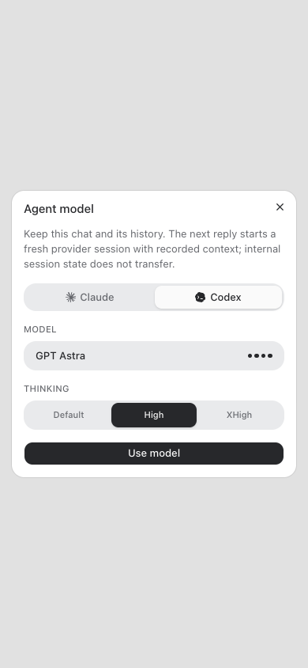

# Inline provider switching

Existing chats can select a model from another available provider using the composer model button, provider tab, model and thinking choice, then **Use model**. Send the next message to continue. Finish or stop an active reply before switching.

The conversation ID, title, project, instruction snapshot, message routing, approvals, scheduled wakeups and message queue remain attached to the same chat. Earlier normalized history and generated-file references are preserved. A provider change always creates a fresh native session, including when switching back to a previously used provider.

The new session receives an opening and recent excerpt of recorded context (at most 48,000 characters plus framing). A full redacted record of user/assistant messages and attempted tool names is saved under the project's `.veneer/provider-context/<chat-id>/` folder for further reading. Tool payloads, hidden reasoning and internal provider session state are not supplied to the replacement model. Existing file references remain available. The replacement is instructed to reload relevant skills and check what completed before repeating external changes. Context transfer remains pending after a failed reply and is retried until a turn completes successfully.

Selected model and last answering model are separate. An old successful Fable response can no longer replace an Opus or GPT selection after a limit error. A failed switch displays an error and preserves the source session. No fallback or external work is started merely by opening the picker; existing queued messages may run after applying a switch.

## Validation

- Typecheck and the full installer, server, web and browser-manager suites.
- Regression coverage for identity/history/files, fresh sessions, repeated switching, restart recovery, failed turns, bounded/redacted transfer, unavailable targets, busy replies, queued delivery and snapshots overlapping a switch.
- HTTP authorization and rejection coverage; provider catalogs retain concrete default model IDs and filter hidden models.
- Browser check: Claude → Codex → Astra → High → Use model submitted the expected provider, model and effort. At 390 × 844, the dialog remained inside the viewport with no horizontal overflow.
- No live Henry/Piper provider switch or external catalog operation was performed during validation.

## Changed files

- [Migration](/Users/archerclawdington/veneer-os/server/src/db/migrations/0089_conversation_provider_switch.sql)
- [Database types](/Users/archerclawdington/veneer-os/server/src/db/db.ts)
- [Model endpoint](/Users/archerclawdington/veneer-os/server/src/routes/api.ts)
- [Runner client](/Users/archerclawdington/veneer-os/server/src/runner/client.ts)
- [Runner RPC](/Users/archerclawdington/veneer-os/server/src/runner/ipcServer.ts)
- [Conversation runtime](/Users/archerclawdington/veneer-os/server/src/runtime/conversationManager.ts)
- [Context transfer](/Users/archerclawdington/veneer-os/server/src/runtime/providerSwitch.ts)
- [Runtime regression tests](/Users/archerclawdington/veneer-os/server/test/providerSwitch.test.ts)
- [Route regression tests](/Users/archerclawdington/veneer-os/server/test/conversationCompactionRoute.test.ts)
- [Shared model picker](/Users/archerclawdington/veneer-os/web/src/components/chat/ModelThinkingPicker.tsx)
- [Picker tests](/Users/archerclawdington/veneer-os/web/src/components/chat/ModelThinkingPicker.test.tsx)
- [Web API](/Users/archerclawdington/veneer-os/web/src/lib/api.ts)
- [Web types](/Users/archerclawdington/veneer-os/web/src/lib/types.ts)
- [Chat screen](/Users/archerclawdington/veneer-os/web/src/screens/Chat.tsx)
- [Mobile verification image](/Users/archerclawdington/veneer-os/docs/screenshots/provider-switch-mobile.png)
