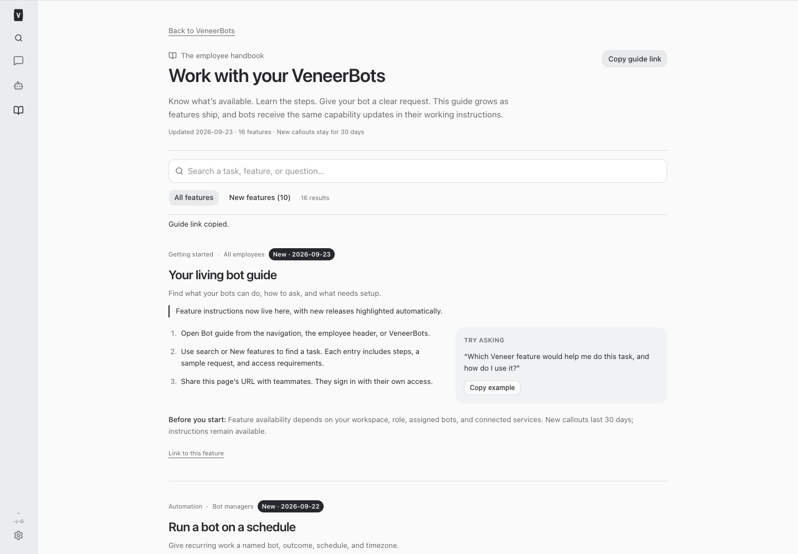
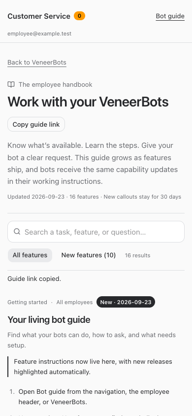

# Living VeneerBots guide

Standing order from the owner, September 23, 2026: employees and bots must discover and know how to use capabilities as they ship. The owner should not have to teach or announce every release.

## Employee access

The permanent authenticated route is `/#/bot-guide`. It is part of the installed product, not an expiring public page. Desktop navigation has **Bot guide**; mobile navigation includes it under **More**. The restricted employee header also links directly to the guide. VeneerBots shows a feature-update notice with links to new and all features. The guide supports search, example copying, a share link, and individual feature links.

`server/src/featureGuide/catalog.ts` is the single catalog. The authenticated, noncached `GET /api/bot-workflows/guide` endpoint serves it to all active workspace roles, including restricted employees. It contains product instructions only, never customer records or account configuration. Instructions label role and setup limits; the guide does not grant feature access. Open guide and notice components refresh on focus, tab visibility, and every five minutes, so future catalog releases reach existing tabs.

A nonempty announcement plus its update date earns a **New** callout for 30 days beginning at midnight UTC on that date. Older instructions remain searchable. Baseline documentation has no announcement; revising copy alone need not announce a feature. The initial guide covers platform bot capabilities, not every bespoke connected business application's operations.

## Bot awareness

`botFeatureInstructions()` derives current capability instructions from the same catalog. Core rules v14 deliver them to all agents, including registered bots, through the existing `prepareConversationInstructions` path on **every new turn**. Both normal toolbox materialization and its required-instruction fallback use that path. The instruction hash changes with the content, so resumed provider sessions receive updated instructions. Frozen agent/project snapshots and existing user roles remain intact.

An idle bot receives the update before its next task; it is not woken merely to announce a feature or perform unrelated customer work. In-flight turns receive changes on their next turn. Guidance tells bots when to suggest/use each capability and retains authorization, approval, and setup limits. No owner broadcast or per-bot prompt editing is needed.

## Required release work

For every added, changed, or retired bot capability:

1. Update the catalog in the same source change. Include employee steps using actual UI labels, a realistic example request, audience, setup and access limits, and concrete agent tool/use instructions. Retired behavior must not remain advertised as available.
2. Set the actual release date and announcement for meaningful changes. Describe what employees can do and how to start. Distinguish implemented, connected, and activated behavior; verify integration status rather than promoting a planned cutover as live.
3. Verify the full and restricted employee guide, new callouts, search, and mobile layout. Verify fresh and resumed agent instructions reflect the catalog without changing frozen snapshots or widening authority.
4. Run root typecheck, the full test suite, and build before restart. Commit and push the verified change. Include the guide link in the release response.

This checklist is also a standing Platform Dev core instruction, refreshed for existing chats; it is not left solely in a document that developers must remember to find. Catalog contract tests require dates, stable links, human instructions, bot guidance, and aging behavior. Tests cannot infer the semantics of arbitrary future feature code: the shipping agent remains responsible for inventory completeness.

## Initial rollout limits

At this release, the OrderOps event transport is deployed and verified, but live sender enablement, receiver routines, and overlapping polling reconciliation remain a separate pending cutover. Device push requires a human to enable browser/device permission. The guide documents these limits without changing production business workflows.

## Verification and changed files

Root typecheck, the full test suite, and the production build passed: 2,166 server tests (5 skipped), 850 web tests, 40 browser-manager tests, and 21 installer tests. Isolated browser checks covered desktop and mobile, full and restricted employees, keyboard navigation, new-feature discovery, search, copying examples and links, feature permalinks, overflow, refresh after a catalog update, announcement aging, and failure/retry. Browser fixtures never accessed production business data.

The shell’s default Node 22 binary had a missing shared library. Validation uses the product’s required Node 24 from `/opt/homebrew/opt/node@24/bin`.

Changed files:

- [docs/bot-feature-guide.md](/Users/archerclawdington/veneer-os/docs/bot-feature-guide.md)
- [docs/reports/bot-guide/desktop.png](/Users/archerclawdington/veneer-os/docs/reports/bot-guide/desktop.png)
- [docs/reports/bot-guide/employee-mobile.png](/Users/archerclawdington/veneer-os/docs/reports/bot-guide/employee-mobile.png)
- [scripts/bot-guide-browser-check.mjs](/Users/archerclawdington/veneer-os/scripts/bot-guide-browser-check.mjs)
- [server/src/featureGuide/catalog.ts](/Users/archerclawdington/veneer-os/server/src/featureGuide/catalog.ts)
- [server/src/botWorkflows/routes.ts](/Users/archerclawdington/veneer-os/server/src/botWorkflows/routes.ts)
- [server/src/bots/employeeAccess.ts](/Users/archerclawdington/veneer-os/server/src/bots/employeeAccess.ts)
- [server/src/instructions/context.ts](/Users/archerclawdington/veneer-os/server/src/instructions/context.ts)
- [server/test/botFeatureGuide.test.ts](/Users/archerclawdington/veneer-os/server/test/botFeatureGuide.test.ts)
- [server/test/botWorkflowRoutes.test.ts](/Users/archerclawdington/veneer-os/server/test/botWorkflowRoutes.test.ts)
- [server/test/instructionContext.test.ts](/Users/archerclawdington/veneer-os/server/test/instructionContext.test.ts)
- [web/src/App.tsx](/Users/archerclawdington/veneer-os/web/src/App.tsx)
- [web/src/components/NavBar.tsx](/Users/archerclawdington/veneer-os/web/src/components/NavBar.tsx)
- [web/src/components/BotGuideNotice.tsx](/Users/archerclawdington/veneer-os/web/src/components/BotGuideNotice.tsx)
- [web/src/lib/botGuide.ts](/Users/archerclawdington/veneer-os/web/src/lib/botGuide.ts)
- [web/src/lib/botGuide.test.ts](/Users/archerclawdington/veneer-os/web/src/lib/botGuide.test.ts)
- [web/src/screens/BotGuide.tsx](/Users/archerclawdington/veneer-os/web/src/screens/BotGuide.tsx)
- [web/src/screens/Bots.tsx](/Users/archerclawdington/veneer-os/web/src/screens/Bots.tsx)
- [web/src/screens/EmployeeWorkspace.tsx](/Users/archerclawdington/veneer-os/web/src/screens/EmployeeWorkspace.tsx)

## Unified Chats — September 23, 2026

Chats replaces the separate VeneerBots and Messages destinations. The project conversation surface is labeled Workspace. People contains human DMs and groups with other people; Bots retains individual bots, team groupings, and bot-only groups. Blue person and violet bot badges count unread conversations for the signed-in user across businesses. The work overview remains accessible from Chats.

The + button starts a human DM, opens an existing bot, or creates a group. Typing @ distinguishes current members from bots available to invite. Inviting a bot from a DM creates a separate group with explicitly reviewed text and the first request in one transaction. The original DM and its attachments stay intact. All humans must already have access to the bot. Existing groups retain creator-only membership management and disclose full-history access.

Room bots still do not inherit their original connected accounts or private history. The UI, invitation dialog, wake instructions, and guide explain this limit; QuickBooks actions still use the original connected bot and existing approval flow. No financial integration or external action was enabled by this release.

Verification and screenshots are recorded in [the implementation report](./reports/unified-chats/report.md). The guide browser checks cover full and restricted employee access, feature discovery, current steps, search, aging, and refresh. The instruction-context regression verifies that resumed bots receive the new Chats and invitation guidance without changing their frozen role snapshots.
