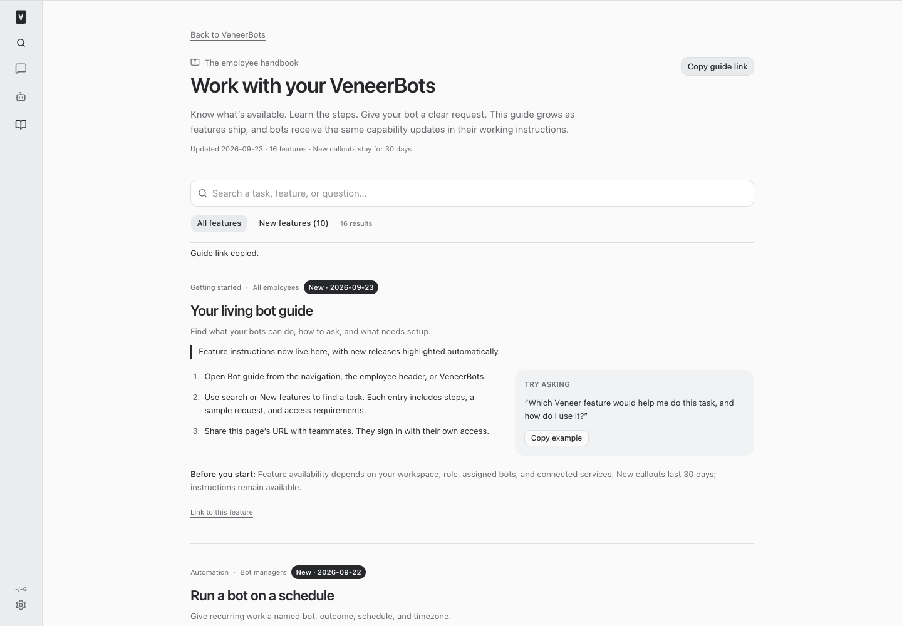
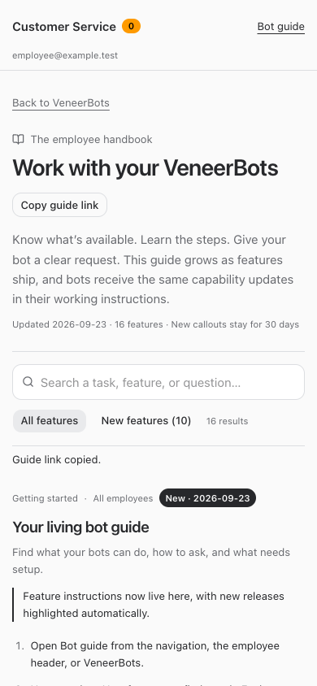

# Living VeneerBots guide

Standing order from the owner, September 23, 2026: employees and bots must discover and know how to use capabilities as they ship. The owner should not have to teach or announce every release.

## Employee access

The permanent authenticated route is `/#/bot-guide`. It is part of the installed product, not an expiring public page. Desktop navigation has **Bot guide**; mobile navigation includes it under **More**. The restricted employee header also links directly to the guide. VeneerBots shows a feature-update notice with links to new and all features. The guide supports search, example copying, a share link, and individual feature links.

`server/src/featureGuide/catalog.ts` is the single catalog. The authenticated, noncached `GET /api/bot-workflows/guide` endpoint serves it to all active workspace roles, including restricted employees. It contains product instructions only, never customer records or account configuration. Instructions label role and setup limits; the guide does not grant feature access. Open guide and notice components refresh on focus, tab visibility, and every five minutes, so future catalog releases reach existing tabs.

A nonempty announcement plus its update date earns a **New** callout for 30 days beginning at midnight UTC on that date. Older instructions remain searchable. Baseline documentation has no announcement; revising copy alone need not announce a feature. The initial guide covers platform bot capabilities, not every bespoke connected business application's operations.

## Bot awareness

`botFeatureInstructions()` derives current capability instructions from the same catalog. Core rules v15 deliver them to all agents, including registered bots, through the existing `prepareConversationInstructions` path on **every new turn**. Both normal toolbox materialization and its required-instruction fallback use that path. The instruction hash changes with the content, so resumed provider sessions receive updated instructions. Frozen agent/project snapshots and existing user roles remain intact.

An idle bot receives the update before its next task; it is not woken merely to announce a feature or perform unrelated customer work. In-flight turns receive changes on their next turn. Guidance tells bots when to suggest/use each capability and retains authorization, approval, and setup limits. No owner broadcast or per-bot prompt editing is needed.

## Required release work

For every added, changed, or retired bot capability:

1. Update the catalog in the same source change. Include employee steps using actual UI labels, a realistic example request, audience, setup and access limits, and concrete agent tool/use instructions. Retired behavior must not remain advertised as available.
2. Set the actual release date and announcement for meaningful changes. Describe what employees can do and how to start. Distinguish implemented, connected, and activated behavior; verify integration status rather than promoting a planned cutover as live.
3. Verify the full and restricted employee guide, new callouts, search, and mobile layout. Verify fresh and resumed agent instructions reflect the catalog without changing frozen snapshots or widening authority.
4. Run root typecheck, the full test suite, and build before restart. Commit and push the verified change. Include the guide link in the release response.

This checklist is also a standing Platform Dev core instruction, refreshed for existing chats; it is not left solely in a document that developers must remember to find. Catalog contract tests require dates, stable links, human instructions, bot guidance, and aging behavior. Tests cannot infer the semantics of arbitrary future feature code: the shipping agent remains responsible for inventory completeness.

## Initial rollout limits

At this release, the OrderOps event transport is deployed and verified, but live sender enablement, receiver routines, and overlapping polling reconciliation remain a separate pending cutover. Device push requires a human to enable browser/device permission. The guide documents these limits without changing production business workflows.

## Verification and changed files

Root typecheck, the full test suite, and the production build passed: 2,166 server tests (5 skipped), 850 web tests, 40 browser-manager tests, and 21 installer tests. Isolated browser checks covered desktop and mobile, full and restricted employees, keyboard navigation, new-feature discovery, search, copying examples and links, feature permalinks, overflow, refresh after a catalog update, announcement aging, and failure/retry. Browser fixtures never accessed production business data.

The shell’s default Node 22 binary had a missing shared library. Validation uses the product’s required Node 24 from `/opt/homebrew/opt/node@24/bin`.

Changed files:

- [docs/bot-feature-guide.md](/Users/archerclawdington/veneer-os/docs/bot-feature-guide.md)
- [docs/reports/bot-guide/desktop.png](/Users/archerclawdington/veneer-os/docs/reports/bot-guide/desktop.png)
- [docs/reports/bot-guide/employee-mobile.png](/Users/archerclawdington/veneer-os/docs/reports/bot-guide/employee-mobile.png)
- [scripts/bot-guide-browser-check.mjs](/Users/archerclawdington/veneer-os/scripts/bot-guide-browser-check.mjs)
- [server/src/featureGuide/catalog.ts](/Users/archerclawdington/veneer-os/server/src/featureGuide/catalog.ts)
- [server/src/botWorkflows/routes.ts](/Users/archerclawdington/veneer-os/server/src/botWorkflows/routes.ts)
- [server/src/bots/employeeAccess.ts](/Users/archerclawdington/veneer-os/server/src/bots/employeeAccess.ts)
- [server/src/instructions/context.ts](/Users/archerclawdington/veneer-os/server/src/instructions/context.ts)
- [server/test/botFeatureGuide.test.ts](/Users/archerclawdington/veneer-os/server/test/botFeatureGuide.test.ts)
- [server/test/botWorkflowRoutes.test.ts](/Users/archerclawdington/veneer-os/server/test/botWorkflowRoutes.test.ts)
- [server/test/instructionContext.test.ts](/Users/archerclawdington/veneer-os/server/test/instructionContext.test.ts)
- [web/src/App.tsx](/Users/archerclawdington/veneer-os/web/src/App.tsx)
- [web/src/components/NavBar.tsx](/Users/archerclawdington/veneer-os/web/src/components/NavBar.tsx)
- [web/src/components/BotGuideNotice.tsx](/Users/archerclawdington/veneer-os/web/src/components/BotGuideNotice.tsx)
- [web/src/lib/botGuide.ts](/Users/archerclawdington/veneer-os/web/src/lib/botGuide.ts)
- [web/src/lib/botGuide.test.ts](/Users/archerclawdington/veneer-os/web/src/lib/botGuide.test.ts)
- [web/src/screens/BotGuide.tsx](/Users/archerclawdington/veneer-os/web/src/screens/BotGuide.tsx)
- [web/src/screens/Bots.tsx](/Users/archerclawdington/veneer-os/web/src/screens/Bots.tsx)
- [web/src/screens/EmployeeWorkspace.tsx](/Users/archerclawdington/veneer-os/web/src/screens/EmployeeWorkspace.tsx)

## Unified Chats — September 23, 2026

Chats replaces the separate VeneerBots and Messages destinations. The project conversation surface is labeled Workspace. People contains human DMs and groups with other people; Bots retains individual bots, team groupings, and bot-only groups. Blue person and violet bot badges count unread conversations for the signed-in user across businesses. The work overview remains accessible from Chats.

The + button starts a human DM, opens an existing bot, or creates a group. Typing @ distinguishes current members from bots available to invite. Inviting a bot from a DM creates a separate group with explicitly reviewed text and the first request in one transaction. The original DM and its attachments stay intact. All humans must already have access to the bot. Existing groups retain creator-only membership management and disclose full-history access.

Room bots still do not inherit their original connected accounts or private history. The UI, invitation dialog, wake instructions, and guide explain this limit; QuickBooks actions still use the original connected bot and existing approval flow. No financial integration or external action was enabled by this release.

Verification and screenshots are recorded in [the implementation report](./reports/unified-chats/report.md). The guide browser checks cover full and restricted employee access, feature discovery, current steps, search, aging, and refresh. The instruction-context regression verifies that resumed bots receive the new Chats and invitation guidance without changing their frozen role snapshots.

## Routine scope handoff — September 25, 2026

The current business owner can open `/#/routine-scope-review` after routine source enrollment, prepare the exact decision tuple and actual source case locators, then separately review the complete source projection and classify its scope. Case handoff and classification have independent immutable records and revocations. Unknown/business-wide scope stays blocking. No service inventory or bot owner impersonation is added.

The owner-facing review includes the original decision under its existing ACL in the same snapshot as its version/hash/event tuple. The dedicated source service can retrieve only one exact handoff ID with current trust, owner, ACL and tuple checks. Its first matching observation binds to the owner request UUID; later explicit refresh preserves the same handoff binding. Preparation is never business approval, source eligibility or customer delivery. Source activation remains dependent on runtime/schema setup and genuine owner enrollment.

Catalog entry `routine-scope-handoff` supplies the dated announcement, owner steps, example, access/setup limits and current/resumed-agent instructions. The release verification and compatible source payload are retained in [the handoff report](./reports/routine-scope-handoff/README.md).

## Group bot activity — September 25, 2026

Mixed human/bot rooms now show room-specific bot status above the composer, refreshed by the existing visible-room polling. Status comes from isolated room workers and durable wake, queue, pending-turn, approval, and question records. Working includes a turn awaiting recovery after restart; it does not claim text is streaming. A later room reply is labeled Reply posted, without claiming it answers a particular request. No room reply with no pending work is not a success receipt. Waiting and errors may need administrator investigation; private prompts, errors, approval details, and worker IDs are not exposed to room members.

Select an exact recipient through the @ picker. Sent messages list selected recipients, and plain mention text with no recipients gets a warning. Plain text never creates a wake. Membership, bot access, private-session isolation, and external action permissions remain unchanged. The team-messages catalog entry delivers these instructions to employees and fresh/resumed bots.

Implementation and verification files:

- [server/src/rooms/service.ts](/Users/archerclawdington/veneer-os/server/src/rooms/service.ts)
- [server/src/rooms/routes.ts](/Users/archerclawdington/veneer-os/server/src/rooms/routes.ts)
- [web/src/lib/teamRooms.ts](/Users/archerclawdington/veneer-os/web/src/lib/teamRooms.ts)
- [web/src/screens/TeamMessages.tsx](/Users/archerclawdington/veneer-os/web/src/screens/TeamMessages.tsx)
- [server/test/teamRooms.test.ts](/Users/archerclawdington/veneer-os/server/test/teamRooms.test.ts)
- [server/test/teamRoomRoutes.test.ts](/Users/archerclawdington/veneer-os/server/test/teamRoomRoutes.test.ts)
- [web/src/lib/teamRooms.test.ts](/Users/archerclawdington/veneer-os/web/src/lib/teamRooms.test.ts)
- [scripts/room-activity-browser-check.mjs](/Users/archerclawdington/veneer-os/scripts/room-activity-browser-check.mjs)
- [server/src/featureGuide/catalog.ts](/Users/archerclawdington/veneer-os/server/src/featureGuide/catalog.ts)

Validation: root typecheck and the full suite passed (2,507 server tests, 898 web tests, 40 browser-manager tests, and 29 installer tests; five server tests skipped). Isolated browser checks verified queued/working/error polling, selected-recipient display, plain-mention warnings, and overflow at 390px and 1280px. The guide browser checks passed for full/restricted employees, discovery, search, mobile layout, refresh, and aging. Instruction-context and catalog tests passed for fresh/resumed agent delivery. No real employee messages were sent.

## Routine training without a build slot — September 26, 2026

The existing Save reusable instructions feature now distinguishes authorized training text,
procedural documentation, task receipts and isolated artifacts from software changes. Bots
save ordinary training through the applicable project skill; they coordinate overlapping
edits, read current content, patch narrowly and verify the saved result. An unresolved file
ownership conflict delays that edit only.

Software source, executable automation, dependencies, schemas and deployment changes still
use the durable build queue. Mixed requests queue their software portion. Training never
grants account access, financial or customer-send authority, and this update does not cancel
or reclassify existing queue entries automatically.

The same guidance is delivered by core rules v15, the enqueue_build tool description, and
catalog entry training. The existing resumed-session test verifies delivery while preserving
the frozen role snapshot. Isolated browser checks cover full and restricted employees,
desktop/mobile guide access, training search and example copying, plus existing refresh,
announcement aging and error recovery behavior. No live business actions are used as tests.

Clara-specific procedure consolidation also completed under build 374: current native
ownership, bounded passes, routine custody, training and artifact delivery replace the
obsolete migrated worker/card mechanics. Her original routine keeps its timing and owner.
Skill/regression checks and independent no-effect behavioral review passed; existing
accounting cases and financial authority were preserved. See the
[completion report](./reports/training-without-builds/report.md). This does not certify
live connector parity or completion of her outstanding business cases.

## Authenticated approved case mapping — September 28, 2026

Approved-message delegation can preserve an approved UUID and a different ticket code
when the server verifies their persisted equivalence under a protected, caller-specific
OrderOps registration. No aliases or credentials are accepted from bot request bodies.
Fresh source authority and a supplemental immutable fingerprint are checked through
inspection, delegation, acceptance, claim and receipt reconciliation. Original exact
approval, named executor, one-time claim and completed-receipt rules remain intact.

The native contract is implemented; live unequal-ID use remains disabled until the
source capability account/business/runtime projection and own-credential custody are
established. Equal-ID messages need no new setup. Missing source setup is not missing
human consent. The catalog supplies the same steps and limitations to employees and
fresh/resumed bots. See the [executable resolver contract](./reports/approved-case-ticket-binding/resolver-contract.md).

## Dedicated approved-case source reads — September 28, 2026

BUILD428 adopts only the deployed dedicated OrderOps capability and bounded case GETs,
with no legacy fallback. The BUILD425 approval, mapping, claim and receipt guards stay
intact. Source account/business/runtime support is now deployed; the remaining activation
dependency is scoped native-server credential-use permission and protected registration.
No duplicate customer approval is needed. The shared catalog carries this distinction
for employees and fresh/resumed bots. See the [current resolver contract](./reports/approved-case-ticket-binding/resolver-contract.md).

## Approved-case registry activation — September 28, 2026

BUILD429 configures the existing six-caller ERVP resolver under current scoped custody
permission. Earlier missing-permission status is superseded. Original case owners use
their own inspector on the unchanged current approval; configured custody does not
certify case readiness or customer delivery. Expiration is October28 at21:04UTC, with
revocation checks at each stage. See [activation receipt](./reports/approved-case-ticket-binding/build429.md).

## Separate instruction obligations — September 28, 2026

The original instruction-owning bot can now inspect and record a separate SMS intent after a direct human source has already answered an email proposal. The immutable intent record retains the existing answer and the exact later draft separately. It always reports `execute:false` and identifies missing exact-payload authority and authenticated source-case linkage; it does not authorize the ordinary draft or request a duplicate approval. Full/restricted employee guidance and fresh/resumed bot instructions come from the `instruction-obligations` catalog entry. The [supported contract](./reports/instruction-obligations/contract.md) describes inspection, idempotent recording, drift and revocation.

## Composed SMS evidence review — September 28, 2026

The `composed-sms` catalog entry describes original-owner correspondence inspection, prospective exact composition authority, and named-executor acceptance/claim/receipt tools. Unlike BUILD431's intent-only record, the native lifecycle has a positive single-use path under verified evidence and accepted source transport. The installed source v1 consumer truthfully reports unknown SMS sender ownership and unavailable native-action transport; live derivation and dispatch are not enabled. It requires a separate correspondence-reader custody receipt and never extends the email resolver's permission implicitly. The [contract](./reports/composed-sms/contract.md) identifies exact fields, review semantics, duplicate/UNKNOWN protections and remaining source prerequisites. No second customer approval, alias merge or ordinary-draft authorization retrofit is introduced. Full/restricted employee and fresh/resumed agent delivery are tested from the shared catalog.

BUILD434 configures that separate correspondence-reader custody for Grant, Owen, Avery, Nora, Miles and Tess until October 28, 2026 at21:04UTC or earlier revocation. Original owners may use `inspect_composed_sms`; no duplicate reader setup is needed. Source sender ownership remains unverified and dispatch remains unsupported. The [activation receipt](./reports/composed-sms/build434.md) retains exact permission, bindings and runtime verification.

## Dedicated composed-SMS dispatch — September 28, 2026

BUILD435 replaces the synthetic bot execution claim with reservation-only behavior.
The named executor receives `execute:false`; only the first authenticated source
service association can entitle its exact fenced attempt. Lost association responses
remain UNKNOWN. Receipt recording fetches the source's exact persisted action rather
than accepting a bot's provider ID. `SENT_ACCEPTED` distinguishes provider acceptance
from delivery. The catalog updates employees and fresh/resumed bots together.
Dedicated service custody, an accepted positive sender/guard adapter and the source
prepare expiry/key readback extension remain outstanding; existing correspondence
reader setup does not need to be repeated. See the [contract](./reports/composed-sms/contract.md).

## Composed SMS current context — September29,2026

BUILD440 adds exact-action service context and explicit v2 dispatch association.
Native holds, obligations, revocations and ACL changes are rechecked atomically;
unknown scope remains blocking, never inferred unrelated from case IDs. Dedicated
CF transport and approved protected credential destinations are provisioned, but
source installation, accepted guards/sender adapter and final native service registry
remain pending. No repeated customer approval or reader setup is needed. The shared
composed-sms catalog carries these limits to employees and resumed agents. See the
[current contract](./reports/composed-sms/contract.md).

## Composed SMS sender and scope consumers — September 29, 2026

BUILD444 implements separate authenticated sender evidence and scope-closure consumers,
plus original-owner `inspect_composed_sms_scope`, `record_composed_sms_scope` and
`revoke_composed_sms_scope`. Reviews bind actual immutable native tuples to refreshed
persisted source components. Unsupported or incomplete scope stays blocking. This is
factual scope review, not another customer approval. Explicit current-context v2 and
association v3 preserve historical contracts and recheck reviews atomically.

Source installation is disabled. New evidence producers and scoped custody, current
sender evidence, executed writer coverage and final native service registration remain
pending; this release does not enable customer dispatch. The shared catalog supplies
employee and fresh/resumed agent instructions. See the [accepted native consumer
contract](./reports/composed-sms/build444/contract.md).

## Scoped composed-SMS registry setup — September 29, 2026

BUILD447 configures the dedicated service/evidence registries using actual installed
source ACLs and final scoped custody. It accepts only the exact reviewed source
guard implementation and executed lock/failure coverage, not case readiness or
post-commit revocation. Fresh sender/process proof, recipient-timezone evidence
and source installation of the native acceptance remain independent prerequisites.

The source closure deliberately stays incomplete for correspondence, subjects,
notes, QA, tags, unsupported references and non-E164 phones. Original-owner review
cannot turn that incomplete model into unrelatedness. Report the concrete evidence
limit rather than requesting duplicate consent, merging cases or changing records.
The shared catalog exposes these setup limits to employees and resumed agents.
See the [installation report](./reports/composed-sms/build447/README.md).

## Prospective human correction review — September 29, 2026

The original source owner can use `inspect_composed_sms_correction` to read a later authenticated correction, full native context and exact corrected draft without rewriting the earlier answer or consumption. Explicit unconditional composition AND sending requires semantic review; edits, status questions, quotations, conditions and ambiguity fail closed. With verified source/sender evidence, `derive_composed_sms_correction` records an immutable prospective proof under the shared original action fence. `read_composed_sms_correction` reconciles a lost response read-only by the same decision, source and request key.

The source authority contract does not yet accept this distinct correction proof. No corrected authority may use old accept/claim/export; no customer effect or readiness is implied. Sender/process, scope completeness and timezone remain independent requirements. The dated `composed-sms-correction` catalog entry reaches full/restricted employees and new/resumed agents. [BUILD450 contract and validation](./reports/composed-sms/build450/README.md).

## Native-only correction preflight — September 29, 2026

`inspect_correction_preflight` and `review_correction_preflight` let the original decision owner inspect complete bounded native human context without a draft or source/sender fetch. Every later human message receives exact semantic review; status-only questions do not automatically supersede or supply consent. Outputs remain execute:false/ready:false/authority:false, with no persisted review or business mutation. They are not BUILD450 authority/transport evidence. The dated `correction-preflight` catalog delivers steps and limitations to employees and resumed agents. [BUILD451 report](./reports/composed-sms/build451/README.md).

## Integrated correction review — September 29, 2026

BUILD452 adds explicit correction-v2 inspect/derive/reconcile tools. The original owner submits complete BUILD451 review input with current correction/draft/source inspection, continuing composition/send citations and narrowing continuity; detached review hashes are not authority. Later status-only questions give no consent. Named executor claims remain reservations only. Historical tools and proofs retain their meanings; new source projection/routes require an explicit protected amendment and source adoption across intents and precontext audit rows. Employee and current/resumed instructions come from `correction-integration` in the catalog. No source activation or real-case readiness is claimed. See [contract and source adoption](/Users/archerclawdington/veneer-os/docs/reports/composed-sms/build452/source-adoption.md).

## Prospective completed-case custody — September 30, 2026

`prospective-case-custody` documents original-reviewer inspection and prospective issuance, exact read-only reconciliation and revocation. The full/restricted employee guide and fresh/resumed agent instructions carry the same enrollment and no-effect limits. Dedicated human enrollment uses authenticated `/api/bots/case-custody/enrollment/prepare` then `/confirm` against an independently accepted protected source registration. Bots cannot perform that enrollment; the one setup step is technical trust, not a duplicate Dometic business approval.

No production registry or source consumer is installed by the native release. Authority is restricted to insertion of a prospective custody ledger entry, not a reopen, lease, customer contact, refund or historical ownership repair. Historical retired identity must be authentically enrolled in historical-only mode; it is never reactivated. Missing human provenance, source coverage or prior-effect resolution blocks. Original reviewer Henry and executor Nora remain separate roles. See [contract and acceptance limits](./reports/case-custody/build485/contract.md).

### Paired contact verification (September 30, 2026)

The `paired-contact-verification` catalog entry supplies employee and resumed-agent instructions. This native integration supports only a new exact human-approved `proposal.contact_verification` manifest with both existing customer IDs, source revisions, purchaser statement, ordered email/SMS public templates and one source-only secret-link slot each. Do not request outreach approval until executable dedicated setup and the exact manifest exist. Existing SMS/draft/custody approval never authorizes substitution. No source secret or actual link URL belongs in native records or chat.

After genuine dedicated owner enrollment, the original owner uses `inspect_contact_verification`, then `issue_contact_verification` with the exact inspection hash/key. Both are nonexecuting. The accepted source service must independently authenticate its persisted paired generation and both intents before the first one-time dispatch association. Native receipt calls fetch authenticated source proof; no bot SID assertion. `read_contact_verification` reconciles uncertainty, and `revoke_contact_verification` preserves reservations. Second-channel dispatch waits for first provider acceptance. UNKNOWN, rollback, expired or revoked authority never permits another generation/key. Public redemption, source mutation, identity association and financial clearance remain separately governed. No production registration or source enablement was installed by this release.

Paired contact decisions show both exact public templates, accounts/from/recipients, statement and fixed opaque link placeholders before the answer controls. The expandable public manifest retains exact identifiers/revisions. Queue quick-approval is unavailable for this new proposal type; no actual link secret is displayed or generated.

## Staged controller reconnect (September 30, 2026)

BUILD505 adds original-owner `inspect_controller` and `reconnect_controller` guidance to the catalog. This change is staged: the active slot expressly forbids the coordinated restart required to load the server migration and manager process-generation marker. It does not announce a successful live recovery.

After separately authorized deployment, the owning bot obtains the exact tuple from inspection, reconnects with one stable request key, and performs its own tabs/read. A detached result never resolves a prior UNKNOWN operation or permits replay. Missing pinned bridge proof, changed process generation, or uncertain controller shutdown remains blocked; no Chrome-close fallback exists. Employee and full/restricted resumed-agent catalog delivery is covered by the shared guide tests. [Implementation and deployment limit](/Users/archerclawdington/veneer-os/docs/reports/browser-controller-reconnect/build505/report.md).

## Global question desk and hotline — October 1, 2026

The `question-desk` catalog entry documents the global question line, persistent desktop dock,
mobile sheet, personal reminders and explicit hotline coordinator. The original native decision
remains the authorization record. Queue preferences never approve, defer or execute it. The
employee API boundary allows only human-scoped question-line GET/POST; decision and source ACLs
remain enforced. The hotline pins each operation to the currently selected question and uses the
existing VoiceWorkspace checks. Launched with owner approval in build #529; live authenticated
question-line, dock, guide and voice-configuration checks passed. See
[the launch receipt](./reports/question-desk/build529.md) for verification and limits.
