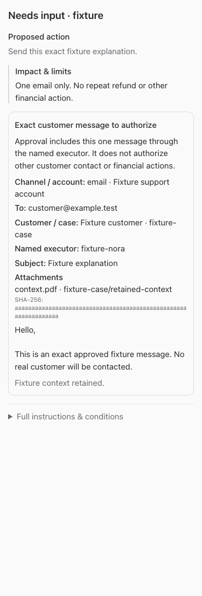
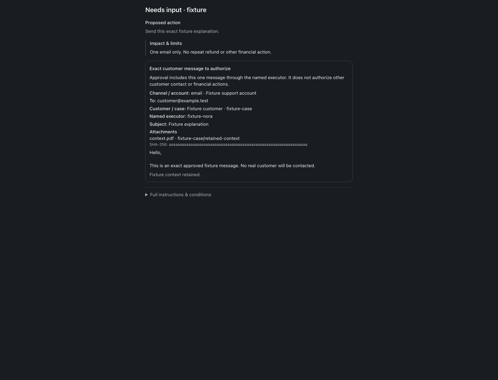
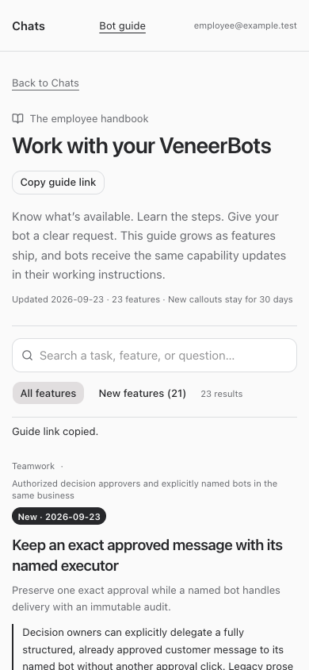

# Approved-message delegation release

Build #229 · 2026-09-23 · Commission `zcjal4-approved-nora-draft-bridge-20260923`

The native owner-to-named-executor bridge is deployed in commit `483aa435704cd434eda83866d15e6fe9b7328846`. **The actual ZCJAL4 case remains BLOCKED: its approved snapshot lacks structured delivery-scope proof.** Nicholas’s original approval is intact. No live delegation, acceptance, draft creation, provider send, or business decision mutation was performed.

## Behavior and contract

The bridge validates the immutable approved proposal, exact body/account/recipients/case/attachments and named executor, current version, active approver and bot authority. Only the owner can delegate; only the named executor can accept. Acceptance creates one queued draft under the original human approval. Fresh claim checks and a bound provider receipt protect delivery; ambiguous effects require reconciliation rather than another attempt. Ordinary separate drafts still require their own send authorization. Conversation mismatch now has an explicit diagnostic distinct from stale version.

See [the executable Grant/Nora contract](./contract.md) for inspect, delegation, acceptance, claim, receipt, and revocation fields. For this legacy case, stop at read-only inspection. Do not derive authority from EXACT DRAFT prose, retrofit an old approval, or automatically ask for duplicate approval.

## Case verified after deployment

Decision `5e78f3a2-f0c1-42df-a236-c3882a53c320` remains version 1, `blocked`, last updated `2026-09-23 14:55:06`. Original approval event: `453ed642-5f81-4668-a0d8-adbf9574cdbb`. Read-only preflight returns `ready:false` with missing proof:

> proposal.message_delivery in the approved snapshot: exact channel/account/recipients/subject/body/customer/ticket/attachments, canonical_case and named executor; legacy EXACT DRAFT prose is not a structured transport authorization

The live decision has zero delegations and zero drafts. The terminal $59.99 refund and OrderOps0078 are outside this change.

## Validation and deployment

- Root typecheck, full tests, and build passed before root `npm run restart`.
- Full tests: 2,244 server tests passed (5 skipped), 860 web tests passed, 21 installer tests passed, and 40 browser-manager tests passed.
- Bridge suite: 20 tests covering exact scope, permissions/revocation, stale versions, immutable audit, concurrent delegation/acceptance/claim, receipt conflicts, and uncertain delivery. Existing ordinary draft workflow tests passed.
- Native tool definitions and API routing verified against stub transport. Full/restricted employee guide fixtures and resumed-agent instructions verified.
- Isolated summary fixtures passed at 320, 375, 768, and 1440 pixels in both themes, with no horizontal overflow. No real employee/customer messages or bot wakes were used as tests.
- After restart: web, runner, terminal, browser-manager health and app-runner status returned HTTP 200. Migration 0109 is applied. Live guide exposes the dated New capability and current agent instructions include inspect-first guidance.

## Screenshots

## Changed files and evidence

- [docs/reports/approved-message-delegation/contract.md](/Users/archerclawdington/veneer-os/docs/reports/approved-message-delegation/contract.md)
- [scripts/message-delegation-browser-check.mjs](/Users/archerclawdington/veneer-os/scripts/message-delegation-browser-check.mjs)
- [server/src/bots/communication.ts](/Users/archerclawdington/veneer-os/server/src/bots/communication.ts)
- [server/src/bots/communicationRoutes.ts](/Users/archerclawdington/veneer-os/server/src/bots/communicationRoutes.ts)
- [server/src/bots/draftPayload.ts](/Users/archerclawdington/veneer-os/server/src/bots/draftPayload.ts)
- [server/src/bots/messageDelegation.ts](/Users/archerclawdington/veneer-os/server/src/bots/messageDelegation.ts)
- [server/src/bots/service.ts](/Users/archerclawdington/veneer-os/server/src/bots/service.ts)
- [server/src/db/migrations/0109_approved_message_delegations.sql](/Users/archerclawdington/veneer-os/server/src/db/migrations/0109_approved_message_delegations.sql)
- [server/src/featureGuide/catalog.ts](/Users/archerclawdington/veneer-os/server/src/featureGuide/catalog.ts)
- [server/src/mcp/botTools.ts](/Users/archerclawdington/veneer-os/server/src/mcp/botTools.ts)
- [server/test/messageDelegation.test.ts](/Users/archerclawdington/veneer-os/server/test/messageDelegation.test.ts)
- [web/src/components/BotProposalSummary.test.tsx](/Users/archerclawdington/veneer-os/web/src/components/BotProposalSummary.test.tsx)
- [web/src/components/BotProposalSummary.tsx](/Users/archerclawdington/veneer-os/web/src/components/BotProposalSummary.tsx)
- [web/src/lib/bots.ts](/Users/archerclawdington/veneer-os/web/src/lib/bots.ts)
- [web/src/screens/Bots.tsx](/Users/archerclawdington/veneer-os/web/src/screens/Bots.tsx)
- [docs/reports/approved-message-delegation/guide/desktop.png](/Users/archerclawdington/veneer-os/docs/reports/approved-message-delegation/guide/desktop.png)
- [docs/reports/approved-message-delegation/guide/employee-mobile.png](/Users/archerclawdington/veneer-os/docs/reports/approved-message-delegation/guide/employee-mobile.png)
- [docs/reports/approved-message-delegation/scope-1440-dark.png](/Users/archerclawdington/veneer-os/docs/reports/approved-message-delegation/scope-1440-dark.png)
- [docs/reports/approved-message-delegation/scope-1440-light.png](/Users/archerclawdington/veneer-os/docs/reports/approved-message-delegation/scope-1440-light.png)
- [docs/reports/approved-message-delegation/scope-320-dark.png](/Users/archerclawdington/veneer-os/docs/reports/approved-message-delegation/scope-320-dark.png)
- [docs/reports/approved-message-delegation/scope-320-light.png](/Users/archerclawdington/veneer-os/docs/reports/approved-message-delegation/scope-320-light.png)
- [docs/reports/approved-message-delegation/scope-375-dark.png](/Users/archerclawdington/veneer-os/docs/reports/approved-message-delegation/scope-375-dark.png)
- [docs/reports/approved-message-delegation/scope-375-light.png](/Users/archerclawdington/veneer-os/docs/reports/approved-message-delegation/scope-375-light.png)
- [docs/reports/approved-message-delegation/scope-768-dark.png](/Users/archerclawdington/veneer-os/docs/reports/approved-message-delegation/scope-768-dark.png)
- [docs/reports/approved-message-delegation/scope-768-light.png](/Users/archerclawdington/veneer-os/docs/reports/approved-message-delegation/scope-768-light.png)
- [docs/reports/approved-message-delegation/README.md](/Users/archerclawdington/veneer-os/docs/reports/approved-message-delegation/README.md)
