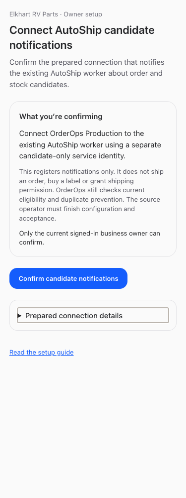
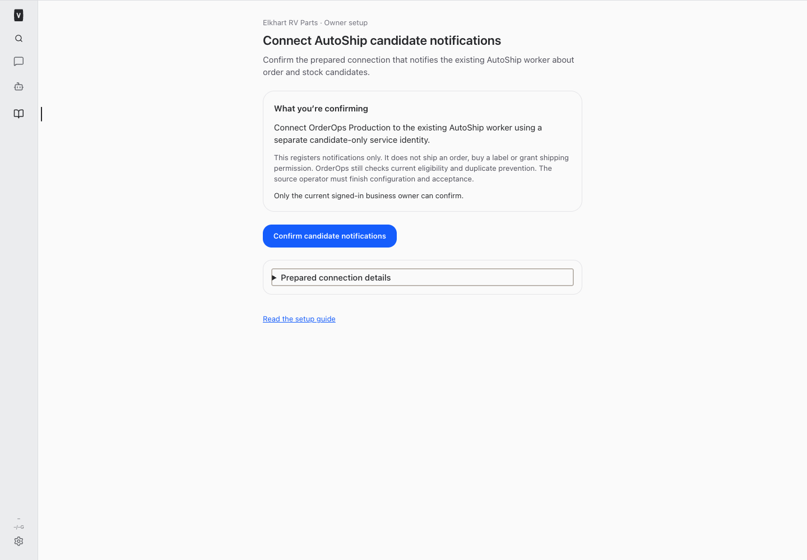

# Dedicated candidate transport — BUILD301

## Provisioning and custody

Existing authenticated Doppler custody was freshly verified at main/prd. A bounded authenticated Cloudflare read found no candidate app or token; protected native candidate keys and Doppler ervp/prd candidate names were absent. The operator then created exactly one dedicated service identity, application and single-token Service Auth policy. Existing human, AutoShip verifier and return policies were not modified. No owner registration or event was submitted.

[Nonsecret provisioning receipt](./provisioned.json) records application `cf38ddac-68f8-4b58-8c50-306a6708e6ec`, service token `a443e9fc-45ce-47b6-8a68-e9e21bd36d41` and policy `4db7b626-f196-45f9-9efc-a4ef81c9faad`. The application path `nicksworld.dev/api/autoship/candidates` covers its child paths. Its dedicated audience/client differ from the other identities. Policy readback shows only that service token, no exclusions or additional requirements. Token duration is8760h; no automatic rotation is provided.

Approved custody now contains ervp/prd `OO_AUTOSHIP_CANDIDATE_CF_CLIENT_SECRET`, `CF_CLIENT_ID`, `CF_AUD`, `ORIGIN` (all with the OO_AUTOSHIP_CANDIDATE_ prefix). Secret went from the creation response directly to Doppler stdin; no value was printed, logged, placed in argv or written to a source/temp/report file. Provisioning credentials were used only for Cloudflare operations. Protected native runtime keys are `VP_AUTOSHIP_CANDIDATE_CF_AUD` and **`VP_AUTOSHIP_CANDIDATE_CLIENT_ID`**, the actual configuration schema spelling. Unknown existing destinations are refused, not overwritten. Provisioning is not repeated on an uncertain result; inspect retained IDs and custody first.

Current Cloudflare [application path documentation](https://developers.cloudflare.com/cloudflare-one/access-controls/policies/app-paths/) and [service-token documentation](https://developers.cloudflare.com/cloudflare-one/access-controls/service-credentials/service-tokens/) were checked. Operational readback and synthetic-key checks, not documentation alone, establish this deployment's result.

## Owner confirmation

Native authenticated page: **https://nicksworld.dev/#/autoship-candidate-setup**. Sign in as the current Elkhart RV Parts owner, review the prepared connection, then select **Confirm candidate notifications**. No Console or credential entry into a published app is involved. Page load performs GET only. An uncertain POST disables another confirmation until **Check registration status** reconciles the unchanged stable key.

GET/POST `/api/bot-communication/autoship-candidates/setup` require genuine current human owner, active user and worker registration, exact business/owner and pinned dedicated configuration. POST accepts only `{review_hash,confirm:true}`; it cannot accept arbitrary account/recipient/client scope. The server uses the reviewed immutable payload, immediate transaction and existing enrollment contract. A conflicting registration, stale review, revoked registration, bot actor or changed owner/worker fails closed. Return and candidate pages have independent keyed state, preventing an old receipt/review from carrying across routes. The nonsecret receipt contains actual source_id, owner/account/key/time. No source_id is fabricated.

The source custodian's original request key is preserved exactly:
`orderops-candidate-registration-v1:b87535be8b1b666100ca0c06cf51a8e48411ffff5e2541e03f33f14c87adface`.
New account: `orderops-autoship-candidates-4d9eccb6-ba10-401d-a86b-3bf607ac8a36`. This is current new registration provenance, not historical identity. The prepared source tuple/origin is unchanged. Notification registration grants **no shipping authority** and performs no event, order, label, customer or provider action.

## Source installation and separate AutoPO custody

Original source owner a4bc7b0c-e56a-4b90-b4bc-cb71cbc88e68 retains the serialized installation boundary. Platform made no Railway writes/redeploys. Fresh authenticated Railway identity is nicholasdschneider@gmail.com; exact project/environment/service metadata is accessible and latest deployment `ab98ece4-24f6-474d-b7c8-2b75101dc347` reports SUCCESS at source `a46f92cb616f888500c29c9035d504f1dcc20dfb`. Custodian additionally attested actual runtime at2026-09-24T17:50:51.979Z with52 matching artifacts. Metadata access plus prior268 successful custody is evidence of the existing operator mechanism, not a claim that new writes occurred.

Custodian names-only receipt at17:51:09.338Z: candidate ORIGIN/CF_CLIENT_ID/CF_CLIENT_SECRET/SOURCE_ID/ACCOUNT_ID and both AUTO_PO_ACCESS_KEY/AUTO_PO_SECRET_KEY are absent. Runtime tuple is project71cc77d6-9c0d-4770-9d6d-62b8c4bb516c/environment530025e2-352d-443c-a8ed-e589fc20621d/serviceede1932e-b3f9-4e7b-b1be-45804dfbe842, source origin https://orderops-dev-web-production.up.railway.app. Absence must be refreshed at installation because this receipt is not a lock.

Prepared protected transfer mechanism, for source custodian only at an explicitly released serial boundary:

- Recheck authenticated identity, exact tuple, current artifact and destination names; stop on any unknown/present destination, staged change or conflicting owner.
- Read each approved secret at use into a subprocess pipe from `doppler secrets get NAME --plain --project PROJECT --config prd`. Pipe directly to supported `railway variable set NAME --stdin --skip-deploys --project 71cc77d6-9c0d-4770-9d6d-62b8c4bb516c --environment 530025e2-352d-443c-a8ed-e589fc20621d --service ede1932e-b3f9-4e7b-b1be-45804dfbe842`. Suppress both commands' output/error bodies, inspect exit codes only; no shell tracing, value argv, temporary secret file or printing. CLI help verified this exact stdin/skip-deploys contract.
- Candidate secret source is ervp/prd; install source ORIGIN=https://nicksworld.dev, actual dedicated CF client/secret, reviewed account and ONLY actual owner source_id receipt. Source does not require CF_AUD per its current packet; stored CF_AUD remains nonsecret custody metadata. Do not substitute return/verifier identities or enable events to test setup.
- AutoPO is a **separate** transfer: main/prd AUTO_PO_ACCESS_KEY and AUTO_PO_SECRET_KEY to SAME destination names, pinned source code endpoint https://autopo.magicbits.io and header X-AutoPO-ShopifyDomain:elkhart-rv-parts. Both source names were verified without retrieving values. No AutoPO secret read/transfer/provider call occurred in301. No bot bearer or shipping credential is involved.
- Custodian owns one controlled redeploy/readback when all reviewed bindings are installed. Names/tuple/hash/health checks establish configuration, never provider acceptance. On any failed/unknown write, reconcile destination names and protected custody before repeating; never overwrite blindly.

No missing human-admin right was assumed. The current concrete prerequisite is the source custodian's explicit installation boundary and actual owner source receipt, not another infrastructure task for Nick. Schema adoption, source activation and named-worker acceptance remain source-owned. Existing return setup is unchanged.

## Validation and artifacts

Synthetic server tests cover exact prepared registration, identical retries, lost response, no event/wake effects, bot/nonowner/revoked worker/changed owner/config denial, stale/injected scope, conflicting key and immutable source ledger. Existing candidate auth/revocation/idempotency tests remain. Browser fixtures cover desktop/mobile light/dark, keyboard/tap disclosure, no initial POST, exact confirmation, read-only unknown reconciliation, reload, owner denial, receipt, overflow and return/candidate route isolation. The unchanged return page is regression checked. Full/restricted living-guide browser checks passed; root tests include resumed instruction/catalog coverage.

Changed files:
- [Prepared payload](/Users/archerclawdington/veneer-os/server/src/bots/preparedCandidateRegistration.ts)
- [Owner service](/Users/archerclawdington/veneer-os/server/src/bots/candidateOwnerSetup.ts)
- [Authenticated routes](/Users/archerclawdington/veneer-os/server/src/bots/communicationRoutes.ts)
- [Shared owner screen](/Users/archerclawdington/veneer-os/web/src/screens/ReturnOwnerSetup.tsx)
- [Native routing](/Users/archerclawdington/veneer-os/web/src/App.tsx)
- [Guide](/Users/archerclawdington/veneer-os/server/src/featureGuide/catalog.ts)
- [Server fixtures](/Users/archerclawdington/veneer-os/server/test/candidateOwnerSetup.test.ts)
- [Browser fixtures](/Users/archerclawdington/veneer-os/scripts/candidate-owner-setup-browser-check.mjs)
- [Bounded provisioning operator](./provision_service.py)
- [Read-only synthetic authentication check](./check_transport.py)

Root typecheck, full npm test and build passed after the final route-isolation change: server2452 passed/5 existing skipped, web880, browser-manager40, installer21. Existing bundle-size advisory remains. Deployment/health and post-restart auth receipt follow below.
