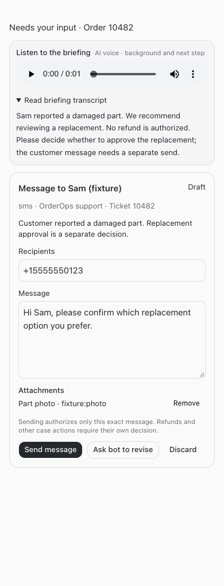
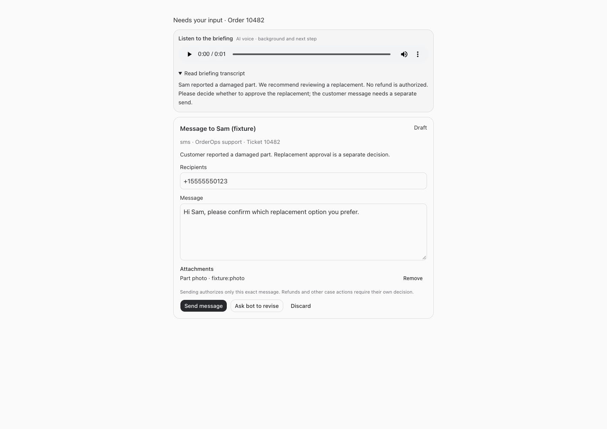
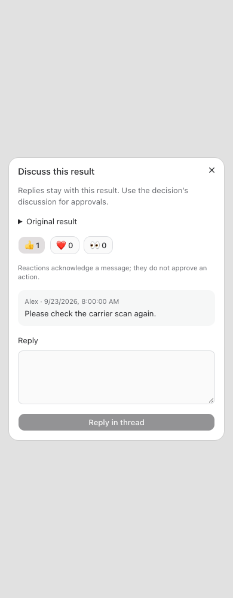
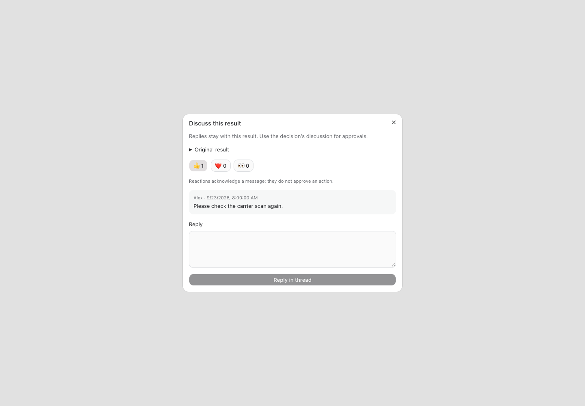
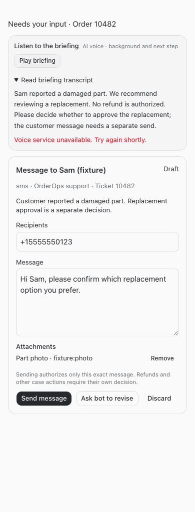
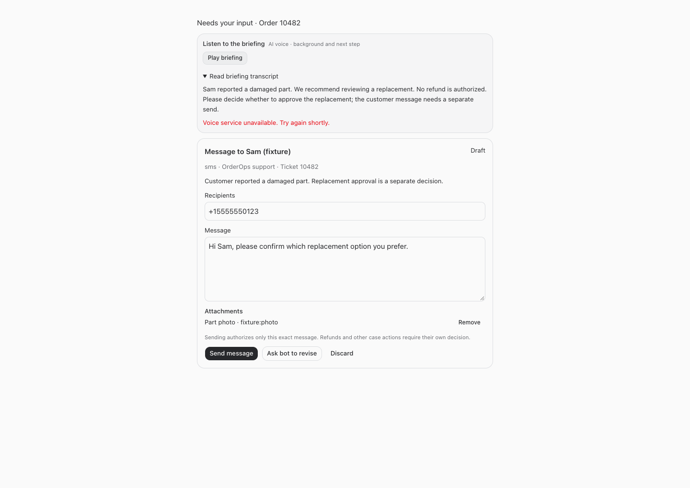

# Customer messages, result threads, and voice briefings

Build 215 adds editable outgoing message cards, persistent discussions on individual bot results, and saved voice briefings in chats and Needs input cards.

Employee instructions and New callouts are in the [VeneerBot guide](https://nicksworld.dev/#/bot-guide). The same release catalog enters every bot’s working instructions, including resumed conversations.

## Using the features

- **Customer messages:** Ask the bot to prepare an editable message attached to the relevant decision. Open the Needs input discussion, review customer/ticket/channel/account/recipients/attachments, edit and save the message, then choose Send message and Confirm send message. The bot sends through the existing source-system connection and records its receipt. Queued, Sending, Sent, Failed and Uncertain are distinct. Ask bot to revise and Discard are also available.
- **Result threads:** Choose Reply in thread beneath a completed bot response. Replies wake the same bot and stay with the original result. Reply counts, unread counts and three acknowledgement reactions are available. Existing decision discussions remain the approval surface.
- **Voice:** Choose Play briefing on a Needs input card or its discussion. The first request prepares the contextual summary and audio; use the audio controls to listen. The transcript stays available. Bots can also publish concise briefings in regular chat. The briefing covers background, the evidence behind the recommendation, the next step and the decision needed. Material conditions may require longer than the target 30–60 seconds.

## Delivery and authorization

Message authorization is separate from the underlying business decision. It does not approve refunds or other case mutations. Draft edits increment their version; send authorizes the exact saved version. The permanent bot uses its existing connected accounts, while human authorization is rechecked before dispatch and again before claiming delivery. Each draft has one durable send claim and a stable source idempotency key. Repeated claims return execute=false; uncertain outcomes require source reconciliation. A source receipt is required before the bot records Sent. Historical EXACT DRAFT proposals retain their existing behavior; new separate drafts must not duplicate that authorization.

OrderOps SMS was inspected read-only: its existing send-sms route requires the owning ticket lease, explicit approval provenance, and an idempotency key, and persists the returned provider receipt. This build reuses that bot-mediated transport. It does not install another SMS sender or alter OrderOps source. No customer was contacted for verification.

Proposal-bound drafts and briefings reject changed versions. Old audio cannot be fetched after a proposal revision. Conversation, employee and business access apply to all new routes, and the speech endpoints recheck access after asynchronous generation. Reactions and listening never approve actions.

Speech uses the existing server-side OpenAI connection. Audio is generated on demand, cached privately, and labeled AI voice. Both the transcript and full card remain available if speech fails. Generated summaries explain supplied evidence; they do not expose hidden reasoning. Physical iPhone/AirPods playback was not tested.

## Verification

Focused tests cover edits, send deduplication, uncertain delivery reconciliation, stale proposals, revoked users, employee wake attribution, thread anchoring, reactions, unread state, audio caching and proposal changes during generation. Desktop and 390px mobile browser fixtures exercise save/edit/send, two-step send confirmation, voice failure/retry, transcript access, audio controls without autoplay, threads, reactions and horizontal overflow. Provider speech requests in automated tests are mocked; these checks do not claim a live customer send or a physical-device audio test.

Root typecheck and production build passed. The full suite passed: 2,175 server tests (5 skipped), 850 web tests, 40 browser-manager tests and 21 installer tests. The focused communication/decision/wakeup suite passed 68 tests. Desktop/mobile browser checks passed. Deployment follows these checks through the root restart command; service health is verified separately at completion.

## Screenshots

### Mobile card and briefing

### Desktop card and briefing

### Result discussion

### Audio failure recovery

## Changed files

- [Communication service](/Users/archerclawdington/veneer-os/server/src/bots/communication.ts)
- [Communication routes](/Users/archerclawdington/veneer-os/server/src/bots/communicationRoutes.ts)
- [Wake delivery checks](/Users/archerclawdington/veneer-os/server/src/bots/delivery.ts)
- [Employee route access](/Users/archerclawdington/veneer-os/server/src/bots/employeeAccess.ts)
- [Additive migration](/Users/archerclawdington/veneer-os/server/src/db/migrations/0104_bot_communication.sql)
- [Bot tools](/Users/archerclawdington/veneer-os/server/src/mcp/botTools.ts)
- [API routing](/Users/archerclawdington/veneer-os/server/src/routes/api.ts)
- [Shared employee and bot guide](/Users/archerclawdington/veneer-os/server/src/featureGuide/catalog.ts)
- [Message cards, audio player and thread dialog](/Users/archerclawdington/veneer-os/web/src/components/BotCommunication.tsx)
- [Needs input integration](/Users/archerclawdington/veneer-os/web/src/screens/Bots.tsx)
- [Chat integration](/Users/archerclawdington/veneer-os/web/src/screens/Chat.tsx)
- [Server tests](/Users/archerclawdington/veneer-os/server/test/botCommunication.test.ts)
- [Isolated browser verification](/Users/archerclawdington/veneer-os/scripts/bot-communication-browser-check.mjs)
- [This report](/Users/archerclawdington/veneer-os/docs/reports/bot-communication/report.md)
- [Desktop screenshot](/Users/archerclawdington/veneer-os/docs/reports/bot-communication/desktop.png)
- [Mobile screenshot](/Users/archerclawdington/veneer-os/docs/reports/bot-communication/mobile.png)
- [Desktop thread screenshot](/Users/archerclawdington/veneer-os/docs/reports/bot-communication/thread-desktop.png)
- [Mobile thread screenshot](/Users/archerclawdington/veneer-os/docs/reports/bot-communication/thread-mobile.png)
- [Desktop failure screenshot](/Users/archerclawdington/veneer-os/docs/reports/bot-communication/desktop-error.png)
- [Mobile failure screenshot](/Users/archerclawdington/veneer-os/docs/reports/bot-communication/mobile-error.png)
