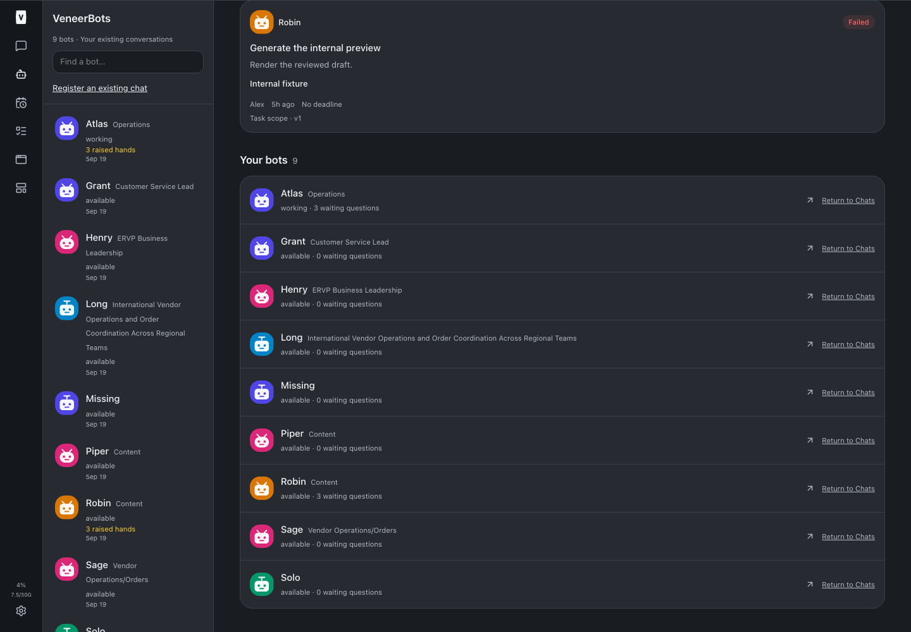
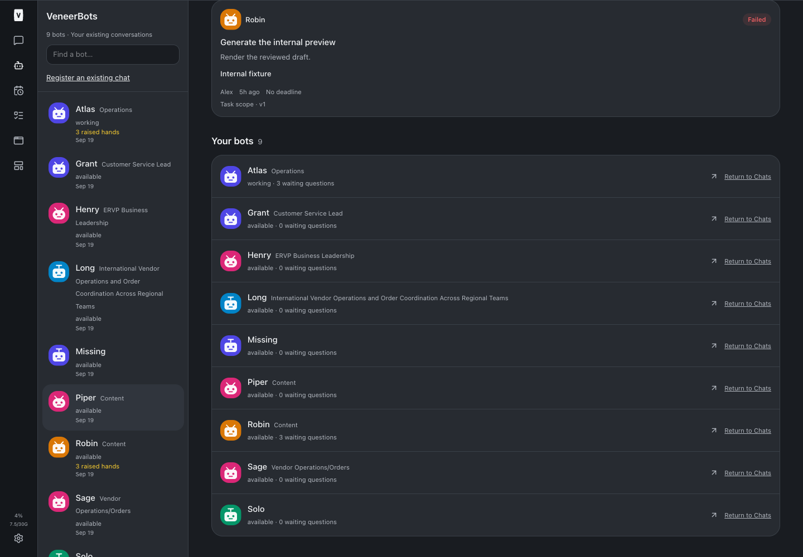
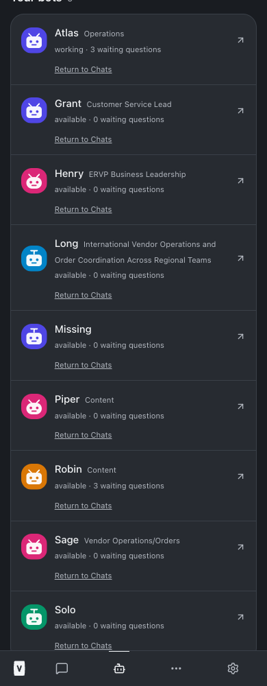
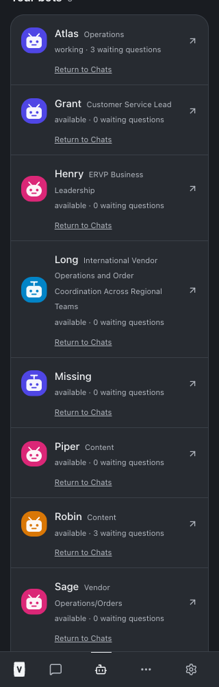
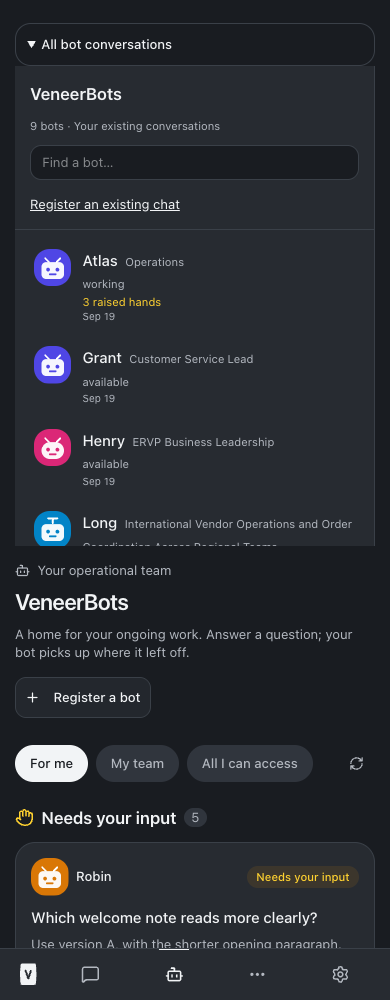

# VeneerBots descriptive job titles — build 80

September 19, 2026. Bot roster and conversation rail now show descriptive native titles beside names in smaller, normal-weight muted text. Status and questions remain below. Names and long descriptions wrap without truncation at narrow mobile widths. The existing legacy registration control moves to its own row on mobile to leave room for readable titles.

Display parsing strips only a matching leading name and optional separator, including `Piper Content`. Missing/name-only titles render just the name. Other title wording stays intact, including Henry’s native `ERVP Business Leadership`. No business-specific name/role mapping, chat rename, registration, authority or persisted data change is involved. Avatars, unread indicators, presence, navigation, business roles and decision behavior use their existing paths. No live bot/decision writes or customer/financial actions were performed.

## Validation

- Focused identity/title tests: 18 passed ([output](./scoped-tests.txt)). Includes punctuation/whitespace boundaries, no-separator titles, names that prefix other words, missing/name-only descriptions and duplicate-name prevention.
- Typecheck passed ([output](./typecheck.txt)).
- Full required test suite: **2,867 passed, 5 existing skipped**. Production build passed (existing Vite chunk-size advisory only). See [test output](./full-tests.txt) and [build output](./build.txt).
- Real production UI with isolated in-memory fixture: desktop roster, rail and selected original chat; mobile roster at390px and320px; mobile conversation list. Long titles wrap, missing titles remain usable, no overflow or browser exceptions ([output](./browser-tests.txt)). No production data was used in browser tests.

## Screenshots

## Changed files

- [Shared name/title rendering and parser](/Users/archerclawdington/veneer-os/web/src/components/BotIdentity.tsx)
- [Title and identity tests](/Users/archerclawdington/veneer-os/web/src/components/BotIdentity.test.tsx)
- [Conversation rail](/Users/archerclawdington/veneer-os/web/src/components/BotConversationRail.tsx)
- [Roster](/Users/archerclawdington/veneer-os/web/src/screens/Bots.tsx)
- [Isolated native-title fixtures](/Users/archerclawdington/veneer-os/scripts/bots-browser-fixture.ts)
- [Browser validation](/Users/archerclawdington/veneer-os/scripts/bot-titles-browser-check.mjs)

Reproduce browser validation with Node24: run `node --import tsx scripts/bots-browser-fixture.ts --titles`, then `node scripts/bot-titles-browser-check.mjs <playwright/index.mjs path>`. These fixtures are separate from live services.

## Deployment

Deployed source commit `2118beb`, pushed to `origin/main`. The required root restart completed successfully after all checks passed; web, runner, app-runner, terminal and browser-manager are healthy ([restart output](./restart.txt)). No migration, enrollment or additional restart is required.
