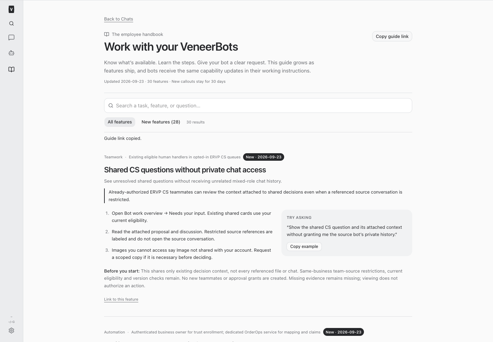
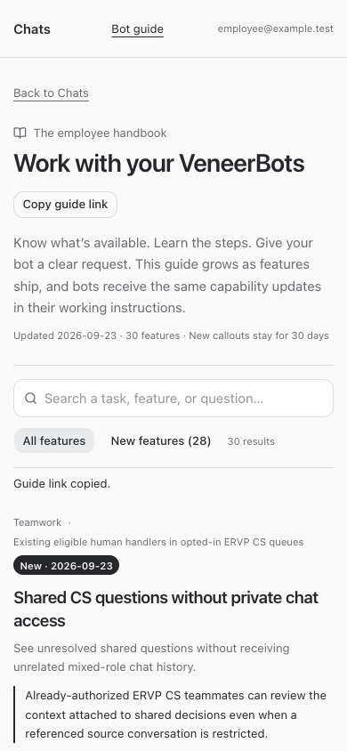

# Browser tab recovery — September 23, 2026

BUILD265, existing Platform Dev owner 732adce5-ea99-45d4-be9d-07ae47e02133.

## Demonstrated defects and repair

Synthetic command fixtures reproduce the retained failure path without accessing Shopify:

- The manager discarded the agent control ticket for every failed command, including a missing element on a live copy. The next command obtained a different control address, causing the broker to enter reconnect recovery. Page-level failures now retain the ticket while invalidating the runtime freshness check. Connection failures and lost copies retain the existing cold recovery path.
- Text tab parsing treated the next tab's URL as a continuation of a blank/internal tab. A blank t1 followed by login t7 therefore appeared to contain two identical login URLs. The parser now borrows a continuation URL only when the next line is not another tab.
- Broker bookkeeping skipped failed commands. A redirect followed by a failed lookup left an old URL/generation cached. Failed commands now refresh private tab metadata without retrying the command. Failed bookkeeping does not replace the original result. A recovered connection keeps old element references invalid until a successful fresh snapshot.

No safety guard was removed. Genuine duplicate URLs and closed targets remain ambiguous; no first-tab guessing or automatic mutation retry was added. Existing conversation/copy isolation, credential redaction, and saved-profile generation/promotion guards remain unchanged. Tab metadata remains in memory, never added to reports or persistent logs.

These source defects explain the reported loop without establishing whether a daemon also crashed during the incident. No raw production logs, page content, authentication URLs, cookies, storage, credentials, or customer session were inspected. The later BUILD262 restart is not attributed as the cause of the earlier incident. No new target-identity transport or browser-manager bypass was introduced.

## Recovery handoff

The existing operator d254c025-e786-4549-9da9-c2011e437332 retains login-refresh coordination; Sage remains the PO owner. After deployment, use the assigned working copy: list tabs, explicitly select the intended current tab, then take a fresh snapshot before using references. If two tabs genuinely match, resolve the choice from the current list rather than reusing an expired handle. Do not blindly repeat a failed click or submit.

This repairs runtime recovery, not website authentication. No login, password/TOTP, MFA change, purchase, base-profile promotion, or live recovery acceptance was performed. The saved Nick base was untouched. Return enrollment/setup is separate and unchanged.

## Validation

- Root typecheck passed.
- Full root npm test passed: 2,357 server tests (5 skipped), 872 web tests, 40 browser-manager tests, 21 installer tests.
- Expanded final broker regression suite: 31 passed, including redirect plus failed lookup, control rotation, duplicate URLs, closed targets, explicit selection, stale-reference rejection and no failed-command replay. Manager fixtures verify a failed lookup retains the same control address; parser fixtures cover blank/internal tabs and genuine multiline rows. Existing isolation, redaction and profile-generation tests passed.
- Employee guide browser fixtures passed for full/restricted roles, desktop/mobile, New notice, search, navigation, refresh and failure recovery. Instruction-context tests verify resumed delivery.
- Production build and deployment health are recorded below after completion.

## Changed files

- [agentBrowser.ts](/Users/archerclawdington/veneer-os/server/src/mcp/agentBrowser.ts)
- [manager.ts](/Users/archerclawdington/veneer-os/server/src/veneerBrowser/manager.ts)
- [tabReuse.ts](/Users/archerclawdington/veneer-os/server/src/veneerBrowser/tabReuse.ts)
- [catalog.ts](/Users/archerclawdington/veneer-os/server/src/featureGuide/catalog.ts)
- [agentBrowser.test.ts](/Users/archerclawdington/veneer-os/server/test/agentBrowser.test.ts)
- [veneerBrowser.test.ts](/Users/archerclawdington/veneer-os/server/test/veneerBrowser.test.ts)
- [tabReuse.test.ts](/Users/archerclawdington/veneer-os/server/test/tabReuse.test.ts)
