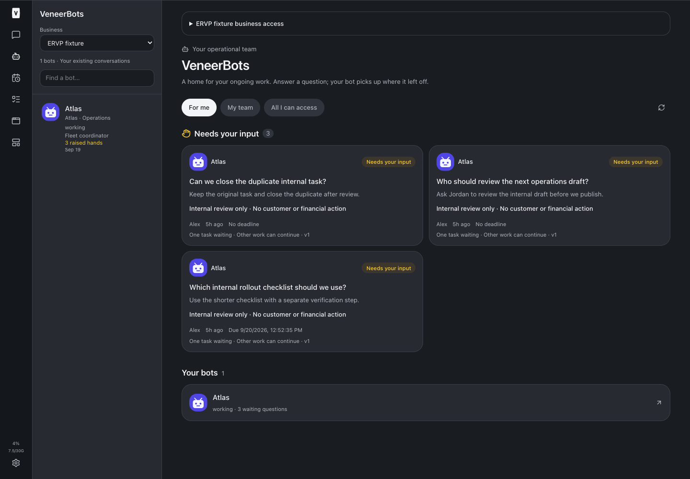
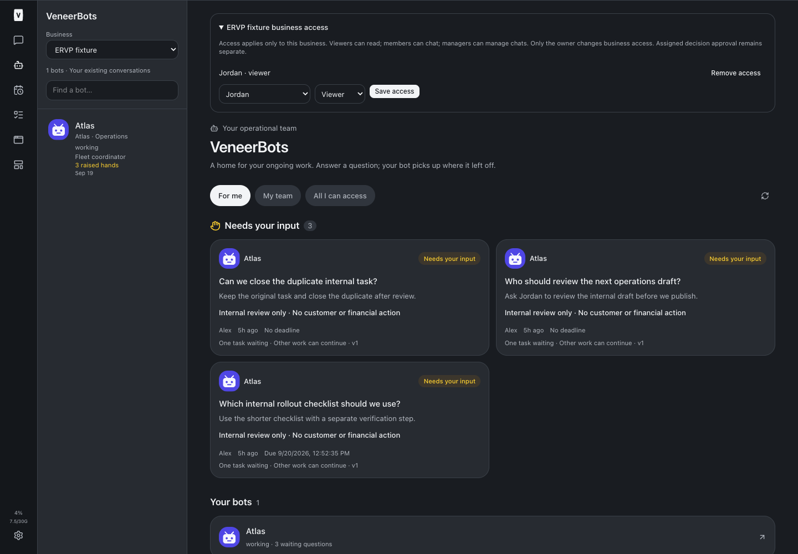
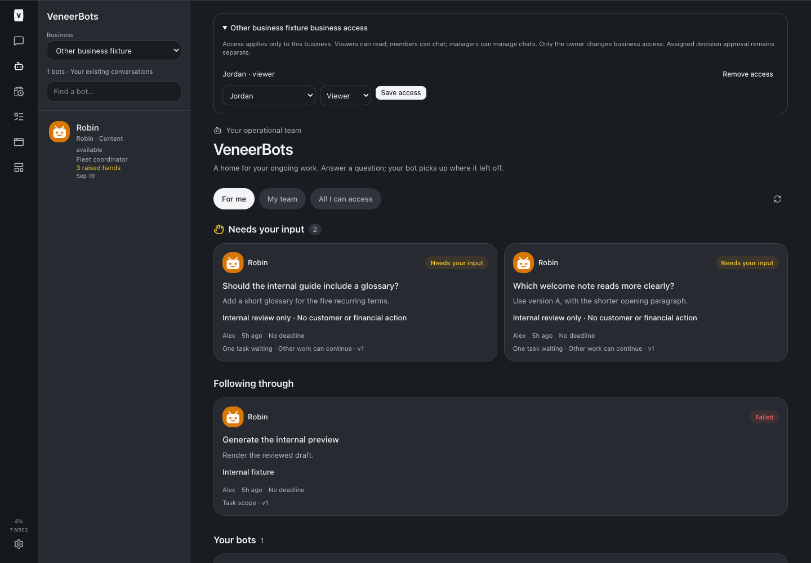
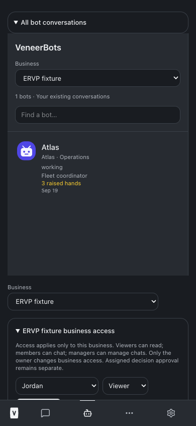
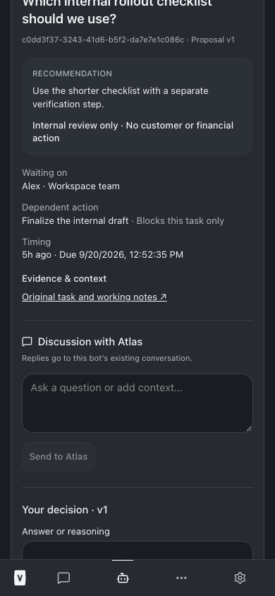

# Business fleets and ERVP adoption — build 79

September 19, 2026. Source implementation and validation complete. Deployment and actual ERVP enrollment are pending; this report will be updated after supported adoption/readback.

## Built

Stable business entities, explicit employee memberships (viewer/member/manager), unique bot memberships, fleet coordinator, reporting lead and subteam metadata. Business membership is an additional server-side boundary over existing chat visibility. The existing workspace “Team” label does not grant business access. Business owners retain access; other users require explicit membership. Viewers can read, members can chat, managers can manage chats; only the business owner can change business access. Assignment to a decision remains a separate approval condition.

VeneerBots has a business selector shared across desktop/mobile roster and raised hands, and owner controls to grant/remove employee access. Existing native conversation links, colorful avatars, working status and streamed-reply dots remain intact. A selected native business chat restores the corresponding roster selection. Coordinators and leads sort before other bots. Legacy individual registration is hidden when business fleets exist.

The supported MCP `manage_business_team` tool creates an owned business, changes explicit employee membership, delegates a bounded chat-ID allowlist, or reverses bot membership. Human owners and authenticated owner Platform Dev may configure businesses; operational agents cannot self-delegate. Native actor identity is recorded in immutable audit, never replaced with a human browser session.

The single MCP `enroll_business_bots` tool supports preview/apply. An operational bot must have a current delegation matching its authenticated native conversation, owner, business, and exact allowed chat IDs. Preview records the selected roles/reporting structure and hashes current ownership, provider/session/model/effort/project/registration metadata plus business/delegation revisions. Apply rechecks these inside one transaction. Foreign/duplicate/already-enrolled chats, bad hierarchy, missing/revoked delegation and changed previews fail without partial membership. Retries return the durable receipt; a service restart does not create a second enrollment.

Membership is reversible via owner management. Reports must be removed before their lead; the coordinator is removed last. Original registration names/active state are restored when they existed; newly registered bots become inactive. Native conversations/history remain intact.

## Permission coverage

Business checks apply to bot/decision/thread/evidence APIs, native chat read/send/manage paths, conversation discovery and archive counts, WebSocket subscriptions and revocation, generated-file registry views/downloads and source-link presentation. A scoped native bot cannot read another business’s scoped chats even when both have the same owner. Cross-business decision evidence is rejected. New chats explicitly created from a scoped native origin or fresh-context action inherit the business access boundary, but are never automatically registered as bots.

Business roles do not grant financial approval, expand policy authority, or bypass existing tool gates. Project ownership and native provider identity are retained. Existing shared project resources remain subject to their own platform permissions; business enrollment does not move or duplicate project directories.

## Validation

- `npm run typecheck`: passed ([output](./typecheck.txt)).
- `npm test`: **2,851 passed, 5 existing skipped** — installer21, server2,005, web785, browser manager40 ([output](./full-tests.txt)).
- Focused business/registry/discovery/unread tests: 35 passed ([output](./scoped-tests.txt)).
- Business tests cover exact-once enrollment across service recreation, unchanged native identity/ownership, immutable audit, duplicate/foreign/unapproved IDs, stale metadata, actor-bound previews, delegation revocation, membership revocation, read-only viewers, cross-business evidence and native reads, assigned-human enforcement, reversible metadata restoration, and direct HTTP conversation/discovery/tool/write gates.
- Isolated browser fixture uses two test businesses, real service/router and production UI. Desktop1440×1000/mobile390×844: business selector scopes roster/raised hands; owner grants/removes fixture viewer access; nonmember gets404; viewer cannot approve a decision assigned to someone else; no horizontal overflow or browser exceptions ([output](./browser-tests.txt)).
- Production build: [output](./build.txt). No live customer/finance tests.

Run the fixture with Node24: `node --import tsx scripts/bots-browser-fixture.ts --teams`. Run `node scripts/business-fleets-browser-check.mjs <local-playwright-module-path>`. These fixture controls exist only in the standalone test server.

## Screenshots

## Authorized ERVP adoption

Henry and Platform Dev independently verified the exact13 existing chats: active, owner1 (Nicholas), project e8e0efc6-2f5f-4666-8588-ede17529bc9c, existing workspace Team visibility. All use Codex and medium effort. Henry/Grant/Boris/Clara/Piper use gpt-6-astra; Nora/Miles/Tess/Owen/Avery/Finn/Sage/Maya use gpt-5.6-sol. No additional exact-ID operational bot is authorized; Astra is not an extra identity.

[Pre-adoption metadata](./adoption-before.json) stores native session hashes, not session values. [Exact reviewed enrollment](./ervp-enrollment.json) contains Henry as fleet coordinator, Grant as Customer Service lead, the five frontline bots reporting to Grant, and six specialists outside that reporting subteam. No employee grants, BulkBid adoption, cloned chats, customer/financial action, or RZ99W6 disposition is authorized or performed by this build.

Deployment requires the new additive0092 migration and rebuilt source, adopted by root `npm run restart` after successful checks/build. No migration seeds or automatically enrolls real chats. After restart Platform Dev will use the authenticated supported management tool to create ERVP and delegate only this list to Henry. Henry will preview/apply through his own tool identity. Readback will compare all13 native identities, models, effort, project ownership and exact hierarchy against the baseline.

## Changed source and test files

- [scripts/bots-browser-fixture.ts](/Users/archerclawdington/veneer-os/scripts/bots-browser-fixture.ts)
- [scripts/business-fleets-browser-check.mjs](/Users/archerclawdington/veneer-os/scripts/business-fleets-browser-check.mjs)
- [server/src/bots/routes.ts](/Users/archerclawdington/veneer-os/server/src/bots/routes.ts)
- [server/src/bots/service.ts](/Users/archerclawdington/veneer-os/server/src/bots/service.ts)
- [server/src/bots/teams.ts](/Users/archerclawdington/veneer-os/server/src/bots/teams.ts)
- [server/src/channels/webSocket.ts](/Users/archerclawdington/veneer-os/server/src/channels/webSocket.ts)
- [server/src/conversations/access.ts](/Users/archerclawdington/veneer-os/server/src/conversations/access.ts)
- [server/src/conversations/messageOriginPresentation.ts](/Users/archerclawdington/veneer-os/server/src/conversations/messageOriginPresentation.ts)
- [server/src/conversations/unread.ts](/Users/archerclawdington/veneer-os/server/src/conversations/unread.ts)
- [server/src/db/db.ts](/Users/archerclawdington/veneer-os/server/src/db/db.ts)
- [server/src/db/migrations/0092_business_fleets.sql](/Users/archerclawdington/veneer-os/server/src/db/migrations/0092_business_fleets.sql)
- [server/src/files/generatedFiles.ts](/Users/archerclawdington/veneer-os/server/src/files/generatedFiles.ts)
- [server/src/mcp/botTools.ts](/Users/archerclawdington/veneer-os/server/src/mcp/botTools.ts)
- [server/src/routes/api.ts](/Users/archerclawdington/veneer-os/server/src/routes/api.ts)
- [server/src/routes/buildQueue.ts](/Users/archerclawdington/veneer-os/server/src/routes/buildQueue.ts)
- [server/src/routes/generatedFiles.ts](/Users/archerclawdington/veneer-os/server/src/routes/generatedFiles.ts)
- [server/src/routes/gmailDrafts.ts](/Users/archerclawdington/veneer-os/server/src/routes/gmailDrafts.ts)
- [server/src/routes/recentConversations.ts](/Users/archerclawdington/veneer-os/server/src/routes/recentConversations.ts)
- [server/test/businessTeams.test.ts](/Users/archerclawdington/veneer-os/server/test/businessTeams.test.ts)
- [web/src/components/BotConversationRail.tsx](/Users/archerclawdington/veneer-os/web/src/components/BotConversationRail.tsx)
- [web/src/components/BusinessAccess.tsx](/Users/archerclawdington/veneer-os/web/src/components/BusinessAccess.tsx)
- [web/src/components/BusinessSelector.tsx](/Users/archerclawdington/veneer-os/web/src/components/BusinessSelector.tsx)
- [web/src/lib/bots.ts](/Users/archerclawdington/veneer-os/web/src/lib/bots.ts)
- [web/src/lib/types.ts](/Users/archerclawdington/veneer-os/web/src/lib/types.ts)
- [web/src/screens/Bots.tsx](/Users/archerclawdington/veneer-os/web/src/screens/Bots.tsx)

## Artifacts

- [adoption-before.json](/Users/archerclawdington/veneer-os/docs/reports/business-fleets/adoption-before.json)
- [browser-tests.txt](/Users/archerclawdington/veneer-os/docs/reports/business-fleets/browser-tests.txt)
- [build.txt](/Users/archerclawdington/veneer-os/docs/reports/business-fleets/build.txt)
- [ervp-enrollment.json](/Users/archerclawdington/veneer-os/docs/reports/business-fleets/ervp-enrollment.json)
- [full-tests.txt](/Users/archerclawdington/veneer-os/docs/reports/business-fleets/full-tests.txt)
- [scoped-tests.txt](/Users/archerclawdington/veneer-os/docs/reports/business-fleets/scoped-tests.txt)
- [typecheck.txt](/Users/archerclawdington/veneer-os/docs/reports/business-fleets/typecheck.txt)
