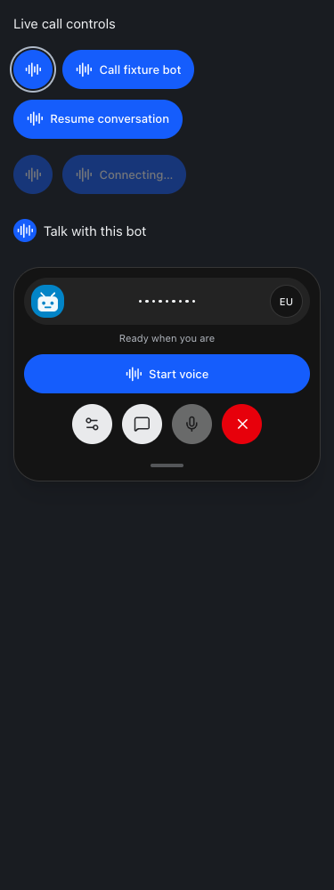
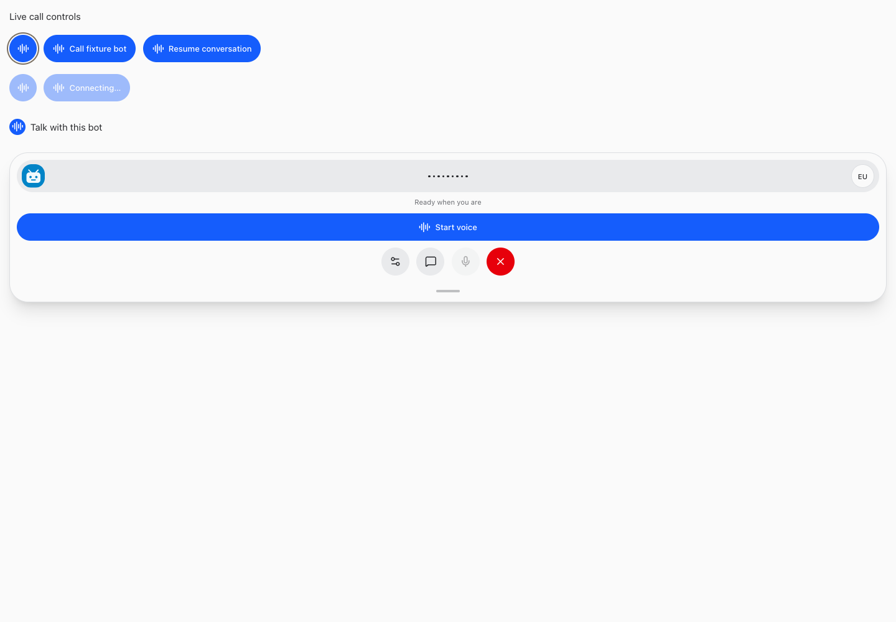

# Consistent live-call controls

September 23, 2026 · BUILD266

All live-call entry/start/resume controls now use the existing white AudioLines waveform and blue rounded surface. This includes chat header/composer/mobile menu, bot rows, Needs input cards/details, and compact/full voice start and resume. Labels, bot/decision routing, permission/readiness guards and pointer behavior remain; the chat header also supports keyboard click activation. The shared control has explicit 44px minimum targets, focus, hover, pressed and disabled styling. Loading/error/connected states remain owned by the existing voice lifecycle; no new call state or behavior was added.

Dictation, mute, playback and destructive End call remain distinct. No microphone, customer session, live call, or business action was used for testing.

The login operator explicitly confirmed restart safe: SMS challenge completed, Nick profile verified from a fresh copy and verification copy stopped. No login/profile/MFA work was performed by this build.

## Verification

Synthetic call-control browser fixtures passed 320/375/414/768/1440 widths, light/dark, keyboard activation exactly once, disabled controls, 44px targets and no overflow. Guide fixtures passed full/restricted employee access, desktop/mobile, notices, navigation, search and refresh. Existing instruction tests cover resumed guide delivery. Source audit found no remaining Phone handset for live-call entry; PhoneOff remains only for End call.

Root typecheck and full tests passed: 2,358 server (5 skipped), 872 web, 40 browser-manager and 21 installer tests. Production build passed. Implementation `ced78c6e4b685c5fe98eaae83b227190f580ce55` is pushed to origin/main. Root restart completed after the operator confirmed safe readiness; web, runner, app-runner, terminal, and browser-manager all returned HTTP 200. No live call or business action was performed.

<!-- Hallmark component refinement: philosophy4 hierarchy4 execution4 specificity5 restraint5 variety3. Existing Veneer palette and type retained; no page redesign. -->

## Changed files

- [CallButton.tsx](/Users/archerclawdington/veneer-os/web/src/components/CallButton.tsx)
- [BotComposer.tsx](/Users/archerclawdington/veneer-os/web/src/components/BotComposer.tsx)
- [VoiceCallPanel.tsx](/Users/archerclawdington/veneer-os/web/src/components/VoiceCallPanel.tsx)
- [Chat.tsx](/Users/archerclawdington/veneer-os/web/src/screens/Chat.tsx)
- [Bots.tsx](/Users/archerclawdington/veneer-os/web/src/screens/Bots.tsx)
- [LiveVoice.tsx](/Users/archerclawdington/veneer-os/web/src/screens/LiveVoice.tsx)
- [catalog.ts](/Users/archerclawdington/veneer-os/server/src/featureGuide/catalog.ts)
- [call-controls-browser-check.mjs](/Users/archerclawdington/veneer-os/scripts/call-controls-browser-check.mjs)
- [call-controls.tsx](/Users/archerclawdington/veneer-os/scripts/fixtures/call-controls.tsx)

Additional views: [mobile light](./375-light.png), [desktop dark](./1440-dark.png).
