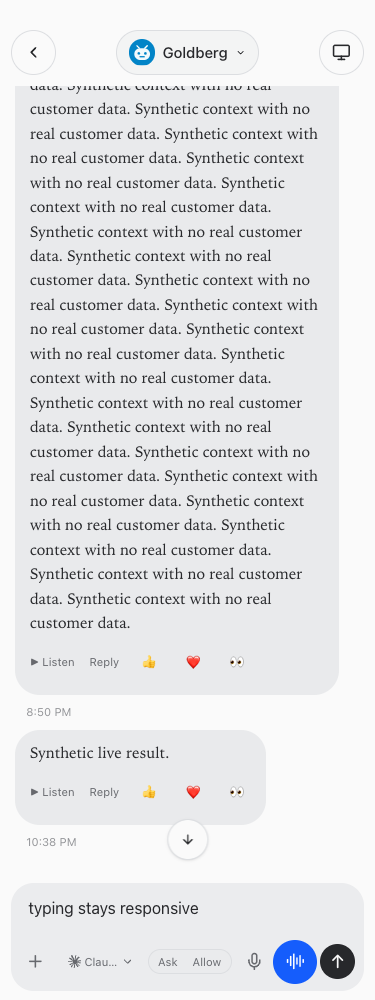
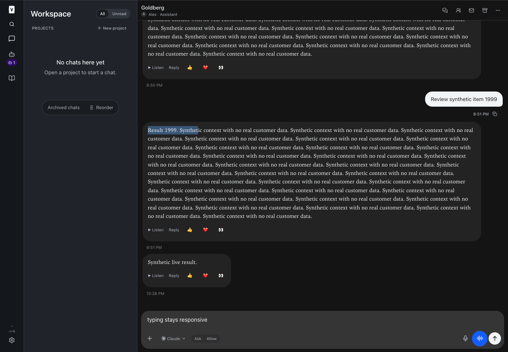

# Bounded chat history

BUILD275, September 23, 2026. The queue combined the separately requested performance task into the existing slot. CS draft authority work was completed first in `cb7fbff`; this is the subsequent, separate performance change. No provider context compaction, history deletion, real messages, calls, approvals or customer actions were used.

## What changed

The previous WebSocket subscription requested the complete normalized provider transcript and transmitted it to the browser. The browser reduced all supplied events and retained/rendered the resulting rows, even when offscreen. This source path confirms an unbounded initial browser workload; it does **not** establish a memory crash or diagnose Shopify/session behavior.

Chat subscriptions now request a disposable runner-side history index and a recent page. Pages are limited to 300 events and a 256 KiB event budget, plus small envelope metadata (tested under 260 KiB). A recent-day cutoff applies after a small minimum window so inactive chats still show useful recent work. Tool/request starts and turn context are carried as explicit indexed dependencies. Older pages use immutable generation/cursor indices, not timestamp guesses, and every event remains retrievable. Equal or missing timestamps cannot skip records.

Scroll toward the top or select **Load earlier messages**. Loaded pages merge by original index; live events remain ordered separately. A runner epoch/watermark fences snapshot-versus-live races. Older responses from a replaced generation are ignored. Reconnection opens a fresh recent window; it does not delete older history. Every page and large-record request rechecks current conversation access and user status.

Records over 64 KiB have an explicit large-record control and a bounded read-only text viewer. That viewer exposes original public display text, not hidden reasoning, raw tool inputs or internal provider metadata. Provider history remains untouched. Older calls with unloaded message context are identified separately rather than misleadingly placed among recent messages; loading context restores chronological placement.

Frozen transcript rows preserve unchanged DOM nodes when older content is inserted. Grouping is memoized across composer changes. The paint cache is limited to eight chats and roughly 512 KiB / 200 items per chat. Explicitly loaded history can grow while the user explores it; this is initial-load paging, not an arbitrary deletion/windowing policy.

## Measurements

[Raw browser measurements](./browser-metrics.json) and [10,000-turn reducer baseline](./baseline.json) are synthetic only. No private Grant transcript was read or logged.

The reducer baseline contained 30,000 events / 35,936,671 JSON bytes / 20,000 items and took about 51 ms on this machine. The full-app browser comparison used the same 2,000-turn fixture for an unbounded snapshot and the bounded path in this implementation, with all APIs/WebSockets intercepted. It is a paired transport/rendering comparison, not a claim that the baseline reproduces every prior-release behavior.

At 1440 px/light:

| Measure | Unbounded | Paged |
|---|---:|---:|
| Snapshot bytes | 3,296,462 | 178,192 |
| Transcript rows | 4,000 | 200 |
| Total DOM nodes | 64,285 | 3,487 |
| JS heap used (sample, no forced GC) | 85,120,244 | 27,430,520 |
| Input-event → next animation-frame median | 97.1 ms | 46.5 ms |
| Input-event → next animation-frame p95 | 99.2 ms | 75.7 ms |

These are local headless fixture measurements, not production INP or a guaranteed speedup. Timings vary: the paged dark run’s input-to-frame median was 119.4 ms. Raw output includes every theme/width and external Playwright key-to-frame timings. Resource bounds improved consistently; timing does not establish uniformly faster typing on every device/theme.

**Remaining server cost:** provider normalization still reads the complete source transcript when opening a fresh UI generation. The index avoids shipping/retaining that full snapshot in the browser and avoids full runner-to-web snapshot RPC payloads, but does not implement streaming provider-file parsing. Private temporary indices expire on later opens, are capped at 16 generations and are cleaned on orderly runner shutdown. An expired UI window asks for a reload; original history is preserved.

## Verification

Root typecheck, full tests and build passed: 2,381 server tests / 5 skipped, 877 web tests, 40 browser-manager tests, 21 installer tests. Tests cover huge-day and byte bounds, complete page recovery, tool dependencies, equal/missing timestamps, oversize text, cursor isolation, native snapshot/live watermark races and revoked access. Existing transcript, queue, approval, voice and instruction tests remain passing.

Full-app synthetic browser checks at 320/375/414/768/1440 in light/dark cover bounded initial DOM, older-page loading, visible scroll anchoring, retained selection, composer draft, live result arrival and stale-generation rejection after reconnect. The existing voice suite passed chronological placement, private transcript keyboard access, earlier pages and stale chat-switch responses. Full/restricted guide and resumed instruction checks passed. No live business acceptance is claimed.

## Files

- [docs/reports/chat-history/baseline.json](/Users/archerclawdington/veneer-os/docs/reports/chat-history/baseline.json)
- [docs/reports/chat-history/browser-metrics.json](/Users/archerclawdington/veneer-os/docs/reports/chat-history/browser-metrics.json)
- [docs/reports/routine-message-execution/contract.md](/Users/archerclawdington/veneer-os/docs/reports/routine-message-execution/contract.md)
- [scripts/chat-history-baseline.ts](/Users/archerclawdington/veneer-os/scripts/chat-history-baseline.ts)
- [scripts/chat-history-browser-check.mjs](/Users/archerclawdington/veneer-os/scripts/chat-history-browser-check.mjs)
- [server/src/channels/webSocket.ts](/Users/archerclawdington/veneer-os/server/src/channels/webSocket.ts)
- [server/src/featureGuide/catalog.ts](/Users/archerclawdington/veneer-os/server/src/featureGuide/catalog.ts)
- [server/src/runner/client.ts](/Users/archerclawdington/veneer-os/server/src/runner/client.ts)
- [server/src/runner/ipcServer.ts](/Users/archerclawdington/veneer-os/server/src/runner/ipcServer.ts)
- [server/src/runtime/conversationManager.ts](/Users/archerclawdington/veneer-os/server/src/runtime/conversationManager.ts)
- [server/src/runtime/historyPages.ts](/Users/archerclawdington/veneer-os/server/src/runtime/historyPages.ts)
- [server/test/historyPages.test.ts](/Users/archerclawdington/veneer-os/server/test/historyPages.test.ts)
- [server/test/historySocket.test.ts](/Users/archerclawdington/veneer-os/server/test/historySocket.test.ts)
- [web/src/components/ChatHistoryControls.tsx](/Users/archerclawdington/veneer-os/web/src/components/ChatHistoryControls.tsx)
- [web/src/lib/transcript.ts](/Users/archerclawdington/veneer-os/web/src/lib/transcript.ts)
- [web/src/lib/types.ts](/Users/archerclawdington/veneer-os/web/src/lib/types.ts)
- [web/src/lib/useChatHistory.ts](/Users/archerclawdington/veneer-os/web/src/lib/useChatHistory.ts)
- [web/src/lib/voiceTimeline.ts](/Users/archerclawdington/veneer-os/web/src/lib/voiceTimeline.ts)
- [web/src/lib/ws.test.ts](/Users/archerclawdington/veneer-os/web/src/lib/ws.test.ts)
- [web/src/lib/ws.ts](/Users/archerclawdington/veneer-os/web/src/lib/ws.ts)
- [web/src/screens/Chat.tsx](/Users/archerclawdington/veneer-os/web/src/screens/Chat.tsx)
