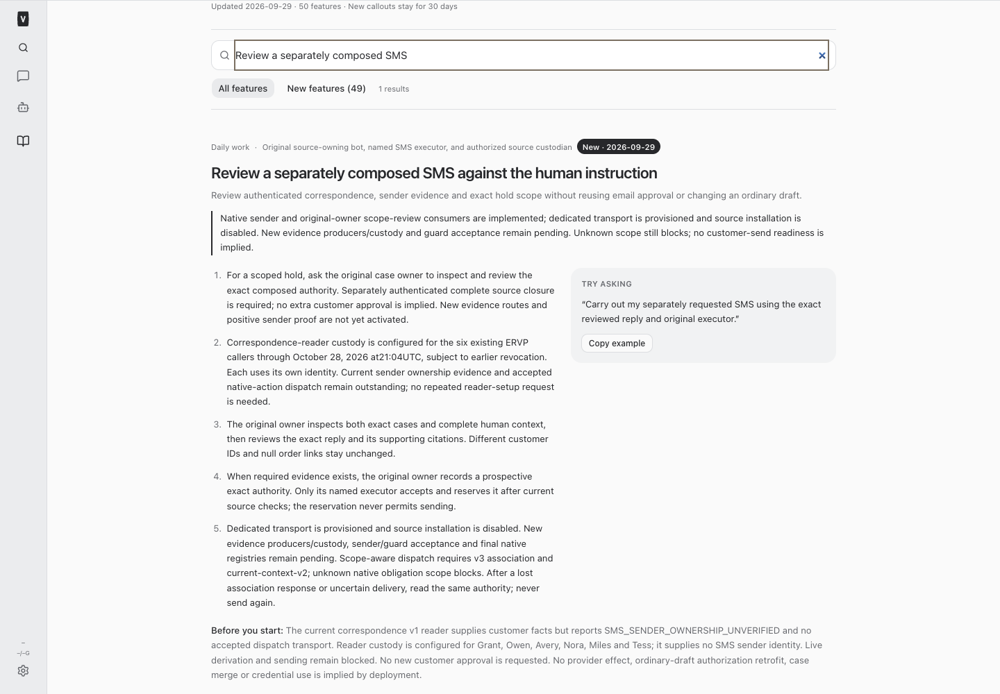
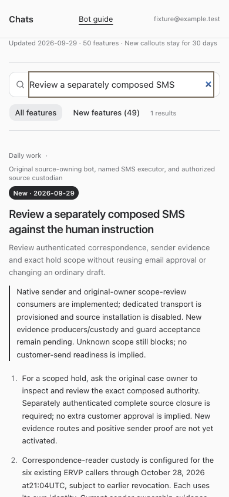

# BUILD444 — Native composed SMS sender and scope consumers

Native now implements authenticated positive sender evidence consumption, complete bounded source-closure validation, original-owner immutable scope review, and explicitly versioned scope-aware first association. Source owner ae5d accepted the corrected consumer contract for disabled wiring at 2026-09-29T01:16:12.521Z. This is not end-to-end SMS activation.

## What changed

- Separate protected evidence custody binds each original caller and the independent exact-action service reader. No existing email, correspondence, forward-service or reverse-ledger grant is widened.
- Positive sender evidence must match the registered issuer and actual dispatch process/client generation, configured/effective account and phone, implementation/runtime, revocation and short observation lifetime. Historical source433 unknown-only data is unchanged.
- Source closure commits real persisted roots, edges and revisions. Native traverses all three seeds; incomplete, ambiguous, unsupported or overlapping scope stays blocking. The original owner reviews full accessible native context and authenticated facts, then records a supplemental immutable classification. It never changes business approval or closes a hold.
- Context v2 and association/readback v3 retain historical versions. First association refreshes source proof and atomically rechecks native dependency revisions and review revocation. A new hold invalidates prior classifications. Replay, lost response and UNKNOWN never yield another entitlement.

## Source review and registry disposition

Source441 code4745ce652f920ab53a280e53bcf514bcdcd503c5 and configuration deploymente52babaa-1705-4399-8395-c4871651193e succeeded; retained exact-SHA health is 2026-09-29T00:56:52.545Z. Its disabled installation preserves null sender/guard acceptance and empty timezone evidence. Native matched all12 retained writer-file hashes and read the actual lock/fence code. Retained real-PG tests demonstrate the recorded STOP/message and table-lock checks, but do not establish the full requested executed DELETE/enrollment/canonical-conflict and common-wire race matrix. Therefore no blanket guard acceptance was issued.

Both native service and new evidence registries remain absent. Existing429/434 registry files and authority are preserved. No production authority, scope review, claim, prepare, dispatch, credential read or provider/customer probe occurred.

## Exact remaining integration

Source owner ae5d owns the three agreed evidence/closure producer routes, stable immutable scope snapshot ledger, v3 prepared context and dispatch-process observation integration through its own source queue. Custodian a4bc owns the exact new route/audit/service-reader custody receipt and current permitted sender issuer evidence. Executed writer coverage, actual process sender proof and local-time evidence are still required before native guard acceptance and protected registry activation. These are technical dependencies, not duplicate customer approval.

After those dependencies are established, original Grant uses supported composed inspection/derivation and scope inspection/review under his own identity; original Tess alone owns eventual acceptance/reservation and separately fenced execution. This build commissions no customer execution.

## Validation and deployment

Node24 root typecheck, focused152 tests, full suites (server2,862 passed/5 skipped; web909; browser54; installer29), and production build passed before restart. The build emitted its standard bundle-size advisory. Isolated browser fixtures verified full and restricted employee guide access, current scope/setup limits and mobile overflow; catalog/core-instruction tests verified fresh/resumed-agent delivery. No production data was used. Runtime readback follows the supported root restart.

## Contract and changed files

- [bot-feature-guide.md](/Users/archerclawdington/veneer-os/docs/bot-feature-guide.md)
- [composedSmsContext.ts](/Users/archerclawdington/veneer-os/server/src/bots/composedSmsContext.ts)
- [composedSmsContract.ts](/Users/archerclawdington/veneer-os/server/src/bots/composedSmsContract.ts)
- [composedSmsReader.ts](/Users/archerclawdington/veneer-os/server/src/bots/composedSmsReader.ts)
- [composedSmsVerifier.ts](/Users/archerclawdington/veneer-os/server/src/bots/composedSmsVerifier.ts)
- [composedSmsVerifierRoutes.ts](/Users/archerclawdington/veneer-os/server/src/bots/composedSmsVerifierRoutes.ts)
- [routes.ts](/Users/archerclawdington/veneer-os/server/src/bots/routes.ts)
- [config.ts](/Users/archerclawdington/veneer-os/server/src/config.ts)
- [catalog.ts](/Users/archerclawdington/veneer-os/server/src/featureGuide/catalog.ts)
- [botTools.ts](/Users/archerclawdington/veneer-os/server/src/mcp/botTools.ts)
- [botFeatureGuide.test.ts](/Users/archerclawdington/veneer-os/server/test/botFeatureGuide.test.ts)
- [composedSms.test.ts](/Users/archerclawdington/veneer-os/server/test/composedSms.test.ts)
- [composedSmsContext.test.ts](/Users/archerclawdington/veneer-os/server/test/composedSmsContext.test.ts)
- [composedSmsReader.test.ts](/Users/archerclawdington/veneer-os/server/test/composedSmsReader.test.ts)
- [composedSmsTools.test.ts](/Users/archerclawdington/veneer-os/server/test/composedSmsTools.test.ts)
- [composedSmsVerifierRoutes.test.ts](/Users/archerclawdington/veneer-os/server/test/composedSmsVerifierRoutes.test.ts)
- [composedSmsClosure.ts](/Users/archerclawdington/veneer-os/server/src/bots/composedSmsClosure.ts)
- [composedSmsEvidenceReader.ts](/Users/archerclawdington/veneer-os/server/src/bots/composedSmsEvidenceReader.ts)
- [composedSmsScope.ts](/Users/archerclawdington/veneer-os/server/src/bots/composedSmsScope.ts)
- [composedSmsSender.ts](/Users/archerclawdington/veneer-os/server/src/bots/composedSmsSender.ts)
- [0133_compose_scope_reviews.sql](/Users/archerclawdington/veneer-os/server/src/db/migrations/0133_compose_scope_reviews.sql)
- [composedSmsEvidence.test.ts](/Users/archerclawdington/veneer-os/server/test/composedSmsEvidence.test.ts)
- [contract.md](/Users/archerclawdington/veneer-os/docs/reports/composed-sms/build444/contract.md)
- [guard-review.json](/Users/archerclawdington/veneer-os/docs/reports/composed-sms/build444/guard-review.json)

## Isolated employee guide checks

