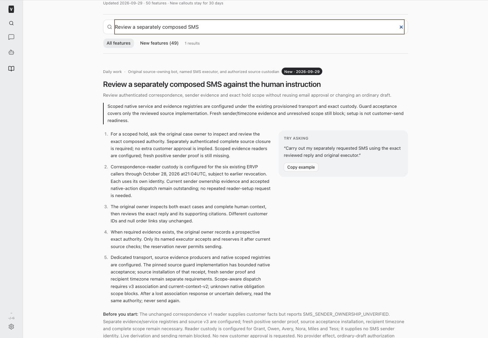
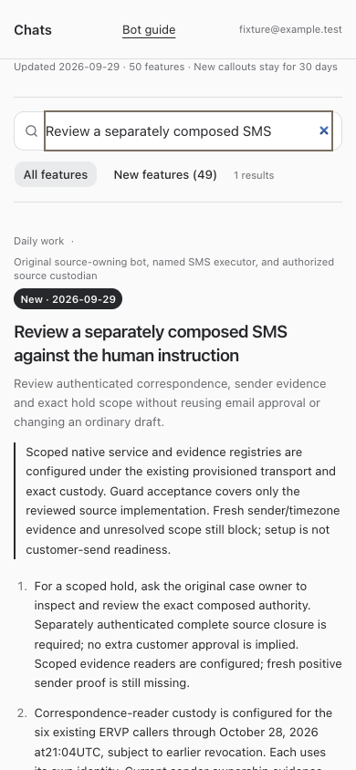

# BUILD447 — Scoped composed-SMS trust installation

Native independently reviewed source commit `52529d8ebf607e66c031f9ee2dcbab79c85400f8` and manifest `5d07c815da5a030e8db76b26afbcf4b1ffff94cd35c1038b758a6cae47cf5129`. The whole source registration hash remains `22bb6bf3a0434e22ce34af24ac4aac01fe972d0e447a1a5c61b3622024dd010a`. Native accepts the exact implementation and exercised concurrency/failure boundaries, not case readiness, universal coverage or post-commit revocation.

All 17 distinct writer-file digests match. Retained source tests now demonstrate the previously missing real-PG DELETE, enrollment revocation, material child insertion/update, canonical lease conflict and escalation contention; the actual legacy sendSMS entry is fenced before its synthetic provider. The 53-test focused and 35-test final correction runs passed. Source build passed; its full typecheck still reports 285 errors outside changed modules, with no clean-baseline claim. Final source Railway deployment `8f117362-154d-4aec-9f1e-f84faca84729` has retained SUCCESS and exact-SHA health at 02:05:55.005Z. Native performed no source/provider probes.

## Configuration and preserved authority

The native service and evidence manifests use actual provisioned identities and hashes, final installed source ACL, current native Grant/Tess bindings and final custodian permission. The SMS payload account is exactly **OrderOps SMS +15746756919**, read from the retained original inspection artifact and verified against payload hash `894f6968415a70c02d8c3b2578739512139f1a9b76da0cac62d21742d402ddca`. It was not inferred from source account `help@elkhartrvparts.com` or obtained through a live case read.

Protected registry files must be absolute, regular, nonsymlink, owned by UID501 and mode0600. Earliest grant/token/custody expiry remains **2026-10-28T00:14:26Z** or earlier revocation. Own Grant/Tess sender reads, Grant-only owner scope review and separately authenticated exact-action scope reader stay distinct. Scope snapshot issuance and pre-context action binding are explicitly permitted technical audit writes; neither authorizes business mutations. Original email approval, ordinary SMS draft and429/434 registries are unchanged.

## Independent readiness limits

- Source must install the exact native guard-acceptance receipt through sole source owner ae5d and its proper queue. Native does not edit source configuration.
- Sender receipt is still null; the old observation is expired. Actual current issuer and dispatcher configured/effective identity proof is required. Recipient-timezone evidence is still empty. No provider verification is performed by this build.
- Source closure intentionally reports incomplete for subjects, correspondence, notes, QA, tags, unsupported return/customer references and non-E164 phones. Common real cases may never clear under this model even after owner review. Synthetic complete graphs do not establish Brian/global-inventory readiness. Original-owner inspection must report this concrete model limit, never missing consent or infer aliases, merge cases, retire drafts or rewrite approvals.
- Locks end at source SENDING commit. There is no distributed transaction or post-commit revocation guarantee. Original one-attempt, UNKNOWN, exact payload, executor and receipt gates remain enforced.

No authority, review, preparation, claim, send, credential retrieval or customer/provider action was performed. No new source builder or source job was created. Original-owner inspection is separate from derivation/execution; no acceptance retry was issued while sender evidence remains absent.

## Validation and runtime

Node24 root typecheck, 169 focused tests, full suites (server2,862 passed/5 skipped, web909, browser54, installer29) and production build passed. Standard bundle-size advisory only. Isolated browser fixtures verified full/restricted employee guide and mobile overflow; core/catalog tests verify resumed-agent instructions. Both protected files were installed at 2026-09-29T02:17:56Z and passed the actual deployed loaders and current native identity checks. Only two exact config paths were appended; old429/434 hashes remain unchanged. Commit `a9ad00ea04a03a81342796552ddec5ef315773f7` was pushed and the supported root restart completed once. All five services returned HTTP200; all 4,552 built artifact hashes match. Protected file ownership, permissions, exact config paths and preserved429/434 digests were read back successfully. Registries are configured; the independent readiness limits above remain unresolved.

## Evidence and changed files

- [guard-review.json](/Users/archerclawdington/veneer-os/docs/reports/composed-sms/build447/guard-review.json)
- [guard-acceptance.json](/Users/archerclawdington/veneer-os/docs/reports/composed-sms/build447/guard-acceptance.json)
- [service-registry.manifest.json](/Users/archerclawdington/veneer-os/docs/reports/composed-sms/build447/service-registry.manifest.json)
- [evidence-registry.manifest.json](/Users/archerclawdington/veneer-os/docs/reports/composed-sms/build447/evidence-registry.manifest.json)
- [validation.json](/Users/archerclawdington/veneer-os/docs/reports/composed-sms/build447/validation.json)
- [catalog.ts](/Users/archerclawdington/veneer-os/server/src/featureGuide/catalog.ts)
- [botFeatureGuide.test.ts](/Users/archerclawdington/veneer-os/server/test/botFeatureGuide.test.ts)
- [bot-feature-guide.md](/Users/archerclawdington/veneer-os/docs/bot-feature-guide.md)

- [installation.json](/Users/archerclawdington/veneer-os/docs/reports/composed-sms/build447/installation.json)

- [runtime.json](/Users/archerclawdington/veneer-os/docs/reports/composed-sms/build447/runtime.json)
