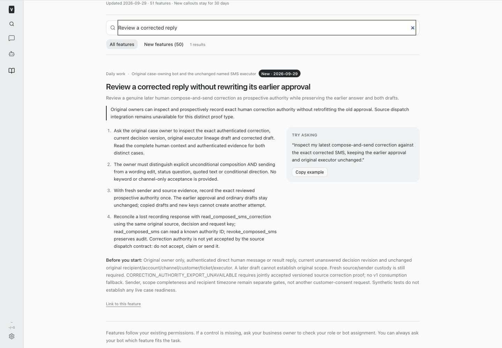
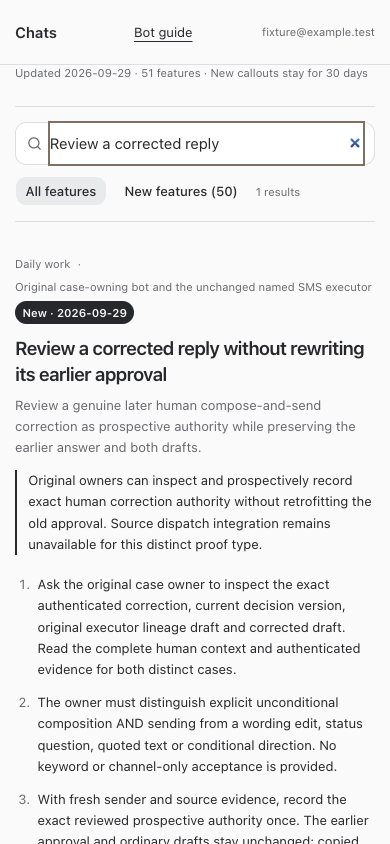

# BUILD450 — Prospective authenticated correction authority

Implemented original-owner inspection, semantic review, immutable prospective correction authority, and read-only lost-response reconciliation. Historical conversational consent and consumed-approval composition remain unchanged. One shared decision/business/SMS fence prevents replacement across proof types, drafts and keys. No production decisions, drafts, authorities, claims or customer actions were performed.

The new proof cannot safely use the existing source authority contract, which assumes unchanged historical consumption. Correction accept/claim/export fail explicitly until a distinct source contract is accepted. This is a deployed native derivation path, not a ready customer-send path. Sender/process, scope completeness and timezone remain separate dependencies; no refresh or live case probe was commissioned.

See [exact contract](./contract.md), [synthetic proof vector](./synthetic-correction-v1.json), and the authenticated employee guide at `/#/bot-guide?feature=composed-sms-correction`.

## Validation

Node24 root typecheck, 150 focused tests, full suites (server 2,904 passed/5 skipped, web 909, browser 54, installer 29), and production build passed before restart. Full/restricted employee guide and mobile layout passed isolated browser checks; current and resumed-agent instructions passed. Source independently reproduced the new synthetic authority, wire, correction-source and shared action hashes at 03:25:02.871Z; source coupling is not accepted. Runtime receipt follows the supported restart.

## Changed files

- [composedSmsCorrection.ts](/Users/archerclawdington/veneer-os/server/src/bots/composedSmsCorrection.ts)
- [composedSms.ts](/Users/archerclawdington/veneer-os/server/src/bots/composedSms.ts)
- [routes.ts](/Users/archerclawdington/veneer-os/server/src/bots/routes.ts)
- [botTools.ts](/Users/archerclawdington/veneer-os/server/src/mcp/botTools.ts)
- [catalog.ts](/Users/archerclawdington/veneer-os/server/src/featureGuide/catalog.ts)
- [composedSmsCorrection.test.ts](/Users/archerclawdington/veneer-os/server/test/composedSmsCorrection.test.ts)
- [composedSmsTools.test.ts](/Users/archerclawdington/veneer-os/server/test/composedSmsTools.test.ts)
- [botFeatureGuide.test.ts](/Users/archerclawdington/veneer-os/server/test/botFeatureGuide.test.ts)
- [bot-feature-guide.md](/Users/archerclawdington/veneer-os/docs/bot-feature-guide.md)

- [contract.md](/Users/archerclawdington/veneer-os/docs/reports/composed-sms/build450/contract.md)
- [synthetic-correction-v1.json](/Users/archerclawdington/veneer-os/docs/reports/composed-sms/build450/synthetic-correction-v1.json)
- [validation.json](/Users/archerclawdington/veneer-os/docs/reports/composed-sms/build450/validation.json)
