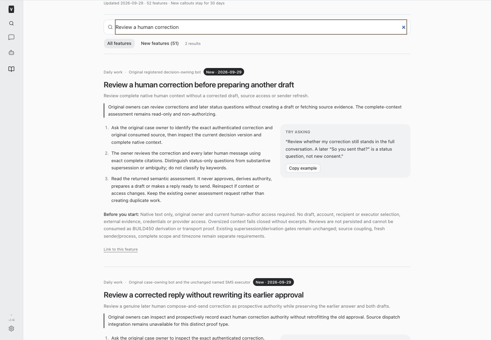
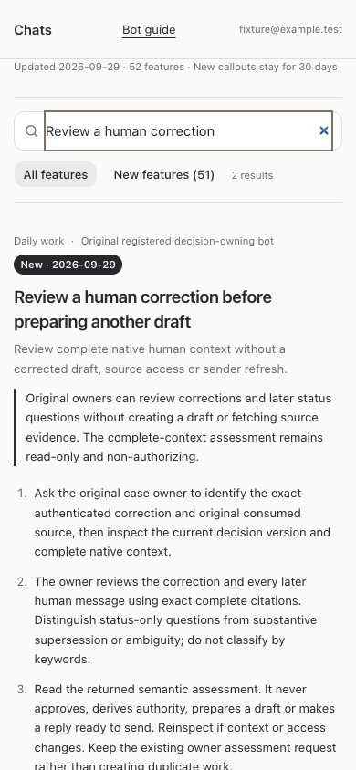

# BUILD451 — Native-only human correction review

Added original-owner `inspect_correction_preflight` and `review_correction_preflight`. Neither requires or reads a draft, source service, credential or sender observation. Later status questions are returned for semantic assessment instead of automatically superseding the correction. Every result is non-authorizing; no audit or business records are written.

The owner reviews the complete native context and exact citations for the correction and every later human message. Substantive supersession and ambiguity remain unresolved. Wording edits, status questions, quoted/bot text and conditional instructions cannot become send authority. BUILD450 derivation and all transport gates are unchanged.

[Exact API and limits](/Users/archerclawdington/veneer-os/docs/reports/composed-sms/build451/contract.md). The existing Grant assessment request is not duplicated. No builder interpretation or customer/source/provider action was performed; the actual original-owner assessment must precede any transport continuation. Source owner ae5d relayed Grant’s existing 04:10:41.750Z assessment at 04:18:28.850Z: the full instruction sequence supports the narrowed photo request, the later status question is not supersession or approval, and no exact corrected SMS payload/version is established. This is a reported owner assessment, not a new preflight invocation or authority created by the builder.

## Validation and runtime

Node24 root typecheck, 95 focused tests, full suites (server 2,926 passed/5 skipped, web 909, browser 54, installer 29), and production build passed. Isolated full/restricted employee guide and mobile overflow checks passed; current/resumed-agent instructions passed. Tests ran preflight with no drafts and SQLite query-only enabled, verified unchanged history/authority tables and no network call. Runtime receipt follows the supported root restart.

## Changed files

- [correctionPreflight.ts](/Users/archerclawdington/veneer-os/server/src/bots/correctionPreflight.ts)
- [routes.ts](/Users/archerclawdington/veneer-os/server/src/bots/routes.ts)
- [botTools.ts](/Users/archerclawdington/veneer-os/server/src/mcp/botTools.ts)
- [catalog.ts](/Users/archerclawdington/veneer-os/server/src/featureGuide/catalog.ts)
- [correctionPreflight.test.ts](/Users/archerclawdington/veneer-os/server/test/correctionPreflight.test.ts)
- [composedSmsTools.test.ts](/Users/archerclawdington/veneer-os/server/test/composedSmsTools.test.ts)
- [botFeatureGuide.test.ts](/Users/archerclawdington/veneer-os/server/test/botFeatureGuide.test.ts)
- [bot-feature-guide.md](/Users/archerclawdington/veneer-os/docs/bot-feature-guide.md)

- [validation.json](/Users/archerclawdington/veneer-os/docs/reports/composed-sms/build451/validation.json)
