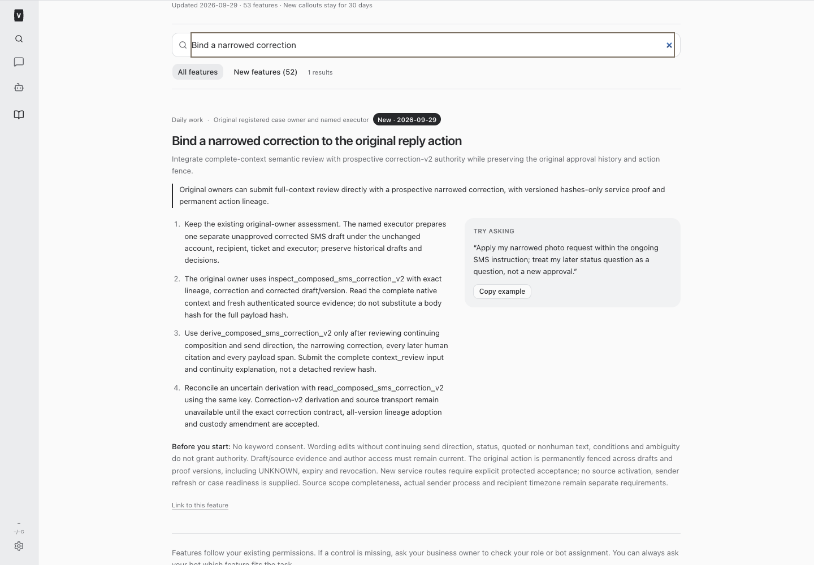
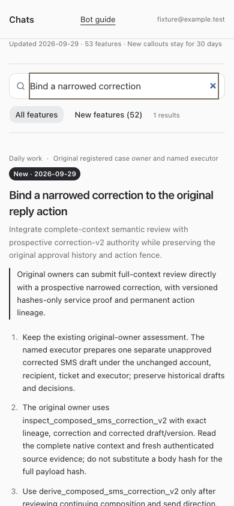

# BUILD452 — Integrated correction review and permanent action lineage

Implemented explicit correction-v2 inspect, derive and read-only reconciliation. The original owner submits the complete native preflight review input, exact continuing compose/send citations, narrowing correction, every later-human classification and every corrected payload span. The server authenticates and reruns that review after source reads and inside the immediate derivation transaction; it never accepts a detached review hash as authority. Historical preflight and correction-v1 meanings remain unchanged.

New correction authority commits complete native context, current decision/version/handling/proposal, exact full payload, wire body, original lineage, owner/executor, authenticated source material, sender and protected registration. Historical decisions, consumption, drafts and authorities are not rewritten. A wording edit without continuing send direction, status question, nonhuman/quoted evidence, unresolved condition or ambiguity fails closed. Later reviewed status questions neither supply consent nor automatically supersede.

One permanent native action UUID is shared by original-action digest across proof versions. Historical dispatch UUIDs are preserved and exported only from exact durable records; unknown/conflicting mappings deny. Copied drafts, changed keys, expiry, revocation and UNKNOWN never free uniqueness. Migration 0134 only appends a new immutable mapping table; no applied SQL was changed.

The versioned hashes-only service projection, strict locators, lineage GET, correction-aware current-context-v2, first-only association and source receipt consumer are implemented. Export recomputes the entire projection from the private authority. Current context, access, revocation and native revisions are rechecked at accept, reservation, export and first association. Only a first authenticated service association can return entitlement. Bot claim remains `execute:false`; readback never invokes a provider or repairs timelines.

## Activation boundary

**No production registry, source code, business record, credential or provider was changed or probed by this build.** Current protected trust has no correction amendment. Correction-v2 derivation and service use deny before creating a new authority until actual source adoption/implementation and custody amendment are accepted; no placeholder flag or future retrofit is offered.

Original Grant retains semantic ownership, and Tess retains executor identity. Their reported corrected draft ID/version is a reference, not a builder-verified payload. Grant's own supported inspection must obtain the actual complete payload hash and current source evidence. Existing evidence reports an expired sender receipt; process/scope/timezone remain separate unresolved requirements. Real source closure intentionally excludes unsupported freeform/relationship evidence and may not prove unrelatedness. No case readiness, send or delivery is claimed.

Source owner ae5d accepted the common adoption design at 2026-09-29T05:23:37.722Z, **not** its implementation or custody. No source job was requested. The next source technical requirement is the exact transactional adoption and amendment described below, owned by ae5d and the existing custodian. No duplicate human semantic request or customer approval was made.

## Contracts and evidence

- [Source adoption and custody protocol](/Users/archerclawdington/veneer-os/docs/reports/composed-sms/build452/source-adoption.md)
- [Original accepted interface direction](/Users/archerclawdington/veneer-os/docs/reports/composed-sms/correction-integration-proposal-v1/contract.md)
- [Unchanged synthetic golden vector](/Users/archerclawdington/veneer-os/docs/reports/composed-sms/correction-integration-proposal-v1/golden.json)
- [Strict-parser seven-digest parity receipt](/Users/archerclawdington/veneer-os/docs/reports/composed-sms/build452/golden-parity.json)

Synthetic tests cover integrated review→derivation→export/context→reservation→one association→UNKNOWN/read-only receipt, drift/revocation/supersession and immutable history. Successful association uses an explicitly isolated accepted-scope adapter. Separate actual native-context tests retain unknown inventory blockers. The source intent/audit adoption test is an executable SQLite protocol model, not executed PostgreSQL writer evidence; the latter remains the source owner's responsibility.

## Employee and agent guide

The dated `correction-integration` feature provides exact original-owner/executor steps, setup limitations and examples. Full/restricted employee access, mobile overflow and fresh/resumed agent instructions were verified with isolated fixtures.

## Validation

Node24 root typecheck, 298 focused tests, full tests (server 2,980 passed/5 skipped; web 909; browser 54; installer 29) and production build passed. Build emitted its standard bundle-size advisory. [Validation receipt](/Users/archerclawdington/veneer-os/docs/reports/composed-sms/build452/validation.json). [Exact implementation and contract hashes](/Users/archerclawdington/veneer-os/docs/reports/composed-sms/build452/implementation-manifest.json). Runtime verification follows the supported restart.

## Changed files

- [composedSms.ts](/Users/archerclawdington/veneer-os/server/src/bots/composedSms.ts)
- [composedSmsAuthority.ts](/Users/archerclawdington/veneer-os/server/src/bots/composedSmsAuthority.ts)
- [composedSmsContext.ts](/Users/archerclawdington/veneer-os/server/src/bots/composedSmsContext.ts)
- [composedSmsCorrection.ts](/Users/archerclawdington/veneer-os/server/src/bots/composedSmsCorrection.ts)
- [composedSmsCorrectionV2.ts](/Users/archerclawdington/veneer-os/server/src/bots/composedSmsCorrectionV2.ts)
- [composedSmsCorrectionContract.ts](/Users/archerclawdington/veneer-os/server/src/bots/composedSmsCorrectionContract.ts)
- [composedSmsDispatchProof.ts](/Users/archerclawdington/veneer-os/server/src/bots/composedSmsDispatchProof.ts)
- [composedSmsLineage.ts](/Users/archerclawdington/veneer-os/server/src/bots/composedSmsLineage.ts)
- [composedSmsTypes.ts](/Users/archerclawdington/veneer-os/server/src/bots/composedSmsTypes.ts)
- [composedSmsEvidenceReader.ts](/Users/archerclawdington/veneer-os/server/src/bots/composedSmsEvidenceReader.ts)
- [composedSmsReader.ts](/Users/archerclawdington/veneer-os/server/src/bots/composedSmsReader.ts)
- [composedSmsScope.ts](/Users/archerclawdington/veneer-os/server/src/bots/composedSmsScope.ts)
- [composedSmsTrust.ts](/Users/archerclawdington/veneer-os/server/src/bots/composedSmsTrust.ts)
- [composedSmsVerifier.ts](/Users/archerclawdington/veneer-os/server/src/bots/composedSmsVerifier.ts)
- [composedSmsVerifierRoutes.ts](/Users/archerclawdington/veneer-os/server/src/bots/composedSmsVerifierRoutes.ts)
- [routes.ts](/Users/archerclawdington/veneer-os/server/src/bots/routes.ts)
- [0134_compose_action_lineage.sql](/Users/archerclawdington/veneer-os/server/src/db/migrations/0134_compose_action_lineage.sql)
- [catalog.ts](/Users/archerclawdington/veneer-os/server/src/featureGuide/catalog.ts)
- [botTools.ts](/Users/archerclawdington/veneer-os/server/src/mcp/botTools.ts)
- [composedSmsCorrectionV2.test.ts](/Users/archerclawdington/veneer-os/server/test/composedSmsCorrectionV2.test.ts)
- [composedSmsCorrectionContract.test.ts](/Users/archerclawdington/veneer-os/server/test/composedSmsCorrectionContract.test.ts)
- [composedSmsLineage.test.ts](/Users/archerclawdington/veneer-os/server/test/composedSmsLineage.test.ts)
- [composedSmsTools.test.ts](/Users/archerclawdington/veneer-os/server/test/composedSmsTools.test.ts)
- [botFeatureGuide.test.ts](/Users/archerclawdington/veneer-os/server/test/botFeatureGuide.test.ts)
- [bot-feature-guide.md](/Users/archerclawdington/veneer-os/docs/bot-feature-guide.md)
