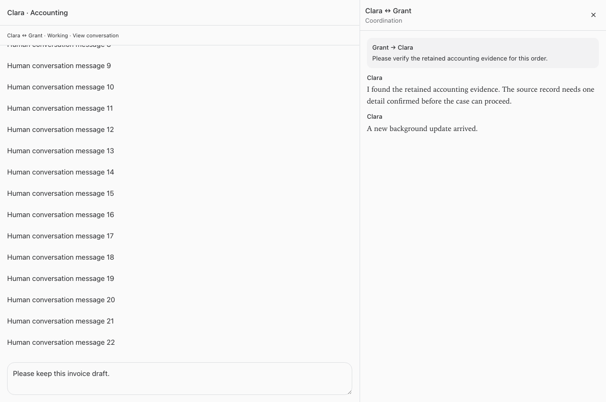

# Separate bot coordination threads

New bot-to-bot messages now use dedicated execution sessions and a shared thread for each pair of original chats. The human chat shows a compact **View conversation** entry below its header. The thread opens alongside the chat on desktop and in a separate pane on mobile. Existing messages and native human sessions are retained where they were.

## Execution and access

- The existing bot remains the executor for tools, connections, browser bindings, decisions, grants, and approvals. Internal sessions are not registered as new bots and receive no copied grants.
- Coordination sessions have separate provider history. The original chat and its coordination sessions share a turn lock; queued human work takes priority. A human message does not kill an already-running coordination turn.
- Bot messages are durably queued, not steered into a human turn. A stable request key deduplicates retries and rejects changed payloads. Replies reuse the same pair thread.
- Viewing a thread requires current access to both original chats. Access is checked again before execution and on every API callback from a coordination session. Thread membership does not broaden access.
- Follow-up wakeups created inside a coordination session remain in that session. Business decisions still use the existing original-bot Needs input lifecycle. Provider requests and failures can be reviewed from the thread.
- Background completions do not mark human conversations unread. Progress and tool details stay in the thread. Bots can use `read_coordination` to bring relevant results back into a human task deliberately.
- The mobile main chat stays mounted with its layout intact while the side pane is visible. Opening, updating, and closing the thread preserves the draft and scroll position.
- The migration is additive. Deleting either original participant removes internal session records instead of leaving ordinary private side chats behind. Earlier history is not heuristically rewritten.

## Verification

- TypeScript checks and the production build passed. Vite reported its existing large-chunk warning.
- Full suites passed: 21 installer tests, 2,463 server tests (5 pre-existing skips), 893 web tests, and 40 browser-manager tests.
- New regression coverage checks bidirectional routing, durable retry deduplication, changed-payload rejection, separate native sessions, canonical executor tokens, queued human priority, revoked access before execution and during callbacks, timer routing, quiet unread behavior, and deletion cleanup.
- Browser checks used synthetic content and the actual Coordination and SplitView components. At 1280px, 390px, and 320px, the draft and scroll offset survived opening, a background update, closing, and Escape. No horizontal overflow or browser errors occurred. No real bot requests, customer messages, or external business actions were used for testing.
- The service runtime preflight verified Node 24 and native module loading.

## Screenshots

These are isolated verification fixtures, not customer conversation data.

## Changed files

- [server/src/bots/employeeAccess.ts](/Users/archerclawdington/veneer-os/server/src/bots/employeeAccess.ts)
- [server/src/conversations/access.ts](/Users/archerclawdington/veneer-os/server/src/conversations/access.ts)
- [server/src/conversations/unread.ts](/Users/archerclawdington/veneer-os/server/src/conversations/unread.ts)
- [server/src/coordination/routes.ts](/Users/archerclawdington/veneer-os/server/src/coordination/routes.ts)
- [server/src/coordination/store.ts](/Users/archerclawdington/veneer-os/server/src/coordination/store.ts)
- [server/src/db/migrations/0124_coordination_threads.sql](/Users/archerclawdington/veneer-os/server/src/db/migrations/0124_coordination_threads.sql)
- [server/src/featureGuide/catalog.ts](/Users/archerclawdington/veneer-os/server/src/featureGuide/catalog.ts)
- [server/src/identity/cloudflareAccess.ts](/Users/archerclawdington/veneer-os/server/src/identity/cloudflareAccess.ts)
- [server/src/index.ts](/Users/archerclawdington/veneer-os/server/src/index.ts)
- [server/src/mcp/agentToolsServer.ts](/Users/archerclawdington/veneer-os/server/src/mcp/agentToolsServer.ts)
- [server/src/routes/api.ts](/Users/archerclawdington/veneer-os/server/src/routes/api.ts)
- [server/src/runner/client.ts](/Users/archerclawdington/veneer-os/server/src/runner/client.ts)
- [server/src/runner/ipcServer.ts](/Users/archerclawdington/veneer-os/server/src/runner/ipcServer.ts)
- [server/src/runtime/agentTokens.ts](/Users/archerclawdington/veneer-os/server/src/runtime/agentTokens.ts)
- [server/src/runtime/conversationManager.ts](/Users/archerclawdington/veneer-os/server/src/runtime/conversationManager.ts)
- [server/test/coordination.test.ts](/Users/archerclawdington/veneer-os/server/test/coordination.test.ts)
- [server/test/employeeWorkspace.test.ts](/Users/archerclawdington/veneer-os/server/test/employeeWorkspace.test.ts)
- [server/test/handoffOrigins.test.ts](/Users/archerclawdington/veneer-os/server/test/handoffOrigins.test.ts)
- [web/src/components/chat/ChatWorkspace.tsx](/Users/archerclawdington/veneer-os/web/src/components/chat/ChatWorkspace.tsx)
- [web/src/components/chat/Coordination.test.tsx](/Users/archerclawdington/veneer-os/web/src/components/chat/Coordination.test.tsx)
- [web/src/components/chat/Coordination.tsx](/Users/archerclawdington/veneer-os/web/src/components/chat/Coordination.tsx)
- [web/src/components/layout/SplitView.tsx](/Users/archerclawdington/veneer-os/web/src/components/layout/SplitView.tsx)
- [web/src/lib/api.ts](/Users/archerclawdington/veneer-os/web/src/lib/api.ts)
- [web/src/screens/Chat.tsx](/Users/archerclawdington/veneer-os/web/src/screens/Chat.tsx)
- [desktop.png](/Users/archerclawdington/veneer-os/docs/reports/coordination-threads/desktop.png)
- [mobile-390.png](/Users/archerclawdington/veneer-os/docs/reports/coordination-threads/mobile-390.png)
- [mobile-320.png](/Users/archerclawdington/veneer-os/docs/reports/coordination-threads/mobile-320.png)
