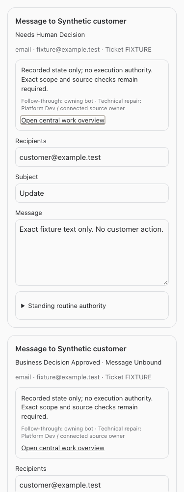
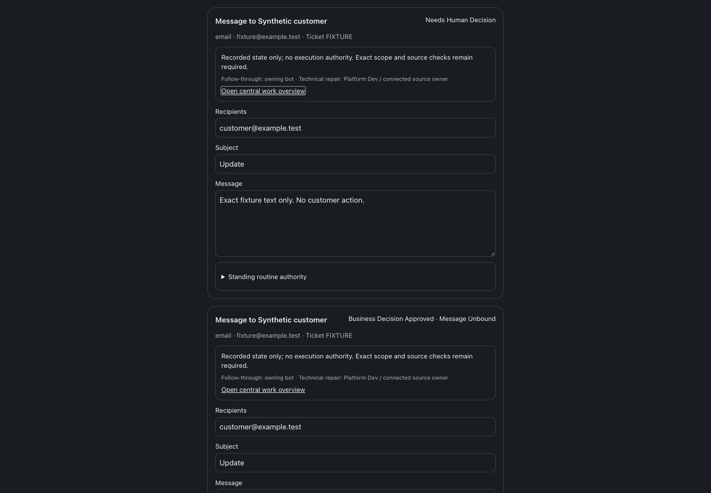

# CS draft follow-through

BUILD275, September 23, 2026. Implementation and synthetic checks completed; deployment follows the combined build slot’s performance change. No live customer, refund, draft, decision, access, enrollment, lease or provider mutation was performed.

The opted-in ERVP CS lane now shows central human questions separately from technical authority/source blockers, queued work, uncertain effects, receipts and retirement. The ordinary per-draft Send action is unavailable in that lane at both UI and API; outside it the prior human-send workflow remains. Existing original structured approval obligations are visible separately, never attached to a differing draft. William’s differing ordinary draft remains unbound; his original approved message and completed refund remain intact.

The routine contract now checks native decision coverage directly and requires a dedicated authenticated one-time service dispatch association. A bot claim is only a reservation (`execute:false`). Replay and reconciliation never grant send permission. Legacy unscoped native decisions conservatively block the whole business, including unrelated unresolved records; no silent scope guessing occurs.

Read the [executable contract and remaining dependencies](./contract.md). BUILD276 retains source ownership. Dedicated routine adapter/config/enrollment and independent business acceptance remain incomplete. BUILD250 still lacks trusted case-mapping transport; legacy unstructured approvals remain non-importable. This release does not claim customer delivery.

Validation: root typecheck, full tests (2,376 server passed / 5 skipped; 877 web; 40 browser-manager; 21 installer), and production build passed. Focused tests cover lane isolation, human-send rejection, ordinary workflow preservation, authority classification, native hold arrival between reservation and dispatch, authenticated one-time dispatch/replay and immutable audit. Synthetic browser checks covered 320/375/414/768/1440 in light/dark, keyboard central links, no CS Send CTA, ordinary Send retained, and no horizontal overflow. Full/restricted guide and resumed-instruction tests passed.

