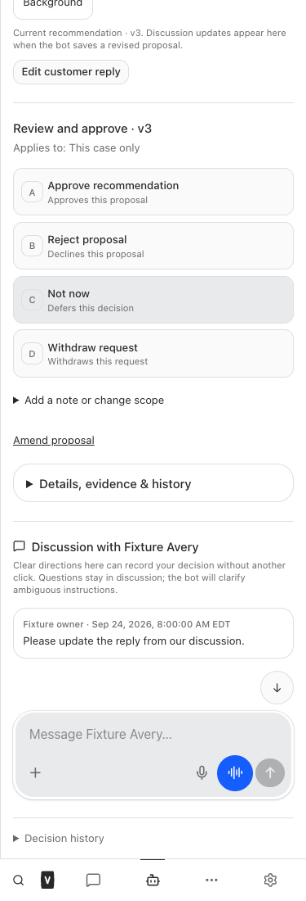
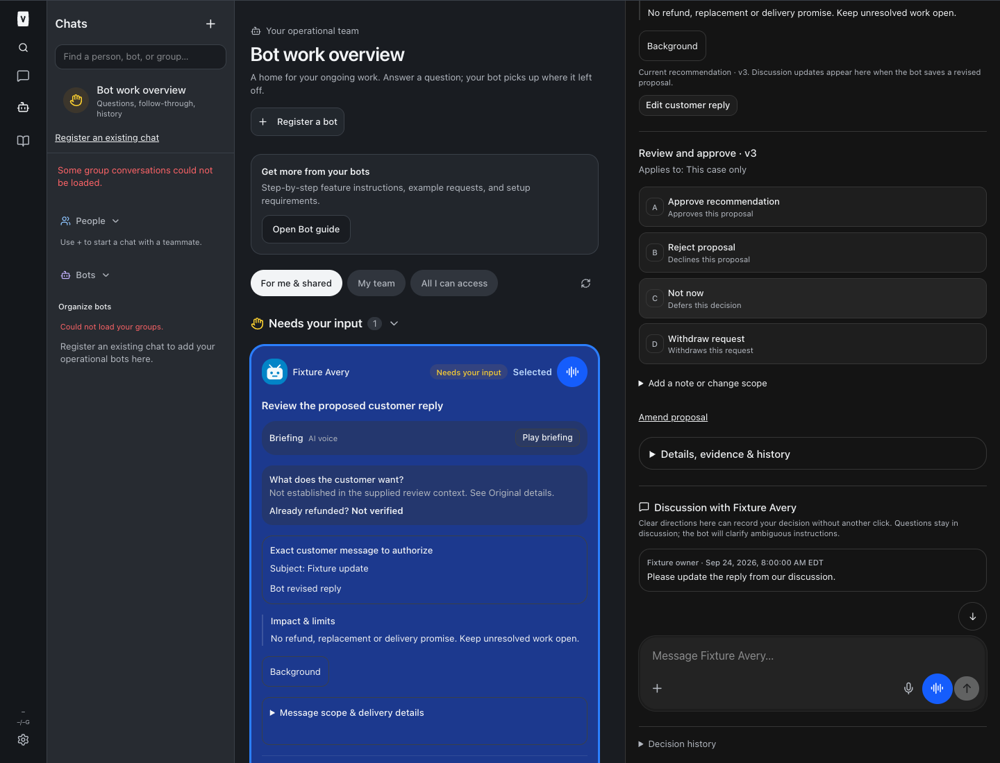

# Decision discussion and exact reply editing — BUILD282

Technical details, briefing, images, prior answers/results and case evidence now sit under **Details, evidence & history**, closed by default. Current recommendation, customer context, material limits, status and approval choices remain visible. Discussion follows the compact disclosure.

Authorized humans can **Edit customer reply → Save reply for review → Approve recommendation**. Structured message body is the actual edited field; account, recipient, subject, attachments and executor remain unchanged. Saving creates a new unapproved version and retains the old answer in immutable history. Legacy explicit draft text stays legacy and does not acquire structured send authority. Running/completed work cannot be edited.

Clean polling follows new bot proposal versions. Unsaved reply text remains in this browser tab across polling/navigation, with stale-version/handling conflicts shown explicitly. Discussion instructions tell bots to save a materially revised proposal with `update_decision`; ordinary discussion or saving text does not approve or send anything. Approval follows existing execution guards and is not a provider delivery receipt.

## Verification

Synthetic full-app browser checks passed at 320/375/414/768/1440 pixels in light/dark: default collapse, keyboard/tap reveal, exact-body save, disabled approval during edits, conflicting bot revision, preserved unsaved text, clean polling refresh, no overflow. Server fixtures cover exact payload preservation, immutable approval history, stale versions, request replay/conflicts, bot denial, shared reviewer/handling CAS, revoked/foreign access, restricted source context and no edit-triggered wake. Restricted employee route permits body-only editing, not raw proposal administration.

Full/restricted employee guide browser checks and current/resumed agent instruction coverage were checked. Root release checks and deployment receipt are recorded below after completion. No live customer, decision, call, refund or provider actions were used as tests.

## Release isolation

BUILD283 was stopped after cross-project queue overlap. Its five new source files, migration0119 and tracked handoff hunks were excluded from an isolated checkout based on ff20553. Canonical source was not reverted or cleaned. Its exact unfinished patch/files were additionally preserved in [BUILD283 archive](/Users/archerclawdington/veneer-build283-preserved/inventory.json). Only reviewed BUILD282 source and compiled artifacts are eligible for this release; neither BUILD283 nor the separately retained BUILD284 deferred-follow-up repair is claimed complete.

## Screenshots

Synthetic fixtures, scrolled to show the collapsed technical section and discussion:

## Changed implementation

- [server/src/bots/employeeAccess.ts](/Users/archerclawdington/veneer-os/server/src/bots/employeeAccess.ts)
- [server/src/bots/routes.ts](/Users/archerclawdington/veneer-os/server/src/bots/routes.ts)
- [server/src/bots/service.ts](/Users/archerclawdington/veneer-os/server/src/bots/service.ts)
- [server/src/bots/replyEdit.ts](/Users/archerclawdington/veneer-os/server/src/bots/replyEdit.ts)
- [server/src/featureGuide/catalog.ts](/Users/archerclawdington/veneer-os/server/src/featureGuide/catalog.ts)
- [server/src/mcp/botTools.ts](/Users/archerclawdington/veneer-os/server/src/mcp/botTools.ts)
- [server/test/botFeatureGuide.test.ts](/Users/archerclawdington/veneer-os/server/test/botFeatureGuide.test.ts)
- [server/test/bots.test.ts](/Users/archerclawdington/veneer-os/server/test/bots.test.ts)
- [web/src/components/BotProposalSummary.tsx](/Users/archerclawdington/veneer-os/web/src/components/BotProposalSummary.tsx)
- [web/src/components/DecisionChoices.tsx](/Users/archerclawdington/veneer-os/web/src/components/DecisionChoices.tsx)
- [web/src/components/DecisionReplyEditor.tsx](/Users/archerclawdington/veneer-os/web/src/components/DecisionReplyEditor.tsx)
- [web/src/components/ui/textarea.tsx](/Users/archerclawdington/veneer-os/web/src/components/ui/textarea.tsx)
- [web/src/lib/bots.ts](/Users/archerclawdington/veneer-os/web/src/lib/bots.ts)
- [web/src/screens/Bots.tsx](/Users/archerclawdington/veneer-os/web/src/screens/Bots.tsx)
- [scripts/decision-discussion-browser-check.mjs](/Users/archerclawdington/veneer-os/scripts/decision-discussion-browser-check.mjs)

- [BotProposalSummary.test.tsx](/Users/archerclawdington/veneer-os/web/src/components/BotProposalSummary.test.tsx)

## Deployment receipt

Code commit **5c1536e80a8882108338141d21357f3015ef8fd7** pushed to origin/main. Isolated root typecheck, full npm test and build passed: installer 21, server 2,413 passed / 5 existing skipped, web 878, browser-manager 40. Build retained the existing large-chunk warning. Ten full-app viewport/theme fixture combinations and full/restricted guide browser checks passed.

Detached root `npm run restart` completed: web PID22312, runner22330, app-runner22366, terminal22468 and browser-manager all healthy. Independent web and browser-manager read-only health returned200. All885 compiled artifact hashes were checked after restart; no BUILD283 migration0119, handoff route or tool was published. No production decision or customer action was used for acceptance.

[Exact artifact manifest](./artifact-manifest.json) records the code commit and per-file hashes. Canonical unfinished BUILD283 files/hunks remain unchanged for serial continuation. BUILD284 deferred-follow-up authorization is a distinct retained repair, not solved by presentation/reply editing.
