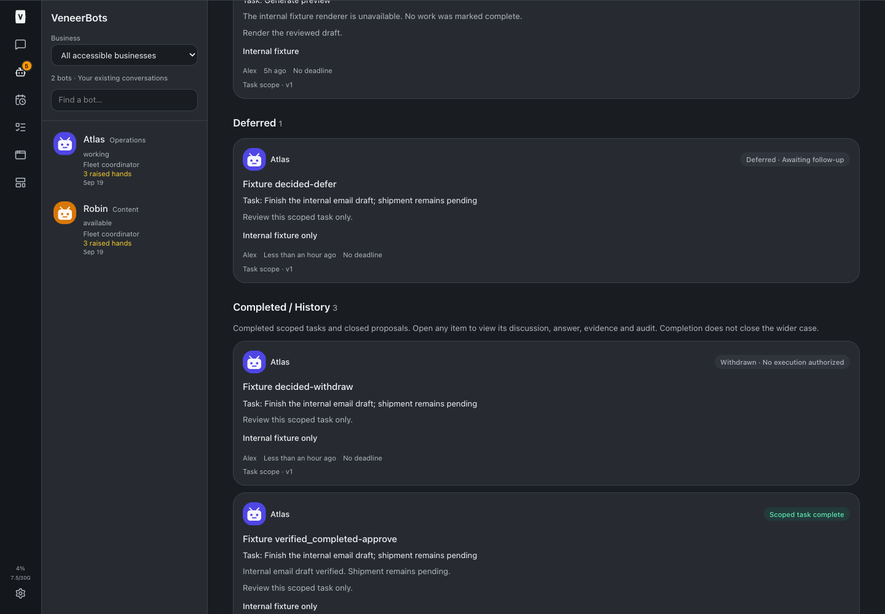
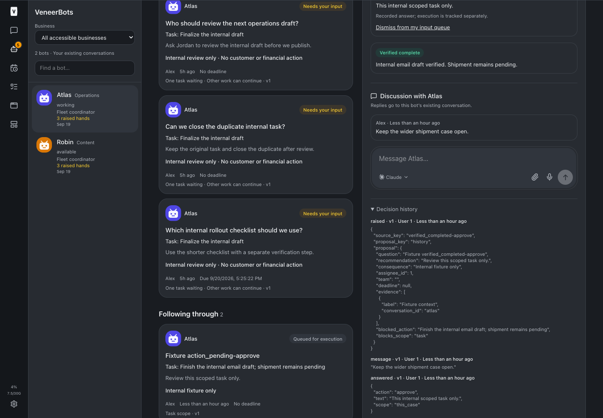
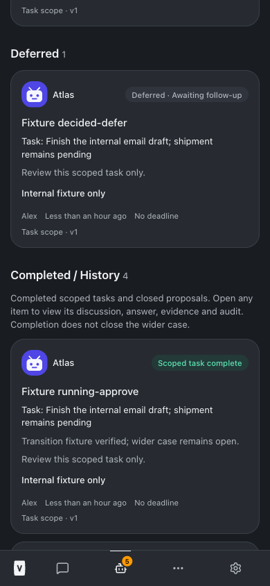
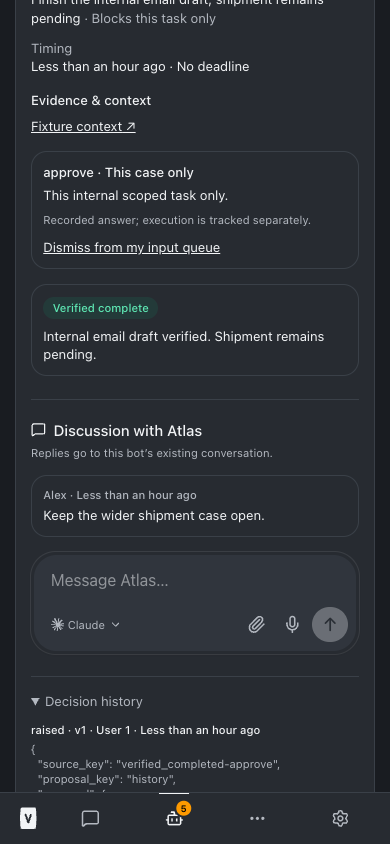

# Decision-specific status and completed history — build 83

VeneerBots decision cards now derive status only from their own lifecycle and recorded answer. Bot-wide working indicators were removed from decision cards and their discussion composer/header; roster and conversation rail presence remains intact.

Following through contains pending/queued/running work. Blocked and failed records remain visible in Needs attention. Deferred answers have a separate visible section. Completed scoped tasks, rejected proposals and withdrawn proposals appear automatically in Completed / History, with their existing detail links, discussion, answer, evidence and immutable audit retained. Opening history is read-only navigation, not a new execution or authority grant.

Labels distinguish approved-awaiting-execution, queued-for-execution and executing-this-task. Completion explicitly covers the scoped task, not the wider customer case. Cards show the blocked action and recorded result evidence. Unknown states remain visible rather than silently dropped. A rejected/withdrawn decision with a blocked/failed delivery remains in Needs attention so the failure is not hidden.

This changes display only: no migrations, real decision updates, approvals, customer/financial sends, schedules, registrations or model changes. Live RHM849 and other real decisions were not touched.

## Validation

- [Focused tests](./scoped-tests.txt): 12 passed covering lifecycle grouping, labels, terminal dispositions, deferred work and completion transitions.
- [Typecheck](./typecheck.txt) passed; [full test suite](./full-tests.txt): **2,889 passed, 5 existing skipped**; [production build](./build.txt) passed with the existing Vite chunk-size advisory.
- [Browser validation](./browser-tests.txt): real UI and in-memory service fixture. Completed task owned by a bot working elsewhere has no working dots; queued/running/blocked/failed/deferred labels are distinct; verified completion moves the card into history on refresh. Discussion, answer, evidence and audit remain accessible. History list/detail deny a business nonmember. Desktop1440×1000 and mobile390×844 navigation and overflow checks.

Reproduce using Node24: `node --import tsx scripts/bots-browser-fixture.ts --history --teams`, then `node scripts/decision-history-browser-check.mjs <playwright/index.mjs path>`. Fixture lifecycle snapshots are seeded only in memory; the transition uses the service result method. There are no production fixture routes.

## Screenshots

## Files changed

- [Decision grouping and labels](/Users/archerclawdington/veneer-os/web/src/lib/decisionPresentation.ts)
- [Lifecycle tests](/Users/archerclawdington/veneer-os/web/src/lib/decisionPresentation.test.ts)
- [Decision cards, sections and detail](/Users/archerclawdington/veneer-os/web/src/screens/Bots.tsx)
- [Decision discussion composer](/Users/archerclawdington/veneer-os/web/src/components/BotComposer.tsx)
- [Isolated lifecycle fixtures](/Users/archerclawdington/veneer-os/scripts/bots-browser-fixture.ts)
- [Browser validation script](/Users/archerclawdington/veneer-os/scripts/decision-history-browser-check.mjs)

## Adoption

No data migration or manual task closing is needed. Deployment result will be recorded after the required root restart.
