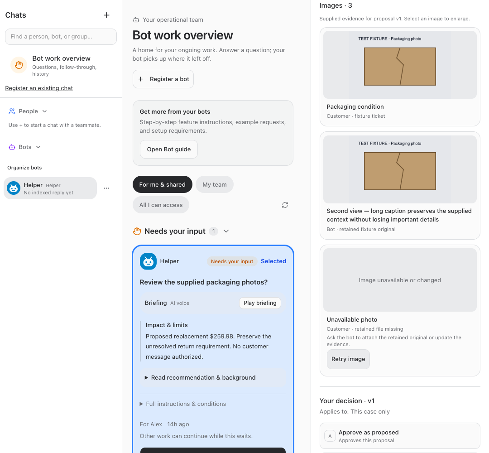
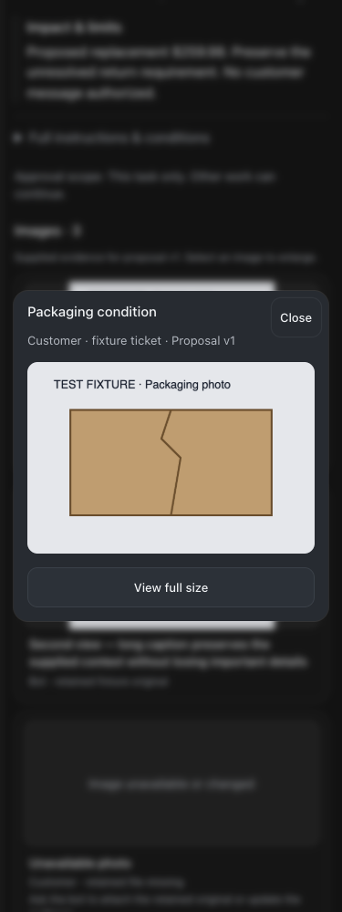

# Images in Needs input decisions

Released September 23, 2026. Implementation commit: `5164a12`.

Detailed decision cards now show explicitly supplied images above the decision controls, outside collapsed case history. Thumbnails preserve the image aspect ratio and show a caption and source. The larger preview supports full-size viewing, fit-to-window, Escape/Close, and keyboard focus return. Loading and unavailable/changed images have clear states and retry. Existing written evidence, approval conditions, discussions, voice briefings, and customer-send boundaries remain unchanged.

## Image source and limits

The old evidence schema contained conversation references only. Read-only inspection of the screenshot’s example confirmed it had no image references. No images were inferred from its prose or pulled from unrelated files.

OrderOps has authenticated Gmail attachment and stored-blob routes. Veneer reuses originals retained by the bot through its existing authorized connection rather than adding a remote URL proxy or sharing source credentials. Bots can attach detected source-conversation files using `proposal.images`: `conversation_id`, `path`, `label`, and `source`. The server supplies `sha256`. Bot tool definitions and current-turn capability guidance explain this workflow.

Existing text-only cards show an honest empty state until the bot supplies explicit photos. No live proposals were revised or backfilled for this release. Materially changed evidence follows the existing new-version/new-answer workflow; bots are instructed not to invalidate live approvals merely for presentation.

Each fetch rechecks decision and source-conversation permissions, business scope, file association, current proposal version, and the original byte hash. Changed/missing bytes fail closed. Paths must match detected/registered conversation files; arbitrary paths, remote URLs, and symlink replacements are refused. Only signature-checked PNG/JPEG/GIF/WebP bytes are served, up to 20 MB each and 12 images per proposal, with private no-store and nosniff headers. No migration or additional customer-system credentials are required.

## Verification

- Root typecheck, full tests, and production build passed before root restart. Tests: 2,224 server passed, 5 skipped; 859 web; 40 browser-manager; 21 installer. The existing bundle-size advisory remains informational.
- Eight focused server tests cover byte binding and version changes, forged hashes, API integration, unrelated/missing/oversized/nonimage files, symlinks, business isolation, employee source access/revocation, old proposals, and response headers.
- Mock browser checks passed at 320, 375, 414, 768, 1080, 1440, and 1920 pixels in both themes: real detailed cards, long captions, thumbnails, preview/fit/full-size, 44-pixel Close target, Escape/focus return, retry, unavailable state, and no horizontal overflow. No API mutations, customer messages, approvals, or bot wakes occurred.
- Full and restricted employee guide fixtures passed. Live guide, New callout, employee instructions, and current agent capability text were verified after restart. Catalog/instruction tests verify delivery through the shared instructions path used by resumed agents.
- Web, runner, terminal, app runner, and browser-manager health/status checks succeeded after restart. Source commit pushed to origin/main.

Hallmark component refinement retained existing Veneer tokens and typography; no page redesign or new palette. Existing unrelated working files were preserved.

## Screenshots

## Changed files and evidence

- [server/src/bots/employeeAccess.ts](/Users/archerclawdington/veneer-os/server/src/bots/employeeAccess.ts)
- [server/src/bots/routes.ts](/Users/archerclawdington/veneer-os/server/src/bots/routes.ts)
- [server/src/bots/service.ts](/Users/archerclawdington/veneer-os/server/src/bots/service.ts)
- [server/src/bots/decisionImages.ts](/Users/archerclawdington/veneer-os/server/src/bots/decisionImages.ts)
- [server/src/featureGuide/catalog.ts](/Users/archerclawdington/veneer-os/server/src/featureGuide/catalog.ts)
- [server/src/mcp/botTools.ts](/Users/archerclawdington/veneer-os/server/src/mcp/botTools.ts)
- [server/test/decisionImages.test.ts](/Users/archerclawdington/veneer-os/server/test/decisionImages.test.ts)
- [web/src/lib/bots.ts](/Users/archerclawdington/veneer-os/web/src/lib/bots.ts)
- [web/src/screens/Bots.tsx](/Users/archerclawdington/veneer-os/web/src/screens/Bots.tsx)
- [web/src/components/DecisionImages.tsx](/Users/archerclawdington/veneer-os/web/src/components/DecisionImages.tsx)
- [scripts/decision-images-browser-check.mjs](/Users/archerclawdington/veneer-os/scripts/decision-images-browser-check.mjs)
- [docs/reports/decision-images/README.md](/Users/archerclawdington/veneer-os/docs/reports/decision-images/README.md)
- [docs/reports/decision-images/gallery-1080-dark.png](/Users/archerclawdington/veneer-os/docs/reports/decision-images/gallery-1080-dark.png)
- [docs/reports/decision-images/gallery-1080-light.png](/Users/archerclawdington/veneer-os/docs/reports/decision-images/gallery-1080-light.png)
- [docs/reports/decision-images/gallery-1440-dark.png](/Users/archerclawdington/veneer-os/docs/reports/decision-images/gallery-1440-dark.png)
- [docs/reports/decision-images/gallery-1440-light.png](/Users/archerclawdington/veneer-os/docs/reports/decision-images/gallery-1440-light.png)
- [docs/reports/decision-images/gallery-1920-dark.png](/Users/archerclawdington/veneer-os/docs/reports/decision-images/gallery-1920-dark.png)
- [docs/reports/decision-images/gallery-1920-light.png](/Users/archerclawdington/veneer-os/docs/reports/decision-images/gallery-1920-light.png)
- [docs/reports/decision-images/gallery-320-dark.png](/Users/archerclawdington/veneer-os/docs/reports/decision-images/gallery-320-dark.png)
- [docs/reports/decision-images/gallery-320-light.png](/Users/archerclawdington/veneer-os/docs/reports/decision-images/gallery-320-light.png)
- [docs/reports/decision-images/gallery-375-dark.png](/Users/archerclawdington/veneer-os/docs/reports/decision-images/gallery-375-dark.png)
- [docs/reports/decision-images/gallery-375-light.png](/Users/archerclawdington/veneer-os/docs/reports/decision-images/gallery-375-light.png)
- [docs/reports/decision-images/gallery-414-dark.png](/Users/archerclawdington/veneer-os/docs/reports/decision-images/gallery-414-dark.png)
- [docs/reports/decision-images/gallery-414-light.png](/Users/archerclawdington/veneer-os/docs/reports/decision-images/gallery-414-light.png)
- [docs/reports/decision-images/gallery-768-dark.png](/Users/archerclawdington/veneer-os/docs/reports/decision-images/gallery-768-dark.png)
- [docs/reports/decision-images/gallery-768-light.png](/Users/archerclawdington/veneer-os/docs/reports/decision-images/gallery-768-light.png)
- [docs/reports/decision-images/guide/desktop.png](/Users/archerclawdington/veneer-os/docs/reports/decision-images/guide/desktop.png)
- [docs/reports/decision-images/guide/employee-mobile.png](/Users/archerclawdington/veneer-os/docs/reports/decision-images/guide/employee-mobile.png)
- [docs/reports/decision-images/preview-1440-dark.png](/Users/archerclawdington/veneer-os/docs/reports/decision-images/preview-1440-dark.png)
- [docs/reports/decision-images/preview-1440-light.png](/Users/archerclawdington/veneer-os/docs/reports/decision-images/preview-1440-light.png)
- [docs/reports/decision-images/preview-375-dark.png](/Users/archerclawdington/veneer-os/docs/reports/decision-images/preview-375-dark.png)
- [docs/reports/decision-images/preview-375-light.png](/Users/archerclawdington/veneer-os/docs/reports/decision-images/preview-375-light.png)
