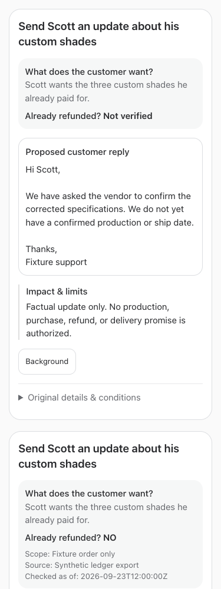
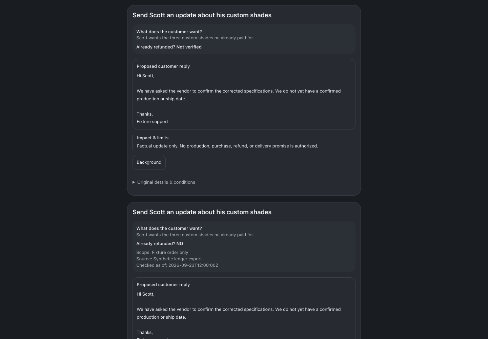

# Reply-first decision review

September 23, 2026 · BUILD267

Detailed and compact decision surfaces now lead with customer-request/refund context and the proposed exact customer reply (or recommended action). Briefings follow the review block. Background is a compact button: mouse hover previews short supplied bullets; click/tap or Enter pins them, Escape closes them. Original question, recommendation and complete instructions remain in Original details & conditions. Material Impact & limits remains visible. Structured delivery body is rendered once, ahead of collapsed account/recipient/executor/attachment metadata. A conflicting legacy draft remains explicitly labeled in original details, never silently substituted for structured scope.

## Grounded producer contract

Optional `proposal.review_summary` is part of the ordinary versioned proposal:

- `action_title`: plain-English action, at most160 characters.
- `customer_request`: supplied actual ask, at most300 characters; unavailable intent must be explicit.
- `background`: up to6 semantic bullets, each at most240 characters; preserve facts, amounts, risks and uncertainty.
- `refund`: `not_verified`, or `none` backed by `complete_refund_history` plus source/scope/as_of, or `partial`/`full` backed by `completed_refund` plus source/scope/as_of/receipt/positive amount/ISO currency.

These are source-supplied review facts, not a new provider verifier. Schema validation enforces required provenance and evidence kinds; it cannot independently establish truth from a citation. Producers must use actual completed records or complete checked history. `$0`, proposed refunds and absence of refund authority never mean NO. The UI retains source/check time and partial amount. Missing legacy evidence displays **Not verified** and customer request **Not established**; it does not search customer systems.

No unchanged live proposal was revised. Legacy cards without an explicit action title use neutral Review the proposed customer reply / Review the recommended action, retaining their raw title in Original details. There is no speculative title or prose-summary parser. Long legacy background stays in original details; the Background panel explicitly says a concise summary was not supplied. The existing explicit EXACT DRAFT delimiter remains presentation-only and now preserves trailing whitespace; it grants no send authority.

Normal updates still version the full proposal and invalidate the prior answer. Human raw-proposal edits clear the old structured summary rather than carry stale review context into changed scope. Tools instruct bots to refresh evidence on material updates, not revise an unchanged approval for cosmetics. Existing first-valid-answer, handling, scoped evidence ACLs and action permissions remain unchanged.

## Validation

Fixtures cover legacy, action-only, exact reply ordering/whitespace, no duplicate draft, full/partial/none/unknown refunds and missing provenance rejection. Browser checks cover320/375/414/768/1440 widths and light/dark, hover/click/keyboard/Escape, default-closed background, original details, visible reply, no overflow. Guide fixtures cover full/restricted employees and resumed-instruction tests. No customer, approval, refund, access, provider or live call mutation was used.

Root typecheck and full tests passed: 2,361 server (5 skipped), 877 web, 40 browser-manager and 21 installer tests. Production build passed. Implementation `3e665696b94d88f48d2f3db23aa5f019740593f1` is pushed to origin/main. Root detached restart completed; web, runner, app-runner, terminal and browser-manager each returned HTTP 200. No production decision, refund, customer or access record was mutated for validation.

Other views: [mobile dark](./375-dark.png), [desktop light](./1440-light.png).

## Changed files

- [service.ts](/Users/archerclawdington/veneer-os/server/src/bots/service.ts)
- [botTools.ts](/Users/archerclawdington/veneer-os/server/src/mcp/botTools.ts)
- [catalog.ts](/Users/archerclawdington/veneer-os/server/src/featureGuide/catalog.ts)
- [decisionReviewSummary.test.ts](/Users/archerclawdington/veneer-os/server/test/decisionReviewSummary.test.ts)
- [bots.ts](/Users/archerclawdington/veneer-os/web/src/lib/bots.ts)
- [decisionPresentation.ts](/Users/archerclawdington/veneer-os/web/src/lib/decisionPresentation.ts)
- [decisionPresentation.test.ts](/Users/archerclawdington/veneer-os/web/src/lib/decisionPresentation.test.ts)
- [BotProposalSummary.tsx](/Users/archerclawdington/veneer-os/web/src/components/BotProposalSummary.tsx)
- [BotProposalSummary.test.tsx](/Users/archerclawdington/veneer-os/web/src/components/BotProposalSummary.test.tsx)
- [Bots.tsx](/Users/archerclawdington/veneer-os/web/src/screens/Bots.tsx)
- [decision-review-browser-check.mjs](/Users/archerclawdington/veneer-os/scripts/decision-review-browser-check.mjs)
- [decision-review.tsx](/Users/archerclawdington/veneer-os/scripts/fixtures/decision-review.tsx)
