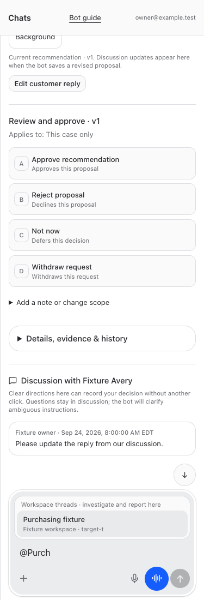
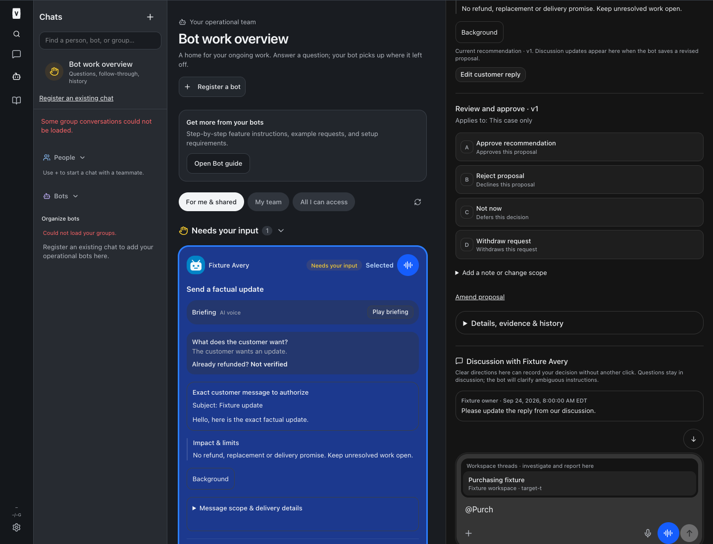
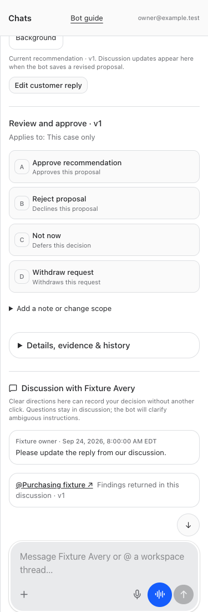

# Decision thread investigations — BUILD286

In a decision discussion, type **@**, search a workspace project or thread, choose the destination, and write a bounded investigation request. The selected thread receives the current proposal plus up to eight recent discussion messages (2,000 characters each). Its findings return to the original discussion, attributed to that thread and the investigated version.

The picker supports keyboard, tap and mouse. The visible status distinguishes queued, delivered/awaiting findings, cancelled delivery and findings returned. A lost send response retains the same request key on retry; a successful mutation followed by a failed refresh clears the composer instead of encouraging a duplicate request.

## Contract and limits

- Human POST `/api/bots/decisions/:id/handoffs`: `expected_version`, stable `request_key`, explicit `target_id`, bounded `text`.
- Human GET `.../:id/handoff-targets?q=...` and `.../:id/handoffs`: authorized destinations and status. Restricted employees have these narrow routes; agent result routes remain unavailable to their human session.
- Selected thread uses `read_decision_handoff({handoff_id})`, then `report_decision_handoff({handoff_id,request_key,text})`. One immutable final report, identical retries permitted; conflicting retries denied.
- Requester, source bot, target identity/availability, destination audience and source evidence access are rechecked before wake delivery, read and report. Cross-business targets and wider audiences are denied. Revocation does not erase context already delivered under valid access.
- Original decision state, version and answer remain unchanged. Neither request nor result receives an instruction row or approval authority. Material recommendations still use the existing versioned decision workflow.
- Snapshot is text and referenced evidence, not image bytes or whole source history. Total context is capped at128KiB; larger requests fail explicitly. Attachments must be added to the original discussion separately. Existing permissions still govern opening files or source links.
- Findings disclose the investigated version if the proposal changed. Tools instruct the receiving thread to investigate read-only and return only relevant findings; no customer/provider/financial action is authorized by this feature.

## Validation

Synthetic SQL/HTTP fixtures cover durable dedupe, stale versions, immutable records, denied approval conversion, exact-thread identity, conflicting results, requester/source/target revocation, archived targets, private/historical evidence, foreign business, destination audience, wake delivery and restricted employee routes. UI fixtures cover picker close/reopen, keyboard selection, lost-response retry, refresh failure, returned status, mobile/desktop and light/dark. Full/restricted guide checks and the shared instruction-context tests cover discovery for resumed agents.

No real employees, customer records, calls or provider actions were used as tests. BUILD282 reply editing and collapsed details remain intact. The separately retained BUILD284 deferred-follow-up repair is not included.

## Screenshots

## Implementation

- [server/src/bots/delivery.ts](/Users/archerclawdington/veneer-os/server/src/bots/delivery.ts)
- [server/src/bots/employeeAccess.ts](/Users/archerclawdington/veneer-os/server/src/bots/employeeAccess.ts)
- [server/src/bots/routes.ts](/Users/archerclawdington/veneer-os/server/src/bots/routes.ts)
- [server/src/bots/decisionHandoffRoutes.ts](/Users/archerclawdington/veneer-os/server/src/bots/decisionHandoffRoutes.ts)
- [server/src/bots/decisionHandoffs.ts](/Users/archerclawdington/veneer-os/server/src/bots/decisionHandoffs.ts)
- [server/src/db/migrations/0119_decision_handoffs.sql](/Users/archerclawdington/veneer-os/server/src/db/migrations/0119_decision_handoffs.sql)
- [server/src/featureGuide/catalog.ts](/Users/archerclawdington/veneer-os/server/src/featureGuide/catalog.ts)
- [server/src/mcp/botTools.ts](/Users/archerclawdington/veneer-os/server/src/mcp/botTools.ts)
- [server/test/decisionHandoffs.test.ts](/Users/archerclawdington/veneer-os/server/test/decisionHandoffs.test.ts)
- [web/src/components/BotComposer.tsx](/Users/archerclawdington/veneer-os/web/src/components/BotComposer.tsx)
- [web/src/components/DecisionHandoffStatus.tsx](/Users/archerclawdington/veneer-os/web/src/components/DecisionHandoffStatus.tsx)
- [web/src/lib/decisionHandoffs.ts](/Users/archerclawdington/veneer-os/web/src/lib/decisionHandoffs.ts)
- [web/src/lib/decisionHandoffs.test.ts](/Users/archerclawdington/veneer-os/web/src/lib/decisionHandoffs.test.ts)
- [web/src/screens/Bots.tsx](/Users/archerclawdington/veneer-os/web/src/screens/Bots.tsx)
- [scripts/decision-handoff-browser-check.mjs](/Users/archerclawdington/veneer-os/scripts/decision-handoff-browser-check.mjs)

## Deployment receipt

Code **e04b389086b47ffd11773d2d564f8de16e1be423** pushed to origin/main. Root typecheck, full tests and production build passed: installer21, server2,424 passed/5 existing skipped, web880, browser-manager40. Four viewport/theme browser combinations passed, including restricted mobile and full desktop; guide browser and resumed instruction checks passed. Existing large-chunk build warning remains.

Detached root restart completed with web PID32696, runner32709, app-runner32725, terminal32797 and browser-manager all healthy. Independent read-only web and browser-manager health checks returned200. Read-only SQLite metadata confirmed the two handoff ledgers and immutable update triggers. No live investigation, employee message, decision answer or provider action was performed as a test.

The preserved BUILD283 work is now completed in this serial platform release. BUILD282 remains intact; unrelated `.veneer-browser/`, `.veneer/` and `out/` were preserved. BUILD284 remains a separate retained request, not an implemented part of this release.
