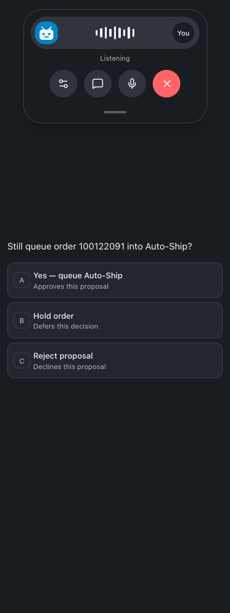
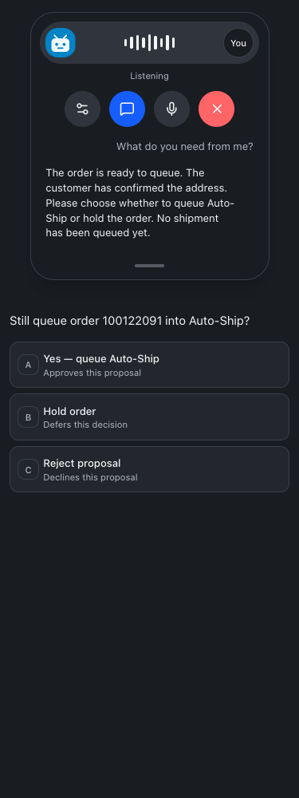

# Clickable decisions and compact voice calls

September 23, 2026 · Build queue #216

Needs input decisions now offer labeled buttons with optional notes. Bots can supply two to six contextual choices with descriptions. Existing proposals receive Approve as proposed, Reject proposal, Not now, and Withdraw request. Each button states its effect. The selected answer shows a green checkmark; execution remains a separate status.

The server resolves the selected ID against the current proposal. Version checks, shared-queue claims, permissions, scope, event attribution, and duplicate protection reuse native decision execution. Custom choices disable the generic quick-approve shortcut. Standalone message drafts still require their own send authorization.

Chat questions use lettered choice rows and a recorded-answer checkmark. Multiple-selection questions retain Submit answers.

The blue waveform button beside dictation opens a centered floating call panel. It uses the existing LiveKit connection and real participant audio levels. Settings, transcript, mute, and end controls follow the supplied screenshots. Transcript expansion keeps chat visible and shows user and bot speech on opposite sides. Settings offers standby and device audio guidance. No autoplay or automatic microphone access was introduced.

Veneer keeps its own bot avatars and uses “You” for the caller. Device output selection remains in the operating system. This change does not add call recordings or a new transport. Saved asynchronous briefings from build #215 remain available in chat and Needs input.

Employee instructions and dated New callouts are in the [Bot guide](https://nicksworld.dev/#/bot-guide). The same catalog supplies current and resumed bot instructions, including contextual choice examples and approval boundaries.

## Verification

- Isolated browser checks passed at 320, 375, 414, 768, and 1440 pixels: start, mute/unmute, transcript expansion/collapse, standby, end, keyboard choice selection, and no horizontal overflow.
- Full and restricted employee guide checks passed: New discovery, navigation, search, copying examples, mobile layout, refresh, aging, and error recovery.
- Server tests cover current-version choices, optional notes, forged choice IDs, bot attempts to authorize, duplicate clicks, rejected conflicting retries, defer never executing, and shared-queue ownership.
- No live customer sends, business actions, or microphone calls were used as tests.
- Root typecheck, full tests (2,178 server passed, 5 skipped; 850 web; 40 browser-manager; 21 installer), and production build passed. The build retains the existing bundle-size advisory.
- Deployed commit `2ec4e37` through the root restart script. Live health reports web and runner healthy; restart preflight passes. The authenticated live guide serves both New announcements, and built bot instructions include proposal.choices guidance. Committed and pushed to origin/main.

## Screenshots

## Changed files

- [server/src/bots/employeeAccess.ts](/Users/archerclawdington/veneer-os/server/src/bots/employeeAccess.ts)
- [server/src/bots/routes.ts](/Users/archerclawdington/veneer-os/server/src/bots/routes.ts)
- [server/src/bots/service.ts](/Users/archerclawdington/veneer-os/server/src/bots/service.ts)
- [server/src/featureGuide/catalog.ts](/Users/archerclawdington/veneer-os/server/src/featureGuide/catalog.ts)
- [server/src/mcp/botTools.ts](/Users/archerclawdington/veneer-os/server/src/mcp/botTools.ts)
- [server/test/bots.test.ts](/Users/archerclawdington/veneer-os/server/test/bots.test.ts)
- [web/src/components/VoiceProvider.tsx](/Users/archerclawdington/veneer-os/web/src/components/VoiceProvider.tsx)
- [web/src/components/chat/QuestionCard.tsx](/Users/archerclawdington/veneer-os/web/src/components/chat/QuestionCard.tsx)
- [web/src/lib/botGuide.test.ts](/Users/archerclawdington/veneer-os/web/src/lib/botGuide.test.ts)
- [web/src/lib/bots.ts](/Users/archerclawdington/veneer-os/web/src/lib/bots.ts)
- [web/src/screens/Bots.tsx](/Users/archerclawdington/veneer-os/web/src/screens/Bots.tsx)
- [web/src/screens/Chat.tsx](/Users/archerclawdington/veneer-os/web/src/screens/Chat.tsx)
- [web/src/screens/LiveVoice.tsx](/Users/archerclawdington/veneer-os/web/src/screens/LiveVoice.tsx)
- [web/src/components/DecisionChoices.tsx](/Users/archerclawdington/veneer-os/web/src/components/DecisionChoices.tsx)
- [web/src/components/VoiceCallPanel.tsx](/Users/archerclawdington/veneer-os/web/src/components/VoiceCallPanel.tsx)
- [scripts/decision-voice-browser-check.mjs](/Users/archerclawdington/veneer-os/scripts/decision-voice-browser-check.mjs)
- [docs/reports/decision-voice/report.md](/Users/archerclawdington/veneer-os/docs/reports/decision-voice/report.md)
- [docs/reports/decision-voice/compact-1440.png](/Users/archerclawdington/veneer-os/docs/reports/decision-voice/compact-1440.png)
- [docs/reports/decision-voice/compact-320.png](/Users/archerclawdington/veneer-os/docs/reports/decision-voice/compact-320.png)
- [docs/reports/decision-voice/compact-375.png](/Users/archerclawdington/veneer-os/docs/reports/decision-voice/compact-375.png)
- [docs/reports/decision-voice/compact-414.png](/Users/archerclawdington/veneer-os/docs/reports/decision-voice/compact-414.png)
- [docs/reports/decision-voice/compact-768.png](/Users/archerclawdington/veneer-os/docs/reports/decision-voice/compact-768.png)
- [docs/reports/decision-voice/guide/desktop.png](/Users/archerclawdington/veneer-os/docs/reports/decision-voice/guide/desktop.png)
- [docs/reports/decision-voice/guide/employee-mobile.png](/Users/archerclawdington/veneer-os/docs/reports/decision-voice/guide/employee-mobile.png)
- [docs/reports/decision-voice/transcript-1440.png](/Users/archerclawdington/veneer-os/docs/reports/decision-voice/transcript-1440.png)
- [docs/reports/decision-voice/transcript-320.png](/Users/archerclawdington/veneer-os/docs/reports/decision-voice/transcript-320.png)
- [docs/reports/decision-voice/transcript-375.png](/Users/archerclawdington/veneer-os/docs/reports/decision-voice/transcript-375.png)
- [docs/reports/decision-voice/transcript-414.png](/Users/archerclawdington/veneer-os/docs/reports/decision-voice/transcript-414.png)
- [docs/reports/decision-voice/transcript-768.png](/Users/archerclawdington/veneer-os/docs/reports/decision-voice/transcript-768.png)
