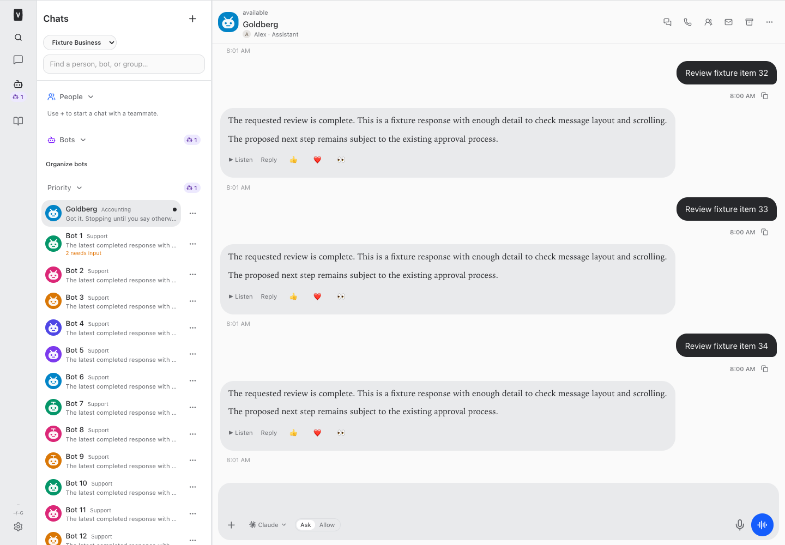
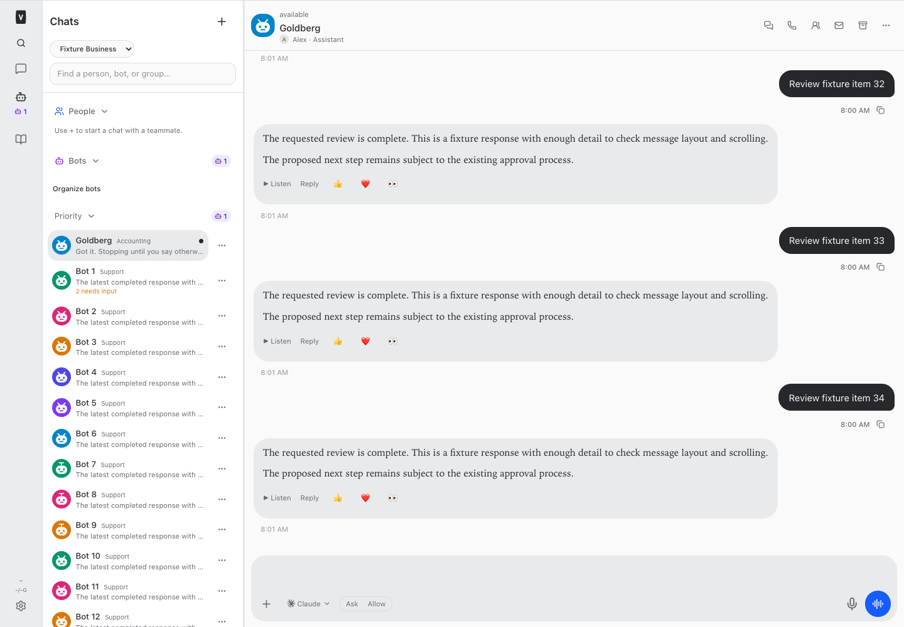
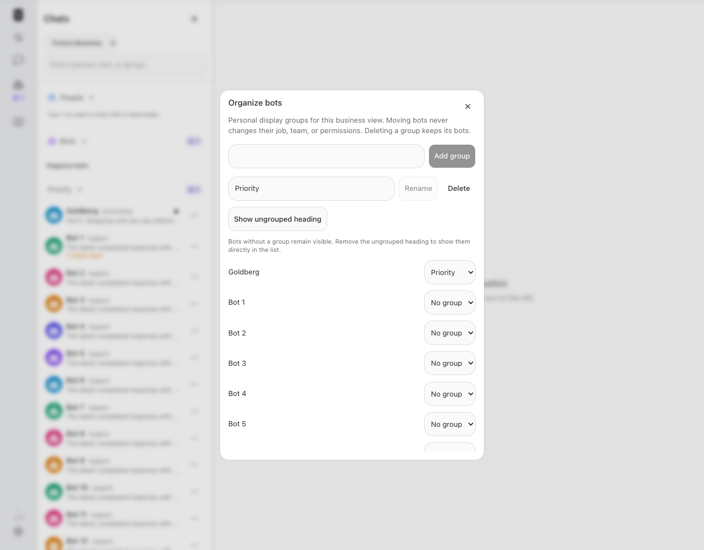
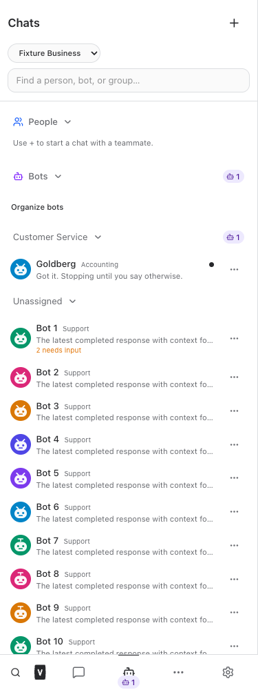

# Desktop Chats and personal bot groups

Released September 23, 2026 · Build #223 · Implementation `1767208`, pushed to origin/main.

<!-- Hallmark · pre-emit critique: P4 H4 E4 S5 R4 V3. Existing Veneer theme; screenshot-guided workspace layout. -->

Chats now uses a compact, resizable left sidebar and the available conversation pane instead of centering a narrow list. The sidebar and transcript scroll independently; the conversation header and composer stay in view. Bot rows show names, concise role text, unread indicators, Needs input counts, and a short preview of the latest indexed assistant response.

Select **Organize bots** to add, rename, or delete personal display groups. Existing operational subteams seed the initial display layout. Drag a bot to a group heading, or use **Actions → Move to…**; the organization dialog also provides native select controls for mobile and keyboard use. **No group** moves a bot out. Deleting a group keeps every bot; deleting the Unassigned heading shows those bots directly in the list. A visible drop target appears when dragging to an otherwise unnamed ungrouped area.

Layouts are stored per person and business view; All businesses has its own layout. They never change operational teams, roles, reporting lines, credentials, room membership, or approval authority. The server validates visible bots and business scope on each move, filters revoked placements, and rejects stale revisions. The client waits for a successful save before changing placement and reloads current organization after a conflict.

Reply previews reuse bounded queries against the existing assistant search index, after conversation access checks. They exclude user messages, tool payloads, thinking, and private room-worker sessions. Indexing can lag; an empty index shows “No indexed reply yet.” Live streaming does not fabricate a completed preview.

Existing people conversations, group rooms, native huddles, pins, unread states, work overview, and permissions remain in place. The employee guide at `/#/bot-guide?feature=organize` includes updated steps, limits, a New callout, and bot-facing instructions.

## Verification

- Root typecheck passed.
- Full npm test passed: 2,216 server tests (5 skipped), 859 web tests, 40 browser-manager tests, 21 installer tests.
- Production build passed before root npm run restart. Existing large-bundle notices were informational.
- Full-application browser fixtures passed at 320, 375, 414, 768, 1280, 1440, and 1920 pixels in both light and dark themes. Checks covered actual chat transcript rendering, wide conversation layout, list position/width, no horizontal or desktop document overflow, visible header/composer, independent list scroll, preview text, group creation/rename/delete, moving, reload persistence, drag/drop at desktop sizes, and failed-save recovery.
- Restricted employee fixtures passed at 375 and 1280 pixels in both themes through the same group-management and conversation flows.
- Server tests cover user isolation, inaccessible and cross-business moves, unknown groups, revoked placement filtering, stale versions, keeping bots after group deletion, narrow employee routes, and bounded assistant-only previews.
- Full and restricted guide checks passed for New callouts, search, mobile layout, copy/link controls, refresh, aging, and failure recovery. Resumed-agent instruction tests confirm organization guidance is included while frozen roles remain intact.
- After restart, web, runner, terminal, browser manager, and app-runner returned HTTP 200. The authenticated live guide returned 200 with the new announcement and agent guidance. Read-only schema checks confirmed the organization table and assistant-preview index were applied.
- Tests used fixtures and in-memory databases only. No live employee messages, customer sends, bot wakes, account changes, or organizational moves were performed.

## Screenshots

### Desktop conversation

### Dark desktop

### Organization controls

### Mobile

## Changed source and verification files

- [scripts/desktop-chats-browser-check.mjs](/Users/archerclawdington/veneer-os/scripts/desktop-chats-browser-check.mjs)
- [server/src/bots/employeeAccess.ts](/Users/archerclawdington/veneer-os/server/src/bots/employeeAccess.ts)
- [server/src/bots/organization.ts](/Users/archerclawdington/veneer-os/server/src/bots/organization.ts)
- [server/src/bots/routes.ts](/Users/archerclawdington/veneer-os/server/src/bots/routes.ts)
- [server/src/db/migrations/0108_chat_organization.sql](/Users/archerclawdington/veneer-os/server/src/db/migrations/0108_chat_organization.sql)
- [server/src/featureGuide/catalog.ts](/Users/archerclawdington/veneer-os/server/src/featureGuide/catalog.ts)
- [server/test/chatOrganization.test.ts](/Users/archerclawdington/veneer-os/server/test/chatOrganization.test.ts)
- [server/test/instructionContext.test.ts](/Users/archerclawdington/veneer-os/server/test/instructionContext.test.ts)
- [web/src/App.tsx](/Users/archerclawdington/veneer-os/web/src/App.tsx)
- [web/src/components/BotActions.tsx](/Users/archerclawdington/veneer-os/web/src/components/BotActions.tsx)
- [web/src/components/BotConversationRail.tsx](/Users/archerclawdington/veneer-os/web/src/components/BotConversationRail.tsx)
- [web/src/components/ChatOrganization.tsx](/Users/archerclawdington/veneer-os/web/src/components/ChatOrganization.tsx)
- [web/src/lib/bots.ts](/Users/archerclawdington/veneer-os/web/src/lib/bots.ts)
- [web/src/lib/mermaidPresentation.test.ts](/Users/archerclawdington/veneer-os/web/src/lib/mermaidPresentation.test.ts)
- [web/src/screens/Chat.tsx](/Users/archerclawdington/veneer-os/web/src/screens/Chat.tsx)
- [web/src/screens/EmployeeWorkspace.test.tsx](/Users/archerclawdington/veneer-os/web/src/screens/EmployeeWorkspace.test.tsx)
- [web/src/screens/EmployeeWorkspace.tsx](/Users/archerclawdington/veneer-os/web/src/screens/EmployeeWorkspace.tsx)
- [Release report](/Users/archerclawdington/veneer-os/docs/reports/desktop-chats/README.md)

All fixture screenshots

- [conversation-1280-dark.png](/Users/archerclawdington/veneer-os/docs/reports/desktop-chats/conversation-1280-dark.png)
- [conversation-1280-light.png](/Users/archerclawdington/veneer-os/docs/reports/desktop-chats/conversation-1280-light.png)
- [conversation-1440-dark.png](/Users/archerclawdington/veneer-os/docs/reports/desktop-chats/conversation-1440-dark.png)
- [conversation-1440-light.png](/Users/archerclawdington/veneer-os/docs/reports/desktop-chats/conversation-1440-light.png)
- [conversation-1920-dark.png](/Users/archerclawdington/veneer-os/docs/reports/desktop-chats/conversation-1920-dark.png)
- [conversation-1920-light.png](/Users/archerclawdington/veneer-os/docs/reports/desktop-chats/conversation-1920-light.png)
- [conversation-320-dark.png](/Users/archerclawdington/veneer-os/docs/reports/desktop-chats/conversation-320-dark.png)
- [conversation-320-light.png](/Users/archerclawdington/veneer-os/docs/reports/desktop-chats/conversation-320-light.png)
- [conversation-375-dark.png](/Users/archerclawdington/veneer-os/docs/reports/desktop-chats/conversation-375-dark.png)
- [conversation-375-light.png](/Users/archerclawdington/veneer-os/docs/reports/desktop-chats/conversation-375-light.png)
- [conversation-414-dark.png](/Users/archerclawdington/veneer-os/docs/reports/desktop-chats/conversation-414-dark.png)
- [conversation-414-light.png](/Users/archerclawdington/veneer-os/docs/reports/desktop-chats/conversation-414-light.png)
- [conversation-768-dark.png](/Users/archerclawdington/veneer-os/docs/reports/desktop-chats/conversation-768-dark.png)
- [conversation-768-light.png](/Users/archerclawdington/veneer-os/docs/reports/desktop-chats/conversation-768-light.png)
- [employee-conversation-1280-dark.png](/Users/archerclawdington/veneer-os/docs/reports/desktop-chats/employee-conversation-1280-dark.png)
- [employee-conversation-1280-light.png](/Users/archerclawdington/veneer-os/docs/reports/desktop-chats/employee-conversation-1280-light.png)
- [employee-conversation-375-dark.png](/Users/archerclawdington/veneer-os/docs/reports/desktop-chats/employee-conversation-375-dark.png)
- [employee-conversation-375-light.png](/Users/archerclawdington/veneer-os/docs/reports/desktop-chats/employee-conversation-375-light.png)
- [employee-list-1280-dark.png](/Users/archerclawdington/veneer-os/docs/reports/desktop-chats/employee-list-1280-dark.png)
- [employee-list-1280-light.png](/Users/archerclawdington/veneer-os/docs/reports/desktop-chats/employee-list-1280-light.png)
- [employee-list-375-dark.png](/Users/archerclawdington/veneer-os/docs/reports/desktop-chats/employee-list-375-dark.png)
- [employee-list-375-light.png](/Users/archerclawdington/veneer-os/docs/reports/desktop-chats/employee-list-375-light.png)
- [employee-organize-1280-dark.png](/Users/archerclawdington/veneer-os/docs/reports/desktop-chats/employee-organize-1280-dark.png)
- [employee-organize-1280-light.png](/Users/archerclawdington/veneer-os/docs/reports/desktop-chats/employee-organize-1280-light.png)
- [employee-organize-375-dark.png](/Users/archerclawdington/veneer-os/docs/reports/desktop-chats/employee-organize-375-dark.png)
- [employee-organize-375-light.png](/Users/archerclawdington/veneer-os/docs/reports/desktop-chats/employee-organize-375-light.png)
- [guide/desktop.png](/Users/archerclawdington/veneer-os/docs/reports/desktop-chats/guide/desktop.png)
- [guide/employee-mobile.png](/Users/archerclawdington/veneer-os/docs/reports/desktop-chats/guide/employee-mobile.png)
- [list-1280-dark.png](/Users/archerclawdington/veneer-os/docs/reports/desktop-chats/list-1280-dark.png)
- [list-1280-light.png](/Users/archerclawdington/veneer-os/docs/reports/desktop-chats/list-1280-light.png)
- [list-1440-dark.png](/Users/archerclawdington/veneer-os/docs/reports/desktop-chats/list-1440-dark.png)
- [list-1440-light.png](/Users/archerclawdington/veneer-os/docs/reports/desktop-chats/list-1440-light.png)
- [list-1920-dark.png](/Users/archerclawdington/veneer-os/docs/reports/desktop-chats/list-1920-dark.png)
- [list-1920-light.png](/Users/archerclawdington/veneer-os/docs/reports/desktop-chats/list-1920-light.png)
- [list-320-dark.png](/Users/archerclawdington/veneer-os/docs/reports/desktop-chats/list-320-dark.png)
- [list-320-light.png](/Users/archerclawdington/veneer-os/docs/reports/desktop-chats/list-320-light.png)
- [list-375-dark.png](/Users/archerclawdington/veneer-os/docs/reports/desktop-chats/list-375-dark.png)
- [list-375-light.png](/Users/archerclawdington/veneer-os/docs/reports/desktop-chats/list-375-light.png)
- [list-414-dark.png](/Users/archerclawdington/veneer-os/docs/reports/desktop-chats/list-414-dark.png)
- [list-414-light.png](/Users/archerclawdington/veneer-os/docs/reports/desktop-chats/list-414-light.png)
- [list-768-dark.png](/Users/archerclawdington/veneer-os/docs/reports/desktop-chats/list-768-dark.png)
- [list-768-light.png](/Users/archerclawdington/veneer-os/docs/reports/desktop-chats/list-768-light.png)
- [organize-1280-dark.png](/Users/archerclawdington/veneer-os/docs/reports/desktop-chats/organize-1280-dark.png)
- [organize-1280-light.png](/Users/archerclawdington/veneer-os/docs/reports/desktop-chats/organize-1280-light.png)
- [organize-1440-dark.png](/Users/archerclawdington/veneer-os/docs/reports/desktop-chats/organize-1440-dark.png)
- [organize-1440-light.png](/Users/archerclawdington/veneer-os/docs/reports/desktop-chats/organize-1440-light.png)
- [organize-1920-dark.png](/Users/archerclawdington/veneer-os/docs/reports/desktop-chats/organize-1920-dark.png)
- [organize-1920-light.png](/Users/archerclawdington/veneer-os/docs/reports/desktop-chats/organize-1920-light.png)
- [organize-320-dark.png](/Users/archerclawdington/veneer-os/docs/reports/desktop-chats/organize-320-dark.png)
- [organize-320-light.png](/Users/archerclawdington/veneer-os/docs/reports/desktop-chats/organize-320-light.png)
- [organize-375-dark.png](/Users/archerclawdington/veneer-os/docs/reports/desktop-chats/organize-375-dark.png)
- [organize-375-light.png](/Users/archerclawdington/veneer-os/docs/reports/desktop-chats/organize-375-light.png)
- [organize-414-dark.png](/Users/archerclawdington/veneer-os/docs/reports/desktop-chats/organize-414-dark.png)
- [organize-414-light.png](/Users/archerclawdington/veneer-os/docs/reports/desktop-chats/organize-414-light.png)
- [organize-768-dark.png](/Users/archerclawdington/veneer-os/docs/reports/desktop-chats/organize-768-dark.png)
- [organize-768-light.png](/Users/archerclawdington/veneer-os/docs/reports/desktop-chats/organize-768-light.png)

