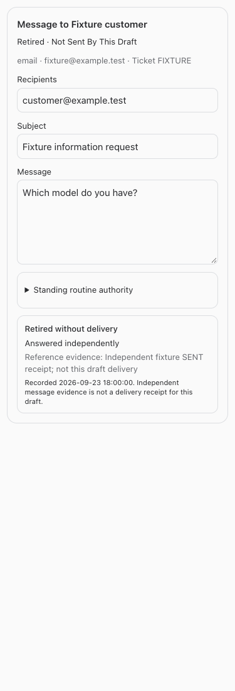

# Retire obsolete unclaimed drafts

September 23, 2026 · BUILD255

Adds `retire_message_draft` for the active native owning bot to close an ordinary nondelegated draft in `draft` or `queued` state, only when `claim_key` is null. It uses the existing terminal `discarded` state and a separate immutable retirement audit. Payload, original authorization, decision binding and delivery receipt are preserved. Independent source SENT evidence is reference evidence, never delivery of this draft.

## Owner acceptance contract

The actual owning bot first calls `list_message_drafts` and reads current ID, version, state, claim key and delegation. It then calls:

```json
{
  "draft_id": "<freshly read own ordinary draft ID>",
  "expected_version": 2,
  "request_key": "<stable unique retirement key>",
  "reason": "Message is obsolete because the issue was answered independently",
  "evidence": "<verified independent source receipt and context; not this draft delivery>"
}
```

Use the actual current version, not the illustrative `2`. Tool: `retire_message_draft`. Equivalent authenticated bot API: `POST /api/bot-communication/drafts/:id/retire`, with the same body excluding `draft_id`. Human and foreign-bot callers are rejected. Sending authorization is not required to cancel this bot's own unclaimed work. Enrollment/registration and current access must remain active.

An identical retry returns the same retired draft after fresh access checks. Changed reason/evidence/version or a reused key for a different draft conflicts; a new key cannot rewrite an existing retirement. A changed draft version requires fresh inspection. The returned card includes `retirement` with reason, reference evidence, native actor/conversation, original expected version and timestamp. UI shows **Retired without delivery**, not Sent.

Retirement and claim use immediate SQLite transactions. If claim wins, retirement fails and the bot must reconcile source effects. If retirement wins, later claims fail and stale send wakeups cannot execute or relabel the retirement as a delivery failure. Claimed, sending, sent, uncertain, failed, discarded and delegated messages are rejected by this operation. Never claim a message merely to close it. Delegated messages retain their existing delegation contract; no decision, source ticket, case completion or standing-policy authority is modified.

## Live case boundary

LRVC5W draft `ce13d0fd-6fcf-4965-969c-f74ea82009f7`, independent SENT `1a0cf09cb9e3f39e`, and no-contact completion `af56f3c8-9afc-45eb-938e-a31aa2080c21` were user-provided reference identifiers only. The builder did not read or mutate that live draft, claim a lease, call a customer provider, send a message, or perform acceptance. Nora must independently refresh and apply the supported operation if still appropriate. The independent email is not copied into this draft's delivery receipt.

## Verification

Focused tests cover ordinary unapproved and queued drafts, preservation of payload/authorization/receipt, immutable audit, idempotency/conflicts, stale version, foreign/human/revoked/archived owners, all forbidden states, delegation exclusion, both claim/retirement orderings, stale wake cancellation and simultaneous HTTP claim/retirement. No source/provider calls occur. Full checks and deployment receipt follow below.

Mock browser checks cover retired cards at 320/375/414/768/1440 widths in light/dark themes, no send control, clear independent evidence and no horizontal overflow. Full/restricted guide discovery and resumed-agent instructions are verified.



## Changed files

- [Communication service](/Users/archerclawdington/veneer-os/server/src/bots/communication.ts)
- [API route](/Users/archerclawdington/veneer-os/server/src/bots/communicationRoutes.ts)
- [Retirement migration](/Users/archerclawdington/veneer-os/server/src/db/migrations/0113_draft_retirement.sql)
- [Native tool](/Users/archerclawdington/veneer-os/server/src/mcp/botTools.ts)
- [Guide catalog](/Users/archerclawdington/veneer-os/server/src/featureGuide/catalog.ts)
- [Draft card](/Users/archerclawdington/veneer-os/web/src/components/BotCommunication.tsx)
- [Retirement tests](/Users/archerclawdington/veneer-os/server/test/draftRetirement.test.ts)
- [Delegation regression](/Users/archerclawdington/veneer-os/server/test/messageDelegation.test.ts)
- [Resumed instructions regression](/Users/archerclawdington/veneer-os/server/test/instructionContext.test.ts)
- [Retirement browser fixtures](/Users/archerclawdington/veneer-os/scripts/draft-retirement-browser-check.mjs)
- [Guide browser fixtures](/Users/archerclawdington/veneer-os/scripts/bot-guide-browser-check.mjs)
- [This report](/Users/archerclawdington/veneer-os/docs/reports/draft-retirement/README.md)

## Final checks

Root typecheck, full tests (2,285 server passed plus 5 skipped; 864 web; 21 installer; 40 browser-manager), and production build passed. The build emitted only the existing bundle-size advisory. Focused lifecycle tests passed, including simultaneous claim/retirement. All ten retired-card browser combinations and full/restricted guide fixtures passed.

### Browser evidence

- [draft-1440-dark.png](/Users/archerclawdington/veneer-os/docs/reports/draft-retirement/screenshots/draft-1440-dark.png)
- [draft-1440-light.png](/Users/archerclawdington/veneer-os/docs/reports/draft-retirement/screenshots/draft-1440-light.png)
- [draft-320-dark.png](/Users/archerclawdington/veneer-os/docs/reports/draft-retirement/screenshots/draft-320-dark.png)
- [draft-320-light.png](/Users/archerclawdington/veneer-os/docs/reports/draft-retirement/screenshots/draft-320-light.png)
- [draft-375-dark.png](/Users/archerclawdington/veneer-os/docs/reports/draft-retirement/screenshots/draft-375-dark.png)
- [draft-375-light.png](/Users/archerclawdington/veneer-os/docs/reports/draft-retirement/screenshots/draft-375-light.png)
- [draft-414-dark.png](/Users/archerclawdington/veneer-os/docs/reports/draft-retirement/screenshots/draft-414-dark.png)
- [draft-414-light.png](/Users/archerclawdington/veneer-os/docs/reports/draft-retirement/screenshots/draft-414-light.png)
- [draft-768-dark.png](/Users/archerclawdington/veneer-os/docs/reports/draft-retirement/screenshots/draft-768-dark.png)
- [draft-768-light.png](/Users/archerclawdington/veneer-os/docs/reports/draft-retirement/screenshots/draft-768-light.png)
- [retirement-desktop.png](/Users/archerclawdington/veneer-os/docs/reports/draft-retirement/screenshots/retirement-desktop.png)
- [retirement-employee-mobile.png](/Users/archerclawdington/veneer-os/docs/reports/draft-retirement/screenshots/retirement-employee-mobile.png)

## Deployment receipt

Implementation **2d15fc3** committed and pushed to origin/main. Root restart ran after passing checks; the queue resumed this chat across restart. Read-only verification returned HTTP 200 from web, runner, app-runner, terminal and browser-manager health endpoints. The live database has `bot_message_retirements`; deployed tool definitions, dated New guide entry and resumed-agent instructions include `retire_message_draft`. No live retirement or customer acceptance was performed. LRVC5W remains for its actual owner to refresh and handle separately. Unrelated `.veneer-browser/`, `.veneer/` and `out/` were preserved.
