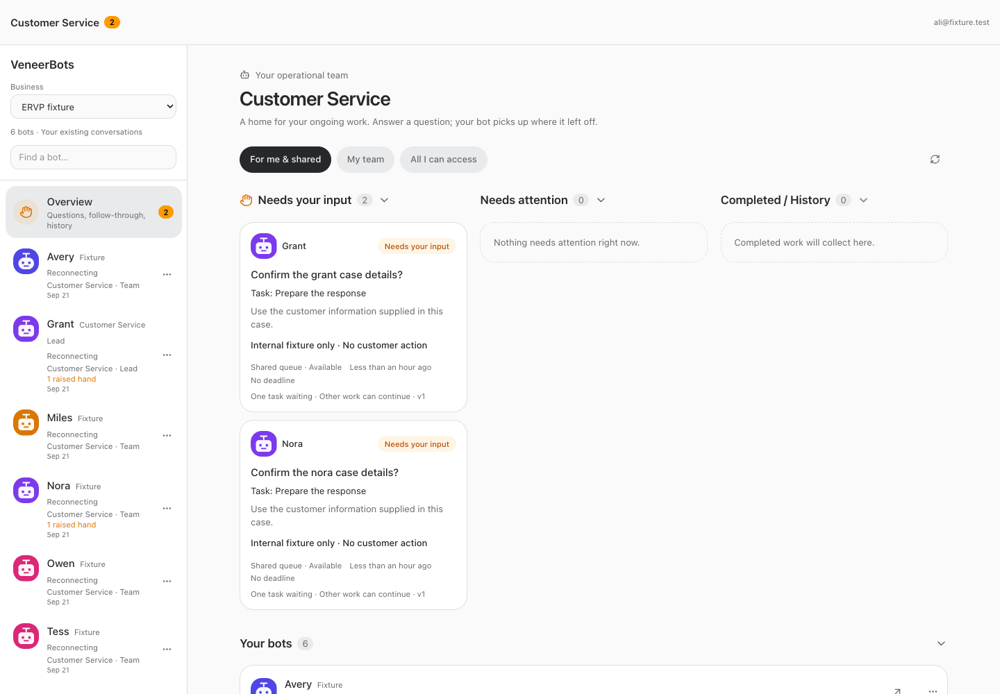
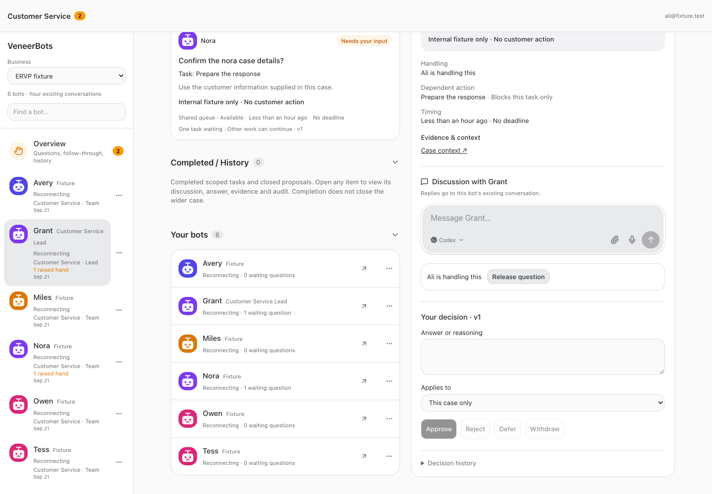
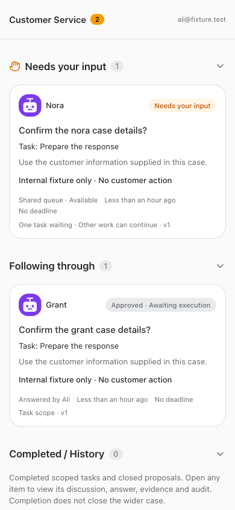
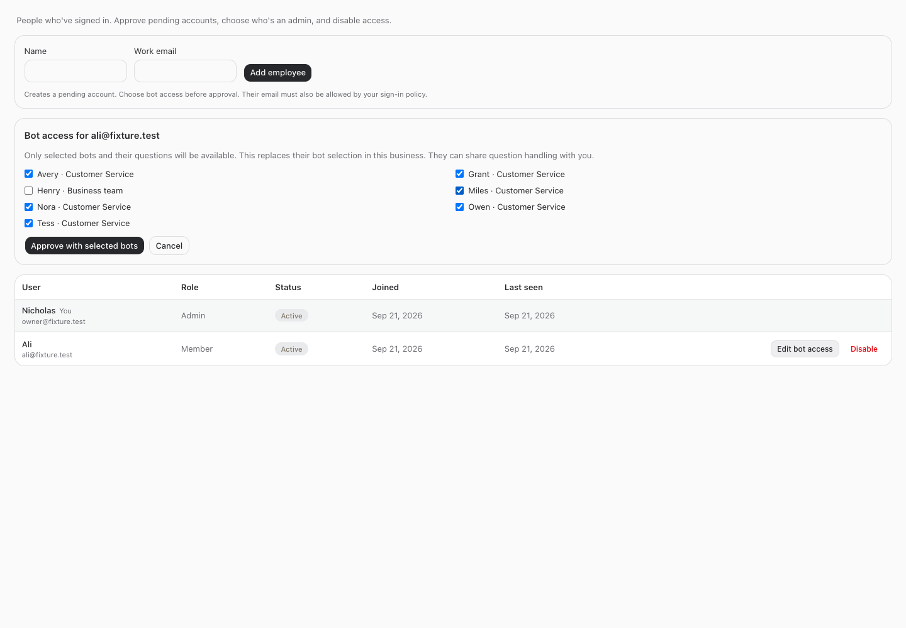

# Customer Service employee workspace — build 126

September 21, 2026. Implemented, validated, built and deployed. All five services restarted healthy. Ali's live account setup is pending authenticated administration; no employee account or access was created by this build.

## Behavior

Restricted employees land in Customer Service and see only explicitly assigned bots and their accessible questions. The intended selection for ali@elkhartrvparts.com is Grant, Nora, Miles, Tess, Owen and Avery in ERVP. The owner retains their existing workspace and development questions.

Owner and authorized employees share the selected bots' questions addressed to the owner or authorized staff. “Handle this” claims a question; the roster/cards show the handler. Only the current handler can answer; claim/release revisions and proposal versions prevent conflicting claims and stale answers. The handler or owner can release a question. Answers retain attribution and appear as “Answered by …”. Existing execution, financial and policy gates remain intact. No escalation workflow was added. Existing notification queries include eligible shared questions and exclude inaccessible questions.

People & access can create a pending member by work email, select bots and approve with those restrictions in one transaction. Editing a restricted account starts from its actual grants. Revoking all grants leaves the account restricted, without falling back to broad Team visibility. Restricted accounts cannot be promoted to administrators. Existing business membership management can revoke access.

The server enforces the boundary across bot/decision APIs, native conversations, discovery, generated-file IDs/listing, evidence, source-link presentation and WebSocket subscriptions. Restricted employee API routes are denied by default; project/filesystem, memory, tools, management and unrelated platform surfaces are unavailable. Local Mini Apps and browser-control sockets are denied. Open chat sockets recheck access before emitting updates. A granted operational bot retains its original executor and tools; this change does not create a separate OS/process sandbox or redact material already contained in an explicitly granted bot's transcript.

## Validation and deployment

- Typecheck passed: [output](./typecheck.txt).
- Full suite: **2,952 passed, 5 existing skipped** (server 2,065; web 826; installer 21; browser manager 40): [output](./tests.txt).
- In-memory HTTP and WebSocket tests cover restricted discovery, legacy Team chats, evidence, direct file IDs, revoked sessions, active-account checks, claims, stale handling/proposal versions, retries, duplicate answers and actor attribution.
- Isolated desktop/mobile browser checks passed for the six-bot view, shared handling in two user contexts, conflict rejection, attributed answer, mobile overflow, native bot discussion, inaccessible chats and People access selection: [output](./browser-tests.txt).
- Production build passed with the existing large-chunk advisory: [output](./build.txt).
- All five services restarted healthy: [output](./restart.txt).
- Read-only live verification confirmed migration 0097 installed and all 13 original bot identities, providers, models, effort, ownership, projects and reporting structure unchanged: [verification](./live-verification.json), [prior fingerprints](./bot-identities-before.json). Session values were not recorded.
- No live customer cases, decisions, approvals, sends or financial actions were used as tests.

## Remaining account setup

The confirmed email is **ali@elkhartrvparts.com**. At the final live readback, that email had not provisioned an account. The available browser showed the Nicks World sign-in screen. The native management tool refused this chat with “Human owner or authenticated owner Platform Dev required.” No authentication or role checks were bypassed.

An authenticated owner can open [People & access](https://nicksworld.dev/#/settings/people), add Ali with that work email (or use her pending account after she signs in), choose the six Customer Service bots, and select **Approve with selected bots**. Her email must also be allowed by the existing Cloudflare Access sign-in policy; its current allowance was not verified. Both entry controls are required. The user has already authorized this setup; the remaining requirement is an authenticated administration session, not new approval of the work.

## Screenshots

## Files

- [docs/reports/employee-workspace/bot-identities-before.json](/Users/archerclawdington/veneer-os/docs/reports/employee-workspace/bot-identities-before.json)
- [docs/reports/employee-workspace/browser-tests.txt](/Users/archerclawdington/veneer-os/docs/reports/employee-workspace/browser-tests.txt)
- [docs/reports/employee-workspace/build.txt](/Users/archerclawdington/veneer-os/docs/reports/employee-workspace/build.txt)
- [docs/reports/employee-workspace/live-verification.json](/Users/archerclawdington/veneer-os/docs/reports/employee-workspace/live-verification.json)
- [docs/reports/employee-workspace/report.md](/Users/archerclawdington/veneer-os/docs/reports/employee-workspace/report.md)
- [docs/reports/employee-workspace/restart.txt](/Users/archerclawdington/veneer-os/docs/reports/employee-workspace/restart.txt)
- [docs/reports/employee-workspace/screenshots/desktop.png](/Users/archerclawdington/veneer-os/docs/reports/employee-workspace/screenshots/desktop.png)
- [docs/reports/employee-workspace/screenshots/handling.png](/Users/archerclawdington/veneer-os/docs/reports/employee-workspace/screenshots/handling.png)
- [docs/reports/employee-workspace/screenshots/mobile.png](/Users/archerclawdington/veneer-os/docs/reports/employee-workspace/screenshots/mobile.png)
- [docs/reports/employee-workspace/screenshots/people.png](/Users/archerclawdington/veneer-os/docs/reports/employee-workspace/screenshots/people.png)
- [docs/reports/employee-workspace/tests.txt](/Users/archerclawdington/veneer-os/docs/reports/employee-workspace/tests.txt)
- [docs/reports/employee-workspace/typecheck.txt](/Users/archerclawdington/veneer-os/docs/reports/employee-workspace/typecheck.txt)
- [scripts/employee-browser-check.mjs](/Users/archerclawdington/veneer-os/scripts/employee-browser-check.mjs)
- [scripts/employee-browser-fixture.ts](/Users/archerclawdington/veneer-os/scripts/employee-browser-fixture.ts)
- [server/src/bots/employeeAccess.ts](/Users/archerclawdington/veneer-os/server/src/bots/employeeAccess.ts)
- [server/src/bots/routes.ts](/Users/archerclawdington/veneer-os/server/src/bots/routes.ts)
- [server/src/bots/service.ts](/Users/archerclawdington/veneer-os/server/src/bots/service.ts)
- [server/src/bots/teams.ts](/Users/archerclawdington/veneer-os/server/src/bots/teams.ts)
- [server/src/channels/veneerBrowser.ts](/Users/archerclawdington/veneer-os/server/src/channels/veneerBrowser.ts)
- [server/src/channels/webSocket.ts](/Users/archerclawdington/veneer-os/server/src/channels/webSocket.ts)
- [server/src/conversations/access.ts](/Users/archerclawdington/veneer-os/server/src/conversations/access.ts)
- [server/src/db/migrations/0097_employee_bot_access.sql](/Users/archerclawdington/veneer-os/server/src/db/migrations/0097_employee_bot_access.sql)
- [server/src/files/generatedFiles.ts](/Users/archerclawdington/veneer-os/server/src/files/generatedFiles.ts)
- [server/src/mcp/botTools.ts](/Users/archerclawdington/veneer-os/server/src/mcp/botTools.ts)
- [server/src/routes/api.ts](/Users/archerclawdington/veneer-os/server/src/routes/api.ts)
- [server/src/routes/localMiniApps.ts](/Users/archerclawdington/veneer-os/server/src/routes/localMiniApps.ts)
- [server/test/employeeWorkspace.test.ts](/Users/archerclawdington/veneer-os/server/test/employeeWorkspace.test.ts)
- [server/test/lanViewer.test.ts](/Users/archerclawdington/veneer-os/server/test/lanViewer.test.ts)
- [web/src/App.tsx](/Users/archerclawdington/veneer-os/web/src/App.tsx)
- [web/src/components/BusinessAccess.tsx](/Users/archerclawdington/veneer-os/web/src/components/BusinessAccess.tsx)
- [web/src/components/NavBar.tsx](/Users/archerclawdington/veneer-os/web/src/components/NavBar.tsx)
- [web/src/lib/api.ts](/Users/archerclawdington/veneer-os/web/src/lib/api.ts)
- [web/src/lib/bots.ts](/Users/archerclawdington/veneer-os/web/src/lib/bots.ts)
- [web/src/lib/types.ts](/Users/archerclawdington/veneer-os/web/src/lib/types.ts)
- [web/src/screens/Bots.tsx](/Users/archerclawdington/veneer-os/web/src/screens/Bots.tsx)
- [web/src/screens/EmployeeWorkspace.tsx](/Users/archerclawdington/veneer-os/web/src/screens/EmployeeWorkspace.tsx)
- [web/src/screens/settings/UsersPage.tsx](/Users/archerclawdington/veneer-os/web/src/screens/settings/UsersPage.tsx)
- [web/test/employee-browser.tsx](/Users/archerclawdington/veneer-os/web/test/employee-browser.tsx)
