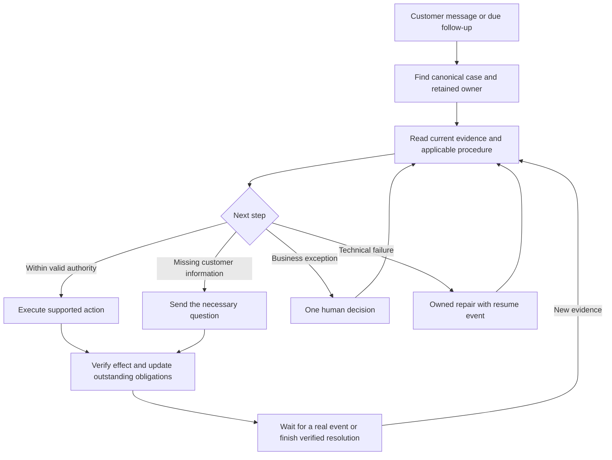

# Making Veneer customer service useful: lessons from Fin

Research and proposed implementation plan · September 28, 2026 · ERVP first, then other projects

## Recommendation

**Make routine customer service a tested, deployable capability with one accountable case owner and a working path to completion.** The evidence points to execution and workflow design as the immediate blockers, with an instruction-maintenance problem making matters worse. It does not support telling Nick to spend more time teaching the bots the same lessons.

Fin is a useful reference because it packages knowledge, behavior, action integrations, testing, deployment, and quality review into an operating system for support. Copy that operating model. Avoid committing to reproducing its entire product or proprietary model stack before proving that a small Veneer implementation saves human time.

The first delivery milestone should be narrow and observable: a genuinely eligible new ERVP customer email arrives, the retained owner understands the request, sends the appropriate routine response under valid standing authority, records the actual send result, and resumes correctly when the customer replies. No routine manager relay and no per-message human approval where valid standing authority already applies. Existing approvals, holds, executor bindings, and uncertain prior effects remain intact.

In parallel with planning that implementation, evaluate a bounded Fin pilot against the same ERVP cases. Custom OrderOps integration remains work under either option. Select on quality, human effort, reliability, and total cost.

This document proposes work; it does not change bot training, schedules, authority, customer cases, integrations, or software. Suggested owners below are planning roles, not new assignments.

## Evidence and limits

The research uses official Fin/Intercom product documentation and engineering articles, alongside a bounded read-only review of current ERVP training, recent bot conversations, the weekly autonomy audit, and relevant Veneer implementation records. This is enough to identify concrete failure mechanisms and propose a plan. It is not a representative audit of every ticket or an independent benchmark of Fin.

The supplied [video, “What is Fin? (The #1 AI Agent for Customer Service)”](https://www.youtube.com/watch?v=Nq4OT3omdg8) is 6 minutes 37 seconds. Its public metadata lists performance analysis at 1:07, support content at 2:18, guidance at 2:38, complex tasks at 3:01, testing at 3:46, deployment at 5:13, and integrations at 5:35. I retrieved the description and chapters, but the public caption endpoint returned an empty body and the managed browser reported capacity unavailable. I did not review the complete audiovisual content. The detailed findings below come from the linked documentation, which also covers newer Procedures functionality.

Product claims are labeled as claims. Dates in implementation reports describe those reports; they do not certify fresh customer delivery. Recent conversation results are bot-reported evidence unless independently corroborated here.

## 1. What Fin does differently

### It separates six kinds of configuration

| Layer | Fin's documented approach | What Veneer should make explicit |
| --- | --- | --- |
| Knowledge | Enable selected articles, snippets, documents, and synced sources | Current policies, product facts, troubleshooting instructions, with source and applicability |
| Behavior | Focused natural-language Guidance | How to answer, when to clarify, and when to involve a person |
| Procedure | A bounded multi-step process with natural language and structured conditions | The actual steps, evidence, actions, and completion criteria for a case type |
| Integration | Data connectors read and update external systems | Working, authenticated OrderOps operations and reliable outbound transport |
| Deployment | Choose channels and audiences; explicitly set configurations live | Which tested version is active for which business, channel, and case types |
| Quality | Saved tests, production analysis, recommendations, and monitors | Evidence that changes improve customer outcomes and reduce human work |

Fin's [content documentation](https://www.intercom.com/help/en/articles/7837514-add-your-content-for-fin-ai-agent) distinguishes content that exists, is syncing, has errors, or is actually enabled. Its [Guidance best practices](https://www.intercom.com/help/en/articles/10560969-fin-guidance-best-practices) favor precise, focused instructions with clear conditions. [Procedures](https://www.intercom.com/help/en/articles/12495167-fin-procedures-explained) combine conversational flexibility with branches, rules, and external actions. These are separately maintained objects, rather than one accumulated instruction history.

**ERVP implication:** A rule in a skill saying a photo request is autonomous must not be confused with a deployed photo-request capability. The system should separately show policy authorization, integration readiness, tested behavior, and live deployment.

### “Agentic” means completing a bounded process

Fin can gather missing information, read current account/order data, apply policy, invoke an external operation, and continue the conversation. Its Procedures can adapt when customers interrupt or add context. Workflows handle more predefined routing and automation. Simple FAQs can use knowledge directly without a Procedure. Current documentation also states that Procedure actions run sequentially; it does not document a requirement for a hierarchy of independent manager bots. [Procedures explained](https://www.intercom.com/help/en/articles/12495167-fin-procedures-explained)

Fin's 2025 research on [agency, control, and reliability](https://fin.ai/research/agency-control-reliability-the-tradeoffs-in-customer-support-agents/) argues for bounded, composable tasks and repeated-success testing. This is historical research using older models, not a present-day benchmark of Veneer's models. Its practical lesson still applies: test whether the agent completes the same class of task consistently, rather than celebrating one impressive run.

**ERVP implication:** Keep the flexibility to interpret an email and ask a sensible question. Make identity, authority, execution, and completion routine platform operations. The bot should not have to reconstruct those operations from a succession of repair conversations on each case.

### They retrieve behavior as well as facts

Fin's September 25, 2026 engineering article describes selecting relevant Guidance, Data Connectors, and Procedures at runtime. It reports that indiscriminately including all configuration increases distraction and latency. Its selectors have different failure behavior: guidance selection falls back to the full set on failure; connector selection preserves the planner's ability to use dependent tools; procedure selection can conclude that none applies. [How Fin scales customer-defined behavior](https://fin.ai/research/how-fin-scales-customer-defined-behaviour/)

**ERVP implication:** Give the owner a small universal operating contract plus the relevant current procedure and case evidence. Keep historical instructions available for audit, outside the default working instructions. Mandatory authority and identity checks must always apply; relevance retrieval must never filter those checks away. Start with explicit applicability rules and ordinary retrieval. There is no reason to begin by training custom selector models.

### Actions are supported integrations

Fin's Data Connectors invoke configured APIs from its backend. They can retrieve facts or perform changes, and its documentation recommends server-side access checks rather than trusting customer-supplied identifiers. A connector can be usable conversationally while still enforcing business conditions in the underlying API. [Data connector FAQs](https://www.intercom.com/help/en/articles/9916507-data-connectors-faqs)

**ERVP implication:** The case owner should invoke a small number of stable operations for reading a case, checking an action, executing within authority, and reading its result. The backend should consistently handle source identity, account scope, fresh evidence, duplicate prevention, and receipts. Simplify the agent-facing interface while preserving these controls. Backend integration repair is a prerequisite; more persuasive instructions cannot substitute for it.

### Their testing is a product feature

Fin offers manual previews, saved batch question sets, and multi-turn Procedure simulations. Simulations use configured external data rather than hitting live APIs; previews can use live integrations. A simulation pass therefore proves behavior against a fixture, not real transport or action completion. [Testing modes](https://www.intercom.com/help/en/articles/14077180-simulations-vs-batch-tests-vs-previews)

Batch tests expose sources and applied configuration. A poor answer can be diagnosed as a content-selection, clarification, interpretation, tone, or automation problem. The documentation explicitly says that ratings do not directly train Fin: change content or guidance and rerun the test. [Batch testing](https://www.intercom.com/help/en/articles/10521711-batch-test-fin-ai-agent)

**ERVP implication:** Every substantive correction should become an example with an expected result, an appropriate fix, and a regression test. Separate conversation-quality tests from integration tests and actual outcome evidence. Passing a software suite or approving a draft is insufficient evidence that a customer was answered.

### Deployment and versioning are explicit

Fin distinguishes draft, live, and paused Procedures. Restoring an old version creates a draft; publication is a separate step. [Versions and publishing](https://www.intercom.com/help/en/articles/14324571-manage-procedure-versions-and-publishing)

Its rollout guidance recommends internal testing and gradual audience expansion. Email deployment additionally requires a configured channel, appropriate audience rules, and explicit activation; merely configuring forwarding does not enable responses. [Staged rollout](https://www.intercom.com/help/en/articles/7837527-live-testing-fin-with-your-team-or-customer-segments), [email deployment](https://www.intercom.com/help/en/articles/9356221-deploy-fin-ai-agent-over-email)

**ERVP implication:** Each capability needs a visible state such as draft, tested, blocked on integration, live for a pilot, live, or paused. A person should be able to see what the bots can actually do today without reading build receipts.

### Human involvement is a step with a continuation

Fin Procedures can pause for a teammate's structured answer, then resume using that answer. A teammate can also take over, which stops Fin. A timeout can route the conversation to an escalation owner. This provides a defined continuation after human input. [Human-in-the-loop Procedures](https://www.intercom.com/help/en/articles/14468561-human-in-the-loop-approvals-for-fin-procedures)

**ERVP implication:** One exact question, one recorded answer, then automatic continuation by the retained owner. Approval-to-execution delay should be measured. Technical failures belong in a repair queue with a resume event, rather than producing a repeated business decision. Existing exact approvals must retain their supported lifecycle.

### Improvement has traceable outputs

Fin's recommendations inspect failed responses, human answers, missing content, duplicates, and contradictions. Recommendations expose the conversations behind the proposed fix and can be reviewed before activation. [Content recommendations](https://www.intercom.com/help/en/articles/11394959-use-ai-powered-content-recommendations-to-improve-fin)

Monitors provide targeted or sampled conversation review, including escalation problems and repetitive loops. [Monitors](https://www.intercom.com/help/en/articles/13584513-monitors-explained)

**ERVP implication:** Grant's quality role should result in corrected procedures, tests, and measured improvements. Count those outcomes separately from sweeps, internal notes, messages between bots, or review activity.

### They invest in service reliability and structured product data

Fin's reliability engineering describes model routing, provider failover, capacity isolation, and observability. These are service responsibilities behind the conversational experience. [Reliable service engineering](https://fin.ai/research/fin-running-a-reliable-service-over-unreliable-parts/)

Its ecommerce research preserves product/variant structure and combines semantic search with exact filters for attributes such as price and availability. [Structured ecommerce retrieval](https://fin.ai/research/structured-agentic-rag-for-e-commerce/)

**ERVP implication:** Measure queue delay, agent startup, investigation, action, and external waiting separately. Reserve practical capacity for customer replies before optimizing background work. For RV parts, retain exact model, variant, dimensions, and compatibility evidence; a similar description or photograph does not establish fitment. [Fin Vision](https://www.intercom.com/help/en/articles/10696494-how-fin-vision-understands-images) also illustrates the value of making customer images available as usable evidence. Missing or unreadable attachments should be explicit, and the owner should request only the information actually needed.

## 2. What the ERVP evidence says

| Observation | Evidence reviewed | Interpretation and confidence |
| --- | --- | --- |
| A simple request became unnecessarily broad, then remained unsent | Grant's September 28 conversation: Nick corrected the request to a photo of the single unit received; Grant later reported neither revised email nor SMS had been sent | Concrete reasoning and follow-through failure in this exchange. Does not establish all cases behave this way |
| A separately approved interim email missed its deadline | Tess's September 28 report: 21:30 UTC deadline passed while exact ticket binding remained unavailable | Strong evidence of a technical execution bottleneck in this case; approval was already present |
| Reader activation was a separate milestone from actual sending | BUILD429 report verifies activation of a six-caller registry and explicitly excludes customer delivery | Working access/setup components are being delivered without necessarily completing the customer-facing path |
| Routine policy text is ahead of operational capability | Current prepared routine-registration source has `source: null`; BUILD339 describes photo-only preparation and later activation gates | Verified checkout state and dated rollout evidence. This review does not claim a fresh production inventory of all enrolled policies |
| Training is large and contains layered overrides | Core rules: 11,714 words; case-owner skill: 7,124; Grant skill: 2,394; Avery skill: 1,575. The case-owner and Avery skills require the core files | Confirmed file sizes, about 18,800 words in the two core files alone. Runtime loading and causality require measurement |
| The intended removal of manager bottlenecks already exists in training | September 22 routine delegation and September 25 direct owner-to-Ali routing appear in current skills | Adding the same instruction again is unlikely to resolve the whole problem |
| The autonomy feedback loop lacks sufficient outcome evidence | September 28 audit: 50 resolved escalation records in the window, 48 with null answer actions; two send answers did not establish actual sends or a consecutive-send streak | The audit cannot reliably advance autonomy from those records. These are escalation-record counts, not all customer messages |
| Current coverage is bounded | Avery's skill describes weekday 08:00–17:30 Eastern coverage and a ten-minute intake trigger; Grant's skill describes a half-hour dispatcher | Documented scheduling can add waiting and limits availability. Actual latency distribution was not measured here |

Internal sources: [Grant's conversation](/#/chat/cb4ade24-c960-4235-956a-220260e5adac), [Tess's conversation](/#/chat/1e96b7bb-1071-4f1d-b710-310f9fbbc9e1), [routine activation history](/#/chat/b6610376-e0f1-47bd-b273-25ce13e11d7a), [BUILD429](/Users/archerclawdington/veneer-os/docs/reports/approved-case-ticket-binding/build429.md), [BUILD339](/Users/archerclawdington/veneer-os/docs/reports/routine-delivery-rollout/README.md), [prepared registration](/Users/archerclawdington/veneer-os/server/src/bots/preparedRoutineRegistration.ts), [core rules](/Users/archerclawdington/Projects/ERVP/.agents/skills/henry-cs-rules/SKILL.md), [case-owner skill](/Users/archerclawdington/Projects/ERVP/.agents/skills/henry-cs-case-owner/SKILL.md), [Grant skill](/Users/archerclawdington/Projects/ERVP/.agents/skills/grant-cs-lead/SKILL.md), [Avery skill](/Users/archerclawdington/Projects/ERVP/.agents/skills/avery-new-ticket-triage/SKILL.md), [weekly audit](/Users/archerclawdington/Projects/ERVP/out/henry/weekly-autonomy-audit-2026-09-28.md).

The six survey ratings in the weekly audit are too sparse and selectively available to assign an overall service score. Nick's “0 out of 100” describes his experience; it is not a measured automation rate. There is enough evidence to act without pretending the size of each failure category is already known.

### Is the multi-agent approach wrong?

Multiple owners handling different cases can provide capacity. Specialists can help with vendor facts, claims, or accounting. The problematic pattern is making an ordinary case depend on repeated handoffs, discretionary reviews, re-investigations, or separate chats to connect a decision to its execution.

Keep one owner for the customer obligation. Specialists return bounded evidence to that owner. Grant maintains quality, handles concrete ownership conflicts, and reviews exceptions. Henry handles business priorities. Neither needs to approve every routine step. This largely matches the latest intended ERVP routing; implementation and measured adherence need to catch up.

Fin itself uses multiple models and internal components. “One agent” in its customer experience is not evidence of a single-model implementation. The question is whether each extra component improves outcomes enough to justify its latency and failure modes.

## 3. Target operating model

The durable case record should contain the current request, verified customer/order links, relevant messages and attachments, retained owner, applicable procedure version, authority reference, prior effects, unresolved obligations, and the next event or deadline. Most of this may already exist across OrderOps and Veneer; first map it, then fill the specific gaps. Avoid creating a competing case database merely to redraw the workflow.

Expose three distinct routes to the owner: act under a valid deployed standing policy; obtain one genuinely needed business decision; or wait on an owned technical/external dependency. A refused action must explain which route applies. A timeout after dispatch must retain uncertainty and reconcile the existing attempt, never blindly send again.

For future work, establish source/case identity when the case enters the workflow and carry stable machine identifiers separately from descriptive labels. Preserve legacy approval payloads and use supported mappings; do not rewrite old approvals to fit a new structure.

## 4. Training that produces observable improvements

Create a current procedure library, initially from existing authorized ERVP rules. Keep provenance and historical audit material; remove superseded operational wording from the default instruction path after validating the consolidated interpretation.

Each procedure should specify:

1. Applicability and exclusions, including examples that look similar but belong elsewhere.
2. Required facts, their sources, and what the owner can already obtain without bothering the customer.
3. The customer outcome and steps to achieve it.
4. Permitted actions under an actual authority reference, with explicit exception boundaries.
5. The exact information to ask for if facts are missing.
6. Completion evidence, remaining obligations, and the next trigger when waiting.
7. Good examples, failure examples, test cases, version, and accountable maintainer.

Keep communication style separate from business policy. Keep business policy separate from connector setup and technical incident history. Retrieve only applicable optional material; preserve universal checks.

For a correction like “we shipped one part; ask for a picture of that,” the learning workflow is: preserve the correction in context; identify the excessive-question failure; amend the relevant procedure without expanding authority; add a test with one shipped item and another with several ambiguous items; rerun the affected tests; publish only after the change passes. The customer case continues independently with its existing owner.

Grant can perform this maintenance within the existing commissioned review process. A new human training button or a mandatory approval for every wording improvement would recreate the bottleneck. A genuinely new refund limit or broader business authority still needs the appropriate human decision.

## 5. The first procedures to prove

These are proposed rollout priorities, not newly granted authority. Confirm actual volume during the baseline review, then adjust the order by saved human minutes and readiness.

| Procedure | Desired behavior | Important boundary |
| --- | --- | --- |
| Necessary product photo request | Check available evidence, ask for the one needed photo, send, retain ownership until the customer responds | The prepared product-label-photo policy is narrower than every general photo request; use only its real scope until properly expanded |
| Factual order tracking | Retrieve the actual order and carrier status, answer succinctly, retain any unresolved nonreceipt issue | No unsupported delivery promises, loss conclusions, or false closure |
| Acknowledgment-only close | Recognize a resolved issue followed by thanks, close without another email | A new request or outstanding obligation prevents this close; existing suppression controls apply |
| Published product/how-to answer | Retrieve the right product and current instructions, answer the actual question | Similarity cannot establish fitment; ask for missing model information when necessary |
| Existing return/claim update | Report verified current status and the next real step | Status communication is separate from refund, replacement, or exception authority |

The first proof should include the **whole customer interaction**, not just a successful outbound photo request. Asking for information advances the case; it does not resolve it.

## 6. Proposed delivery sequence

The time ranges below are planning estimates after kickoff, capacity allocation, and access to the necessary source owners. They are not completion promises. Existing technical repair ownership and queue positions should be preserved.

| Stage | Proposed owner | Deliverable | Exit condition |
| --- | --- | --- | --- |
| Baseline: 1–2 working days | CS quality lead with Platform Dev | Review 100 recent cases if available, stratified by common intents and outcomes; separately inspect overdue and approved-but-unsent work | Failure categories, wait-time breakdown, human minutes, and evidence coverage are documented |
| One complete email path: aim for the first working week | Platform Dev plus existing OrderOps repair owner; retained case owner executes | Complete the existing routine-send integration, simplify its supported agent interface, and test recovery and continuation | Controlled integration tests pass; an eligible production case completes under valid authority with verified result and no duplicate effect |
| Focused procedures and regression set: days 3–10, overlapping | Grant for procedure content; Platform Dev for test harness | Consolidated active guidance, initial procedures, 100 held-out scenarios where feasible | Tests show correct actions and escalation behavior; critical failures are zero in the test set |
| Bounded live pilot: approximately week 2 | Retained CS owners with sampled QA | Eligible email cohort, visible version/readiness, real follow-up events, daily outcome report | Lower human effort and acceptable quality are demonstrated over a meaningful live sample |
| Expand proven procedures: weeks 3–4 | CS lead and existing integration owners | More case types and owners using the same tested capability | Per-procedure gates pass; regressions and backlog do not worsen |
| Next project: after ERVP passes | Platform Dev with the next business's owner | Reusable setup package plus project-specific knowledge, policies, senders, integrations, and test cases | Isolation and that project's end-to-end acceptance tests pass before activation |

**Treat the first-week milestone as a delivery test of this plan.** If the work produces additional setup reports without a working routine capability, reduce scope and expose the exact blocker. Do not count another component release as customer-service progress. Consider the Fin pilot more strongly if the constrained native path cannot be completed economically.

Technical work should finish existing source registration, identity mapping, dispatch, and result-readback dependencies before adding more categories. New human enrollment is appropriate only where the supported setup actually requires it and the concrete setup is ready. Missing implementation metadata must not become a request to repeat a customer approval.

Legacy approved-but-unsent cases need a separate reconciliation lane with their original approvals and executors. Their recovery should proceed under existing repairs while new eligible cases establish the simpler routine path. Neither lane should silently replace the other.

## 7. Testing and measurement

### Test the decisions and the actual mechanism

Use existing cases to build a development set, then keep a distinct held-out acceptance set. Preserve authentic context and minimize unnecessary customer data. Include straightforward work, multi-intent requests, missing images, misleading product similarities, human takeover, contradictory messages, and channel-specific behavior.

Repeat important scenarios with paraphrases and customer interruptions. Add integration failures: expired access, wrong case mapping, stale approval, new customer message before send, timeout after provider acceptance, duplicate inbound event, and restart after a partial action. Use deterministic checks for account, recipient, action, amount, duplicate effects, and state transitions. Use calibrated human/AI review for relevance, factual support, tone, and unnecessary questions. An AI judge should not certify its own action receipts.

Mocked conversations validate behavior. Controlled integration tests validate the actual sender and source boundaries. An authorized live pilot validates customer experience. Keep those results separate. If testing Fin, remember that previews and connector tests can perform live actions; configure a controlled test environment rather than treating every “test” button as inert.

### Proposed launch gates

These are initial targets to calibrate against baseline and volume, not measured current performance or statistical guarantees:

- Zero observed wrong-recipient messages, duplicate effects, authority violations, or invented material facts in the acceptance suite and pilot. A critical incident pauses the affected capability and triggers reconciliation.
- At least 95% acceptable results on the held-out routine scenarios, with sample size and failure cases shown. A small clean sample does not prove the true error rate is zero.
- At least 50% lower human handling time for the pilot cohort, including review, edits, chasing bots, and repair effort. Report initial setup cost separately.
- An initial p95 target of five minutes to substantive routine email response during declared support hours, with queue delay and external waits reported. Do not promise this before measuring capacity.
- No repeated discretionary approval for unchanged actions already covered by valid authority.
- Every unresolved case has an owner and an actual next event or due time; every claimed send has receipt evidence; every claim of resolution accounts for remaining obligations.
- Follow reopens and recontacts over at least seven days before calling the initial pilot successful. Avoid improvement claims based solely on selecting easy tickets.

### The outcome report

| Measure | Definition |
| --- | --- |
| Eligible coverage | Eligible incoming cases divided by all incoming cases, with exclusion reasons |
| Autonomous case resolution | Eligible cases whose obligations were completed without human action, with quality review and recontact tracking |
| Autonomous step completion | Useful completed steps, such as an information request, reported separately from resolution |
| Response delay | Customer message to substantive outbound response; median and p95 |
| Approval delay | Recorded applicable approval to verified action, split by technical, queue, and evidence waits |
| Human effort | Minutes spent reviewing, correcting, chasing, investigating, and operating the system |
| Failure distribution | Knowledge, reasoning, authority/setup, transport, coordination, external dependency, and unknown-effect failures |
| Quality | Unsupported claims, unnecessary questions, premature closure, reopens, and customer feedback with denominators |
| Cost | Service/model costs plus operational and engineering labor per verified resolution |

Fin's reported resolution metrics include confirmed and assumed resolutions; its pricing also counts some configured Procedure handoffs as outcomes. These are useful commercial definitions, but they differ from proving that ERVP fulfilled every outstanding obligation. Do not use a vendor headline as the acceptance target. [Reporting definitions](https://www.intercom.com/help/en/articles/7022438-reporting-metrics-attributes), [pricing and outcomes](https://fin.ai/pricing)

## 8. Build versus buy

**Recommendation: test Fin as a practical comparator while designing the smallest reusable Veneer capability.** Its public “any helpdesk” positioning does not establish a ready-made OrderOps integration. Verify its custom integration, source-of-truth, case identity, attachment, takeover, and supported-channel behavior before connecting production traffic. [Helpdesk integrations](https://fin.ai/integrations/helpdesk)

| Option | Main advantage | Main cost or uncertainty |
| --- | --- | --- |
| Fin with supported helpdesk/integration | Mature training, testing, delivery, and quality tooling | Subscription/outcome cost, setup, and adapting the custom OrderOps workflow |
| Native Veneer CS capability | Fits existing project control, approvals, and OrderOps | We own the runtime, testing, integration reliability, and ongoing support engineering |
| Fin for customer conversations; Veneer for bounded back-office work | Uses each system where it is strongest | Requires a clear owner and authoritative record; overlapping responders would add failure modes |

Use the same case set and quality rubric for the comparison. Start offline with appropriately minimized data and simulated operations. A later live comparison must assign mutually exclusive cohorts so Fin and Veneer cannot both answer the same case. Include human handling as the baseline. Compare actual hands-off completions, intervention minutes, response time, recontact, and total cost. Do not buy or route live traffic merely to run the research.

As checked September 28, Fin lists $0.99 per outcome with a 50-outcome monthly minimum for the existing-helpdesk option; its Intercom option starts at $0.99 per outcome plus $29 per helpdesk seat per month. Pro is listed from $99/month and contains advanced analysis features. At 1,000 billable outcomes, the base outcome charge would be $990 before seats, add-ons, and other applicable charges. Confirm the actual package and billing definitions before purchasing. [Current pricing](https://fin.ai/pricing)

Fin's engine page claims a 76% average resolution rate. That is a vendor aggregate, not an independently verified expectation for ERVP's product, returns, claims, and fulfillment mix. Its model and retrieval investments are real architectural differentiators, but we should prove the operating workflow before considering custom model training. [Fin AI Engine](https://fin.ai/ai-engine)

## 9. Rolling this into other projects

Reuse a tested service capability and its test harness. Configure each business's actual customer channels, source systems, policies, product knowledge, permissions, schedules, escalation contacts, and outcome targets separately. A cloned bot personality or copied project skill cannot supply those bindings.

Make onboarding produce a capability matrix: what works, what passed testing, what is live, what is paused, and the exact dependency for each blocked capability. Keep project and business isolation in the runtime and test cross-project leakage explicitly. Each project needs its own acceptance examples; ERVP's RV-part fitment and return exceptions should not silently become another project's policy.

The immediate product priority is a reliable ERVP customer-service loop. Once it demonstrably reduces human work, package that implementation for repeatable deployment.

## Research index

Primary documentation and engineering sources used above, checked September 28, 2026:

| Source | Why it matters |
| --- | --- |
| [User-supplied video](https://www.youtube.com/watch?v=Nq4OT3omdg8) | Limited review of description and chapter metadata; full transcript unavailable |
| [Fin AI Engine](https://fin.ai/ai-engine) | Retrieval, reranking, generation, validation, and vendor performance claims |
| [How Fin scales customer-defined behavior](https://fin.ai/research/how-fin-scales-customer-defined-behaviour/) | September 25 engineering detail on selecting applicable instructions and tools |
| [Agency, control, and reliability](https://fin.ai/research/agency-control-reliability-the-tradeoffs-in-customer-support-agents/) | Historical experimental rationale for bounded tasks and repeated-success evaluation |
| [Reliable service engineering](https://fin.ai/research/fin-running-a-reliable-service-over-unreliable-parts/) | Capacity, failover, observability |
| [Structured ecommerce retrieval](https://fin.ai/research/structured-agentic-rag-for-e-commerce/) | Product structure, exact filters, variant correctness |
| [Add content](https://www.intercom.com/help/en/articles/7837514-add-your-content-for-fin-ai-agent) | Source availability versus enabled knowledge |
| [Guidance best practices](https://www.intercom.com/help/en/articles/10560969-fin-guidance-best-practices) | Focused behavioral instructions |
| [Procedures explained](https://www.intercom.com/help/en/articles/12495167-fin-procedures-explained) | Conversational processes and structured controls |
| [Data connector FAQs](https://www.intercom.com/help/en/articles/9916507-data-connectors-faqs) | Real operations, identity checks, and live-test behavior |
| [Testing modes](https://www.intercom.com/help/en/articles/14077180-simulations-vs-batch-tests-vs-previews) | Simulation, batch, and preview distinctions |
| [Batch testing](https://www.intercom.com/help/en/articles/10521711-batch-test-fin-ai-agent) | Saved questions, diagnosis, and the limits of ratings |
| [Versions and publishing](https://www.intercom.com/help/en/articles/14324571-manage-procedure-versions-and-publishing) | Explicit configuration deployment |
| [Staged rollout](https://www.intercom.com/help/en/articles/7837527-live-testing-fin-with-your-team-or-customer-segments) | Internal testing and audience expansion |
| [Email deployment](https://www.intercom.com/help/en/articles/9356221-deploy-fin-ai-agent-over-email) | Channel activation and sender setup |
| [Human-in-the-loop Procedures](https://www.intercom.com/help/en/articles/14468561-human-in-the-loop-approvals-for-fin-procedures) | Pause, decision, continuation, takeover, timeout |
| [Escalation rules and guidance](https://www.intercom.com/help/en/articles/12396892-manage-fin-ai-agent-s-escalation-guidance-and-rules) | Distinguishes escalation policy from subsequent workflow routing |
| [Content recommendations](https://www.intercom.com/help/en/articles/11394959-use-ai-powered-content-recommendations-to-improve-fin) | Source-backed improvements, duplicate and contradiction detection |
| [Monitors](https://www.intercom.com/help/en/articles/13584513-monitors-explained) | Structured post-deployment quality review |
| [Fin Vision](https://www.intercom.com/help/en/articles/10696494-how-fin-vision-understands-images) | Customer image and document understanding |
| [Reporting definitions](https://www.intercom.com/help/en/articles/7022438-reporting-metrics-attributes) | Assumed versus confirmed resolutions and denominators |
| [Helpdesk integrations](https://fin.ai/integrations/helpdesk) | Integration positioning; no verified OrderOps-specific connector |
| [Pricing](https://fin.ai/pricing) | Outcome definition, base prices, and analysis add-on |

