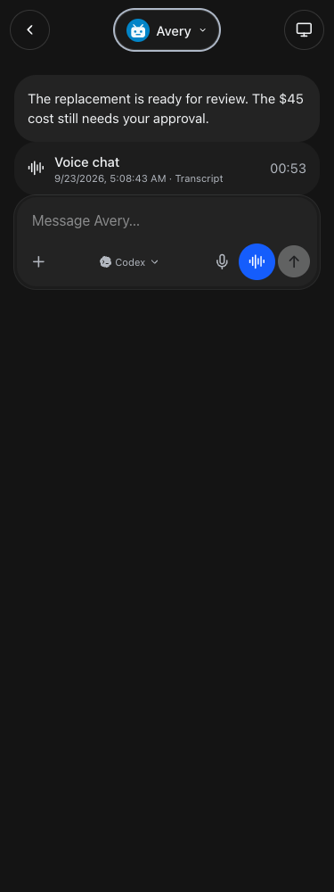
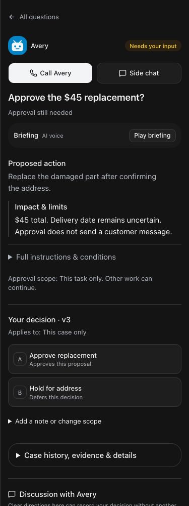

# Grokbot interaction alignment

September 23, 2026 · Build queue #217

Implemented all six approved refinements using the supplied Grokbot screenshots.

1. **Mobile chat header:** Back, centered bot/conversation identity, and Computer when available. The identity opens secondary actions, preserving permission checks. Desktop controls remain available.
2. **Decision layout:** Question, briefing, recommendation, material impact, scope, and contextual choices appear before discussion. Optional notes and scope changes sit below the buttons; supporting history/evidence collapse separately. Business approval and customer draft sending remain distinct.
3. **Shared composer:** Left attachment control, rounded input, dictation, blue live-call control, and send. Decision calls keep their decision context. Discussion includes a jump-to-latest control.
4. **Voice-session cards:** New calls save lifecycle records and leave a dated Voice chat card with connected duration in the original conversation. Open the card for the caller’s private transcript. Earlier calls and long transcripts paginate. Failed/unconnected/interrupted calls have explicit states. These are transcripts, not audio recordings; historical calls without duration records are not assigned invented durations.
5. **Result interactions:** Compact reply counts/unread indicators and quick thumbs-up, heart, and eyes reactions appear next to completed results. Existing thread storage, bot notifications, and permissions are reused. Reactions never authorize actions.
6. **Visual alignment:** Rounded assistant messages, neutral dark conversation surfaces, consistent controls, and caller initials in the floating voice panel. Named themes and light mode retain their palettes. Existing muted handoff disclosures remain intact.

The [employee guide](https://nicksworld.dev/#/bot-guide) has updated steps and New callouts. The same catalog supplies fresh and resumed bot instructions.

## Verification

- Root typecheck passed.
- Full test suite passed: 2,180 server tests (5 skipped), 850 web tests, 40 browser-manager tests, and 21 installer tests.
- Production build passed, retaining the existing large-chunk advisory.
- Focused tests verify connected duration, idempotent end, caller isolation, revoked access, transcript pagination, older-session cursors, restart interruption, and reaction aggregation.
- Browser checks cover the actual decision surface and shared components at 320, 375, 414, and 768 pixels: menu access, transcript opening, caller initials, call controls, material risks above discussion, and no-note version-bound choice submission.
- Full/restricted employee guide browser checks passed, including New discovery, search, navigation, mobile layout, aging, refresh, and failure recovery.
- No live customer sends, business actions, or microphone calls were performed.
- Deployment verification pending.

## Screenshots

## Changed files

- [server/src/bots/communicationRoutes.ts](/Users/archerclawdington/veneer-os/server/src/bots/communicationRoutes.ts)
- [server/src/bots/employeeAccess.ts](/Users/archerclawdington/veneer-os/server/src/bots/employeeAccess.ts)
- [server/src/featureGuide/catalog.ts](/Users/archerclawdington/veneer-os/server/src/featureGuide/catalog.ts)
- [server/src/routes/liveVoice.ts](/Users/archerclawdington/veneer-os/server/src/routes/liveVoice.ts)
- [server/src/voice/service.ts](/Users/archerclawdington/veneer-os/server/src/voice/service.ts)
- [server/test/botCommunication.test.ts](/Users/archerclawdington/veneer-os/server/test/botCommunication.test.ts)
- [server/test/liveVoice.test.ts](/Users/archerclawdington/veneer-os/server/test/liveVoice.test.ts)
- [server/test/liveVoiceService.test.ts](/Users/archerclawdington/veneer-os/server/test/liveVoiceService.test.ts)
- [web/src/components/BotCommunication.tsx](/Users/archerclawdington/veneer-os/web/src/components/BotCommunication.tsx)
- [web/src/components/BotComposer.tsx](/Users/archerclawdington/veneer-os/web/src/components/BotComposer.tsx)
- [web/src/components/VoiceCallPanel.tsx](/Users/archerclawdington/veneer-os/web/src/components/VoiceCallPanel.tsx)
- [web/src/lib/botGuide.test.ts](/Users/archerclawdington/veneer-os/web/src/lib/botGuide.test.ts)
- [web/src/lib/liveVoice.ts](/Users/archerclawdington/veneer-os/web/src/lib/liveVoice.ts)
- [web/src/screens/Bots.tsx](/Users/archerclawdington/veneer-os/web/src/screens/Bots.tsx)
- [web/src/screens/Chat.tsx](/Users/archerclawdington/veneer-os/web/src/screens/Chat.tsx)
- [web/src/screens/LiveVoice.tsx](/Users/archerclawdington/veneer-os/web/src/screens/LiveVoice.tsx)
- [web/src/styles.css](/Users/archerclawdington/veneer-os/web/src/styles.css)
- [server/src/db/migrations/0105_voice_sessions.sql](/Users/archerclawdington/veneer-os/server/src/db/migrations/0105_voice_sessions.sql)
- [server/src/voice/sessions.ts](/Users/archerclawdington/veneer-os/server/src/voice/sessions.ts)
- [web/src/components/VoiceSessions.tsx](/Users/archerclawdington/veneer-os/web/src/components/VoiceSessions.tsx)
- [web/src/components/chat/MobileChatHeader.tsx](/Users/archerclawdington/veneer-os/web/src/components/chat/MobileChatHeader.tsx)
- [scripts/grokbot-alignment-browser-check.mjs](/Users/archerclawdington/veneer-os/scripts/grokbot-alignment-browser-check.mjs)
- [docs/reports/grokbot-alignment/report.md](/Users/archerclawdington/veneer-os/docs/reports/grokbot-alignment/report.md)
- [docs/reports/grokbot-alignment/chat-320.png](/Users/archerclawdington/veneer-os/docs/reports/grokbot-alignment/chat-320.png)
- [docs/reports/grokbot-alignment/chat-375.png](/Users/archerclawdington/veneer-os/docs/reports/grokbot-alignment/chat-375.png)
- [docs/reports/grokbot-alignment/chat-414.png](/Users/archerclawdington/veneer-os/docs/reports/grokbot-alignment/chat-414.png)
- [docs/reports/grokbot-alignment/chat-768.png](/Users/archerclawdington/veneer-os/docs/reports/grokbot-alignment/chat-768.png)
- [docs/reports/grokbot-alignment/decision-320.png](/Users/archerclawdington/veneer-os/docs/reports/grokbot-alignment/decision-320.png)
- [docs/reports/grokbot-alignment/decision-375.png](/Users/archerclawdington/veneer-os/docs/reports/grokbot-alignment/decision-375.png)
- [docs/reports/grokbot-alignment/decision-414.png](/Users/archerclawdington/veneer-os/docs/reports/grokbot-alignment/decision-414.png)
- [docs/reports/grokbot-alignment/decision-768.png](/Users/archerclawdington/veneer-os/docs/reports/grokbot-alignment/decision-768.png)
- [docs/reports/grokbot-alignment/guide/desktop.png](/Users/archerclawdington/veneer-os/docs/reports/grokbot-alignment/guide/desktop.png)
- [docs/reports/grokbot-alignment/guide/employee-mobile.png](/Users/archerclawdington/veneer-os/docs/reports/grokbot-alignment/guide/employee-mobile.png)
