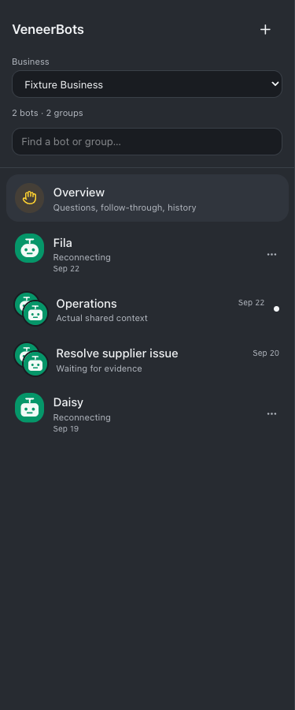
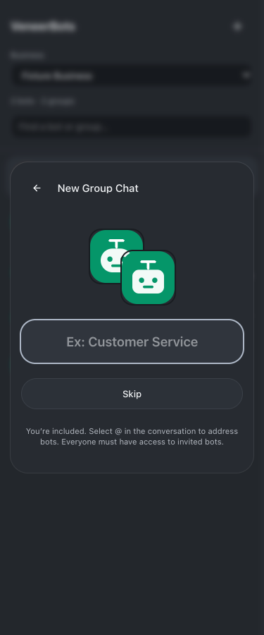
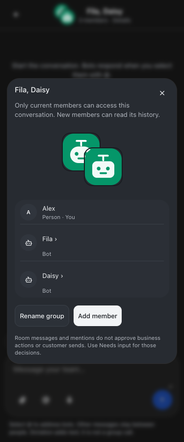
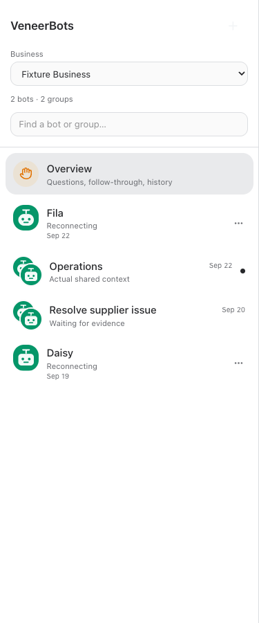

# Inline groups and huddles

Released September 23, 2026 · Build #221 · Implementation `3b3e606` (pushed to origin/main).

Groups and accessible native huddles now appear in the same recency-sorted conversation list as bots. Existing personal bot pins stay first. Rows show actual activity dates, room previews, unread counts where available, and stacked member avatars. Business filters and existing membership checks remain enforced; restricted employees do not fetch native huddles.

Select **+** in VeneerBots, choose bots or people, then **Next**. Enter a group name or **Skip** to use member names. Two bots plus the creator work without a lead or required outcome. Selected members have removable avatar chips and search. The group opens immediately; **Back** returns to bots. Tap its centered name to see members, rename, or add members. Existing Messages still handles human DMs.

Lightweight groups reuse team-room storage, isolated bot sessions, explicit mentions, attachments, dictation, and membership controls. Native huddles retain their lead, outcome, tracked actions, history, deep links, and wake semantics. No data conversion, new group routines, shared computer, or group call was introduced. Customer-send and business-action approval boundaries remain unchanged.

## Verification

- Root typecheck passed.
- Full npm test passed: 2,208 server tests (5 skipped), 854 web tests, 40 browser-manager tests, 21 installer tests.
- Production build passed before restart; existing large-chunk notices remain informational.
- Browser fixtures passed at 320, 375, 414, 768, and 1280 pixels in light and dark themes: inline rows, recency order, previews, unread, business filtering, restricted huddle exclusion, picker, removable chips, Back/Next, Skip, group details, rename, and return navigation.
- Existing Messages fixtures passed at all five widths, including mock messages, explicit mentions, file attachment flow, group editing, and navigation.
- Server tests verify previews contain the latest bounded message only for current authorized members, including removed-member exclusion and no bot wakes from ordinary messages.
- Full and restricted guide fixtures passed for New callouts, search, links, mobile layout, refresh, and aging. Resumed-chat instruction tests verify new group guidance while preserving fixed roles.
- After root npm run restart: web, runner, terminal, browser manager, and app-runner returned HTTP 200. Authenticated live guide returned 200 and contained the inline-group announcement and agent guidance.
- All group creation, messages, and UI interactions used isolated fixtures. No real rooms, employee messages, bot wakes, customer sends, or accounts were created for testing.

The employee guide is available at `/#/bot-guide?feature=team-messages`; coordinated huddles are documented at `/#/bot-guide?feature=huddles`.

## Screenshots

### Inline list

### Select members

### Name or Skip

### Group information

### Light theme

## Changed source and verification files

- [scripts/inline-groups-browser-check.mjs](/Users/archerclawdington/veneer-os/scripts/inline-groups-browser-check.mjs)
- [scripts/team-rooms-browser-check.mjs](/Users/archerclawdington/veneer-os/scripts/team-rooms-browser-check.mjs)
- [server/src/featureGuide/catalog.ts](/Users/archerclawdington/veneer-os/server/src/featureGuide/catalog.ts)
- [server/src/rooms/service.ts](/Users/archerclawdington/veneer-os/server/src/rooms/service.ts)
- [server/test/instructionContext.test.ts](/Users/archerclawdington/veneer-os/server/test/instructionContext.test.ts)
- [server/test/teamRooms.test.ts](/Users/archerclawdington/veneer-os/server/test/teamRooms.test.ts)
- [web/src/App.tsx](/Users/archerclawdington/veneer-os/web/src/App.tsx)
- [web/src/components/BotConversationRail.tsx](/Users/archerclawdington/veneer-os/web/src/components/BotConversationRail.tsx)
- [web/src/components/GroupAvatar.tsx](/Users/archerclawdington/veneer-os/web/src/components/GroupAvatar.tsx)
- [web/src/components/GroupConversationRow.tsx](/Users/archerclawdington/veneer-os/web/src/components/GroupConversationRow.tsx)
- [web/src/components/NewGroupChat.tsx](/Users/archerclawdington/veneer-os/web/src/components/NewGroupChat.tsx)
- [web/src/lib/botGroups.test.ts](/Users/archerclawdington/veneer-os/web/src/lib/botGroups.test.ts)
- [web/src/lib/botGroups.ts](/Users/archerclawdington/veneer-os/web/src/lib/botGroups.ts)
- [web/src/lib/teamRooms.ts](/Users/archerclawdington/veneer-os/web/src/lib/teamRooms.ts)
- [web/src/screens/Bots.tsx](/Users/archerclawdington/veneer-os/web/src/screens/Bots.tsx)
- [web/src/screens/EmployeeWorkspace.tsx](/Users/archerclawdington/veneer-os/web/src/screens/EmployeeWorkspace.tsx)
- [web/src/screens/Huddles.tsx](/Users/archerclawdington/veneer-os/web/src/screens/Huddles.tsx)
- [web/src/screens/TeamMessages.tsx](/Users/archerclawdington/veneer-os/web/src/screens/TeamMessages.tsx)
- [Release report](/Users/archerclawdington/veneer-os/docs/reports/inline-groups/README.md)

All fixture screenshots

- [guide/desktop.png](/Users/archerclawdington/veneer-os/docs/reports/inline-groups/guide/desktop.png)
- [guide/employee-mobile.png](/Users/archerclawdington/veneer-os/docs/reports/inline-groups/guide/employee-mobile.png)
- [info-1280-dark.png](/Users/archerclawdington/veneer-os/docs/reports/inline-groups/info-1280-dark.png)
- [info-1280-light.png](/Users/archerclawdington/veneer-os/docs/reports/inline-groups/info-1280-light.png)
- [info-320-dark.png](/Users/archerclawdington/veneer-os/docs/reports/inline-groups/info-320-dark.png)
- [info-320-light.png](/Users/archerclawdington/veneer-os/docs/reports/inline-groups/info-320-light.png)
- [info-375-dark.png](/Users/archerclawdington/veneer-os/docs/reports/inline-groups/info-375-dark.png)
- [info-375-light.png](/Users/archerclawdington/veneer-os/docs/reports/inline-groups/info-375-light.png)
- [info-414-dark.png](/Users/archerclawdington/veneer-os/docs/reports/inline-groups/info-414-dark.png)
- [info-414-light.png](/Users/archerclawdington/veneer-os/docs/reports/inline-groups/info-414-light.png)
- [info-768-dark.png](/Users/archerclawdington/veneer-os/docs/reports/inline-groups/info-768-dark.png)
- [info-768-light.png](/Users/archerclawdington/veneer-os/docs/reports/inline-groups/info-768-light.png)
- [list-1280-dark.png](/Users/archerclawdington/veneer-os/docs/reports/inline-groups/list-1280-dark.png)
- [list-1280-light.png](/Users/archerclawdington/veneer-os/docs/reports/inline-groups/list-1280-light.png)
- [list-320-dark.png](/Users/archerclawdington/veneer-os/docs/reports/inline-groups/list-320-dark.png)
- [list-320-light.png](/Users/archerclawdington/veneer-os/docs/reports/inline-groups/list-320-light.png)
- [list-375-dark.png](/Users/archerclawdington/veneer-os/docs/reports/inline-groups/list-375-dark.png)
- [list-375-light.png](/Users/archerclawdington/veneer-os/docs/reports/inline-groups/list-375-light.png)
- [list-414-dark.png](/Users/archerclawdington/veneer-os/docs/reports/inline-groups/list-414-dark.png)
- [list-414-light.png](/Users/archerclawdington/veneer-os/docs/reports/inline-groups/list-414-light.png)
- [list-768-dark.png](/Users/archerclawdington/veneer-os/docs/reports/inline-groups/list-768-dark.png)
- [list-768-light.png](/Users/archerclawdington/veneer-os/docs/reports/inline-groups/list-768-light.png)
- [messages-regression/light-1280.png](/Users/archerclawdington/veneer-os/docs/reports/inline-groups/messages-regression/light-1280.png)
- [messages-regression/light-320.png](/Users/archerclawdington/veneer-os/docs/reports/inline-groups/messages-regression/light-320.png)
- [messages-regression/light-375.png](/Users/archerclawdington/veneer-os/docs/reports/inline-groups/messages-regression/light-375.png)
- [messages-regression/light-414.png](/Users/archerclawdington/veneer-os/docs/reports/inline-groups/messages-regression/light-414.png)
- [messages-regression/light-768.png](/Users/archerclawdington/veneer-os/docs/reports/inline-groups/messages-regression/light-768.png)
- [messages-regression/picker-1280.png](/Users/archerclawdington/veneer-os/docs/reports/inline-groups/messages-regression/picker-1280.png)
- [messages-regression/picker-320.png](/Users/archerclawdington/veneer-os/docs/reports/inline-groups/messages-regression/picker-320.png)
- [messages-regression/picker-375.png](/Users/archerclawdington/veneer-os/docs/reports/inline-groups/messages-regression/picker-375.png)
- [messages-regression/picker-414.png](/Users/archerclawdington/veneer-os/docs/reports/inline-groups/messages-regression/picker-414.png)
- [messages-regression/picker-768.png](/Users/archerclawdington/veneer-os/docs/reports/inline-groups/messages-regression/picker-768.png)
- [messages-regression/room-1280.png](/Users/archerclawdington/veneer-os/docs/reports/inline-groups/messages-regression/room-1280.png)
- [messages-regression/room-320.png](/Users/archerclawdington/veneer-os/docs/reports/inline-groups/messages-regression/room-320.png)
- [messages-regression/room-375.png](/Users/archerclawdington/veneer-os/docs/reports/inline-groups/messages-regression/room-375.png)
- [messages-regression/room-414.png](/Users/archerclawdington/veneer-os/docs/reports/inline-groups/messages-regression/room-414.png)
- [messages-regression/room-768.png](/Users/archerclawdington/veneer-os/docs/reports/inline-groups/messages-regression/room-768.png)
- [name-1280-dark.png](/Users/archerclawdington/veneer-os/docs/reports/inline-groups/name-1280-dark.png)
- [name-1280-light.png](/Users/archerclawdington/veneer-os/docs/reports/inline-groups/name-1280-light.png)
- [name-320-dark.png](/Users/archerclawdington/veneer-os/docs/reports/inline-groups/name-320-dark.png)
- [name-320-light.png](/Users/archerclawdington/veneer-os/docs/reports/inline-groups/name-320-light.png)
- [name-375-dark.png](/Users/archerclawdington/veneer-os/docs/reports/inline-groups/name-375-dark.png)
- [name-375-light.png](/Users/archerclawdington/veneer-os/docs/reports/inline-groups/name-375-light.png)
- [name-414-dark.png](/Users/archerclawdington/veneer-os/docs/reports/inline-groups/name-414-dark.png)
- [name-414-light.png](/Users/archerclawdington/veneer-os/docs/reports/inline-groups/name-414-light.png)
- [name-768-dark.png](/Users/archerclawdington/veneer-os/docs/reports/inline-groups/name-768-dark.png)
- [name-768-light.png](/Users/archerclawdington/veneer-os/docs/reports/inline-groups/name-768-light.png)
- [picker-1280-dark.png](/Users/archerclawdington/veneer-os/docs/reports/inline-groups/picker-1280-dark.png)
- [picker-1280-light.png](/Users/archerclawdington/veneer-os/docs/reports/inline-groups/picker-1280-light.png)
- [picker-320-dark.png](/Users/archerclawdington/veneer-os/docs/reports/inline-groups/picker-320-dark.png)
- [picker-320-light.png](/Users/archerclawdington/veneer-os/docs/reports/inline-groups/picker-320-light.png)
- [picker-375-dark.png](/Users/archerclawdington/veneer-os/docs/reports/inline-groups/picker-375-dark.png)
- [picker-375-light.png](/Users/archerclawdington/veneer-os/docs/reports/inline-groups/picker-375-light.png)
- [picker-414-dark.png](/Users/archerclawdington/veneer-os/docs/reports/inline-groups/picker-414-dark.png)
- [picker-414-light.png](/Users/archerclawdington/veneer-os/docs/reports/inline-groups/picker-414-light.png)
- [picker-768-dark.png](/Users/archerclawdington/veneer-os/docs/reports/inline-groups/picker-768-dark.png)
- [picker-768-light.png](/Users/archerclawdington/veneer-os/docs/reports/inline-groups/picker-768-light.png)

