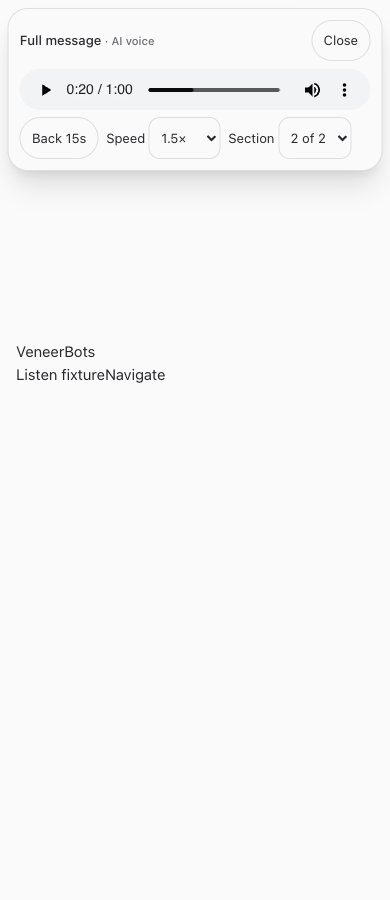

# Full-message audio playback

September 23, 2026

Completed bot responses now offer **Listen** beside Reply in the shared chat renderer used by Veneer and VeneerBots. The floating player survives navigation and provides native pause/seek controls, Back 15s within the current section, playback speed, section selection, and a locally saved position. Starting a live voice call closes the player.

The server resolves the original saved response, renders Markdown deterministically for speech, and labels table cells with their column names. It preserves prose, amounts, qualifications, lists, and code. It reads link labels and image descriptions rather than interpreting image pixels. Long messages are split without dropping text. Audio is generated on demand using the existing configured speech connection, cached per source and section, and served with byte-range support. Every request checks conversation access; archived/read-only chats can listen. No business action is approved by listening.

The shorter explanation remains the existing voice briefing option. This change defaults to reading the full message.

## Verification

- Root typecheck and production build passed.
- Full suite passed: 21 installer tests, 2,207 server tests (5 skipped), 852 web tests, and 40 browser-manager tests.
- Server tests cover real-message anchoring, unauthorized access, replay caching, concurrent generation coalescing, range seeking, invalid section requests, archived chats, and access revocation.
- Speech tests cover tables, qualifications, lists, code, image descriptions, and lossless long-message splitting.
- Isolated Chrome checks at desktop and mobile widths cover failure/retry, seek, speed, section switching, navigation, resume, Media Session seek handlers, and live-voice handoff. No production data or paid speech calls were used in these fixtures.
- Full and restricted employee guide discovery and search passed. Resumed-agent tests verify the new guidance arrives without changing frozen instructions.

Physical iPhone lock-screen, headphone, and uninterrupted background playback have not been verified. Media Session controls are registered where supported; device/browser restrictions still apply. Saved position depends on browser storage. First playback of each section requires the configured OpenAI voice connection.

## Mobile player fixture

## Changed files

- [server/src/bots/messageAudioRoutes.ts](/Users/archerclawdington/veneer-os/server/src/bots/messageAudioRoutes.ts)
- [server/src/bots/messageSpeech.ts](/Users/archerclawdington/veneer-os/server/src/bots/messageSpeech.ts)
- [server/src/bots/communicationRoutes.ts](/Users/archerclawdington/veneer-os/server/src/bots/communicationRoutes.ts)
- [server/src/bots/employeeAccess.ts](/Users/archerclawdington/veneer-os/server/src/bots/employeeAccess.ts)
- [server/src/db/migrations/0107_message_audio.sql](/Users/archerclawdington/veneer-os/server/src/db/migrations/0107_message_audio.sql)
- [server/src/featureGuide/catalog.ts](/Users/archerclawdington/veneer-os/server/src/featureGuide/catalog.ts)
- [web/src/components/MessageAudioPlayer.tsx](/Users/archerclawdington/veneer-os/web/src/components/MessageAudioPlayer.tsx)
- [web/src/components/VoiceProvider.tsx](/Users/archerclawdington/veneer-os/web/src/components/VoiceProvider.tsx)
- [web/src/main.tsx](/Users/archerclawdington/veneer-os/web/src/main.tsx)
- [web/src/screens/Chat.tsx](/Users/archerclawdington/veneer-os/web/src/screens/Chat.tsx)
- [server/test/messageSpeech.test.ts](/Users/archerclawdington/veneer-os/server/test/messageSpeech.test.ts)
- [server/test/botCommunication.test.ts](/Users/archerclawdington/veneer-os/server/test/botCommunication.test.ts)
- [server/test/instructionContext.test.ts](/Users/archerclawdington/veneer-os/server/test/instructionContext.test.ts)
- [web/src/components/MessageAudioPlayer.test.tsx](/Users/archerclawdington/veneer-os/web/src/components/MessageAudioPlayer.test.tsx)
- [scripts/message-audio-browser-check.mjs](/Users/archerclawdington/veneer-os/scripts/message-audio-browser-check.mjs)
- [scripts/bot-guide-browser-check.mjs](/Users/archerclawdington/veneer-os/scripts/bot-guide-browser-check.mjs)
- [docs/reports/message-audio/mobile.png](/Users/archerclawdington/veneer-os/docs/reports/message-audio/mobile.png)
