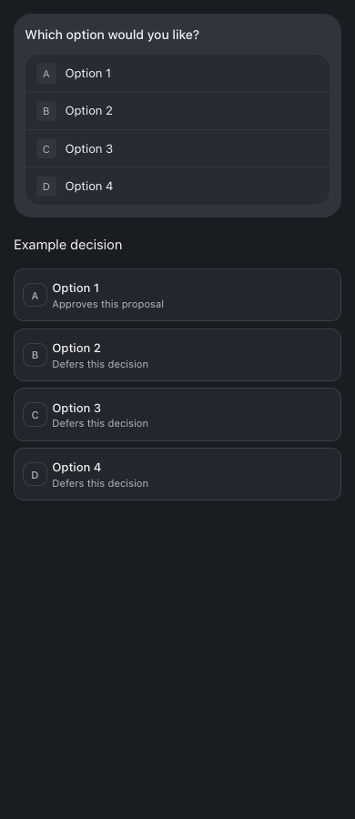
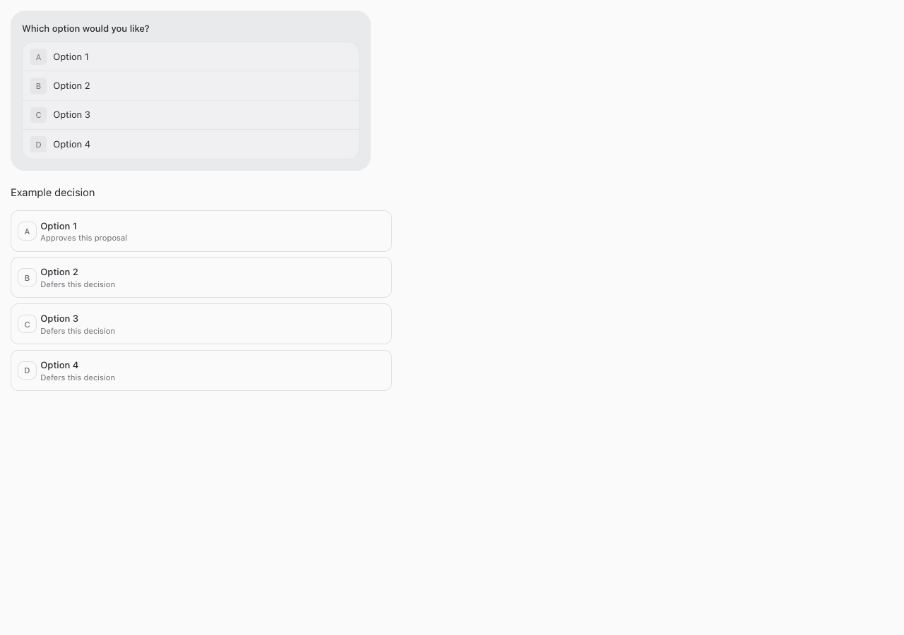

# Compact, one-tap question cards

Single-question, single-choice cards now submit directly on tap, Enter, or Space. There is no separate submit button. Cards use a compact 34rem maximum width, a muted bubble, joined rows and subtle dividers. Removed the Waiting for you heading. Option descriptions remain available for meaningful consequences; bot guidance asks for concise questions and omits redundant descriptions.

A synchronous request guard prevents duplicate taps. The card disables while sending, displays request errors for retry, and shows the confirmed answer after the server accepts it. Durable history remains authoritative. Multi-select, grouped questions and typed Other answers keep an explicit Send answer(s) button. Existing business approval scope and version checks are unchanged.

## Verification

Root typecheck and full tests passed. Isolated browser checks cover phone/desktop widths, keyboard one-tap submission, duplicate taps, failed-request retry, confirmed answer, all 32 multi-select options, typed Other, decision choice IDs, and overflow. Guide checks cover full/restricted access, current feature discovery and mobile layout. Production build passes before restart.

## Changed files

- [scripts/question-cards-browser-check.mjs](/Users/archerclawdington/veneer-os/scripts/question-cards-browser-check.mjs)
- [server/src/featureGuide/catalog.ts](/Users/archerclawdington/veneer-os/server/src/featureGuide/catalog.ts)
- [server/test/botFeatureGuide.test.ts](/Users/archerclawdington/veneer-os/server/test/botFeatureGuide.test.ts)
- [web/src/components/chat/QuestionCard.test.tsx](/Users/archerclawdington/veneer-os/web/src/components/chat/QuestionCard.test.tsx)
- [web/src/components/chat/QuestionCard.tsx](/Users/archerclawdington/veneer-os/web/src/components/chat/QuestionCard.tsx)
- [docs/reports/one-tap-cards/390.png](/Users/archerclawdington/veneer-os/docs/reports/one-tap-cards/390.png)
- [docs/reports/one-tap-cards/1280.png](/Users/archerclawdington/veneer-os/docs/reports/one-tap-cards/1280.png)
- [docs/reports/one-tap-cards/README.md](/Users/archerclawdington/veneer-os/docs/reports/one-tap-cards/README.md)
