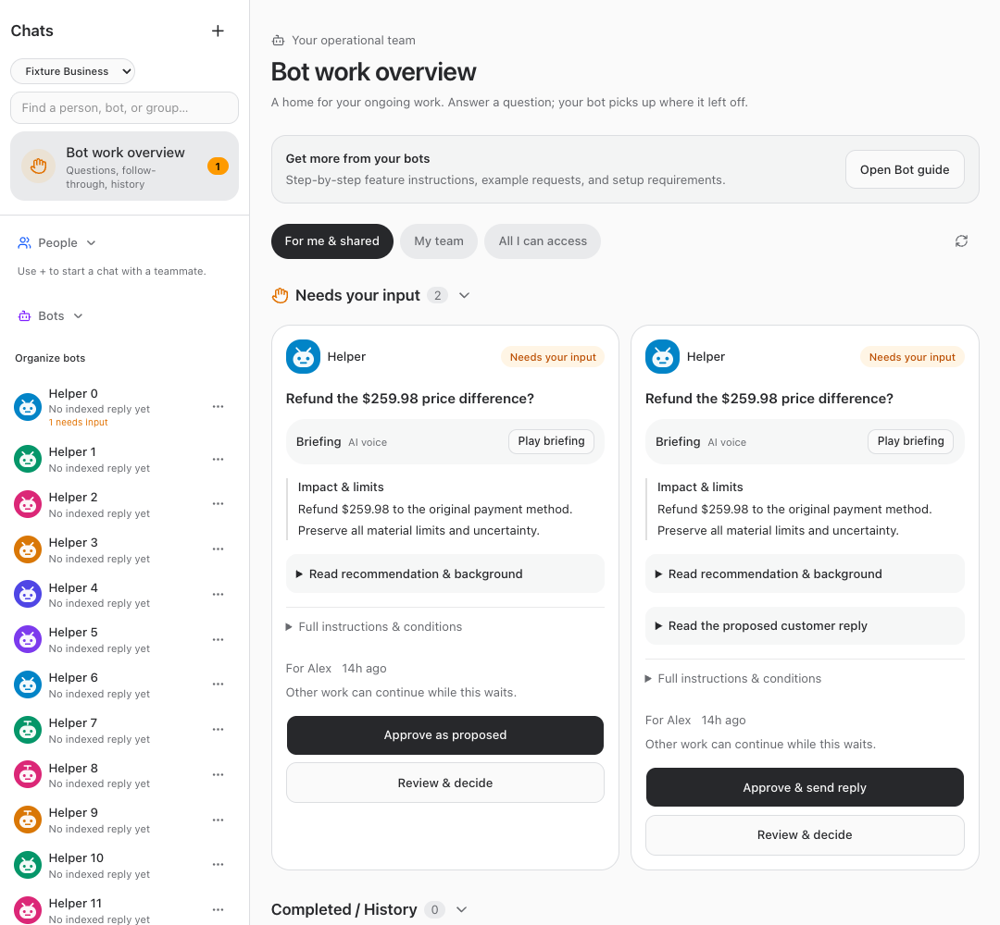
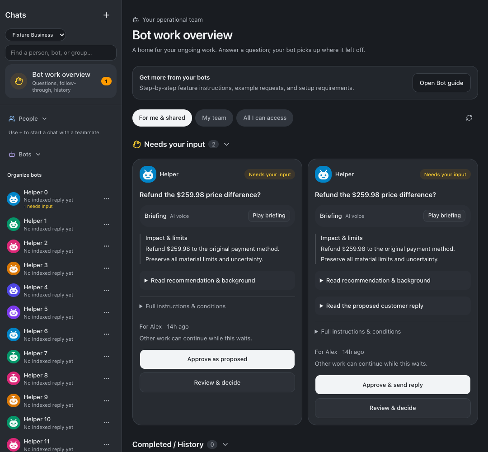
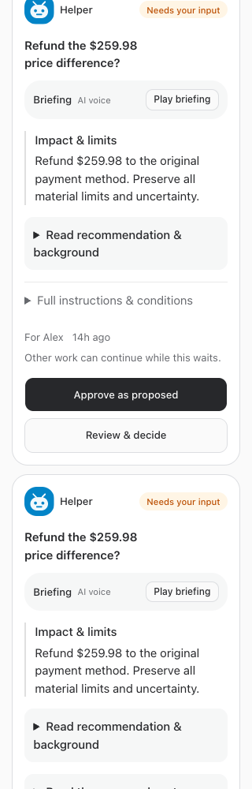

# Work overview and decision-card layout

Released September 23, 2026. Implementation: `1a73ffd`.

Bot work overview now sits directly below Search, above the scrolling People/Bots list. Its existing Needs input count and destination are preserved. Decision columns follow the available pane width, and action buttons wrap or stack inside each card with at least 44-pixel touch targets. Full labels, material amounts, approval confirmation, and existing authorization behavior remain intact.

## Verification

- Root typecheck, full test suite, and production build passed before restart: 2,216 server tests (5 skipped), 859 web tests, 40 browser-manager tests, and 21 installer tests. Build retained the existing bundle-size advisory.
- Isolated browser fixtures passed at 320, 375, 414, 768, 1080, 1280, 1440, and 1920 pixels in both themes, plus a 500-pixel resized work pane. Checked card action bounds, approval/send confirmation and cancel layouts, horizontal overflow, fixed overview position while scrolling, and its route. No real approvals, sends, or bot wakes; fixture mutations remained zero.
- Full and restricted employee guide fixtures passed, including mobile navigation. Live guide announcement and employee steps were verified after restart. Current bot instructions contain the new navigation guidance; the shared instructions context includes this catalog for resumed agents.
- Web, runner, terminal, browser manager, and app runner returned successful health/status responses after restart. Implementation was pushed to origin/main.

## Screenshots

## Changed files and evidence

- [web/src/components/BotConversationRail.tsx](/Users/archerclawdington/veneer-os/web/src/components/BotConversationRail.tsx)
- [web/src/screens/Bots.tsx](/Users/archerclawdington/veneer-os/web/src/screens/Bots.tsx)
- [server/src/featureGuide/catalog.ts](/Users/archerclawdington/veneer-os/server/src/featureGuide/catalog.ts)
- [scripts/overview-layout-browser-check.mjs](/Users/archerclawdington/veneer-os/scripts/overview-layout-browser-check.mjs)
- [docs/reports/overview-layout/README.md](/Users/archerclawdington/veneer-os/docs/reports/overview-layout/README.md)
- [docs/reports/overview-layout/guide/desktop.png](/Users/archerclawdington/veneer-os/docs/reports/overview-layout/guide/desktop.png)
- [docs/reports/overview-layout/guide/employee-mobile.png](/Users/archerclawdington/veneer-os/docs/reports/overview-layout/guide/employee-mobile.png)
- [docs/reports/overview-layout/overview-1080-dark.png](/Users/archerclawdington/veneer-os/docs/reports/overview-layout/overview-1080-dark.png)
- [docs/reports/overview-layout/overview-1080-light.png](/Users/archerclawdington/veneer-os/docs/reports/overview-layout/overview-1080-light.png)
- [docs/reports/overview-layout/overview-1280-dark.png](/Users/archerclawdington/veneer-os/docs/reports/overview-layout/overview-1280-dark.png)
- [docs/reports/overview-layout/overview-1280-light.png](/Users/archerclawdington/veneer-os/docs/reports/overview-layout/overview-1280-light.png)
- [docs/reports/overview-layout/overview-1440-dark.png](/Users/archerclawdington/veneer-os/docs/reports/overview-layout/overview-1440-dark.png)
- [docs/reports/overview-layout/overview-1440-light.png](/Users/archerclawdington/veneer-os/docs/reports/overview-layout/overview-1440-light.png)
- [docs/reports/overview-layout/overview-1920-dark.png](/Users/archerclawdington/veneer-os/docs/reports/overview-layout/overview-1920-dark.png)
- [docs/reports/overview-layout/overview-1920-light.png](/Users/archerclawdington/veneer-os/docs/reports/overview-layout/overview-1920-light.png)
- [docs/reports/overview-layout/overview-320-dark.png](/Users/archerclawdington/veneer-os/docs/reports/overview-layout/overview-320-dark.png)
- [docs/reports/overview-layout/overview-320-light.png](/Users/archerclawdington/veneer-os/docs/reports/overview-layout/overview-320-light.png)
- [docs/reports/overview-layout/overview-375-dark.png](/Users/archerclawdington/veneer-os/docs/reports/overview-layout/overview-375-dark.png)
- [docs/reports/overview-layout/overview-375-light.png](/Users/archerclawdington/veneer-os/docs/reports/overview-layout/overview-375-light.png)
- [docs/reports/overview-layout/overview-414-dark.png](/Users/archerclawdington/veneer-os/docs/reports/overview-layout/overview-414-dark.png)
- [docs/reports/overview-layout/overview-414-light.png](/Users/archerclawdington/veneer-os/docs/reports/overview-layout/overview-414-light.png)
- [docs/reports/overview-layout/overview-768-dark.png](/Users/archerclawdington/veneer-os/docs/reports/overview-layout/overview-768-dark.png)
- [docs/reports/overview-layout/overview-768-light.png](/Users/archerclawdington/veneer-os/docs/reports/overview-layout/overview-768-light.png)
