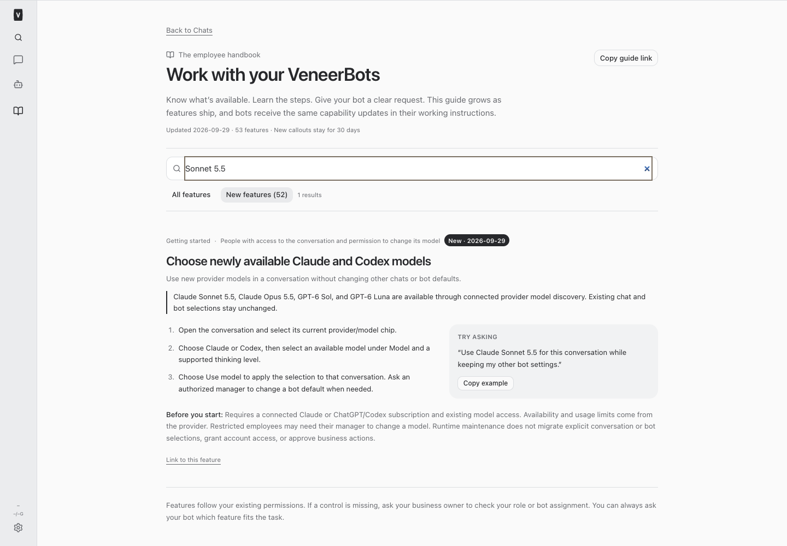
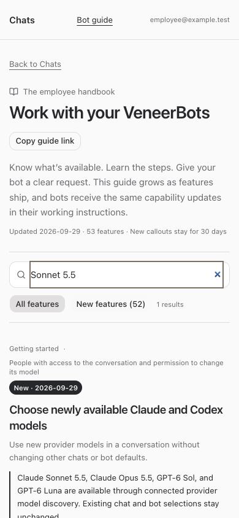

# Provider maintenance — September 29, 2026

Authorized recurring maintenance in active build slot #456 for standalone Veneer OS.

| Runtime | Previous | Installed and pinned |
| --- | --- | --- |
| Claude Code | 2.1.282 | 2.1.284 |
| Codex CLI | 0.157.0 | 0.159.0 |
| Grok (unchanged) | 1.0.5 | 1.0.5 |

Both affected providers were provisioned separately with `installer/provider-runtimes.mjs --service-home /Users/archerclawdington/veneer-pro-home --provider <provider>`. Configured service home was verified. Node 24.21.0 was used; the preexisting shell-default Node 22 missing-library issue was avoided without changing Homebrew.

## Release and account evidence

- [Claude 2.1.284](https://github.com/anthropics/claude-code/releases/tag/v2.1.284), [2.1.283](https://github.com/anthropics/claude-code/releases/tag/v2.1.283), and [official package metadata](https://registry.npmjs.org/@anthropic-ai%2Fclaude-code/latest). Reviewed stream, resumed-session, MCP and permission changes. Production latest is 2.1.284; the slower stable tag remains 2.1.277. This continues the prior exact-pinned production-latest policy.
- [Codex 0.159.0](https://github.com/openai/codex/releases/tag/rust-v0.159.0), [0.158.0](https://github.com/openai/codex/releases/tag/rust-v0.158.0), [official package metadata](https://registry.npmjs.org/@openai%2Fcodex/latest), and [OpenAI Docs changelog](https://learn.chatgpt.com/docs/changelog). Reviewed app-server pagination, tool/permission and transport fixes. Excluded 0.160 alpha releases.
- [Anthropic platform notes](https://platform.claude.com/docs/en/release-notes/overview) confirm Sonnet 5.5 availability and API migration details. Veneer uses the current Claude CLI for API request construction; no direct Messages API migration or dependency upgrade was needed.
- Fresh authenticated Anthropic `/v1/models` returned HTTP 200, 13 model IDs and no next page, including `claude-sonnet-5-5`. Added it to the existing allowlist and retained Sonnet 5 and every previous picker entry.
- Service-home Codex app-server `account/read` confirmed ChatGPT authentication. `model/list` returned GPT-6 Astra/Sol/Luna, GPT-5.6 Sol/Terra/Luna and GPT-5.5, supported effort levels, and no next page. No newly available OpenAI models. Its catalog reports GPT-5.5 retirement October 14; existing explicit selections remain untouched.
- No credential, chat, bot-default, unrelated provider, or unrelated dependency changes. Updated the shared guide announcement, employee instructions and current/resumed agent guidance for Sonnet 5.5.

## Verification

- Installed runtime verification matches all three exact pins.
- Live Sonnet 5.5 no-tool stream-json request returned successful `OK`; Codex Astra completed an ephemeral read-only app-server turn.
- Root typecheck and all 114 focused runtime, protocol, approval, model, guide and instruction tests passed. Initial test-fixture duplication and an old escaped version expectation were corrected before proceeding.
- Isolated desktop and restricted mobile browser checks passed for guide access, Sonnet search, dated new callout, setup/selection limits and viewport overflow. The initial direct-navigation fixture timed out during route initialization; the normal Chats-to-guide navigation passed for both roles. No production business data was used.
- Full `npm test` passed: 2,981 server tests (5 skipped), 909 web tests, 54 browser-manager tests, and the installer suite. Root production build passed with the existing nonfatal large-chunk warning.
- Deployment verification remains pending until the supported restart finishes.

## Rollback and recurring work

Retained [runtime-only rollback files](/Users/archerclawdington/veneer-pro-home/.local/lib/veneer-provider-runtimes/rollback-2026-09-29): prior Claude binary, complete prior `@openai` runtime packages including native dependency, and runtime policy. No credentials were copied. To roll back, obtain a build slot, revert only this maintenance change, provision the old exact pins through the supported installer with explicit service home/provider, and pass validation/build before restarting. Runtime copies provide an offline fallback.

Automation `7a7ea69b-12f1-46ee-9912-7c5cd79710ae` was verified enabled with cron `0 8 * * 2,5`, America/Indiana/Indianapolis. Next run October 2 at 08:00 local. No automation changes were made.

## Changed files

- [Runtime pins](/Users/archerclawdington/veneer-os/provider-runtimes.json)
- [Claude model discovery](/Users/archerclawdington/veneer-os/server/src/providers/claude/adapter.ts)
- [Employee and agent guide](/Users/archerclawdington/veneer-os/server/src/featureGuide/catalog.ts)
- [Runtime tests](/Users/archerclawdington/veneer-os/server/test/providerRuntimesProvisioner.test.ts)
- [Model and adapter tests](/Users/archerclawdington/veneer-os/server/test/approvalAdapter.test.ts)
- [Guide delivery tests](/Users/archerclawdington/veneer-os/server/test/botFeatureGuide.test.ts)
- [This report](/Users/archerclawdington/veneer-os/docs/reports/provider-maintenance-2026-09-29/README.md)
- [Desktop screenshot](/Users/archerclawdington/veneer-os/docs/reports/provider-maintenance-2026-09-29/desktop.png)
- [Mobile screenshot](/Users/archerclawdington/veneer-os/docs/reports/provider-maintenance-2026-09-29/employee-mobile.png)
