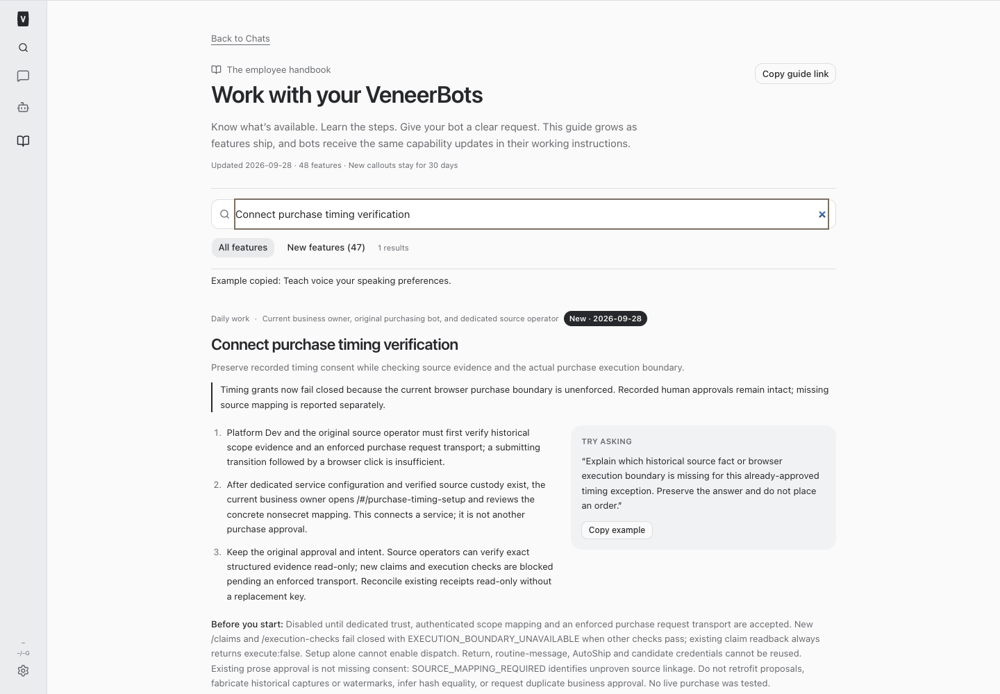
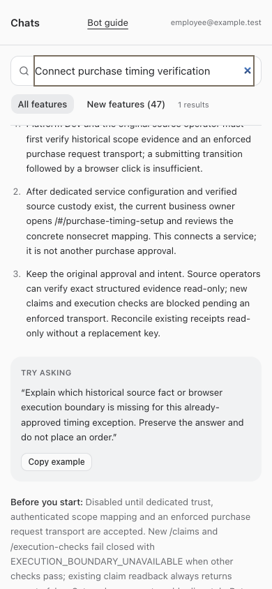

# Preserve timing consent without an unenforced browser grant

September 28, 2026 — build #408. **Native safety repair; purchase execution remains unavailable.** This build does not implement a vendor adapter, prove a historical source mapping, enroll trust, or complete the original purchase outcome.

## Findings and implemented change

Nicholas's native approval for decision `353b6bff-eb83-48fc-b3c8-93907e9b8ba6` v1 remains intact. Sage's retained acceptance reports approval at 13:32:26Z, source `4668f869-e306-414a-b3e1-ab85c6889440`, answer event `4eac6824-d1a3-4007-83b4-0c6db6c0c18c` and conversational event `6dd4b263-948b-40b0-9d36-e9ca352c2fd2`. Reported state is action_pending/current1/delivered1. No live native decision was queried or changed in this build. Missing implementation metadata is not missing human consent.

The original OrderOps owner independently reviewed the source and agreed to the narrow fail-closed repair at 14:13:55Z in coordination `c8873e9e-aed2-4abb-ae87-d44462618c74`. Initial source findings were read in bounded September 28 messages from `c76d37dc-8d52-4cdd-9a3f-7cd912298c93`; Boris coordination remains `9268c24c-f7da-4459-92b3-c6ad6e3d6c13`. No duplicate builder or source build was started.

The current source `transitionVendorOrderJob` acquires the order advisory lock and action row lock, verifies source guards, records submitting, then commits before returning. Sage performs the portal click afterward. Native `browser-manager/cdp-relay.mjs` forwards ordinary input/runtime/network commands; it does not mediate purchase requests. Viewer, background and alternate-session paths are not an enforced purchase boundary. Returning proof from the transition endpoint, keeping a button disabled, or extending a five-second TTL cannot fix this.

Implemented in the existing native service:

- New otherwise eligible `/claims` fail HTTP 409 `EXECUTION_BOUNDARY_UNAVAILABLE` **without inserting or consuming a claim**. No configuration flag or enrollment receipt can enable this path.
- `/execution-checks` likewise cannot return applicability success for a historical claim. Existing identity, expiry, revocation and current-scope checks remain; their denials may occur first.
- Exact historical claim replay and GET reconciliation remain available with `execute:false`, `reconciliation_only:true`. Original request/claim/expiry and durable duplicate constraints remain unchanged. No second intent or retry permission is created.
- The strict claim response schema now accepts only reconciliation responses. The old execution-check success schema is historical documentation, not a reachable success path.
- `/verify` remains read-only. Native answer provenance, immutable original proposal and current approver/evidence access are validated before reporting `SOURCE_MAPPING_REQUIRED` for a prose-only proposal. This distinguishes a recorded human answer from missing source linkage; it does not import a supplemental mapping or fabricate an answer watermark.
- Employee and resumed-agent guidance explicitly reports this boundary and preserves the no-repeat-approval requirement.

## Exact historical evidence gap and alternative

The retained Sage checkpoint identifies OO order `d174dc23-8e94-4e89-a893-74f86c393651`, Shopify order `6133102182552`, line `14708329545880`, SKU643922 ×1, 3090 USD cents and October 5 against September 23–25. It explicitly calls the original window source **mutable, not an immutable archive**. These are reported facts, not an authenticated source DTO. Unrelated Piper SKU2021124075/$6.80 is excluded from the timing scope.

| Binding needed | What has not been independently established |
|---|---|
| Order and line | Historical authoritative linkage between the approved v1 and the exact OO/Shopify order, line, SKU and quantity. IDs in a bot report are insufficient. |
| Material/action | Original material snapshot/fingerprint and action/proposal version linkage. Native proposal and source material hashes remain separate namespaces. |
| Checkout | Original cart/quote identity/version, actual amount/currency breakdown, destination binding and delivery estimate, including timezone. |
| Original delivery | Preserved original source values and their provenance; current mutable attributes cannot silently become historical evidence. |
| Executor | Authenticated mapping between native Sage, the source principal and vendor account. Source code names principal `veneer:11a95fb6-2915-4a78-88eb-cffce14e419a`; name/UUID similarity does not establish enrollment. |
| Chronology/context | Genuine evidence timestamps/version linkage and complete current human context. Native conversational audit retains source/full-context hashes, but does not supply missing source facts or the separate #406 watermark. |

**Concrete alternative consistent with the existing consent:** the original source custodian locates already-retained immutable OO evidence/action/receipt rows, contemporaneous Shopify webhook/audit snapshots, authenticated original browser captures or vendor quote records. Those records must establish each material fact and its linkage to the original native proposal/result before approval. A supplemental mapping can then be separately implemented as a new technical association referencing those originals, stamped with its actual creation time, preserving the proposal/version/answer unchanged. Fresh source observations must be separate and checked for drift; they cannot serve as fictional old snapshots. Full original human/result context must remain available and attributable, including human `actor_conversation_id:null` versus bot nonnull attribution. No keyword classification of consent is introduced.

No such complete retained binding was located by the source owner's bounded read-only review. Whether genuine records exist elsewhere remains unverified. The concrete next evidence step belongs to that custodian, not Nicholas. If a field cannot be recovered, report that field and keep the scope unresolved; do not replace the original approval, ask for another click, or declare a fresh observation historical. The narrow build cannot safely manufacture this missing evidence.

## Agreed execution design — not an implemented vendor contract

The original source owner found no supported source-to-native purchase-submit RPC, verified Lippert HTTP method/path/body contract, provider idempotency guarantee, or exhaustive request interception mechanism. No guessed endpoint or hypothetical bot tool is published as deployed.

The supported implementation direction requires all of the following, with the original source owner retaining its code:

1. **Source durable intent:** commit one immutable intent before any dispatch transaction. Bind original request key, existing action, native decision/version/proposal hash, source material/cart/receipt versions, account and exact executor. Unique decision/order/action associations prevent replacement attempts. Never put the only attempt record inside a transaction that could roll back after purchase.
2. **Native controlled browser transport:** prepare the browser without purchase authority. Bind the correct session/account/cart and actual purchase request bytes. Enforce at egress so generic click/CDP/runtime, viewer, redirects, workers/background requests and alternate available sessions cannot bypass it. A tool wrapper or CDP Fetch hook without lifecycle/bypass controls is insufficient. Discovering the actual transport requires authorized retained technical evidence or a separately scoped safe capture; this build makes no portal/cart call.
3. **Source dispatch under existing locks:** use a dedicated connection, acquire order/action locks in the existing order, revalidate payment/stock/holds/destination/duplicates and exact source material. Obtain fresh native approval applicability under dedicated trust immediately before dispatch. Keep locks while invoking the constrained boundary. Browser callbacks cannot reacquire and deadlock on those same locks. No navigation/cart preparation occurs after the short-lived grant.
4. **Durable native dispatch fence:** before any purchase bytes leave, commit an at-most-once attempt for that same intent. Release only the exact bound request while original expiry and current checks hold. Pause, service/browser restart, lost source lock, crash, expiry, material mutation, response loss or uncertain provider delivery cannot renew the fence or create a fresh grant. Automatic request/redirect retries are prohibited unless a verified provider contract makes them the same effect; none is established here.
5. **Read-only reconciliation:** preserve the same source/native intent and actual request/response provenance. Only independently verified provider confirmation can establish completion. No response, no matching history or a missing receipt is not proof of nonexecution. Without authoritative provider reconciliation, UNKNOWN may remain unresolved.

A source database lock does not freeze Shopify, vendor state or native human input and does not make the provider effect transactional. Acceptance must define the last native/source validation boundary and enforce expiry at outbound request release. No claim of atomic external effect or permanent revocation after dispatched bytes is made. The old five-second policy is not lengthened or advertised as sufficient by itself.

## Owners and legitimate setup

- Platform Dev retains native provenance, verifier and enforcing browser transport ownership.
- Original OrderOps owner `a4bc7b0c-e56a-4b90-b4bc-cb71cbc88e68` retains source evidence discovery, mappings, locks, durable source intent, non-timing gates and independent consumer acceptance.
- Boris retains incident follow-through and receives the deployed native contract and precise prerequisites.
- Sage remains sole business executor. No automatic operational resumption is authorized.

The previous presence-only deployment check found dedicated `VP_PURCHASE_TIMING_CF_AUD` and `VP_PURCHASE_TIMING_CLIENT_ID` absent; this build does not claim a fresh configuration probe. No enrollment receipt exists in this work. Dedicated Cloudflare service setup and authenticated source origin/account/principal/deployment/custody mapping must be prepared legitimately, without borrowing Return/Routine/AutoShip/candidate credentials. Only then can the actual signed-in owner review the concrete mapping through `/#/purchase-timing-setup`. This human-only service connection step is distinct from purchase consent. It is not requested now because the technical prerequisites are not concrete or accepted. Enrollment alone does not enable grants.

## Acceptance and validation

The following are separate acceptance layers; synthetic native tests do not certify a vendor effect.

| Requirement | Native validation / outstanding acceptance |
|---|---|
| Unchanged original-style consent | Genuine synthetic native conversational answer receives precise source-mapping denial; original proposal, answer, events and absent watermark remain unchanged. |
| Human versus bot, current ACL, version/hash/executor, revoked/superseded material | Existing native adversarial tests retained; source drift covers amount/currency/dates/timezone/order/line/SKU/quantity/material/cart/action/proposal versions. |
| Dedicated source authentication and strict wire shape | Service/JWT/setup tests plus real HTTP route tests with disposable SQLite; no production identity used. |
| First grant and historical UNKNOWN | Actual service and HTTP tests deny first grant with zero inserted claims; historical replay is false; execution check denied even with a fresh historical claim. |
| Pause/restart/crash/expiry/concurrent mutation | Durable two-connection/reopened-database and revocation/expiry tests preserve read-only history; no production dispatch path exists. Actual browser crash/pause/egress/lock-loss behavior is **not implemented or accepted**. |
| Provider response loss and no duplicate execution | Native emits no new execution grant; same-intent/alternate-key guards tested. Real provider reconciliation/at-most-once dispatch remains unverified pending the actual transport. |
| Historical evidence drift or incomplete history | Missing mapping fails closed; no source adapter exists to validate hypothetical historical records. Source acceptance must test incomplete/mutable/conflicting evidence against genuine retained artifacts before a supplemental mapping is enabled. |
| Non-timing guards | No OrderOps source changed. Its owner must independently verify payment/stock/hold/duplicate/action-lock guards at actual dispatch when integrating. |
| Employee and resumed delivery | Catalog contains dated announcement, steps, concrete example and setup limits; guide/instruction tests and synthetic full/restricted employee browser checks required. |

Root typecheck and 191 scoped tests passed. The expanded HTTP fixture initially exposed a duplicate test-local variable name, which was corrected before the passing run. The guide browser assertion was updated to the new boundary message; the final full/restricted employee browser run passed navigation, announcement, search, desktop/mobile overflow, refresh and failure recovery. Current instruction/catalog tests verify resumed-agent delivery. These screenshots show synthetic guide access, not production trust or purchase readiness.

Full root suite passed: 2,602 server tests (5 existing skips), 907 web tests, 42 browser-manager tests and 29 installer tests. Production build passed with the existing Vite bundle-size advisory. No restart occurred before all checks passed. Runtime verification follows deployment.

## Changed files

- [Native verifier](/Users/archerclawdington/veneer-os/server/src/bots/purchaseTiming.ts)
- [Strict schemas](/Users/archerclawdington/veneer-os/server/src/bots/purchaseTimingSchema.ts)
- [Native tests](/Users/archerclawdington/veneer-os/server/test/purchaseTiming.test.ts)
- [HTTP route tests](/Users/archerclawdington/veneer-os/server/test/purchaseTimingRoutes.test.ts)
- [Employee and agent catalog](/Users/archerclawdington/veneer-os/server/src/featureGuide/catalog.ts)
- [Synthetic guide browser checks](/Users/archerclawdington/veneer-os/scripts/bot-guide-browser-check.mjs)
- [Guide delivery tests](/Users/archerclawdington/veneer-os/server/test/botFeatureGuide.test.ts)
- [Deployed contract](/Users/archerclawdington/veneer-os/docs/purchase-timing-verifier.md)
- [Strict machine schemas](/Users/archerclawdington/veneer-os/docs/reports/purchase-timing/contract-schemas.json)
- [Release history](/Users/archerclawdington/veneer-os/docs/reports/purchase-timing/report.md)
- [Desktop guide screenshot](/Users/archerclawdington/veneer-os/docs/reports/purchase-timing/build408-guide-desktop.png)
- [Mobile guide screenshot](/Users/archerclawdington/veneer-os/docs/reports/purchase-timing/build408-guide-employee-mobile.png)
- [This investigation and acceptance report](/Users/archerclawdington/veneer-os/docs/reports/purchase-timing/build408.md)
