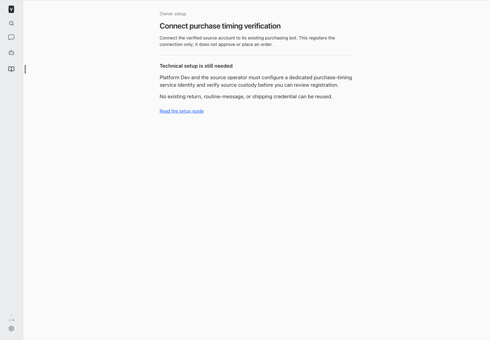
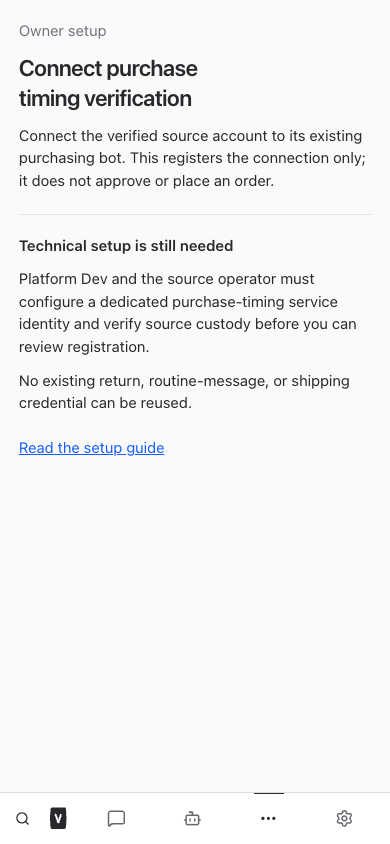
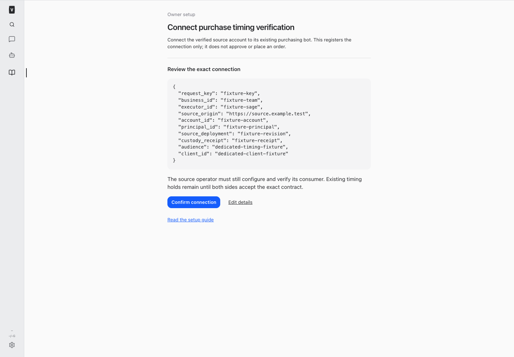
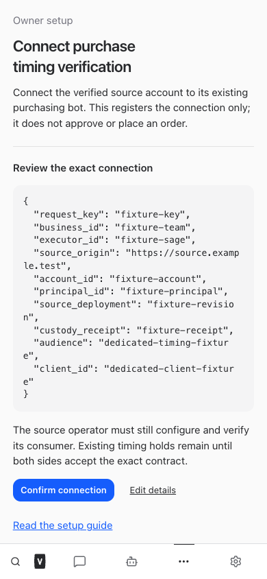

# Purchase timing verifier — build #406

Implementation is deployed in commit `faee01b`, pushed to `origin main`. This is a dedicated native verifier and owner setup flow, not an activated OrderOps consumer or an approval of the reference purchase.

The [versioned contract](../../purchase-timing-verifier.md) specifies methods, paths, strict schemas, exact binding rules, error codes, source execution boundaries, and UNKNOWN reconciliation. [Machine-readable schemas](./contract-schemas.json) are generated from the runtime schema definitions; semantic refinements are documented in the contract.

## Verified behavior

- A distinct Cloudflare Access service identity is required. Human/bot identity, development mode, mismatched service identity and configured cross-purpose credential reuse are rejected.
- Only the actual current business owner can review and enroll the exact source account/origin/principal/executor mapping. Stable registration keys and review hashes prevent conflicting setup; lost confirmation switches to read-only status retrieval.
- Authenticated source captures precede structured native timing proposals. Current native and source material hashes remain distinct. The exact scope includes order, Shopify/line/SKU/quantity, integer cents/currency, original/checkout delivery dates and timezone, source action, proposal/material/cart versions, fingerprint and expiry.
- Proof requires one genuine human answer, exact current approved-running native scope, current approver/evidence access, delivered answer, unchanged material evidence and no newer human instructions. Prose-only legacy approvals and bot-attributed answers are unsupported.
- Claims are durable and unique across the native decision and business/account/source order. A lost response never produces another `execute:true`. Original five-second expiry is nonrenewable. Current execution checks are transactional and read-only; source locks and every other business guard remain mandatory.
- No customer, order, approval, source trust, credential or live business record was changed during implementation. No operational purchase test was performed.

## Outstanding activation and case blockers

The nonsecret configuration-presence check found both `VP_PURCHASE_TIMING_CF_AUD` and `VP_PURCHASE_TIMING_CLIENT_ID` **absent**. This release does not configure or borrow them. There is no actual enrollment receipt.

Platform Dev and the original source custodian must first arrange the separate Cloudflare service application/client and verify the source deployment, account, principal, origin, custody receipt and original executor mapping. The actual signed-in business owner then reviews those concrete nonsecret values in `/#/purchase-timing-setup` and confirms the connection. This is a one-time trust setup step, not another business approval click. Source integration and independent acceptance under OrderOps locks remain with the original OrderOps owner through Boris.

The supplied reference decision v1 is unapproved and lacks this structured source-capture contract. It is not eligible based on the historical conversational reply alone. No live record was queried or retrofitted. Do not infer a scope, import consent, or request duplicate business approval to bypass that blocker. Sage retains sole source custody. Keep the greater-than-seven-day hold until actual authority, trust and consumer acceptance are established.

## Validation

- Root typecheck passed.
- Scoped server regressions: 189 passed, including 40 new verifier tests plus dedicated routing, legacy voice/discussion/conversational consent and guide/resumed-instruction tests.
- Synthetic browser checks passed on desktop/mobile: technical blocker, exact setup review, one confirmation, lost-response GET reconciliation, no horizontal overflow or page errors. A mobile scrolling issue and a label selector were corrected before the passing run.
- Full/restricted employee guide checks passed, including the dated setup announcement, search, mobile layout, refresh and failure recovery. Current instructions deliver the capability to resumed agents.
- A proposed DOM test was replaced with the existing isolated Playwright approach because this repository does not install jsdom. No dependency was added.
- Final full root suite passed: 2,600 server tests (5 existing skips), 907 web tests, 42 browser-manager tests and 29 installer tests. Production build passed. Commit `faee01b` was pushed to `origin main`. All five services restarted September 28 at 10:02 Eastern. The runner restart interrupted the turn after the other four services reported healthy; resumption verified all replacement processes and the supported health check: local web/runner healthy, public front door HTTP 302, four active tunnel connections. Authenticated public end-to-end chat and source consumer acceptance remain unverified. No second restart was needed.

All screenshots below are synthetic fixtures, not actual source setup or enrollment receipts.

### Current blocked setup state (synthetic fixture)

### Review flow after legitimate prerequisites (synthetic fixture)

## Changed files

- [Service and authorization](/Users/archerclawdington/veneer-os/server/src/bots/purchaseTiming.ts)
- [Strict schemas](/Users/archerclawdington/veneer-os/server/src/bots/purchaseTimingSchema.ts)
- [Service and owner routes](/Users/archerclawdington/veneer-os/server/src/bots/purchaseTimingRoutes.ts)
- [Dedicated identity](/Users/archerclawdington/veneer-os/server/src/identity/purchaseTimingVerifier.ts)
- [Immutable migration](/Users/archerclawdington/veneer-os/server/src/db/migrations/0127_purchase_timing_verifier.sql)
- [Native proposal/answer integration](/Users/archerclawdington/veneer-os/server/src/bots/service.ts)
- [Configuration](/Users/archerclawdington/veneer-os/server/src/config.ts)
- [Dedicated route mounting](/Users/archerclawdington/veneer-os/server/src/index.ts)
- [Authenticated setup mounting](/Users/archerclawdington/veneer-os/server/src/routes/api.ts)
- [Native proposal tool schema](/Users/archerclawdington/veneer-os/server/src/mcp/botTools.ts)
- [Capability catalog](/Users/archerclawdington/veneer-os/server/src/featureGuide/catalog.ts)
- [Verifier tests](/Users/archerclawdington/veneer-os/server/test/purchaseTiming.test.ts)
- [Route tests](/Users/archerclawdington/veneer-os/server/test/purchaseTimingRoutes.test.ts)
- [Employee/resumed guide tests](/Users/archerclawdington/veneer-os/server/test/botFeatureGuide.test.ts)
- [Setup screen](/Users/archerclawdington/veneer-os/web/src/screens/PurchaseTimingSetup.tsx)
- [App routing](/Users/archerclawdington/veneer-os/web/src/App.tsx)
- [Setup browser checks](/Users/archerclawdington/veneer-os/scripts/purchase-timing-browser-check.mjs)
- [Guide browser checks](/Users/archerclawdington/veneer-os/scripts/bot-guide-browser-check.mjs)
- [Environment documentation](/Users/archerclawdington/veneer-os/README.md)
- [Exact contract](/Users/archerclawdington/veneer-os/docs/purchase-timing-verifier.md)
- [Generated schemas](/Users/archerclawdington/veneer-os/docs/reports/purchase-timing/contract-schemas.json)
