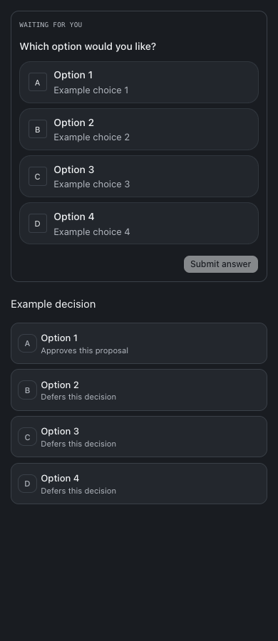
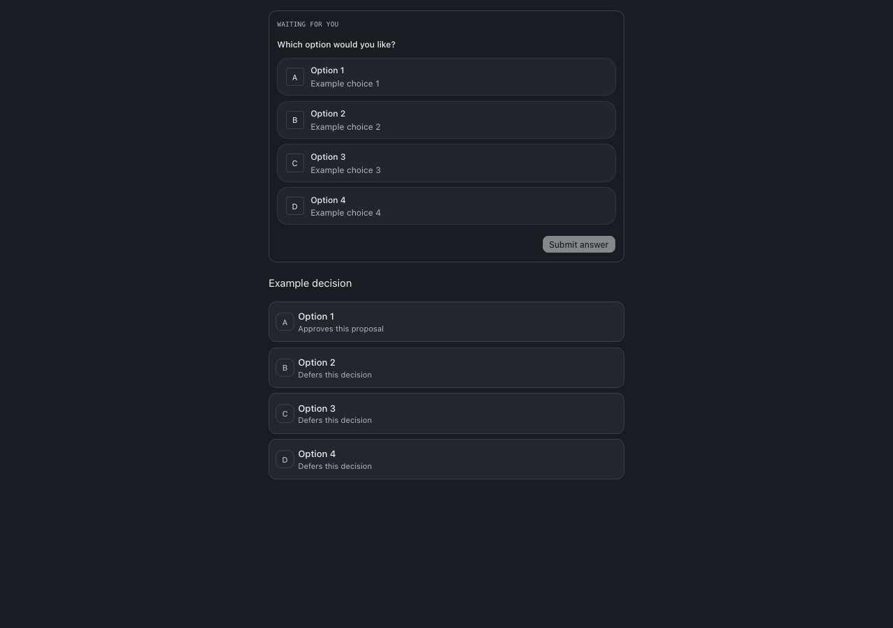

# Clickable question cards — September 25, 2026

Bots now receive explicit guidance to present ordinary choices through `ask_user` and business decisions through the existing versioned `proposal.choices` approval flow. The shared tool supports all providers. Existing chats receive the refreshed capability instructions on their next turn; existing plain-text messages are not retroactively changed.

Removed the six-choice approval cap and the 20-option question/answer caps, including the local Codex native-question adapter cap. Existing request size and per-field text limits remain. Question values must be nonempty and unique. Cards retain native keyboard controls, explicit submission, multi-selection, optional Other, recorded answers, and existing stale/duplicate decision guards. Badges beyond Z use their option number, and long labels wrap.

Use [the bot guide](/#/bot-guide?feature=question-cards) for employee steps and examples. The catalog also delivers these instructions to fresh and resumed agents without changing their fixed role snapshots.

## Verification

- Root `npm run typecheck`, full `npm test`, and `npm run build` passed with Node 24. The build reports its existing large-chunk advisory.
- Regression tests exercise 32 offered/answered choices, duplicate values and IDs, exact decision versions, idempotent decision answers, and fresh/resumed capability delivery.
- Isolated browser checks passed at 320, 390, and 1280 pixels: Yes/No, four and 32 choices, keyboard selection, explicit submission, disabled repeat submission, recorded answers, selecting all 32 options, final decision option ID, and horizontal overflow.
- Guide browser checks passed for full/restricted employees, desktop/mobile navigation, feature discovery, search, clipboard, refresh, expiration and failure recovery.
- Browser fixtures use mocked APIs and synthetic examples only. No customer records or approval states were changed.

## Changed files

- [scripts/bot-guide-browser-check.mjs](/Users/archerclawdington/veneer-os/scripts/bot-guide-browser-check.mjs)
- [server/src/bots/service.ts](/Users/archerclawdington/veneer-os/server/src/bots/service.ts)
- [server/src/featureGuide/catalog.ts](/Users/archerclawdington/veneer-os/server/src/featureGuide/catalog.ts)
- [server/src/mcp/agentToolsServer.ts](/Users/archerclawdington/veneer-os/server/src/mcp/agentToolsServer.ts)
- [server/src/mcp/botTools.ts](/Users/archerclawdington/veneer-os/server/src/mcp/botTools.ts)
- [server/src/providers/codexAppServer/adapter.ts](/Users/archerclawdington/veneer-os/server/src/providers/codexAppServer/adapter.ts)
- [server/src/routes/api.ts](/Users/archerclawdington/veneer-os/server/src/routes/api.ts)
- [server/test/botFeatureGuide.test.ts](/Users/archerclawdington/veneer-os/server/test/botFeatureGuide.test.ts)
- [server/test/bots.test.ts](/Users/archerclawdington/veneer-os/server/test/bots.test.ts)
- [server/test/instructionContext.test.ts](/Users/archerclawdington/veneer-os/server/test/instructionContext.test.ts)
- [server/test/questionManager.test.ts](/Users/archerclawdington/veneer-os/server/test/questionManager.test.ts)
- [web/src/components/DecisionChoices.tsx](/Users/archerclawdington/veneer-os/web/src/components/DecisionChoices.tsx)
- [web/src/components/chat/QuestionCard.test.tsx](/Users/archerclawdington/veneer-os/web/src/components/chat/QuestionCard.test.tsx)
- [web/src/components/chat/QuestionCard.tsx](/Users/archerclawdington/veneer-os/web/src/components/chat/QuestionCard.tsx)
- [scripts/question-cards-browser-check.mjs](/Users/archerclawdington/veneer-os/scripts/question-cards-browser-check.mjs)
- [docs/reports/question-cards/390.png](/Users/archerclawdington/veneer-os/docs/reports/question-cards/390.png)
- [docs/reports/question-cards/1280.png](/Users/archerclawdington/veneer-os/docs/reports/question-cards/1280.png)
- [docs/reports/question-cards/README.md](/Users/archerclawdington/veneer-os/docs/reports/question-cards/README.md)
