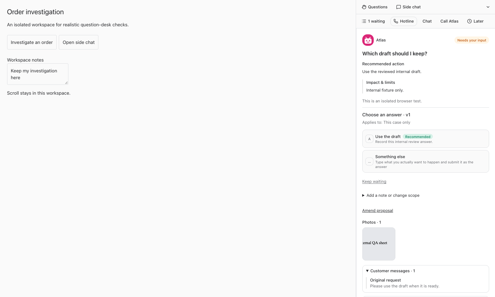
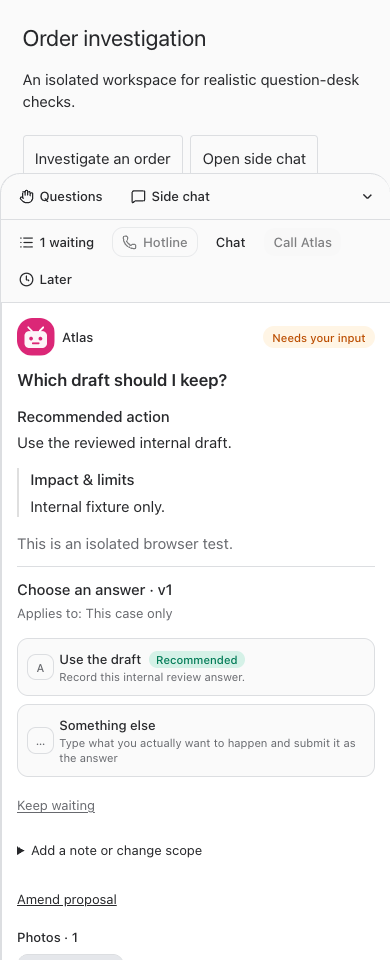

# Question desk and voice hotline — build 527

Prepared October 1, 2026. Launch is held for the owner's approval. No service restart, production migration, or replacement of live built assets has occurred.

## What changed

A quiet global raised-hand avatar and count expose accessible native bot decisions across projects. The line interleaves bots fairly. Desktop questions share a persistent resizing dock with Side chat; narrow screens use an expandable bottom panel. Navigation, collapse, and switching questions retain unfinished composers in this tab. The count opens a selectable waiting list. Answering removes the item and leaves the next arrival quiet.

Cards put the question, recommendation and actual answer choices first, then supplied photos, excerpts and records. Discussion stays attached to the original decision and owning bot. Later can move a question back or return it at a chosen local time, without recording a native answer. Stale versions and answers elsewhere retain the existing server checks.

A card can call its owning bot. The cross-bot hotline follows the same personal line, supports explicit spoken choices, follow-up discussion, skip, named-bot selection, displaying evidence, relative/absolute reminders, and ending the call. Each business answer uses its original decision owner, current version and native authorization. A server guard binds each hotline answer to a fresh complete caller utterance for the question/version selected at speech onset; the same utterance cannot answer another question. An answer recorded is distinct from work completed.

## Verification

- `npm run typecheck`: passed on the final source.
- Full `npm test`: passed — installer 29, server 3,282, web 968, browser manager 49; total **4,328 passed, 15 skipped**. Skipped tests are not represented as verified.
- `npm run build`: passed from an isolated staging copy with byte-identical application source and production configuration. The first staging attempt omitted the shared TypeScript base configuration; the staging copy was corrected and the build rerun successfully. The successful build retains the large-bundle warning.
- Real Chromium rendered the actual desk, decision, evidence and Side chat components at 320, 390, 768, 1,280 and 1,600 pixels. All five scenarios passed with no page errors or horizontal overflow. Checks include navigation/drafts, evidence image bytes and enlargement, discussion without approval, choosing out of order, Later/reminders, quiet advancement, Side chat drafts, voice entry/hangup, failed refresh recovery, answered-elsewhere removal and stale-version answer blocking.
- HTTP integration exercised the real question-line route and in-memory migrated SQLite: human-only access, user isolation, guessed-ID rejection and concurrent revision conflict. Native service tests cover bot fairness, reminders, current-version enforcement and permissions. Voice integration tests cover exact-owner routing, disabled arbitrary cross-bot dispatch, answer reconciliation and caller-utterance replay rejection. Existing call-failure/startup/disconnection and decision-lifecycle regressions passed in the full suite.
- Single-card **actual LiveKit/OpenAI audio** passed: synthesized speech edited the reply, separately approved the revised version, and produced one durable handoff with zero customer sends. Repeated real-audio hotline calls used fictional questions in an in-memory database; the final result is recorded in the verification artifact.
- Feature-guide tests verify employee availability and delivery of updated instructions to resumed agents.

Browser scenarios intercept all API requests with isolated fixtures. They are real rendering/interaction tests, not a claim of a signed-in production end-to-end run. Voice tests use real streaming providers with synthesized caller audio and fixture records; no real employees were messaged and no customer action or purchase was performed.

## Issues found and fixed during testing

- Prevented the voice model from reusing a previous question's approval after advancing the line.
- Made relative reminders use explicit minute durations rather than model-calculated timestamps.
- Accepted nullable optional voice tool arguments emitted by the realtime model.
- Retained per-question components so attachments and unfinished reply controls survive switching; suspended hidden polling and owned dictation safely.
- Prevented overlapping refreshes from starving the question line on slow connections.
- Kept live production assets untouched by moving the build into isolation.

## Concrete limits

This line contains authorized native bot decisions. Transient ordinary chat prompts, tool permission requests and credential forms keep their existing interfaces. Evidence is the evidence actually attached to a decision; the desk does not silently search connected systems. Voice requires the existing configured providers, microphone permission and owning-conversation access; shared card access alone does not grant access to its bot chat. Voice cannot inspect a photo from metadata.

Reminders reappear in the line when due; they do not generate push notifications. Drafts persist across navigation and collapse within this tab, not a browser reload or another device. Calls retain the existing approximately 50-minute voice/session limits; this is continuous queue review within those limits, not an unlimited call. Physical iOS/Android microphones, Safari backgrounding and a full-duration call soak were not exercised. Natural language may require clarification; test success is not a guarantee of perfect recognition.

## Launch handoff

After explicit launch approval, use a build slot, refresh the source and validation as needed, build the approved revision in the live checkout, then use the required root `npm run restart`. Apply the new migration through normal server startup and perform a bounded live health/UI check. Do not use this report as permission to execute customer work.

## Screenshots

Desktop and phone layouts shown with isolated fictional review data.

## Changed files and test artifacts

- [docs/bot-feature-guide.md](/Users/archerclawdington/veneer-os/docs/bot-feature-guide.md)
- [scripts/smoke-live-voice.mjs](/Users/archerclawdington/veneer-os/scripts/smoke-live-voice.mjs)
- [scripts/voice-reply-fixture.mjs](/Users/archerclawdington/veneer-os/scripts/voice-reply-fixture.mjs)
- [server/src/bots/employeeAccess.ts](/Users/archerclawdington/veneer-os/server/src/bots/employeeAccess.ts)
- [server/src/featureGuide/catalog.ts](/Users/archerclawdington/veneer-os/server/src/featureGuide/catalog.ts)
- [server/src/routes/api.ts](/Users/archerclawdington/veneer-os/server/src/routes/api.ts)
- [server/src/routes/liveVoice.ts](/Users/archerclawdington/veneer-os/server/src/routes/liveVoice.ts)
- [server/src/voice/service.ts](/Users/archerclawdington/veneer-os/server/src/voice/service.ts)
- [server/src/voice/worker.ts](/Users/archerclawdington/veneer-os/server/src/voice/worker.ts)
- [server/src/voice/workspace.ts](/Users/archerclawdington/veneer-os/server/src/voice/workspace.ts)
- [server/test/botFeatureGuide.test.ts](/Users/archerclawdington/veneer-os/server/test/botFeatureGuide.test.ts)
- [server/test/liveVoiceService.test.ts](/Users/archerclawdington/veneer-os/server/test/liveVoiceService.test.ts)
- [web/src/components/BotComposer.tsx](/Users/archerclawdington/veneer-os/web/src/components/BotComposer.tsx)
- [web/src/components/BotProposalSummary.tsx](/Users/archerclawdington/veneer-os/web/src/components/BotProposalSummary.tsx)
- [web/src/components/VoiceProvider.tsx](/Users/archerclawdington/veneer-os/web/src/components/VoiceProvider.tsx)
- [web/src/components/chat/ChatWorkspace.tsx](/Users/archerclawdington/veneer-os/web/src/components/chat/ChatWorkspace.tsx)
- [web/src/components/chat/SideChatPanel.tsx](/Users/archerclawdington/veneer-os/web/src/components/chat/SideChatPanel.tsx)
- [web/src/main.tsx](/Users/archerclawdington/veneer-os/web/src/main.tsx)
- [web/src/screens/Bots.tsx](/Users/archerclawdington/veneer-os/web/src/screens/Bots.tsx)
- [web/src/screens/LiveVoice.tsx](/Users/archerclawdington/veneer-os/web/src/screens/LiveVoice.tsx)
- [scripts/question-desk-browser-check.mjs](/Users/archerclawdington/veneer-os/scripts/question-desk-browser-check.mjs)
- [scripts/voice-hotline-fixture.mjs](/Users/archerclawdington/veneer-os/scripts/voice-hotline-fixture.mjs)
- [server/src/bots/questionLine.ts](/Users/archerclawdington/veneer-os/server/src/bots/questionLine.ts)
- [server/src/db/migrations/0145_question_line.sql](/Users/archerclawdington/veneer-os/server/src/db/migrations/0145_question_line.sql)
- [server/src/routes/questionLine.ts](/Users/archerclawdington/veneer-os/server/src/routes/questionLine.ts)
- [server/src/voice/hotline.ts](/Users/archerclawdington/veneer-os/server/src/voice/hotline.ts)
- [server/src/voice/hotlineConsent.ts](/Users/archerclawdington/veneer-os/server/src/voice/hotlineConsent.ts)
- [server/test/hotlineConsent.test.ts](/Users/archerclawdington/veneer-os/server/test/hotlineConsent.test.ts)
- [server/test/questionLine.test.ts](/Users/archerclawdington/veneer-os/server/test/questionLine.test.ts)
- [server/test/questionLineRoutes.test.ts](/Users/archerclawdington/veneer-os/server/test/questionLineRoutes.test.ts)
- [web/src/components/QuestionDesk.tsx](/Users/archerclawdington/veneer-os/web/src/components/QuestionDesk.tsx)
- [web/test/question-desk.html](/Users/archerclawdington/veneer-os/web/test/question-desk.html)
- [web/test/questionDeskHarness.tsx](/Users/archerclawdington/veneer-os/web/test/questionDeskHarness.tsx)
- [docs/reports/question-desk/build527/README.md](/Users/archerclawdington/veneer-os/docs/reports/question-desk/build527/README.md)
- [docs/reports/question-desk/build527/browser-results.json](/Users/archerclawdington/veneer-os/docs/reports/question-desk/build527/browser-results.json)
- [docs/reports/question-desk/build527/verification.json](/Users/archerclawdington/veneer-os/docs/reports/question-desk/build527/verification.json)
- [docs/reports/question-desk/build527/desk-320.png](/Users/archerclawdington/veneer-os/docs/reports/question-desk/build527/desk-320.png)
- [docs/reports/question-desk/build527/desk-390.png](/Users/archerclawdington/veneer-os/docs/reports/question-desk/build527/desk-390.png)
- [docs/reports/question-desk/build527/desk-768.png](/Users/archerclawdington/veneer-os/docs/reports/question-desk/build527/desk-768.png)
- [docs/reports/question-desk/build527/desk-1280.png](/Users/archerclawdington/veneer-os/docs/reports/question-desk/build527/desk-1280.png)
- [docs/reports/question-desk/build527/desk-1600.png](/Users/archerclawdington/veneer-os/docs/reports/question-desk/build527/desk-1600.png)
