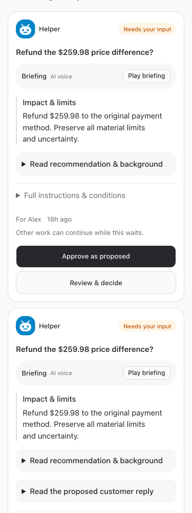
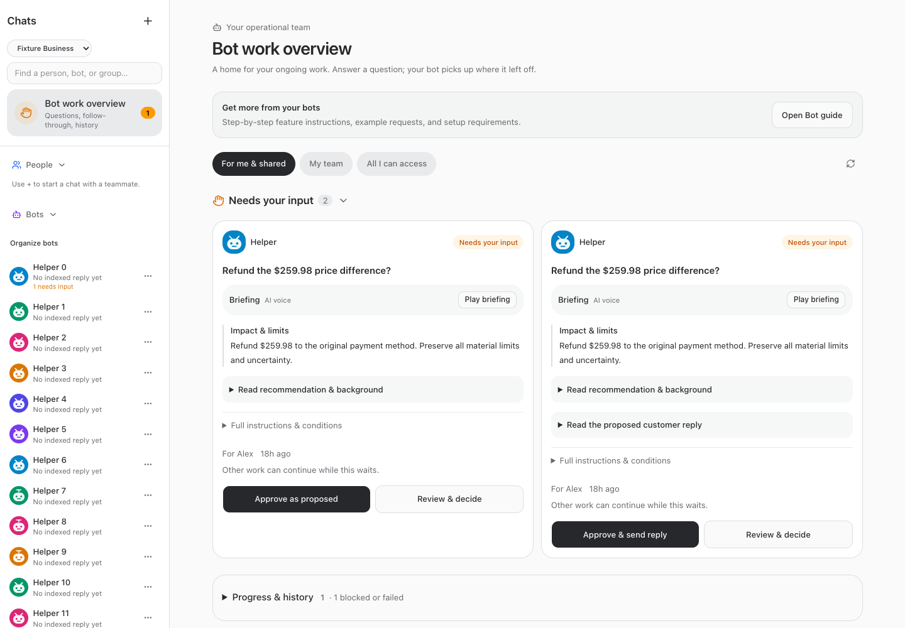

<!-- Hallmark · pre-emit critique: P5 H5 E4 S5 R5 V4. Existing tokens retained; one primary queue with secondary disclosure. -->
# One raised-hand queue

September 23, 2026 · BUILD256

Bot work overview now has one **Needs your input** queue. Answering lowers the hand through the existing decision lifecycle. **Progress & history**, closed by default, contains follow-through, deferred/rejected work, blockers and history. Its blocked/failed count remains visible while closed. No second “Needs attention” column competes for human attention.

Only explicit `needs_input` questions enter the primary queue; sidebar counts already use the same state. Approved technical failures remain tracked internally and visible in progress. A genuine new material question uses the existing versioned proposal revision or a distinct scoped decision. No automatic reapproval, completion, resumption of a human hold or rewriting of old approvals occurs. Older blockers with unclear next steps remain counted and inspectable; the UI does not infer a new question from prose.

## ERVP shared-answer addendum

Read-only inspection found that shared cards were already visible in the default “For me & shared” filter to eligible teammates despite comments or claims. Unresolved cards cannot be dismissed. The actual restriction was exclusive answering: another person's handler claim prevented an otherwise eligible teammate from answering.

A scoped configuration migration opts the existing seven ERVP shared bot queues into non-exclusive answering, bound to their verified native business ID `5bcfe66f-1bc1-46fb-bc8d-bdc217fe3d86`. It does not change private-chat access, business membership, approver eligibility, decision versions, existing claims or answers. Existing claimed cards are covered. Other businesses and non-opted queues retain exclusive handling. Moving a conversation to another business disables the scoped behavior.

Existing eligible humans may answer regardless of a previous handler. Current version and handling revision checks remain; competing answers serialize and only one valid answer records its actual human actor. Comments do not create visibility or approval grants. Existing owner/explicit employee access remains required; business membership alone is insufficient.

Read-only native identity checks found active Nicholas (ID 1, conversation owner) and Ali (ID 2, explicit access to six operational CS bots). The seventh shared queue has no Ali grant and is not newly shared with her. No native Mackenzie account was found: **Mackenzie access has not been verified or granted**. An owner must identify and provision the intended account through supported access management separately. No identity was guessed from a display name or screenshot. Synthetic tests use owner/staff/ungranted identities rather than altering real accounts.

## Verification

Scoped lifecycle tests verify both eligible teammates retain visibility after a claim/comment, non-granted business members cannot answer, unresolved dismissal fails, the actual answering staff actor is retained, competing answers fail, and a revised proposal raises exactly one new question while prior answer audit remains. Existing exclusive shared-queue tests remain unchanged and passing. Presentation tests cover all answer dispositions and technical states staying outside the input queue. Resumed-agent instructions describe the model.

Browser fixtures use mock APIs only, at 320/375/414/768/1080/1280/1440/1920 widths, light/dark themes. They verify the single queue, closed progress disclosure, retained blocker access, action containment, sidebar position and no horizontal overflow. Full/restricted guide discovery is verified separately. No customer, provider, approval, draft or bot-wake test traffic occurred.

## Changed files

- [Overview](/Users/archerclawdington/veneer-os/web/src/screens/Bots.tsx)
- [Decision API types](/Users/archerclawdington/veneer-os/web/src/lib/bots.ts)
- [Presentation tests](/Users/archerclawdington/veneer-os/web/src/lib/decisionPresentation.test.ts)
- [Decision service](/Users/archerclawdington/veneer-os/server/src/bots/service.ts)
- [Scoped queue migration](/Users/archerclawdington/veneer-os/server/src/db/migrations/0114_shared_cs_answers.sql)
- [Lifecycle tests](/Users/archerclawdington/veneer-os/server/test/bots.test.ts)
- [Resumed-instruction test](/Users/archerclawdington/veneer-os/server/test/instructionContext.test.ts)
- [Guide catalog](/Users/archerclawdington/veneer-os/server/src/featureGuide/catalog.ts)
- [Queue browser fixture](/Users/archerclawdington/veneer-os/scripts/raised-hands-browser-check.mjs)
- [Guide browser fixture](/Users/archerclawdington/veneer-os/scripts/bot-guide-browser-check.mjs)
- [This report](/Users/archerclawdington/veneer-os/docs/reports/raised-hands/README.md)

## Final checks

Root typecheck passed; full tests passed: 2,286 server (5 skipped), 865 web, 21 installer, 40 browser-manager. All sixteen overview width/theme fixtures and full/restricted guide fixtures passed. Production build completed before restart (existing bundle-size advisory only).

### Evidence files

- [guide/hands-desktop.png](/Users/archerclawdington/veneer-os/docs/reports/raised-hands/guide/hands-desktop.png)
- [guide/hands-employee-mobile.png](/Users/archerclawdington/veneer-os/docs/reports/raised-hands/guide/hands-employee-mobile.png)
- [overview-1080-dark.png](/Users/archerclawdington/veneer-os/docs/reports/raised-hands/overview-1080-dark.png)
- [overview-1080-light.png](/Users/archerclawdington/veneer-os/docs/reports/raised-hands/overview-1080-light.png)
- [overview-1280-dark.png](/Users/archerclawdington/veneer-os/docs/reports/raised-hands/overview-1280-dark.png)
- [overview-1280-light.png](/Users/archerclawdington/veneer-os/docs/reports/raised-hands/overview-1280-light.png)
- [overview-1440-dark.png](/Users/archerclawdington/veneer-os/docs/reports/raised-hands/overview-1440-dark.png)
- [overview-1440-light.png](/Users/archerclawdington/veneer-os/docs/reports/raised-hands/overview-1440-light.png)
- [overview-1920-dark.png](/Users/archerclawdington/veneer-os/docs/reports/raised-hands/overview-1920-dark.png)
- [overview-1920-light.png](/Users/archerclawdington/veneer-os/docs/reports/raised-hands/overview-1920-light.png)
- [overview-320-dark.png](/Users/archerclawdington/veneer-os/docs/reports/raised-hands/overview-320-dark.png)
- [overview-320-light.png](/Users/archerclawdington/veneer-os/docs/reports/raised-hands/overview-320-light.png)
- [overview-375-dark.png](/Users/archerclawdington/veneer-os/docs/reports/raised-hands/overview-375-dark.png)
- [overview-375-light.png](/Users/archerclawdington/veneer-os/docs/reports/raised-hands/overview-375-light.png)
- [overview-414-dark.png](/Users/archerclawdington/veneer-os/docs/reports/raised-hands/overview-414-dark.png)
- [overview-414-light.png](/Users/archerclawdington/veneer-os/docs/reports/raised-hands/overview-414-light.png)
- [overview-768-dark.png](/Users/archerclawdington/veneer-os/docs/reports/raised-hands/overview-768-dark.png)
- [overview-768-light.png](/Users/archerclawdington/veneer-os/docs/reports/raised-hands/overview-768-light.png)

## Deployment and remaining access limit

Implementation **4452251** committed/pushed; root restart followed all passing checks. Read-only post-restart health checks returned 200 for web, runner, app-runner, terminal and browser-manager. The live opt-in table contains exactly seven queues, all bound to the verified ERVP business. Deployed guide New entry and resumed instructions are present.

Live read-only service checks: Nicholas sees 12 current opted-in raised hands, all answerable. Ali sees one, answerable. **The other 11 cards fail existing evidence-conversation access checks across five source chats**, not handler ownership or comment filtering. This build deliberately does not bypass those evidence ACLs or grant access to private source chats. Full identical visibility across the requested humans is therefore **not yet achieved**: the owner must resolve legitimate source-evidence access for Ali and identify/provision Mackenzie's native account through supported access management. The UI simplification and claim-exclusivity repair are deployed; they are not a claim that all teammate access is now configured. No live decision was answered, revised, dismissed or otherwise mutated during verification.
