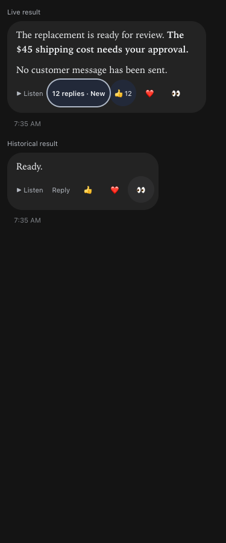
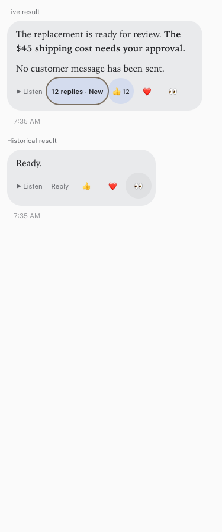

# Result actions inside message cards

September 23, 2026 · Build queue 220

Listen, Reply/reply counts/unread indicators, and reactions now share a compact wrapping footer inside the associated rounded result card. Both live React rows and frozen historical rows use the same renderer and unchanged delegated action anchors. Message quoting remains limited to the text; timestamp/token metadata and citation behavior remain intact. Explicit 44-pixel touch targets work independently of the app’s base font size, with visible keyboard focus and existing selected/loading behavior.

The employee guide and bot-facing instructions now describe the controls inside the card. This preserves the full-message audio player shipped in build 219 and the employee messaging feature from build 218.

## Verification

Focused transcript-freezing, message-selection, and response-metadata checks passed (14 tests). An isolated browser fixture renders the actual production row, including static HTML, at 320/375/414/768/1280 pixels in dark and light themes. It checks card containment, 44-pixel targets, delegated button anchors, text-only quote boundaries, keyboard focus, long unread/reply counts, selected reactions, and page overflow. No real messages, reactions, audio generation, or business actions were performed.

Root typecheck, full tests, and production build passed: 2,207 server tests (5 skipped), 852 web tests, 40 browser-manager tests, and 21 installer tests. Vite retains its existing large-chunk advisory; the build succeeds.

## Release

Pending production build and restart verification.

## Changed files

- [web/src/screens/Chat.tsx](/Users/archerclawdington/veneer-os/web/src/screens/Chat.tsx)

- [server/src/featureGuide/catalog.ts](/Users/archerclawdington/veneer-os/server/src/featureGuide/catalog.ts)

- [scripts/result-card-footer-browser-check.mjs](/Users/archerclawdington/veneer-os/scripts/result-card-footer-browser-check.mjs)

- [docs/reports/result-card-footer/dark-1280.png](/Users/archerclawdington/veneer-os/docs/reports/result-card-footer/dark-1280.png)

- [docs/reports/result-card-footer/dark-320.png](/Users/archerclawdington/veneer-os/docs/reports/result-card-footer/dark-320.png)

- [docs/reports/result-card-footer/dark-375.png](/Users/archerclawdington/veneer-os/docs/reports/result-card-footer/dark-375.png)

- [docs/reports/result-card-footer/dark-414.png](/Users/archerclawdington/veneer-os/docs/reports/result-card-footer/dark-414.png)

- [docs/reports/result-card-footer/dark-768.png](/Users/archerclawdington/veneer-os/docs/reports/result-card-footer/dark-768.png)

- [docs/reports/result-card-footer/light-1280.png](/Users/archerclawdington/veneer-os/docs/reports/result-card-footer/light-1280.png)

- [docs/reports/result-card-footer/light-320.png](/Users/archerclawdington/veneer-os/docs/reports/result-card-footer/light-320.png)

- [docs/reports/result-card-footer/light-375.png](/Users/archerclawdington/veneer-os/docs/reports/result-card-footer/light-375.png)

- [docs/reports/result-card-footer/light-414.png](/Users/archerclawdington/veneer-os/docs/reports/result-card-footer/light-414.png)

- [docs/reports/result-card-footer/light-768.png](/Users/archerclawdington/veneer-os/docs/reports/result-card-footer/light-768.png)

- [docs/reports/result-card-footer/report.md](/Users/archerclawdington/veneer-os/docs/reports/result-card-footer/report.md)
