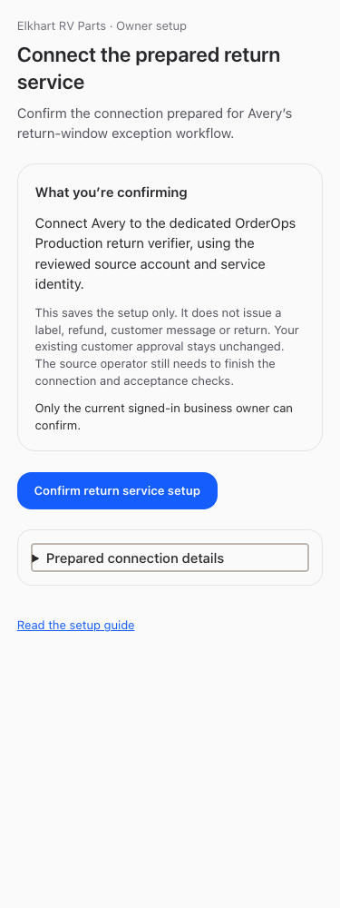
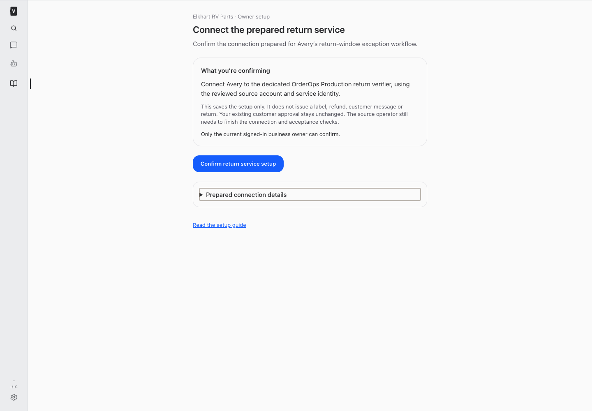

# Prepared return service — owner confirmation

Native authenticated page: https://nicksworld.dev/#/return-service-setup

Nick signs in to his own Veneer session, reviews the short setup boundary, and selects **Confirm return service setup**. No Console, credentials pasted into chat, or technical configuration is required. Only the actual current business owner may confirm. The page is not an unauthenticated published app.

## Exact registration and custody

The original prepared package was read from `/Users/archerclawdington/veneer-pro-home/deliverables/return-owner-enrollment`. Its manifest and payload are preserved in the reviewed server source. The stable request key remains `source-registration-v1:c28b73b20547509d8051610f92fcb2a71a7e8b892ead382490fb0429f3348428`. The canonical manifest hash is checked at use, and a separate review hash binds the full manifest plus payload. No new account identifier, service identity, historical authority or customer approval is inferred.

This is the NEW source account `orderops-return-source-69e9dfad-41d3-4154-b970-169bf4508d26`, pinned to the original Railway project/environment/service/origin boundary, dedicated return service and Avery principal evidence. The evidence's September 23 timestamp remains explicit; it is not presented as a fresh credential check. Runtime tuple enforcement remains the source consumer's responsibility. The original preparation files are unchanged; their Console action is superseded by the native page.

## Supported contract

- `GET /api/bot-communication/return-exception/setup`: current-human-owner-only, no-store review/status. Checks active native identity, current business ownership, active Avery registration/business/owner and exact configured dedicated audience/client. Returns only the pinned nonsecret package, review hash, status and existing nonsecret receipt. No enrollment on read.
- `POST` to the same path accepts only `{review_hash, confirm:true}`. It rechecks all gates in an immediate transaction and calls the existing owner enrollment service with the server-pinned payload. Client-provided account/scope fields are rejected. Exact existing registration returns the same receipt; alternate-key/conflicting registrations fail closed. Revoked records cannot be reactivated here.
- A missing/failed response is shown as uncertain. The next UI action is **Check registration status**, a GET, not another POST. A successful check returns either the existing receipt or confirmed absence, after which the same stable-key confirmation can be deliberately retried. No new key is generated. SQLite uniqueness/transactionality and the existing immutable trust triggers preserve one registration.

Successful setup surfaces `trust_id`, owner, account, original request key and timestamp. The source custodian a4bc7b0c-e56a-4b90-b4bc-cb71cbc88e68 receives the actual receipt for separate exact `OO_RETURN_VERIFIER_TRUST_ID` injection. Grant independently accepts the configured path before the original executor resumes. The page does not inject source configuration, map/claim/submit a return, generate a label/refund/message, or authorize routine messages.

## Validation

Synthetic SQL fixtures cover pinned package integrity, no effects on GET, identical retry/lost-response reconciliation, immutable trust, bots/nonowners/inactive identities, revoked executor, changed configuration/ownership, stale review hash, injected scope, revoked registration and alternate-key conflict. Existing return verifier tests retain mapping/claim/revocation/unknown-effect guards.

Synthetic full-app browser fixtures cover desktop/mobile, light/dark, keyboard/tap disclosure, no automatic POST, exact request body, normal success, lost POST response followed by read-only reconciliation, reload, owner denial, receipt readability and no horizontal overflow. No production enrollment or business actions were tested.

## Changed files

- [Prepared exact package](/Users/archerclawdington/veneer-os/server/src/bots/preparedReturnRegistration.ts)
- [Owner setup service](/Users/archerclawdington/veneer-os/server/src/bots/returnOwnerSetup.ts)
- [Authenticated routes](/Users/archerclawdington/veneer-os/server/src/bots/communicationRoutes.ts)
- [Owner page](/Users/archerclawdington/veneer-os/web/src/screens/ReturnOwnerSetup.tsx)
- [Native navigation route](/Users/archerclawdington/veneer-os/web/src/App.tsx)
- [Employee and bot guide](/Users/archerclawdington/veneer-os/server/src/featureGuide/catalog.ts)
- [SQL fixture tests](/Users/archerclawdington/veneer-os/server/test/returnOwnerSetup.test.ts)
- [Isolated browser fixture](/Users/archerclawdington/veneer-os/scripts/return-owner-setup-browser-check.mjs)

Root typecheck, full npm test and production build passed before deployment: server 2,431 passed / 5 existing skipped, web 880, browser-manager 40, installer 21. Full/restricted guide browser checks passed; catalog/instruction tests verify new and resumed bot guidance. The production build retains its existing bundle-size advisory.
