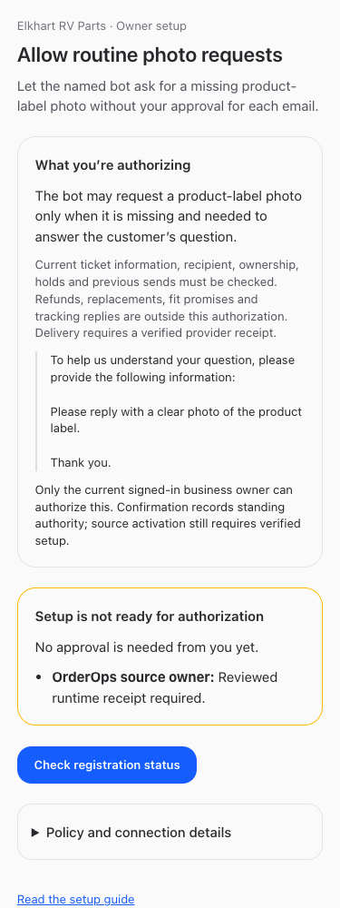

# Routine customer reply delivery — BUILD339

September 25, 2026. Platform preparation is implemented; **customer sending is not yet enabled**. The existing OrderOps owner retains BUILD340 source integration. No policy, trust, customer draft, send claim or customer message was created by this platform rollout.

## Implemented

- Dedicated Cloudflare Access service identity and path for `/api/routine-message/verifier/*`, with a Service Auth policy allowing only its own token. The actual nonsecret receipt is [provisioned.json](./provisioned.json). Existing return, AutoShip and human applications were preserved. Credentials were sent directly into approved `ervp/prd` storage; only nonsecret audience/client identifiers were added to protected native configuration.
- Native owner setup at [Routine reply setup](https://nicksworld.dev/#/routine-reply-setup), displaying the exact message and standing policy. Incomplete source evidence leaves confirmation unavailable and names its technical owner. Source evidence remains deliberately null until the custodian supplies reviewed deployment/runtime and current executor receipts.
- Once preparation is complete, one genuine owner confirmation atomically enrolls the photo-only policy and exact source trust. An interrupted response is reconciled by GET; identical requests do not create new authority. Bots/nonowners, stale reviews, changed scope, revocation, conflicting registrations and overlapping active policies are rejected.
- Optional `missing_information_fields` on policy enrollment restricts native capture and subsequent revalidation. This prepared policy permits only `product_label_photo`. Existing policy snapshots remain unchanged. Source contracts and scopes are unchanged.
- Retired-draft presentation explicitly says that no message was sent and the customer case is not resolved. The owning source bot must verify any independent reply or preserve the outstanding request. No customer record is automatically closed, reopened or re-sent.
- Employee guide and resumed-agent instructions describe the setup and activation limits. [Guide](https://nicksworld.dev/#/bot-guide?feature=routine-owner-setup).

## Remaining activation sequence

1. Existing source owner completes BUILD340 and returns deployed artifact digest, exact runtime connection, schema adoption and own current executor/custody receipts. Dedicated `OO_ROUTINE_VERIFIER_ORIGIN`, `CF_AUD`, `CF_CLIENT_ID`, `CF_CLIENT_SECRET` are available in `ervp/prd`; storage alone does not prove runtime installation. No fake policy/trust identifiers may be injected.
2. Platform verifies those receipts and completes the reviewed source packet. Genuine owner reviews the exact ready setup and confirms. No owner submit is requested while prerequisites are incomplete.
3. Source owner installs the actual policy/trust receipts and verifies runtime behavior. Existing native hold scope obligations may need genuine owner review against complete source evidence; setup cannot silently classify or clear them.
4. Named executor handles an eligible new ticket under fresh source checks. Completion requires actual provider SENT readback and zero duplicate effects. Old tickets with incomplete send history remain separate reconciliation work. Factual tracking and broader categories remain disabled.

## Verification

- Server fixtures exercise atomic policy/trust enrollment, lost-response recovery, bots/nonowners and changed ownership, incomplete configuration/source/executor, stale review, injected scope, trust/policy revocation, rollback, overlapping policies and conflicts with broader legacy policy.
- Routine execution fixtures reject a source request for another field under photo-only authority; existing race, hold, stale material, duplicate, unknown-effect and provider-readback tests pass.
- Synthetic browser checks cover desktop/mobile, light/dark, keyboard use, blocked setup, no automatic POST, exact confirmation, lost-response GET recovery, refresh, owner denial, receipts and overflow. They do not enroll a real owner.
- Full/restricted employee guide checks cover feature discovery, search, navigation, release aging, refresh and failure recovery. Instruction-context regression verifies resumed-agent delivery.
- Fresh read-only native metadata: current business owner active; zero routine policies and zero routine source trusts for ERVP before activation.

## Operator references

Provisioning used the existing bounded workflow and checked [Cloudflare service-token documentation](https://developers.cloudflare.com/api/resources/zero_trust/subresources/access/subresources/service_tokens/methods/create/). Provisioning refuses existing named resources rather than rotating them. An uncertain mutation requires metadata reconciliation; no automatic retry or new key. The source credential is never included in reports.

Final checks, restart, transport readback and changed-file links are appended below.

## Platform release verification

Root typecheck passed. Full suite: server 2,490 passed / 5 skipped; web 896 passed; browser-manager 40 passed; installer 29 passed. Production build passed (existing large-chunk warning only). All five services restarted successfully through root `npm run restart`; local web/runner health and public Access front door were healthy.

Post-restart public synthetic GET checks:

| Identity/path | Result |
| --- | --- |
| Dedicated routine service → routine synthetic absent draft | Native 404 `Routine authorization not found` (authentication succeeded) |
| Return service → routine | 401 |
| AutoShip service → routine | 401 |
| No identity → routine | 401 |
| Invalid human JWT → routine | 401 |
| Routine service → return | 401 |
| Routine service → AutoShip | 403 |

These checks use only an absent synthetic authorization ID; no customer capture or claim is used. A 404 after dedicated authentication establishes transport connectivity, not enrollment or delivery. Final source receipts and actual owner enrollment remain outstanding.

## Changed files

- [scripts/bot-guide-browser-check.mjs](/Users/archerclawdington/veneer-os/scripts/bot-guide-browser-check.mjs)
- [scripts/routine-owner-setup-browser-check.mjs](/Users/archerclawdington/veneer-os/scripts/routine-owner-setup-browser-check.mjs)
- [server/src/bots/communicationRoutes.ts](/Users/archerclawdington/veneer-os/server/src/bots/communicationRoutes.ts)
- [server/src/bots/csDraftState.ts](/Users/archerclawdington/veneer-os/server/src/bots/csDraftState.ts)
- [server/src/bots/preparedRoutineRegistration.ts](/Users/archerclawdington/veneer-os/server/src/bots/preparedRoutineRegistration.ts)
- [server/src/bots/routineOwnerSetup.ts](/Users/archerclawdington/veneer-os/server/src/bots/routineOwnerSetup.ts)
- [server/src/bots/routineExecution.ts](/Users/archerclawdington/veneer-os/server/src/bots/routineExecution.ts)
- [server/src/bots/routinePolicies.ts](/Users/archerclawdington/veneer-os/server/src/bots/routinePolicies.ts)
- [server/src/featureGuide/catalog.ts](/Users/archerclawdington/veneer-os/server/src/featureGuide/catalog.ts)
- [server/test/botFeatureGuide.test.ts](/Users/archerclawdington/veneer-os/server/test/botFeatureGuide.test.ts)
- [server/test/instructionContext.test.ts](/Users/archerclawdington/veneer-os/server/test/instructionContext.test.ts)
- [server/test/routineExecution.test.ts](/Users/archerclawdington/veneer-os/server/test/routineExecution.test.ts)
- [server/test/routineOwnerSetup.test.ts](/Users/archerclawdington/veneer-os/server/test/routineOwnerSetup.test.ts)
- [web/src/App.tsx](/Users/archerclawdington/veneer-os/web/src/App.tsx)
- [web/src/components/BotCommunication.tsx](/Users/archerclawdington/veneer-os/web/src/components/BotCommunication.tsx)
- [web/src/screens/RoutineOwnerSetup.tsx](/Users/archerclawdington/veneer-os/web/src/screens/RoutineOwnerSetup.tsx)
- [docs/reports/routine-delivery-rollout/README.md](/Users/archerclawdington/veneer-os/docs/reports/routine-delivery-rollout/README.md)
- [docs/reports/routine-delivery-rollout/check_transport.py](/Users/archerclawdington/veneer-os/docs/reports/routine-delivery-rollout/check_transport.py)
- [docs/reports/routine-delivery-rollout/guide/routine-setup-desktop.png](/Users/archerclawdington/veneer-os/docs/reports/routine-delivery-rollout/guide/routine-setup-desktop.png)
- [docs/reports/routine-delivery-rollout/guide/routine-setup-employee-mobile.png](/Users/archerclawdington/veneer-os/docs/reports/routine-delivery-rollout/guide/routine-setup-employee-mobile.png)
- [docs/reports/routine-delivery-rollout/provision_service.py](/Users/archerclawdington/veneer-os/docs/reports/routine-delivery-rollout/provision_service.py)
- [docs/reports/routine-delivery-rollout/provisioned.json](/Users/archerclawdington/veneer-os/docs/reports/routine-delivery-rollout/provisioned.json)
- [docs/reports/routine-delivery-rollout/screenshots/1440-dark-blocked.png](/Users/archerclawdington/veneer-os/docs/reports/routine-delivery-rollout/screenshots/1440-dark-blocked.png)
- [docs/reports/routine-delivery-rollout/screenshots/1440-dark.png](/Users/archerclawdington/veneer-os/docs/reports/routine-delivery-rollout/screenshots/1440-dark.png)
- [docs/reports/routine-delivery-rollout/screenshots/1440-light-blocked.png](/Users/archerclawdington/veneer-os/docs/reports/routine-delivery-rollout/screenshots/1440-light-blocked.png)
- [docs/reports/routine-delivery-rollout/screenshots/1440-light.png](/Users/archerclawdington/veneer-os/docs/reports/routine-delivery-rollout/screenshots/1440-light.png)
- [docs/reports/routine-delivery-rollout/screenshots/375-dark-blocked.png](/Users/archerclawdington/veneer-os/docs/reports/routine-delivery-rollout/screenshots/375-dark-blocked.png)
- [docs/reports/routine-delivery-rollout/screenshots/375-dark.png](/Users/archerclawdington/veneer-os/docs/reports/routine-delivery-rollout/screenshots/375-dark.png)
- [docs/reports/routine-delivery-rollout/screenshots/375-light-blocked.png](/Users/archerclawdington/veneer-os/docs/reports/routine-delivery-rollout/screenshots/375-light-blocked.png)
- [docs/reports/routine-delivery-rollout/screenshots/375-light.png](/Users/archerclawdington/veneer-os/docs/reports/routine-delivery-rollout/screenshots/375-light.png)
