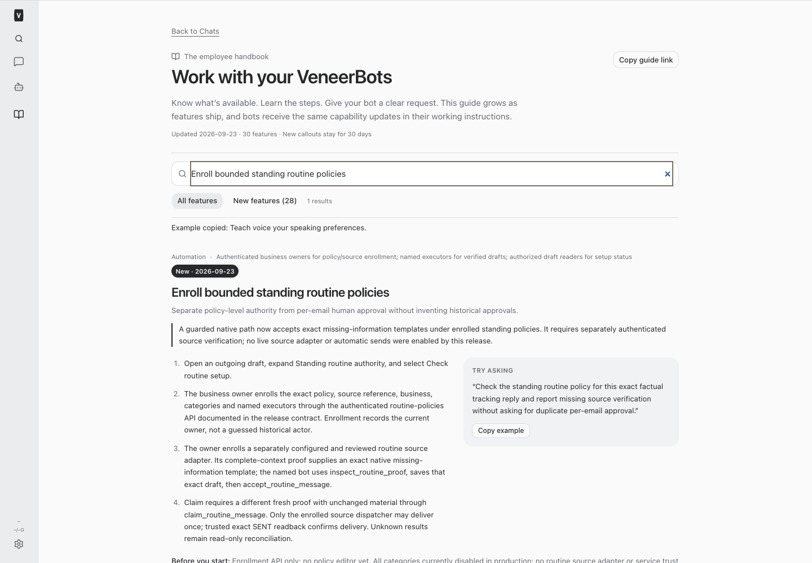
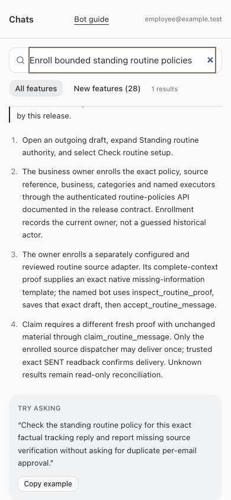

# BUILD261 native routine-message execution release

Implementation **9d2acdd**, pushed to `origin main` and deployed through the root restart. All five services returned HTTP 200 after restart. The dedicated routine verifier rejected an unauthenticated non-business fixture read with HTTP 401.

**Native contract shipped; end-to-end routine delivery is not enabled.** No routine service credentials, source adapter, source trust or live policy acceptance were configured by this release. Factual tracking, including QFCRLF, remains unsupported. The existing OrderOps owner retains the source dependency after BUILD258; no second source builder or source queue receipt is asserted.

## Delivered

- Dedicated service-authenticated source capture boundary, separate from human, AutoShip and return identities; genuine current-owner source enrollment bound to immutable policy, named executor, account, principal, origin and reviewed adapter digest.
- One intentionally narrow native missing-information template: model number, product-label photo or installation-area photo, only with trusted complete-context evidence that each is actually missing and relevant. Unsupported categories fail closed.
- Exact draft acceptance, fresh unchanged-material claim, immutable standing-policy audit with `authorized_by=NULL`, one-time source intent and idempotency binding, retirement/claim serialization, and read-only unknown-outcome reconciliation.
- Trusted exact SENT readback required to mark routine delivery sent. Ordinary bot delivery assertions cannot substitute. Human drafts, approved-message delegation, return authority and case approvals remain separate.
- Updated draft explanation, employee guide/New announcement and resumed bot instructions.

## Validation and deployed state

Root typecheck, full `npm test`, and production build passed before restart. Full suite: **2,354 server tests passed, 5 skipped; 865 web tests; 40 browser-manager tests; 21 installer tests**. Focused suite: 79 tests, including two independent SQLite connections contending for a claim, foreign/revoked identities, stale leases/material, changed scope, financial/category denial, holds, duplicate/unknown effects and source readback. Full/restricted employee guide browser fixtures passed desktop/mobile navigation, New callouts, search, copy, links, overflow, refresh and failure recovery. Resumed-instruction tests passed.

Read-only production verification found all six new routine audit tables present and empty: trusts, revocations, proofs, authorizations, claims and readbacks. Both routine verifier configuration keys remain absent. Built guide exposes the new contract and explicitly labels production execution disabled. No customer/provider/case/draft/lease/policy enrollment/send was performed as acceptance or testing.

## Exact remaining dependency and resumption

See the [producer/consumer contract](/Users/archerclawdington/veneer-os/docs/reports/routine-message-execution/contract.md) for schemas, endpoints, owner enrollment, template scope, proof freshness, native claim linearization, dispatcher obligations and SENT readback.

Source owner **a4bc7b0c-e56a-4b90-b4bc-cb71cbc88e68** must establish the separate routine capture/evaluator/dispatcher after active BUILD258, with a reviewed source field manifest and complete native/source hold, all-channel/attachment, ownership, lease, duplicate and unknown-effect coverage. Fixed templates alone do not establish eligibility. Then dedicated routine transport and truthful source-account/principal registration must be configured, followed by genuine current-owner policy/source enrollment and independent acceptance. Return-only credentials, trust and source-account authority cannot fill this dependency. No per-email duplicate human approval workaround is required or offered.

## Changed files

- [docs/reports/routine-message-execution/contract.md](/Users/archerclawdington/veneer-os/docs/reports/routine-message-execution/contract.md)
- [docs/reports/routine-message-execution/screenshots/desktop.png](/Users/archerclawdington/veneer-os/docs/reports/routine-message-execution/screenshots/desktop.png)
- [docs/reports/routine-message-execution/screenshots/employee-mobile.png](/Users/archerclawdington/veneer-os/docs/reports/routine-message-execution/screenshots/employee-mobile.png)
- [server/src/bots/communication.ts](/Users/archerclawdington/veneer-os/server/src/bots/communication.ts)
- [server/src/bots/communicationRoutes.ts](/Users/archerclawdington/veneer-os/server/src/bots/communicationRoutes.ts)
- [server/src/bots/routineExecution.ts](/Users/archerclawdington/veneer-os/server/src/bots/routineExecution.ts)
- [server/src/bots/routinePolicies.ts](/Users/archerclawdington/veneer-os/server/src/bots/routinePolicies.ts)
- [server/src/bots/routineVerifierRoutes.ts](/Users/archerclawdington/veneer-os/server/src/bots/routineVerifierRoutes.ts)
- [server/src/config.ts](/Users/archerclawdington/veneer-os/server/src/config.ts)
- [server/src/db/migrations/0116_routine_execution.sql](/Users/archerclawdington/veneer-os/server/src/db/migrations/0116_routine_execution.sql)
- [server/src/featureGuide/catalog.ts](/Users/archerclawdington/veneer-os/server/src/featureGuide/catalog.ts)
- [server/src/index.ts](/Users/archerclawdington/veneer-os/server/src/index.ts)
- [server/src/mcp/botTools.ts](/Users/archerclawdington/veneer-os/server/src/mcp/botTools.ts)
- [server/test/botFeatureGuide.test.ts](/Users/archerclawdington/veneer-os/server/test/botFeatureGuide.test.ts)
- [server/test/instructionContext.test.ts](/Users/archerclawdington/veneer-os/server/test/instructionContext.test.ts)
- [server/test/routineExecution.test.ts](/Users/archerclawdington/veneer-os/server/test/routineExecution.test.ts)
- [server/test/routineTools.test.ts](/Users/archerclawdington/veneer-os/server/test/routineTools.test.ts)
- [server/test/routineVerifierRoutes.test.ts](/Users/archerclawdington/veneer-os/server/test/routineVerifierRoutes.test.ts)
- [web/src/components/BotCommunication.tsx](/Users/archerclawdington/veneer-os/web/src/components/BotCommunication.tsx)
- [This release report](/Users/archerclawdington/veneer-os/docs/reports/routine-message-execution/README.md)
