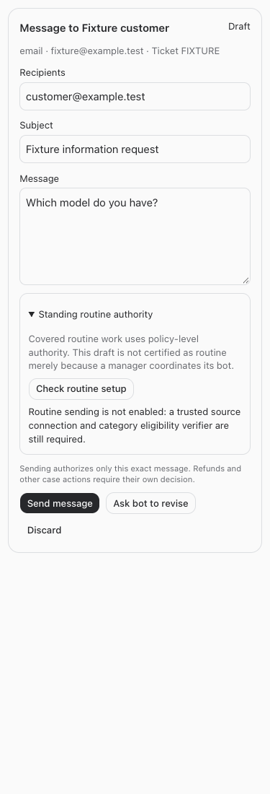
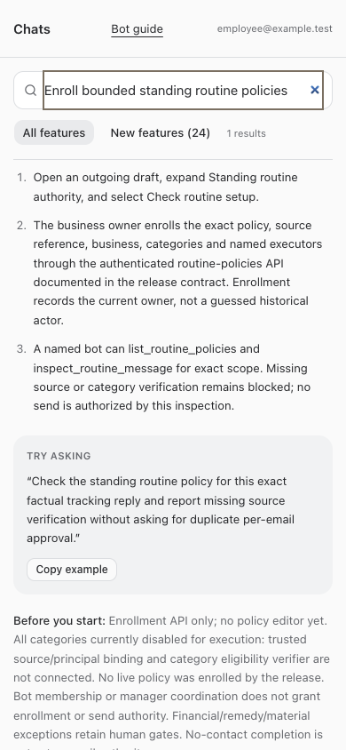

# Standing routine policy enrollment

September 23, 2026 · BUILD252, successor to BUILD232

**Enrollment and read-only readiness are implemented. Routine authorization/claim/delivery is not enabled.** This release removes the missing native enrollment-record prerequisite; it does not certify WQ446A or any other customer draft. All execution categories remain disabled until a trusted source connection and category eligibility verifier are implemented. No live policy, draft, decision, lease, customer message or provider state was changed by the builder.

## What exists

A human authenticated as the current business owner can enroll an immutable policy snapshot with exact business, source reference, complete policy text, named active native executors and bounded categories. The record attributes enrollment to the current owner and timestamp. It never invents a historical actor for BUILD203. The fixed maximum envelope preserves the financial/remedy/material-policy gates and excludes extra emails for no-contact completion.

Versions are append-only. Creating the next version supersedes the previous version. Revocation is an immutable event; deactivated issuers/executors and changed business ownership fail closed. Stable request keys replay only an identical enrollment; conflicting keys or stale expected versions fail. Bots and business managers do not inherit enrollment permission through membership. No manager delegation contract was established, so enrollment is human business-owner-only.

Bots can list only their own enrolled policies in an accessible exact business, and inspect an exact message scope. Inspection returns policy/scope fingerprints, `ready:false`, `execute:false` and concrete missing proof. Inspection writes nothing, creates no draft or approval, and cannot make an ordinary draft claimable. No dormant client-supplied `eligible=true` or generic verifier callback is provided.

Draft cards expose **Standing routine authority → Check routine setup** for authorized readers, including restricted employees. This is a setup explanation, not a determination that the displayed draft qualifies. Existing human-send controls remain for the ordinary draft workflow; this release does not suggest clicking them to work around missing routine setup.

## Executable enrollment contract

These are authenticated API routes under `/api/bot-communication`. Use the owner's own signed-in session through the existing application API transport. No token copying, staff impersonation or bot bearer substitution. No enrollment was performed as part of this release. There is no policy editor yet.

`POST /routine-policies/enroll`:

```json
{
  "business_id": "<verified native business ID owned by current human>",
  "policy_key": "build203-routine",
  "expected_version": 0,
  "request_key": "<stable enrollment request key>",
  "source_reference": "<dated source reference, not a historical signature>",
  "policy_text": "<complete reviewed policy and exclusions; minimum 100 characters>",
  "executor_ids": ["<verified active native executor chat ID>"],
  "categories": ["missing_information", "factual_tracking"]
}
```

Allowed category identifiers: `missing_information`, `no_order_catalog`, `unused_return`, `approved_status_restatement`, `factual_tracking`. Enrollment selects a bounded intended scope; none is enabled for execution. No-contact closeouts are deliberately not a send category. Use the current version as `expected_version` to supersede a policy. A changed request must use a new request key. The response includes the immutable snapshot/hash, current status, `enabled_categories:[]` and setup requirements.

`POST /routine-policies/list` with `{"business_id":"<verified ID>"}` is available to the human owner or a named current bot. Bot tool: `list_routine_policies` with the same argument.

`POST /routine-policies/revoke` with `{"policy_id":"<enrollment ID>","reason":"<specific reason>"}` is human-owner-only. Identical revocation retries are harmless; conflicting reasons fail rather than rewriting audit history.

`POST /routine-policies/inspect`, or bot tool `inspect_routine_message`:

```json
{
  "policy_id": "<enrollment ID>",
  "category": "factual_tracking",
  "scope": {
    "canonical_case": "<exact canonical source case>",
    "executor_conversation_id": "<enrolled own native bot ID>",
    "payload": {
      "channel": "email",
      "account": "<exact source account>",
      "recipients": ["<exact recipient>"],
      "subject": "<exact subject>",
      "body": "<exact body>",
      "customer": "<exact customer>",
      "ticket": "<exact ticket identifier>",
      "attachments": [],
      "context": "<retained context>"
    }
  }
}
```

Attachments, when supplied, require exact `name`, `reference` and `sha256`. This fingerprint does not verify bytes or source identity. Current output is always non-executable, even if a caller supplies a routine-looking body. Altering recipient/body/account/case/attachments/category/policy changes the fingerprint. Arbitrary extra proof assertions are rejected.

## Remaining integration prerequisite

The existing OrderOps capability, lease and case GET contracts supply useful source facts, not category eligibility. A supported server-owned adapter still needs:

1. Owner-authorized native business → source origin/account binding and each native executor → own source principal/credential custody binding, verified with its own capabilities. Documented names/principal mappings are references, not enrollment proof. Resolve the actual business ID from native records; project name is insufficient.
2. Per-category trusted validation using current all-channel case/order/carrier/catalog/workflow evidence, retained ownership, own exclusive lease with at least 30 seconds remaining, explicit human holds, material changes, prior outbound and unknown outcomes. Missing-information and tracking eligibility cannot be inferred from a category string or lease alone. Unsupported categories stay disabled.
3. A separately implemented authorization record binding that trusted result to immutable policy/version/category and exact scope. Revalidate at transactional one-time claim, preserve stable source idempotency, verify provider/SENT/body/recipient/count proof, and reconcile unknown effects without another send. The current release provides no acceptance or routine claim endpoint and no credential transport.

Do not broaden BUILD229, retrofit legacy approvals, infer canonical UUID/ticket equivalence (BUILD250), or use old OrderOps POST fallbacks. No new per-email human approval should be requested merely to bypass this integration prerequisite. Manager coordination is not itself a technical policy grant.

WQ446A / Tess and BGTJQK, 4DU4FU, ZLE3VW, LRVC5W remain reference fixtures only. WQ446A's reported factual tracking message also has a nonreceipt obligation: facts must not falsely close that duty. No live acceptance or eligibility inspection was performed.

## Verification

Scoped policy/bridge/guide/resumed-instruction tests, root typecheck, full tests and production build are required before restart. Browser fixtures use only mock APIs at 320/375/414/768/1440 widths in light and dark themes. They verify setup disclosure, unchanged ordinary send controls and no horizontal overflow; guide fixtures verify full/restricted discovery. Final validation and deployment results are recorded below after checks complete.




## Changed files

- [Policy service](/Users/archerclawdington/veneer-os/server/src/bots/routinePolicies.ts)
- [Migration](/Users/archerclawdington/veneer-os/server/src/db/migrations/0112_routine_policies.sql)
- [Routes](/Users/archerclawdington/veneer-os/server/src/bots/communicationRoutes.ts)
- [Restricted access allowlist](/Users/archerclawdington/veneer-os/server/src/bots/employeeAccess.ts)
- [Bot tools](/Users/archerclawdington/veneer-os/server/src/mcp/botTools.ts)
- [Guide catalog](/Users/archerclawdington/veneer-os/server/src/featureGuide/catalog.ts)
- [Draft UI](/Users/archerclawdington/veneer-os/web/src/components/BotCommunication.tsx)
- [Policy tests](/Users/archerclawdington/veneer-os/server/test/routinePolicies.test.ts)
- [Guide tests](/Users/archerclawdington/veneer-os/server/test/botFeatureGuide.test.ts)
- [Resumed instruction tests](/Users/archerclawdington/veneer-os/server/test/instructionContext.test.ts)
- [Draft browser fixture](/Users/archerclawdington/veneer-os/scripts/routine-policy-browser-check.mjs)
- [Guide browser fixture](/Users/archerclawdington/veneer-os/scripts/bot-guide-browser-check.mjs)
- [This report](/Users/archerclawdington/veneer-os/docs/reports/routine-policy-enrollment/README.md)

### Browser evidence files

- [draft-1440-dark.png](/Users/archerclawdington/veneer-os/docs/reports/routine-policy-enrollment/screenshots/draft-1440-dark.png)
- [draft-1440-light.png](/Users/archerclawdington/veneer-os/docs/reports/routine-policy-enrollment/screenshots/draft-1440-light.png)
- [draft-320-dark.png](/Users/archerclawdington/veneer-os/docs/reports/routine-policy-enrollment/screenshots/draft-320-dark.png)
- [draft-320-light.png](/Users/archerclawdington/veneer-os/docs/reports/routine-policy-enrollment/screenshots/draft-320-light.png)
- [draft-375-dark.png](/Users/archerclawdington/veneer-os/docs/reports/routine-policy-enrollment/screenshots/draft-375-dark.png)
- [draft-375-light.png](/Users/archerclawdington/veneer-os/docs/reports/routine-policy-enrollment/screenshots/draft-375-light.png)
- [draft-414-dark.png](/Users/archerclawdington/veneer-os/docs/reports/routine-policy-enrollment/screenshots/draft-414-dark.png)
- [draft-414-light.png](/Users/archerclawdington/veneer-os/docs/reports/routine-policy-enrollment/screenshots/draft-414-light.png)
- [draft-768-dark.png](/Users/archerclawdington/veneer-os/docs/reports/routine-policy-enrollment/screenshots/draft-768-dark.png)
- [draft-768-light.png](/Users/archerclawdington/veneer-os/docs/reports/routine-policy-enrollment/screenshots/draft-768-light.png)
- [routine-desktop.png](/Users/archerclawdington/veneer-os/docs/reports/routine-policy-enrollment/screenshots/routine-desktop.png)
- [routine-employee-mobile.png](/Users/archerclawdington/veneer-os/docs/reports/routine-policy-enrollment/screenshots/routine-employee-mobile.png)

## Final checks before restart

Root typecheck passed. Full root tests passed: 2,267 server tests (5 skipped), 864 web tests, 21 installer tests and 40 browser-manager tests. Production build passed with the existing bundle-size advisory. Mock draft browser fixtures passed all ten width/theme combinations; full/restricted guide fixtures passed. Resumed-instruction tests explicitly verify the new tool and disabled-execution guidance. No provider or customer test was performed. The disabled routine path has no successful-send/concurrency claim to report; existing approved-message claim/replay tests remain passing.
