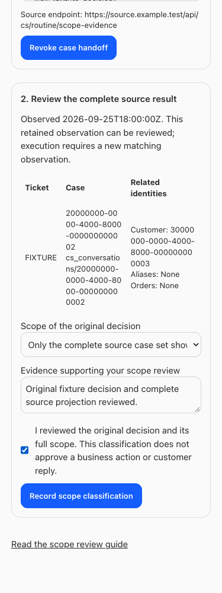

# Complete routine owner scope handoff — BUILD343

September 25, 2026. The native owner-to-source handoff and scope review workflow is implemented. **Routine customer sending remains disabled pending source adoption/configuration and genuine owner enrollment.** This release does not create a production handoff, scope classification, policy, trust, customer draft or send.

## Delivered

- [Owner scope review](https://nicksworld.dev/#/routine-scope-review) shows the original decision alongside its exact tuple, prepares actual owner-selected source case locators, presents the complete returned source projection and records a separate explicit scope classification. Unknown and business-wide scope stay blocking. Retained evidence can be reviewed at the owner's pace; execution still requires fresh matching evidence.
- Owner handoffs have immutable revisions, optimistic concurrency, stable request/source UUIDs and separate revocation. The source receives BUILD340's exact strict body with no DTO change. The dedicated native service has exact-ID retrieval only; no private native inventory or proposal text is exposed.
- First source evidence must match the handoff request UUID and include every selected root. Later explicit observations bind to that same current handoff. Revocation/supersession invalidate evidence and coverage; new handoffs require new projection and classification. Original business decisions and approvals are unchanged.
- Native coverage rechecks the handoff audit during capture, acceptance, reservation and first service dispatch. New source selection, owner/decision/event drift, revoked trust or incomplete/stale source evidence denies. Lost source responses remain UNKNOWN; a lookup handoff grants no customer-send permission.
- The long owner forms now scroll inside the app on mobile. The UI blocks actions while reconciling uncertain writes and disables case-set classification for evidence that no longer matches its handoff.
- Employee guide and current/resumed-agent instructions describe the exact sequence, owner-only boundary and remaining activation prerequisites. [Guide](https://nicksworld.dev/#/bot-guide?feature=routine-scope-handoff).

## Source and executor reconciliation

Original OrderOps BUILD340 deployed `a8c53c6d05babec6aa13952fe9a36da4bbcd7b84`; retained runtime receipt verifies Railway `3ab03b12-8e72-4182-ac61-fbf6303232a0`, twelve live hashes and final adapter digest `c694d749557e60e39fbaa2c885b53e882a861fb3d017b1be962cc6770f8beef1`. That digest supersedes BUILD277 and the undeployed candidate671b. Source tests:75 passed; build passed;279 unchanged pre-existing TypeScript errors. The source custodian owns current runtime revalidation.

The [source completion receipt](/Users/archerclawdington/Projects/ERVP/Order Ops/.veneer/receipts/build340-completion.md) confirms0085/0092 and all twelve routine bindings were absent at that check; deployment is not activation. BUILD344 owns pinned0085→0092 adoption, exact runtime bindings and source enrollment/custody checks. Pre-enrollment verification covers ten non-policy/trust values; the actual POLICY_ID and TRUST_ID follow genuine owner enrollment. This avoids a circular prerequisite.

Fresh native metadata confirms Avery `170ab267-448c-4b13-97f4-5f24db2f3652` is registered active, unarchived in ERVP, with active owner user1. Avery herself performed the sole authenticated capability GET at17:58:56UTC and returned authorized principal `veneer:cbf4e12b-b0ea-44fb-95fc-0e99613dc313`, enforcement required, with her credential retained in her custody. [Nonsecret receipt](./executor-receipt.json). No ticket/customer reads, leases, sends, enrollment or provider probes were performed for it.

At18:03:20UTC, the original source custodian reviewed [the concrete handoff contract](./contract.md) and confirmed compatibility with BUILD340's strict request, refresh and replay behavior; no source DTO or digest change was identified. Runtime/schema changes remain with BUILD344.

## Remaining prerequisites

`preparedRoutineRegistration.source` remains null. Native membership and Avery's own capability receipt do not establish the source's external_bot_id/current enrollment or deployed protected runtime binding. The source custodian must return those actual receipts, schema adoption and ten configured pre-enrollment values. Platform will then complete the prepared registration using the final reviewed digest and retained stable keys.

The genuine current owner then reviews and confirms the ready photo-only setup. Only actual policy/trust receipts may be installed at source. Owner scope handoffs and classifications use authoritative roots, source projection and the current original decision; this release does not manufacture any. Independent Grant acceptance and the named executor's next genuinely NEW eligible product-label-photo request remain later gates. Only actual Gmail SENT plus matching native readback, with no repeats, proves delivery.

## Verification

Targeted tests cover exact owner handoff/replay, original approval preservation, wrong actor/service, stale tuple, duplicate/off-origin roots, initial request-key matching, incomplete closure, explicit refresh, revocation/supersession/owner/trust/event drift, new binding after supersession, immutable records, post-revocation owner revocation and cross-connection first-dispatch races. Existing scoped-hold and routine-send guards remain covered.

Synthetic browser checks exercise desktop/mobile light/dark, exact handoff, lost-response read-only recovery, original/source review, explicit classification, revocation, owner/setup denial, no automatic writes and no horizontal overflow. No production business mutation or source/provider request is used as a release fixture. Guide checks cover full/restricted employees; instruction-context tests cover resumed agents.

Full validation, deployment checks and changed-file links follow below.

## Validation results

Root typecheck passed. Full suite: server 2,505 passed / 5 skipped; web 896 passed; installer 29 passed; browser-manager 40 passed. Owner scope browser checks, existing setup regression checks, full/restricted guide checks and current/resumed instruction checks passed. These are technical fixtures, not customer delivery receipts.

Production build passed, with the existing large-chunk warning. All five services restarted successfully through root `npm run restart`; local health checks and the public Access front door passed. Migration0125 is installed; read-only production counts for handoffs, revocations and handoff evidence are all zero.

Post-restart public read-only synthetic checks: dedicated exact absent handoff returned native404 `Scope handoff not found`; dedicated service inventory path returned405 `Unsupported routine verifier operation`; anonymous and return-identity exact lookups returned401. No real handoff, source case or provider was probed.

## Changed files

- [docs/bot-feature-guide.md](/Users/archerclawdington/veneer-os/docs/bot-feature-guide.md)
- [docs/reports/routine-scope-handoff/README.md](/Users/archerclawdington/veneer-os/docs/reports/routine-scope-handoff/README.md)
- [docs/reports/routine-scope-handoff/check_transport.py](/Users/archerclawdington/veneer-os/docs/reports/routine-scope-handoff/check_transport.py)
- [docs/reports/routine-scope-handoff/contract.md](/Users/archerclawdington/veneer-os/docs/reports/routine-scope-handoff/contract.md)
- [docs/reports/routine-scope-handoff/executor-receipt.json](/Users/archerclawdington/veneer-os/docs/reports/routine-scope-handoff/executor-receipt.json)
- [docs/reports/routine-scope-handoff/guide/scope-review-desktop.png](/Users/archerclawdington/veneer-os/docs/reports/routine-scope-handoff/guide/scope-review-desktop.png)
- [docs/reports/routine-scope-handoff/guide/scope-review-employee-mobile.png](/Users/archerclawdington/veneer-os/docs/reports/routine-scope-handoff/guide/scope-review-employee-mobile.png)
- [docs/reports/routine-scope-handoff/screenshots/1440-dark.png](/Users/archerclawdington/veneer-os/docs/reports/routine-scope-handoff/screenshots/1440-dark.png)
- [docs/reports/routine-scope-handoff/screenshots/1440-light.png](/Users/archerclawdington/veneer-os/docs/reports/routine-scope-handoff/screenshots/1440-light.png)
- [docs/reports/routine-scope-handoff/screenshots/375-dark.png](/Users/archerclawdington/veneer-os/docs/reports/routine-scope-handoff/screenshots/375-dark.png)
- [docs/reports/routine-scope-handoff/screenshots/375-light.png](/Users/archerclawdington/veneer-os/docs/reports/routine-scope-handoff/screenshots/375-light.png)
- [docs/reports/routine-scope-handoff/setup-screenshots/375-dark-blocked.png](/Users/archerclawdington/veneer-os/docs/reports/routine-scope-handoff/setup-screenshots/375-dark-blocked.png)
- [docs/reports/routine-scope-handoff/setup-screenshots/375-light-blocked.png](/Users/archerclawdington/veneer-os/docs/reports/routine-scope-handoff/setup-screenshots/375-light-blocked.png)
- [scripts/bot-guide-browser-check.mjs](/Users/archerclawdington/veneer-os/scripts/bot-guide-browser-check.mjs)
- [scripts/routine-scope-review-browser-check.mjs](/Users/archerclawdington/veneer-os/scripts/routine-scope-review-browser-check.mjs)
- [server/src/bots/communicationRoutes.ts](/Users/archerclawdington/veneer-os/server/src/bots/communicationRoutes.ts)
- [server/src/bots/routineExecution.ts](/Users/archerclawdington/veneer-os/server/src/bots/routineExecution.ts)
- [server/src/bots/routineHoldScopes.ts](/Users/archerclawdington/veneer-os/server/src/bots/routineHoldScopes.ts)
- [server/src/bots/routineScopeHandoffs.ts](/Users/archerclawdington/veneer-os/server/src/bots/routineScopeHandoffs.ts)
- [server/src/bots/routineVerifierRoutes.ts](/Users/archerclawdington/veneer-os/server/src/bots/routineVerifierRoutes.ts)
- [server/src/db/migrations/0125_routine_scope_handoffs.sql](/Users/archerclawdington/veneer-os/server/src/db/migrations/0125_routine_scope_handoffs.sql)
- [server/src/featureGuide/catalog.ts](/Users/archerclawdington/veneer-os/server/src/featureGuide/catalog.ts)
- [server/test/botFeatureGuide.test.ts](/Users/archerclawdington/veneer-os/server/test/botFeatureGuide.test.ts)
- [server/test/instructionContext.test.ts](/Users/archerclawdington/veneer-os/server/test/instructionContext.test.ts)
- [server/test/routineExecution.test.ts](/Users/archerclawdington/veneer-os/server/test/routineExecution.test.ts)
- [server/test/routineVerifierRoutes.test.ts](/Users/archerclawdington/veneer-os/server/test/routineVerifierRoutes.test.ts)
- [web/src/App.tsx](/Users/archerclawdington/veneer-os/web/src/App.tsx)
- [web/src/screens/RoutineOwnerSetup.tsx](/Users/archerclawdington/veneer-os/web/src/screens/RoutineOwnerSetup.tsx)
- [web/src/screens/RoutineScopeReview.tsx](/Users/archerclawdington/veneer-os/web/src/screens/RoutineScopeReview.tsx)
