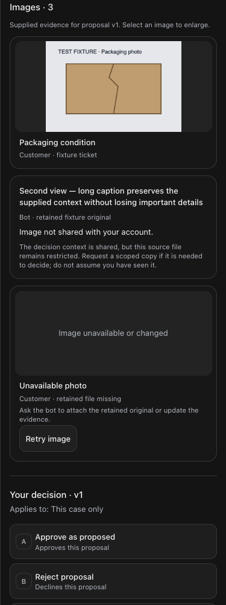
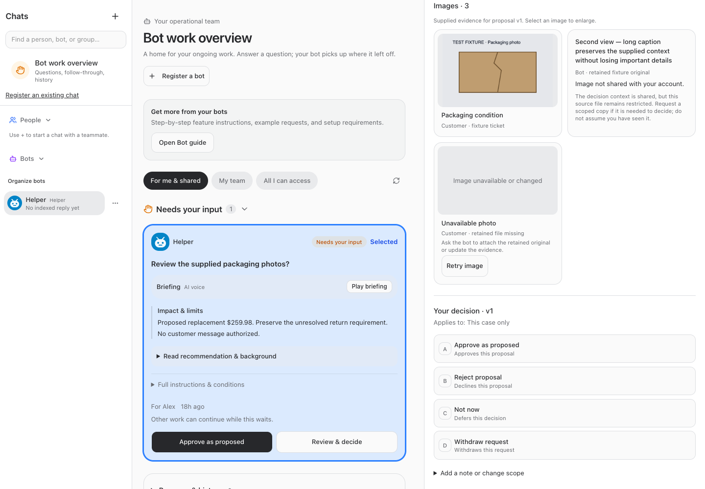

# BUILD257 — scoped CS context and return verifier

Implemented by existing Platform Dev owner. Production deployment and post-restart results are recorded below after release.

The shared decision repair exposes existing attached context to already-eligible ERVP CS humans without granting mixed-role source conversations. A pre-release read-only check against the native database returned Nicholas **12** and Ali **12** raised hands, with **11** of Ali's cards explicitly limited to decision context. All five source conversations remained denied to Ali. No users, memberships, grants, approvals or proposal versions were changed.

The narrow return producer retains the original Y4DYW5 approval and records a separately attributed, authoritative source mapping. It supports dedicated service authentication, authenticated owner trust enrollment/revocation, one atomic claim per decision, and same-intent uncertainty reconciliation. The original OrderOps owner reviewed all six DTO/recovery corrections and found no further producer incompatibility. No live enrollment/mapping/claim/return or customer action occurred.

[Executable setup and producer/consumer contract](./contract.md) covers exact endpoints, actor requirements, dedicated Cloudflare configuration, capture/fingerprint rules, all six findings, revocation, final remapping and lost-response recovery. Deployment is distinct from configured trust and independent source acceptance. Original OO owner retains its transaction/dispatcher work.

## Validation

- Root typecheck passed.
- Full root tests passed: server 2,311 passed / 5 skipped; web 865; browser manager 40; installer 21.
- Scoped tests cover 11 cards / 5 sources, original proposal preservation, current eligibility, private/foreign sources, immutable mapping/claim/audit, source and identity changes, selected quantity, replay, competing claims across connections, restart readback, authenticated HTTP boundary and source drift.
- UI mock fixtures passed 320/375/414/768/1080/1440/1920, both themes, no horizontal overflow, original image preview/keyboard controls, explicit restricted image state with zero restricted-image requests, and nonlinked restricted source references.
- Full/restricted employee guide browser checks passed; catalog and instruction-context tests verify refreshed/resumed agent discovery.
- Production build result and restart health are recorded in the deployment receipt below.

Hallmark component critique: Philosophy5, Hierarchy4, Execution4, Specificity5, Restraint5, Variety3. Existing tokens/component ownership retained; no redesign or fabricated evidence.

## Changed source and verification files

- [Decision access service](/Users/archerclawdington/veneer-os/server/src/bots/service.ts)
- [Return verifier service](/Users/archerclawdington/veneer-os/server/src/bots/returnException.ts)
- [Dedicated service routes](/Users/archerclawdington/veneer-os/server/src/bots/returnExceptionRoutes.ts)
- [Human trust routes](/Users/archerclawdington/veneer-os/server/src/bots/communicationRoutes.ts)
- [Immutable bridge migration](/Users/archerclawdington/veneer-os/server/src/db/migrations/0115_return_exception_bridge.sql)
- [Runtime configuration](/Users/archerclawdington/veneer-os/server/src/config.ts)
- [Router mount](/Users/archerclawdington/veneer-os/server/src/index.ts)
- [Living catalog](/Users/archerclawdington/veneer-os/server/src/featureGuide/catalog.ts)
- [Decision fixtures](/Users/archerclawdington/veneer-os/server/test/bots.test.ts)
- [Return fixtures](/Users/archerclawdington/veneer-os/server/test/returnException.test.ts)
- [Decision types](/Users/archerclawdington/veneer-os/web/src/lib/bots.ts)
- [Decision detail](/Users/archerclawdington/veneer-os/web/src/screens/Bots.tsx)
- [Image access presentation](/Users/archerclawdington/veneer-os/web/src/components/DecisionImages.tsx)
- [Mock browser check](/Users/archerclawdington/veneer-os/scripts/scoped-cs-return-browser-check.mjs)
- [Contract](/Users/archerclawdington/veneer-os/docs/reports/scoped-cs-return/contract.md)

Additional gallery/preview images and full/restricted guide captures in this report folder are synthetic fixture screenshots, not customer evidence.
