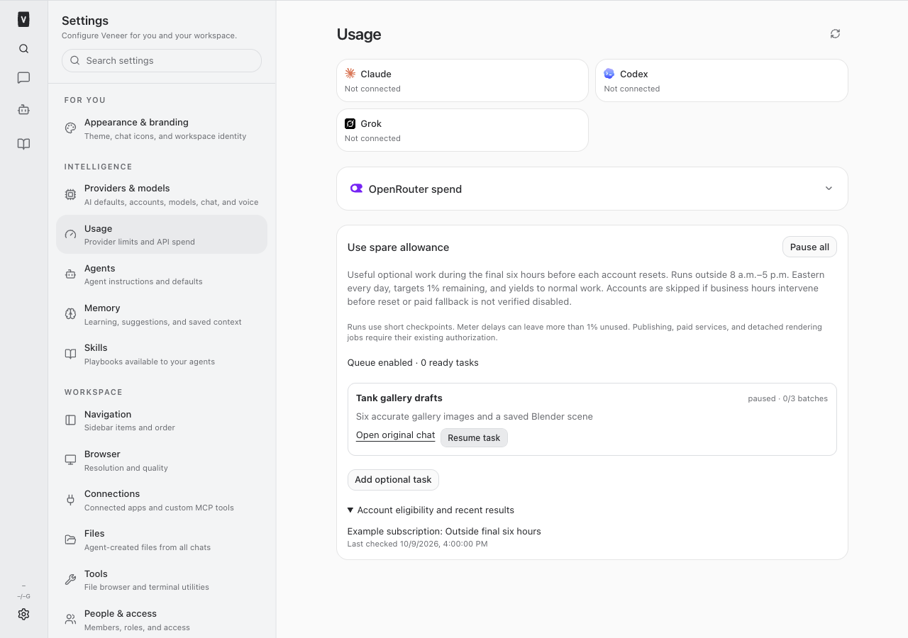
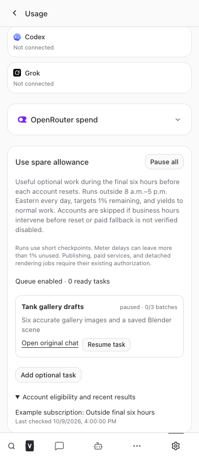
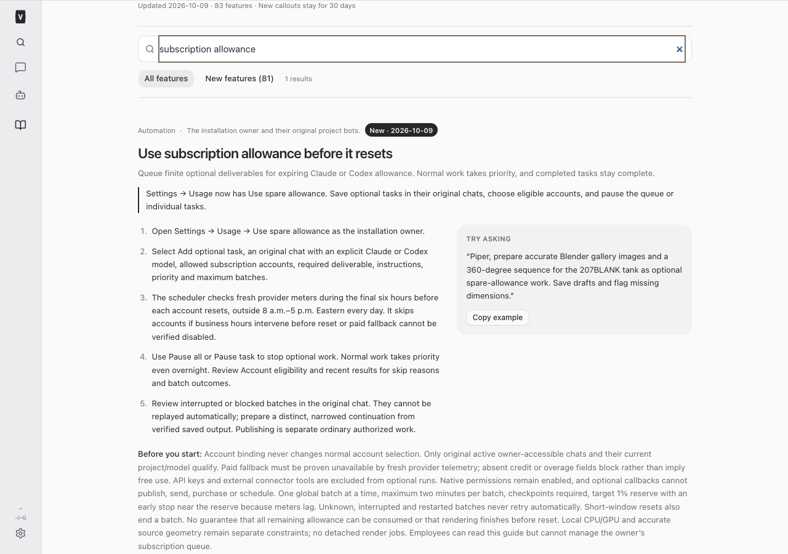
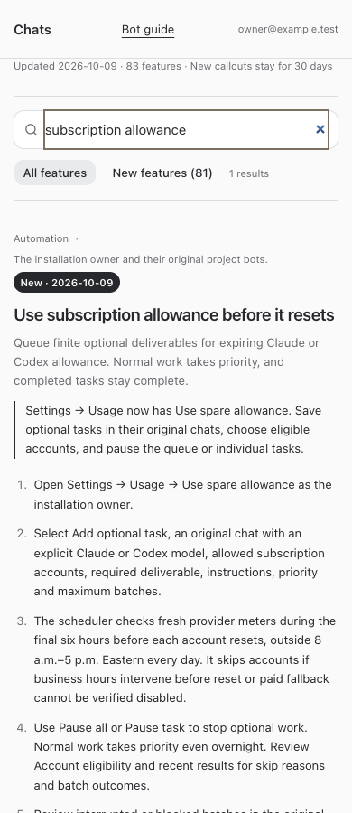

# Use expiring subscription allowance — build 677

October 9, 2026. The owner authorized useful optional work across projects before
included Claude/Codex subscription allowance expires. Settings → Usage → Use spare
allowance provides finite task enrollment, selected account lists, priorities, expected
outputs, per-task pause, global disable, result history and account skip reasons.

## Scheduling and execution

Each account needs genuine provider telemetry no older than 30 seconds and explicit
proof that paid fallback is unavailable. All reported short and model windows are
checked. Weekly resets must be within six hours; 8 a.m.–5 p.m.
America/Indiana/Indianapolis is protected every day, using real timezone/DST conversion.
An account whose reset interval crosses protected hours is conservatively skipped.
Changed cycles, credentials, access, model, task state or account connections halt work.

The one global optional batch lasts at most two minutes and ends at least 30 seconds
before the earliest reported window reset. Normal messages and queued work preempt
it, including evening use. Actual Claude OAuth and Codex native-home binding uses
the selected account; global normal account selection and normal failover are unchanged.
Optional runs have no provider API keys or global subscription failover. The 1% reserve
is a best-effort target: new batches stop at 98% observed utilization to allow for meter
lag, and stop at the 99% reserve. No fresh-cycle spill is intentionally permitted.

Original project/chat identity and access remain in effect. Native permissions remain
enabled even for Full Access bots. Optional MCP configuration contains only native
read/checkpoint and public-browser tools; native mutation callbacks and signed-in
browser actions are denied. No paid connectors, Runway credits, publication, purchases,
sends, schedules or detached jobs are authorized by unused allowance. Shared source
changes still need their own build slot. Local rendering is a separate CPU/GPU workload;
this scheduler does not provision Blender or approve an unattended render farm.

Tasks have a finite batch budget and explicit output. A successful turn plus an immutable
`record_spare_checkpoint` allows distinct next-batch progress. Completed tasks remain
complete. Crashes, cancellation, missing checkpoints or uncertain effects permanently
block the batch, retaining artifacts and requiring read-only reconciliation before a
narrowed distinct continuation. There is no automatic UNKNOWN retry or endless loop.

Usage history shows observed account utilization, not fabricated per-task token attribution.
Meters are refreshed only when ready work exists, outside protected hours and with
normal work idle. Provider fields absent from telemetry block dispatch instead of
inferring that extra usage is disabled. This can leave allowance unused.

## Piper Content first use case

Piper owns the original tank content workflow in chat
`06f163cc-8061-4559-b8f7-167d8ec34631`. The first 207BLANK product has one manufacturer
drawing. Drawing dimensions 54 × 28 × 6.50 inches conflict with listing dimensions
54.25 × 28.25 × 6.625 inches; outlet dimensions are incomplete. The 466BLANK gallery
is a style reference only. Piper retained the sources, reusable scene candidates and
proposed six 4096-square gallery views plus 72 2048-square turntable frames. No
Blender binary, MCP or .blend scene was found in the checked local paths. Geometry,
actual runtime/scene and bounded foreground-safe CPU/GPU execution remain prerequisites.

Piper returned a one-batch, 100-second substantive-work source-reconciliation definition,
leaving 20 seconds for its final checkpoint. Enrollment binds connected accounts from
the original chat; actual run eligibility is evaluated by the scheduler. First enrollment
is useful source reconciliation and draft preparation, not speculative rendering. No tank rendering, Blender installation, website publication or paid generation occurred in this build.

- [Piper workflow](/Users/archerclawdington/Projects/ERVP/out/piper/expiring-allowance-tanks-20261009/workflow.md)
- [Piper backlog](/Users/archerclawdington/Projects/ERVP/out/piper/expiring-allowance-tanks-20261009/backlog.json)
- [Piper finite task definition](/Users/archerclawdington/Projects/ERVP/out/piper/expiring-allowance-tanks-20261009/source-reconciliation-task-definition.json)
- [Piper enrollment notes](/Users/archerclawdington/Projects/ERVP/out/piper/expiring-allowance-tanks-20261009/source-reconciliation-enrollment.md)
- [Piper retained sources](/Users/archerclawdington/Projects/ERVP/out/piper/expiring-allowance-tanks-20261009/file-index.md)

## Validation

Root `npm run typecheck`, full `npm test` and root `npm run build` passed using Node 24.
Final suite: 3,867 server tests passed (15 skipped), 1,013 web tests passed, 51
browser-manager tests passed and 30 installer tests passed. The focused native account
reconnection regression also passed. Commit `012d58b` was pushed to `origin main`. Root `npm run restart` refreshed web
and runner; runner termination stopped the calling shell. Root `npm run restart --
veneer-pro-app-runner veneer-pro-term veneer-browser-manager` then successfully
refreshed the remaining services. Root `npm run health` verifies local web/runner
health and four tunnel connections. Public front-door HTTP 302 proves reachability,
not authenticated browser delivery. Authenticated `list_spare_tasks` succeeds on the
installed schema with the intended original-chat scope and enabled queue. No live
optional batch or provider generation was launched during validation. Fixtures verify account-specific native binding, rejection without
credential/paid fallback proof, no global failover, authorization drift, time/DST/reset
boundaries, reserve, normal-work preemption, immutable checkpoints and restart/no-replay.
HTTP fixtures verify owner-only access, original-bot scoping and durable idempotency.

Isolated browser checks intercepted every API request; no production customer data,
account usage or task execution was accessed. Desktop and mobile checks passed task
creation, explicit account selection, queue/task pause, eligibility history, guide search,
full and restricted employee access, and overflow checks. Catalog tests verify fresh
and resumed instruction delivery and the shared prompt size budget.

The customer-email staged artifact manifest includes shared native MCP/index source.
Its source hash was updated for this release; prior-artifact registrations remain
rejected. No customer-email acceptance, enrollment or business authority was changed.
Native fixture cleanup uses bounded filesystem retries for asynchronous child logs.

## Changed files

- [docs/bot-feature-guide.md](/Users/archerclawdington/veneer-os/docs/bot-feature-guide.md)
- [docs/reports/spare-allowance/desktop.png](/Users/archerclawdington/veneer-os/docs/reports/spare-allowance/desktop.png)
- [docs/reports/spare-allowance/guide-desktop.png](/Users/archerclawdington/veneer-os/docs/reports/spare-allowance/guide-desktop.png)
- [docs/reports/spare-allowance/guide-mobile.png](/Users/archerclawdington/veneer-os/docs/reports/spare-allowance/guide-mobile.png)
- [docs/reports/spare-allowance/mobile.png](/Users/archerclawdington/veneer-os/docs/reports/spare-allowance/mobile.png)
- [docs/reports/spare-allowance/report.md](/Users/archerclawdington/veneer-os/docs/reports/spare-allowance/report.md)
- [scripts/spare-allowance-browser-check.mjs](/Users/archerclawdington/veneer-os/scripts/spare-allowance-browser-check.mjs)
- [server/src/bots/customerEmailArtifact.ts](/Users/archerclawdington/veneer-os/server/src/bots/customerEmailArtifact.ts)
- [server/src/db/migrations/0166_spare_allowance.sql](/Users/archerclawdington/veneer-os/server/src/db/migrations/0166_spare_allowance.sql)
- [server/src/featureGuide/catalog.ts](/Users/archerclawdington/veneer-os/server/src/featureGuide/catalog.ts)
- [server/src/identity/cloudflareAccess.ts](/Users/archerclawdington/veneer-os/server/src/identity/cloudflareAccess.ts)
- [server/src/index.ts](/Users/archerclawdington/veneer-os/server/src/index.ts)
- [server/src/mcp/botTools.ts](/Users/archerclawdington/veneer-os/server/src/mcp/botTools.ts)
- [server/src/providers/claude/adapter.ts](/Users/archerclawdington/veneer-os/server/src/providers/claude/adapter.ts)
- [server/src/providers/codexAppServer/adapter.ts](/Users/archerclawdington/veneer-os/server/src/providers/codexAppServer/adapter.ts)
- [server/src/providers/types.ts](/Users/archerclawdington/veneer-os/server/src/providers/types.ts)
- [server/src/routes/api.ts](/Users/archerclawdington/veneer-os/server/src/routes/api.ts)
- [server/src/runner/index.ts](/Users/archerclawdington/veneer-os/server/src/runner/index.ts)
- [server/src/runtime/agentTokens.ts](/Users/archerclawdington/veneer-os/server/src/runtime/agentTokens.ts)
- [server/src/runtime/buildAgentRuntime.ts](/Users/archerclawdington/veneer-os/server/src/runtime/buildAgentRuntime.ts)
- [server/src/runtime/conversationManager.ts](/Users/archerclawdington/veneer-os/server/src/runtime/conversationManager.ts)
- [server/src/runtime/events.ts](/Users/archerclawdington/veneer-os/server/src/runtime/events.ts)
- [server/src/spareAllowance/policy.ts](/Users/archerclawdington/veneer-os/server/src/spareAllowance/policy.ts)
- [server/src/spareAllowance/routes.ts](/Users/archerclawdington/veneer-os/server/src/spareAllowance/routes.ts)
- [server/src/spareAllowance/scheduler.ts](/Users/archerclawdington/veneer-os/server/src/spareAllowance/scheduler.ts)
- [server/src/spareAllowance/store.ts](/Users/archerclawdington/veneer-os/server/src/spareAllowance/store.ts)
- [server/src/usage/claudeProbe.ts](/Users/archerclawdington/veneer-os/server/src/usage/claudeProbe.ts)
- [server/src/usage/codex.ts](/Users/archerclawdington/veneer-os/server/src/usage/codex.ts)
- [server/src/usage/contract.ts](/Users/archerclawdington/veneer-os/server/src/usage/contract.ts)
- [server/src/veneerBrowser/mcp.ts](/Users/archerclawdington/veneer-os/server/src/veneerBrowser/mcp.ts)
- [server/test/approvalAdapter.test.ts](/Users/archerclawdington/veneer-os/server/test/approvalAdapter.test.ts)
- [server/test/codexAppServer.test.ts](/Users/archerclawdington/veneer-os/server/test/codexAppServer.test.ts)
- [server/test/codexUsage.test.ts](/Users/archerclawdington/veneer-os/server/test/codexUsage.test.ts)
- [server/test/customerEmail.test.ts](/Users/archerclawdington/veneer-os/server/test/customerEmail.test.ts)
- [server/test/spareAllowance.test.ts](/Users/archerclawdington/veneer-os/server/test/spareAllowance.test.ts)
- [server/test/spareAllowanceRoutes.test.ts](/Users/archerclawdington/veneer-os/server/test/spareAllowanceRoutes.test.ts)
- [web/src/screens/Settings.tsx](/Users/archerclawdington/veneer-os/web/src/screens/Settings.tsx)
- [web/src/screens/settings/SpareAllowancePanel.tsx](/Users/archerclawdington/veneer-os/web/src/screens/settings/SpareAllowancePanel.tsx)
- [web/src/screens/settings/UsagePage.tsx](/Users/archerclawdington/veneer-os/web/src/screens/settings/UsagePage.tsx)

## Content handoff state

Piper received the deployed integration contract and enrollment instruction in existing
coordination thread `203b7585-6c81-4cea-bb9d-ed336e0fd130`. Its original chat is currently
busy with normal work, so coordination delivery is queued without interruption. The
one-batch task definition is prepared; enrollment must be performed by the original
Piper identity after that work finishes. It is not falsely reported as enrolled here.

## Enrollment follow-up — October 9, 2026

Read back both the original Piper chat and coordination thread after the deployment
follow-up. Piper's original chat is working on its separately authorized Alpha catalog
batch, now 210BLANK, and the human added a subtle ground-shadow requirement. That
normal work was not interrupted. The deployed queue remains enabled. A read-only
database check found no task for Piper or request key
`piper-alpha-207001cd-source-reconciliation-v1`.

Coordination completed its preparation and reported an exact routing blocker:
“Coordination cannot steer its own human conversation.” Cross-bot messages enter the
coordination lane; its token cannot enroll as Piper's original identity. Repeated
coordination messages or waiting for idle alone do not repair that restriction.
Prepared enrollment now limits accounts to the human-named drmark@mphealth.net
subscription, with account IDs still unbound and no fabricated eligibility.

Platform Dev owns resolution of original-chat delivery. This content-only follow-up
does not change scope enforcement or shared software, impersonate Piper, enroll in
a replacement chat, or ask for redundant business consent. A bounded follow-up may
check for an independently completed original-chat enrollment after normal work.
The task remains prepared, not enrolled; rendering prerequisites remain unresolved.
