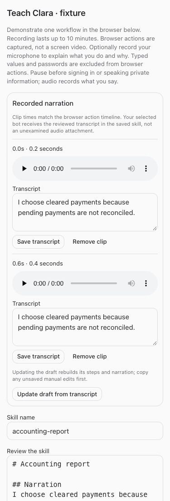
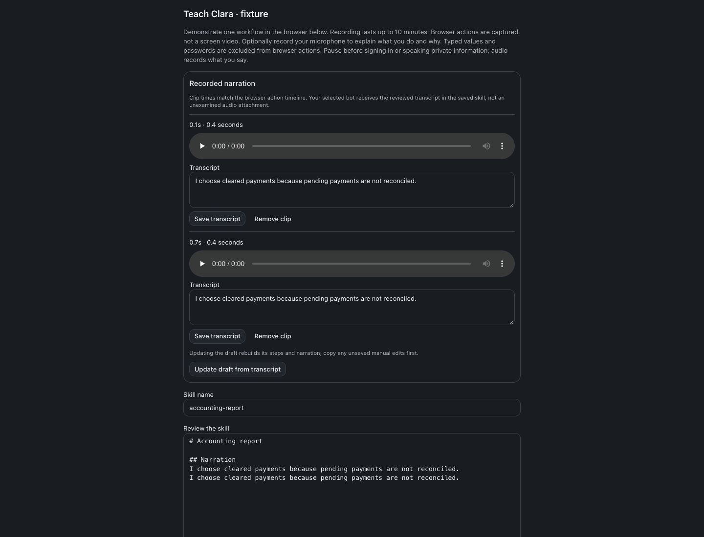
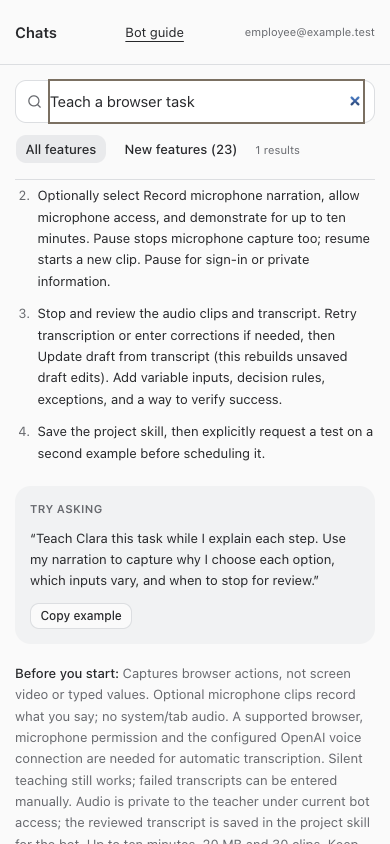

# Narrated task teaching

Build #244 · September 23, 2026 · Implementation `1406141`

Teach a task now supports optional microphone narration alongside the existing browser-action capture. Select **Record microphone narration**, demonstrate, then **Stop and review**. Each clip has audio controls and a timestamped transcript. Review or correct the transcript, update the draft, and save the reviewed skill. The target bot receives that transcript in the project skill, so the explanation of what and why survives beyond the audio attachment.

The existing teaching mechanism captures browser actions, not screen video. This release adds audio and an aligned action/narration timeline; it does not advertise a video recording or simulated screen playback. No tab or system audio is captured. The ten-minute wall-clock limit includes pauses. Pausing stops microphone capture; resuming creates a new clip. Controls disclose when the microphone is on and prevent accidentally closing settings during capture or unsaved uploads. Closing/unmounting releases tracks; hard navigation cannot guarantee an interrupted upload, so keep the tab open until saving finishes.

## Review, access and failure handling

Audio clips are stored under their teaching session, with teacher-only authenticated access and fresh active-user/bot-training checks. No arbitrary paths or public media URLs are exposed. Uploads are bounded to 20 MB and 30 clips per session, checked for supported container/MIME and bounded timing, and deduplicated by request key and content hash. Discard erases session clips. Saved evidence cannot be edited.

Automatic transcription uses the existing configured OpenAI voice credential at use time. [OpenAI’s transcription reference](https://developers.openai.com/api/reference/cli/resources/audio/subresources/transcriptions/methods/create) documents the supported audio formats and JSON transcription response used here. No real provider request was made during verification; synthetic microphone capture and mocked transcription were used. Actual automatic transcription therefore requires the configured voice connection. If it fails, saved audio remains playable and retryable, or the teacher can enter a transcript manually. Microphone denial offers deliberate silent continuation without discarding captured actions.

Saving is blocked while transcripts are unavailable or the reviewed draft lacks the current narration. Updating the draft rebuilds it, with an explicit warning to preserve manual edits first. Transcription responses recheck access/session state and cannot resurrect deleted clips or overwrite manual corrections. Narration is demonstration evidence, never permission to send messages, change finances or bypass existing approvals. Restricted employees can read the guide; existing training-access limits remain intact.

## Verification

- Root typecheck passed.
- Full root tests passed: 2,258 server tests (5 skipped), 864 web tests, 21 installer tests, 40 browser-manager tests.
- Focused HTTP tests cover persistence, actual transcript inclusion in the saved skill, duplicate and overlapping uploads, foreign/revoked/bot access, MIME/size/duration limits, failed transcription, manual correction, concurrent transcription, discarded clips, and saved/silent compatibility.
- Recorder tests cover microphone-only capture, timestamps, ten-minute expiry, disconnection, permission denial and late permission after unmount.
- Browser fixtures passed at 320/375/414/768/1440 pixels in light and dark themes: synthetic microphone, pause/resume clips, review, transcript-to-skill flow, no autoplay, no horizontal overflow, and denied-permission fallback.
- Full and restricted employee guide fixtures passed, including narration search and current instructions. Resumed-agent instruction tests verify timestamped narration guidance without widening permissions.
- Production build passed; the existing large-bundle warning is informational.
- Deployment verified after root restart: web, runner, terminal, app-runner and browser-manager health endpoints returned HTTP 200. Migration 0111 created the narration table. The live authenticated guide exposes microphone narration with its New callout, and deployed bot instructions include timestamped narration guidance. No live teaching sessions or provider/customer actions were created for verification.

## Screenshots

## Changed files and evidence

- [scripts/bot-guide-browser-check.mjs](/Users/archerclawdington/veneer-os/scripts/bot-guide-browser-check.mjs)
- [scripts/teaching-audio-browser-check.mjs](/Users/archerclawdington/veneer-os/scripts/teaching-audio-browser-check.mjs)
- [server/src/botWorkflows/routes.ts](/Users/archerclawdington/veneer-os/server/src/botWorkflows/routes.ts)
- [server/src/botWorkflows/teaching.ts](/Users/archerclawdington/veneer-os/server/src/botWorkflows/teaching.ts)
- [server/src/botWorkflows/teachingAudio.ts](/Users/archerclawdington/veneer-os/server/src/botWorkflows/teachingAudio.ts)
- [server/src/db/migrations/0111_teaching_narration.sql](/Users/archerclawdington/veneer-os/server/src/db/migrations/0111_teaching_narration.sql)
- [server/src/featureGuide/catalog.ts](/Users/archerclawdington/veneer-os/server/src/featureGuide/catalog.ts)
- [server/test/botFeatureGuide.test.ts](/Users/archerclawdington/veneer-os/server/test/botFeatureGuide.test.ts)
- [server/test/instructionContext.test.ts](/Users/archerclawdington/veneer-os/server/test/instructionContext.test.ts)
- [server/test/teachingAudio.test.ts](/Users/archerclawdington/veneer-os/server/test/teachingAudio.test.ts)
- [web/src/components/BotWorkflows.tsx](/Users/archerclawdington/veneer-os/web/src/components/BotWorkflows.tsx)
- [web/src/components/TeachTask.tsx](/Users/archerclawdington/veneer-os/web/src/components/TeachTask.tsx)
- [web/src/lib/teachingRecorder.test.ts](/Users/archerclawdington/veneer-os/web/src/lib/teachingRecorder.test.ts)
- [web/src/lib/teachingRecorder.ts](/Users/archerclawdington/veneer-os/web/src/lib/teachingRecorder.ts)
- [docs/reports/teaching-narration/guide/desktop.png](/Users/archerclawdington/veneer-os/docs/reports/teaching-narration/guide/desktop.png)
- [docs/reports/teaching-narration/guide/employee-mobile.png](/Users/archerclawdington/veneer-os/docs/reports/teaching-narration/guide/employee-mobile.png)
- [docs/reports/teaching-narration/guide/teach-desktop.png](/Users/archerclawdington/veneer-os/docs/reports/teaching-narration/guide/teach-desktop.png)
- [docs/reports/teaching-narration/guide/teach-employee-mobile.png](/Users/archerclawdington/veneer-os/docs/reports/teaching-narration/guide/teach-employee-mobile.png)
- [docs/reports/teaching-narration/review-1440-dark.png](/Users/archerclawdington/veneer-os/docs/reports/teaching-narration/review-1440-dark.png)
- [docs/reports/teaching-narration/review-1440-light.png](/Users/archerclawdington/veneer-os/docs/reports/teaching-narration/review-1440-light.png)
- [docs/reports/teaching-narration/review-320-dark.png](/Users/archerclawdington/veneer-os/docs/reports/teaching-narration/review-320-dark.png)
- [docs/reports/teaching-narration/review-320-light.png](/Users/archerclawdington/veneer-os/docs/reports/teaching-narration/review-320-light.png)
- [docs/reports/teaching-narration/review-375-dark.png](/Users/archerclawdington/veneer-os/docs/reports/teaching-narration/review-375-dark.png)
- [docs/reports/teaching-narration/review-375-light.png](/Users/archerclawdington/veneer-os/docs/reports/teaching-narration/review-375-light.png)
- [docs/reports/teaching-narration/review-414-dark.png](/Users/archerclawdington/veneer-os/docs/reports/teaching-narration/review-414-dark.png)
- [docs/reports/teaching-narration/review-414-light.png](/Users/archerclawdington/veneer-os/docs/reports/teaching-narration/review-414-light.png)
- [docs/reports/teaching-narration/review-768-dark.png](/Users/archerclawdington/veneer-os/docs/reports/teaching-narration/review-768-dark.png)
- [docs/reports/teaching-narration/review-768-light.png](/Users/archerclawdington/veneer-os/docs/reports/teaching-narration/review-768-light.png)
- [docs/reports/teaching-narration/README.md](/Users/archerclawdington/veneer-os/docs/reports/teaching-narration/README.md)
