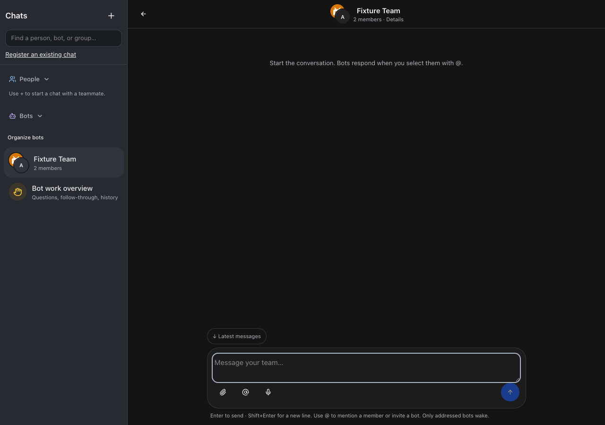
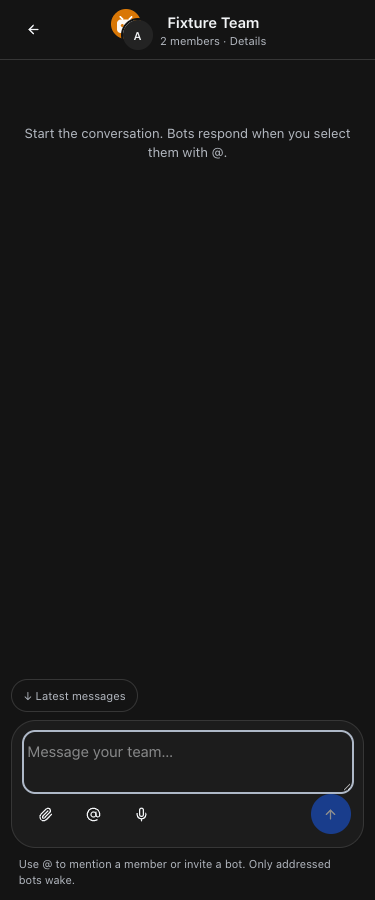

# Enter to send team-chat messages

Released September 23, 2026 · Build #225 · Implementation `0b96009`.

Desktop team-chat composers now use the existing shared Enter-key helper. **Enter sends**, **Shift+Enter adds a new line**, and Control/Command+Enter remains available. Touch-keyboard Return retains a new line. A visible, accessible shortcut hint explains the desktop behavior.

An open @ picker takes focus on a matching choice instead of sending. Selecting a bot invitation still uses the existing invitation review flow. IME composition, keyCode 229, and held/repeated Enter do not send. A synchronous in-flight guard prevents duplicate submission; empty, read-only, uploading, recording, and finalizing guards remain enforced. Failed sends retain the draft and reuse the same idempotency key when retried unchanged.

Verification passed:

- Root typecheck, full npm test (2,216 server tests, 5 skipped; 859 web tests; 40 browser-manager tests; 21 installer tests), and production build before restart.
- Isolated desktop/touch browser fixtures: Enter, Shift+Enter, modifier shortcuts, IME/keyCode 229, repeat suppression, matching mention focus and selection, unchanged retry key/draft, in-flight duplicate prevention, and empty send.
- Full/restricted employee guide checks: New callout, search, mobile layout, copy/link controls, refresh, aging, and failure recovery. Catalog guidance also feeds existing/resumed agent instructions.
- After root restart: web, runner, terminal, browser manager, and app-runner returned HTTP 200. The authenticated live guide returned 200 and included the new employee steps and agent guidance.
- No real employee messages, bot wakes, customer sends, or business actions were performed. All send tests used intercepted fixture APIs.

## Changed files

- [web/src/screens/TeamMessages.tsx](/Users/archerclawdington/veneer-os/web/src/screens/TeamMessages.tsx)
- [server/src/featureGuide/catalog.ts](/Users/archerclawdington/veneer-os/server/src/featureGuide/catalog.ts)
- [scripts/team-enter-browser-check.mjs](/Users/archerclawdington/veneer-os/scripts/team-enter-browser-check.mjs)
- [docs/reports/team-enter/README.md](/Users/archerclawdington/veneer-os/docs/reports/team-enter/README.md)
- [desktop.png](/Users/archerclawdington/veneer-os/docs/reports/team-enter/desktop.png)
- [guide/desktop.png](/Users/archerclawdington/veneer-os/docs/reports/team-enter/guide/desktop.png)
- [guide/employee-mobile.png](/Users/archerclawdington/veneer-os/docs/reports/team-enter/guide/employee-mobile.png)
- [mobile.png](/Users/archerclawdington/veneer-os/docs/reports/team-enter/mobile.png)
