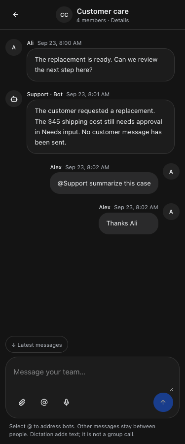
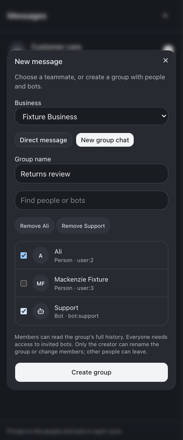
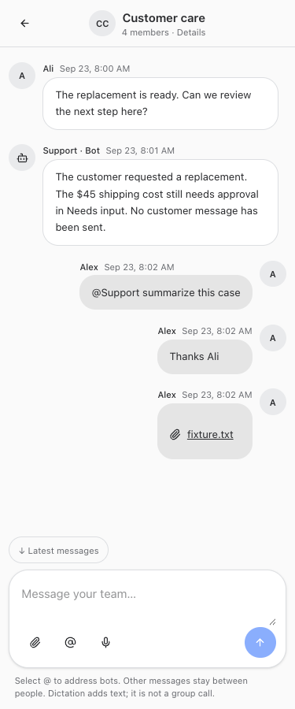
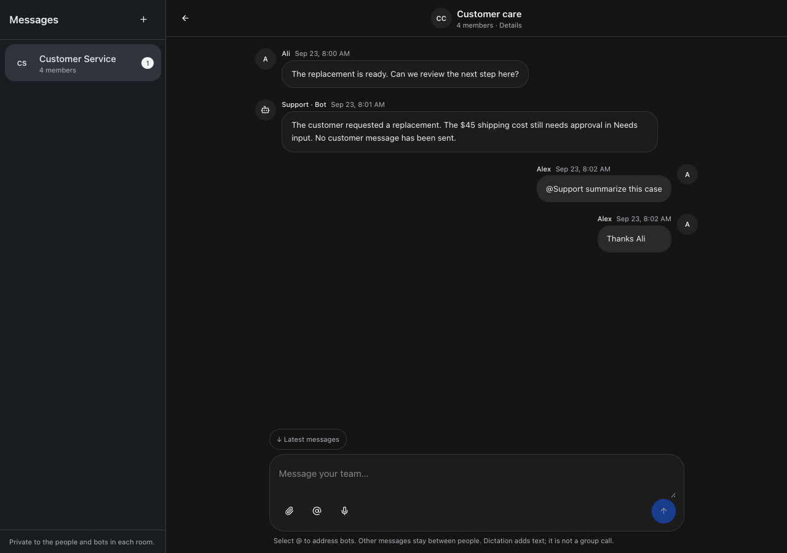

# Employee messages and mixed groups

September 23, 2026 · Build queue 218

Veneer now has **Messages** in desktop/mobile navigation and the restricted employee header. Choose **New message** to start a human direct message or **New group chat** to name a room containing people and bots. Direct-message pairs reopen the same room within their business.

## Research and alignment

The design follows Grokbot’s documented named groups, editable membership, explicit @ selection, and human attachments. Its public documentation is clearer about groups of bots than about human DMs; human and mixed-room membership here follows the owner’s explicit request, not an assumed public feature specification. [Grokbot chat and collaboration](https://docs.x.ai/grok-bot/chat-and-collaboration)

The supplied screenshots informed the centered conversation header, member pane, rounded composer, muted surfaces, and blue send control. Unlike Grokbot’s optional autonomous participation, Veneer bots stay quiet until someone selects them through @. No group voice-call control is implied: the microphone dictates text.

## How to use it

1. Open **Messages → New message**. Select a business and an existing person, or choose **New group chat** and select people and bots.
2. Write a message, attach up to ten files of 20 MB each, or dictate. Use the arrow or Control/Command+Enter to send.
3. Select **@**, a room member, or **@everyone**. The visible recipient chips determine addressing; removing one cancels it. Unselected names in ordinary text do not wake bots.
4. Tap the conversation name for members. The creator can rename and edit group membership. Other people can leave. The creator must remain; DM membership is fixed.
5. Return through **Messages** for unread counts. The full history remains available to current members, including newly added members.

Ali is an active ERVP account. No active account named Mackenzie, or matching the checked name variants, was found. The feature uses existing account IDs; it neither creates accounts nor guesses identities. All screenshots below use mocked people and bots, including the explicitly labeled Mackenzie Fixture.

## Access and bot behavior

Every list, read, send, upload/download, membership change, and bot reply checks current business and participant access. Restricted employees retain their assigned-bot limits. Viewers cannot send or create rooms. Removal revokes room reads and file downloads. Native wake receipts and stable send keys prevent duplicate dispatch/sends; membership epochs invalidate stale bot requests, including remove-and-rejoin cases. Explicit bot requests and bot replies have rate limits, and bot replies cannot wake other bots.

Each bot uses a separate provider session for each room/membership epoch, with the requesting human’s identity. These sessions are hidden from normal conversation and transcript access. They receive room read/reply tools only, without copying original bot transcripts, connections, or tasks. Private memory recall and shared-memory capture are disabled, including memory backfills. This keeps room context out of the bot’s original private conversation. A new authorized mention reopens an idle archived room session.

Use the original bot and versioned **Needs input** cards for connected business actions. Room membership, messages, mentions, and reactions never widen permissions or authorize separate customer communications. Huddles, existing discussions, voice features, and original bot tasks remain intact.

Attachments use opaque server-generated storage IDs and room-scoped download routes. The API accepts file bytes, not arbitrary local paths. Downloads are attachments with `nosniff`; pending uploads are private to their uploader until sent.

Rooms refresh while open, and navigation shows unread counts. Room push notifications and group voice calls are not part of this release. The durable employee guide includes a dated **New** announcement, concrete steps, setup limits, and bot instructions. Existing and new bots receive the updated catalog on their next turn.

## Verification

- Unit/API tests cover directory scope, idempotent DMs and sends, cross-business isolation, forged authors, viewer restrictions, creator rules, removal and rejoin, restricted employee grants, file privacy, unread state, bot identity, isolated sessions, rate limits, and archive reopening.
- The real scheduler/manager fixture verifies room wakes enter the isolated session, retain human attribution, and skip private memory recall/capture. Scheduler reconstruction and queued revocation checks use durable records.
- Browser fixtures cover 320/375/414/768/1280-pixel widths, light/dark themes, reduced motion, mentions, ordinary human messages, group editing/creation, keyboard send, attachments, retained send keys after a failed response, and removal while a room is open. No production messaging or provider calls are used.
- Full/restricted employee guide checks cover discovery, **New**, feature search, examples, navigation, permalinks, mobile overflow, aging, and failure recovery. Resumed-agent tests verify current room guidance arrives without changing frozen instructions.
- Release commands: root `npm run typecheck`, full `npm test`, and `npm run build`, using Node 24. Live restart verification is recorded below after deployment.

## Screenshots

## Release verification

Root typecheck, the full test suite, and the production build passed before restart: 2,203 server tests passed (5 skipped), 850 web tests, 40 browser-manager tests, and 21 installer tests. Vite reports its existing large-chunk advisory; the build succeeds. Implementation commit `c809752` is pushed to `origin/main` and deployed through root `npm run restart`. After restart, web, runner, app-runner, terminal, and browser-manager each returned HTTP 200. All six room tables are present. The authenticated live guide returns the team-messages announcement and five employee steps; built agent guidance contains `post_team_room_message`. The live ERVP directory includes Ali and 14 available bots, with no active Mackenzie match. There are zero live rooms: verification created no employee conversations or messages. Unrelated `.veneer-browser/`, `.veneer/`, and `out/` remain untouched.

## Changed files

- [docs/reports/team-messages/guide/desktop.png](/Users/archerclawdington/veneer-os/docs/reports/team-messages/guide/desktop.png)

- [docs/reports/team-messages/guide/employee-mobile.png](/Users/archerclawdington/veneer-os/docs/reports/team-messages/guide/employee-mobile.png)

- [docs/reports/team-messages/light-1280.png](/Users/archerclawdington/veneer-os/docs/reports/team-messages/light-1280.png)

- [docs/reports/team-messages/light-320.png](/Users/archerclawdington/veneer-os/docs/reports/team-messages/light-320.png)

- [docs/reports/team-messages/light-375.png](/Users/archerclawdington/veneer-os/docs/reports/team-messages/light-375.png)

- [docs/reports/team-messages/light-414.png](/Users/archerclawdington/veneer-os/docs/reports/team-messages/light-414.png)

- [docs/reports/team-messages/light-768.png](/Users/archerclawdington/veneer-os/docs/reports/team-messages/light-768.png)

- [docs/reports/team-messages/picker-1280.png](/Users/archerclawdington/veneer-os/docs/reports/team-messages/picker-1280.png)

- [docs/reports/team-messages/picker-320.png](/Users/archerclawdington/veneer-os/docs/reports/team-messages/picker-320.png)

- [docs/reports/team-messages/picker-375.png](/Users/archerclawdington/veneer-os/docs/reports/team-messages/picker-375.png)

- [docs/reports/team-messages/picker-414.png](/Users/archerclawdington/veneer-os/docs/reports/team-messages/picker-414.png)

- [docs/reports/team-messages/picker-768.png](/Users/archerclawdington/veneer-os/docs/reports/team-messages/picker-768.png)

- [docs/reports/team-messages/report.md](/Users/archerclawdington/veneer-os/docs/reports/team-messages/report.md)

- [docs/reports/team-messages/room-1280.png](/Users/archerclawdington/veneer-os/docs/reports/team-messages/room-1280.png)

- [docs/reports/team-messages/room-320.png](/Users/archerclawdington/veneer-os/docs/reports/team-messages/room-320.png)

- [docs/reports/team-messages/room-375.png](/Users/archerclawdington/veneer-os/docs/reports/team-messages/room-375.png)

- [docs/reports/team-messages/room-414.png](/Users/archerclawdington/veneer-os/docs/reports/team-messages/room-414.png)

- [docs/reports/team-messages/room-768.png](/Users/archerclawdington/veneer-os/docs/reports/team-messages/room-768.png)

- [scripts/bot-guide-browser-check.mjs](/Users/archerclawdington/veneer-os/scripts/bot-guide-browser-check.mjs)

- [scripts/team-rooms-browser-check.mjs](/Users/archerclawdington/veneer-os/scripts/team-rooms-browser-check.mjs)

- [server/src/bots/delivery.ts](/Users/archerclawdington/veneer-os/server/src/bots/delivery.ts)

- [server/src/bots/employeeAccess.ts](/Users/archerclawdington/veneer-os/server/src/bots/employeeAccess.ts)

- [server/src/conversations/access.ts](/Users/archerclawdington/veneer-os/server/src/conversations/access.ts)

- [server/src/db/migrations/0106_team_rooms.sql](/Users/archerclawdington/veneer-os/server/src/db/migrations/0106_team_rooms.sql)

- [server/src/featureGuide/catalog.ts](/Users/archerclawdington/veneer-os/server/src/featureGuide/catalog.ts)

- [server/src/mcp/agentToolsServer.ts](/Users/archerclawdington/veneer-os/server/src/mcp/agentToolsServer.ts)

- [server/src/mcp/roomTools.ts](/Users/archerclawdington/veneer-os/server/src/mcp/roomTools.ts)

- [server/src/memory/curator.ts](/Users/archerclawdington/veneer-os/server/src/memory/curator.ts)

- [server/src/rooms/routes.ts](/Users/archerclawdington/veneer-os/server/src/rooms/routes.ts)

- [server/src/rooms/service.ts](/Users/archerclawdington/veneer-os/server/src/rooms/service.ts)

- [server/src/routes/api.ts](/Users/archerclawdington/veneer-os/server/src/routes/api.ts)

- [server/src/runtime/conversationManager.ts](/Users/archerclawdington/veneer-os/server/src/runtime/conversationManager.ts)

- [server/test/instructionContext.test.ts](/Users/archerclawdington/veneer-os/server/test/instructionContext.test.ts)

- [server/test/memoryCurator.test.ts](/Users/archerclawdington/veneer-os/server/test/memoryCurator.test.ts)

- [server/test/teamRoomRoutes.test.ts](/Users/archerclawdington/veneer-os/server/test/teamRoomRoutes.test.ts)

- [server/test/teamRooms.test.ts](/Users/archerclawdington/veneer-os/server/test/teamRooms.test.ts)

- [web/src/App.tsx](/Users/archerclawdington/veneer-os/web/src/App.tsx)

- [web/src/components/NavBar.tsx](/Users/archerclawdington/veneer-os/web/src/components/NavBar.tsx)

- [web/src/lib/teamRooms.ts](/Users/archerclawdington/veneer-os/web/src/lib/teamRooms.ts)

- [web/src/screens/EmployeeWorkspace.tsx](/Users/archerclawdington/veneer-os/web/src/screens/EmployeeWorkspace.tsx)

- [web/src/screens/TeamMessages.tsx](/Users/archerclawdington/veneer-os/web/src/screens/TeamMessages.tsx)
